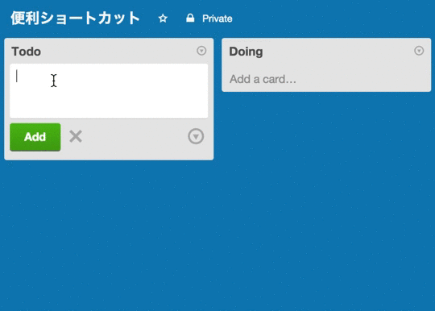
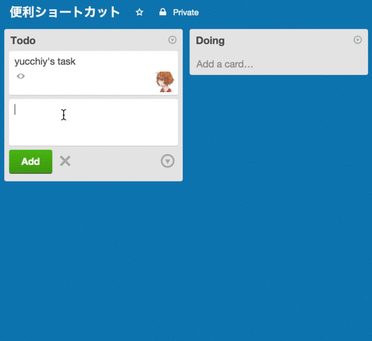
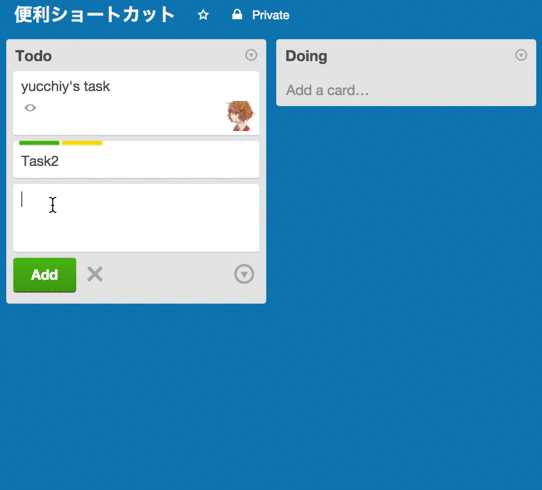

仕事でTrelloを使う機会が多く, 最近では個人の用事もTrelloを使って管理し始めた.

ところで, Trelloには[様々なショートカット](https://trello.com/shortcuts)が用意されていて便利である.

しかし, 意外に知られてないが, 覚えるとすぐに使える便利なショートカットがいくつか存在するので紹介する.

## メンバーの補完

Trelloでは, `@username`と記述することで, メンバーの自動補完を行ってくれる機能が存在する.

これは, コメントの記入時にメンション機能として使うことが多いが, 
新しいカードを追加するときにこの機能を使うと, **そのカードに指定したメンバーを割り当てることができる**. 以下に使用例を示す.

## ラベルの補完

新しいカードを追加するときに, `#labelname`と記述することで, **名前が`labelname`のラベルを割り当てる事ができる**.

もちろん, 複数ラベルを割り当てることも可能である.

## 場所の補完

新しいカードの追加の際に, `^position`と入力することで, **カードを追加する位置を変更できる.**

`position`には, `top`や`bottom`などに加えて, `2nd`や`3rd`, `4th`などが指定できる.

文字では説明しづらいので, 以下に使用例を示す.

優先度の高いタスクを上において管理する事が多いと思うが, Trelloでは, **新しいカードが下に追加されてしまうため**,
カードを追加した後に上にドラッグアンドドロップで持っていくorカードの詳細画面を開いて移動させることになるが,
このショートカットを覚えておくと, わざわざそのような手間が省けて良い.

## まとめ

カードを新しく追加する際に, 覚えておくと便利なショートカットを３つ紹介した.

これらのショートカットは, 覚えるのが容易で, 覚えるとわざわざ**カードの詳細画面を開くことなくカードの操作ができる**
ため, よりスムーズなカード追加を行うことが可能になる.
