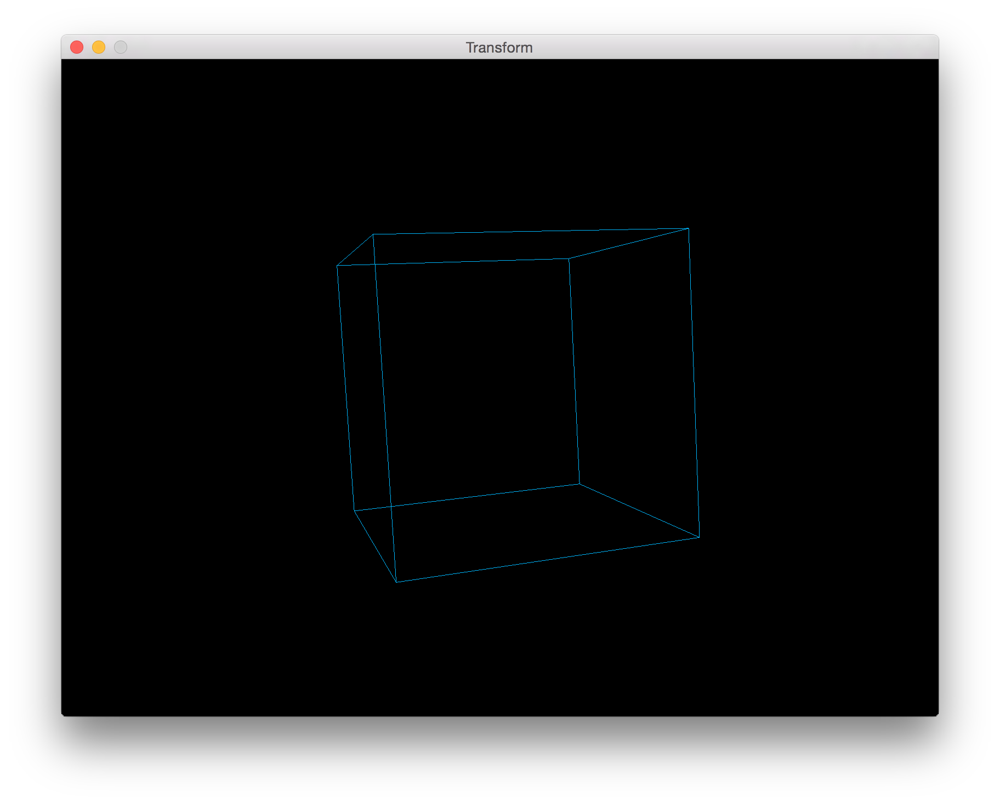

[前回](http://blog.yucchiy.com/2015/11/10/hello-opengl-with-golang/)に引き続き, OpenGLをGolangで触ってワイワイやってる. 今回は, [このへん(PDF)](http://www.wakayama-u.ac.jp/~tokoi/lecture/gg/ggnote03.pdf)を題材に, 同次座標系とか変換の合成から, 平行移動や回転を表現する行列を学び, あとは投影変換やらビュー変換がどういう仕組みなのかを勉強（というか大学の頃の復習）して, 実際にコーディングするなどした.

コーディングの様子がこちら. なんかVJ素材っぽい.



前回からの変更点としては, モデルの変換行列・カメラの視点変換行列・投影行列をバーテックスシェーダに転送して, それぞれの頂点を変換しただけ.

## 実装

まずシェーダー.

```
#version 330

uniform mat4 projection;
uniform mat4 camera;
uniform mat4 model;

in vec3 vert;

void main() {
	gl_Position = projection * camera * model * vec4(vert, 1);
}
```

得に難しいことはしていない. 次にプログラム.

```
projection := mgl32.Perspective(mgl32.DegToRad(45.0), float32(windowWidth)/windowHeight, 0.1, 10.0)
projectionUniform := gl.GetUniformLocation(program, gl.Str("projection\x00"))
gl.UniformMatrix4fv(projectionUniform, 1, false, &projection[0])

camera := mgl32.LookAtV(
	mgl32.Vec3{3, 3, 3},
	mgl32.Vec3{0, 0, 0},
	mgl32.Vec3{0, 1, 0},
)
cameraUniform := gl.GetUniformLocation(program, gl.Str("camera\x00"))
gl.UniformMatrix4fv(cameraUniform, 1, false, &camera[0])

model := mgl32.Ident4()
modelUniform := gl.GetUniformLocation(program, gl.Str("model\x00"))
gl.UniformMatrix4fv(modelUniform, 1, false, &model[0])
```

本来は行列の計算も全部自分でやると良いが, 世の中には[mathgl](https://github.com/go-gl/mathgl)という,
変換とかで利用しそうな関数とかデータ構造を一式用意してくれている便利なライブラリがあるので,
とりあえず利用してる関数の中の計算と, 手計算があってればそのまま利用するなどした.

あとはモデルの変換行列だけ, 時間が経過するごとにぐるぐる回るようにした.

```
time := glfw.GetTime()
elapsed := time - previousTime
previousTime = time

angleX += math.Sin((elapsed / period) * math.Pi * 2.0)
angleY += math.Sin((elapsed / period) / 6.0 * math.Pi * 2.0)
angleZ += math.Sin((elapsed / period) / 3.0 * math.Pi * 2.0)
model = mgl32.HomogRotate3DY(float32(angleY)).Mul4(mgl32.HomogRotate3DX(float32(angleX))).Mul4(mgl32.HomogRotate3DZ(float32(angleZ)))
```

`period`秒の周期で, x軸に1回転, y軸に1/6回転, z軸に1/3回転するように実装している.

ここで, `glfw.GetTime()`は, glfwの管理しているタイマーから, 経過時間を秒単位で取得する関数.

成果物は[https://github.com/yucchiy/toybox-opengl/blob/master/transform/main.go](https://github.com/yucchiy/toybox-opengl/blob/master/transform/main.go).

## 今後の予定

簡単な変換とかなら一通りかけるようになった. 引き続き[この辺](http://www.wakayama-u.ac.jp/~tokoi/lecture/gg/)を読みながら,
シェーダーについて何ができるのか一通り把握するために勉強したい.

