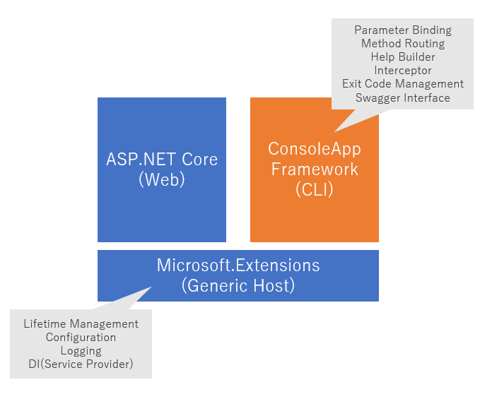

[ConsoleAppFramework](https://github.com/Cysharp/ConsoleAppFramework)を触ってみたので、メモがてらブログにしました。基本的に[README](https://github.com/Cysharp/ConsoleAppFramework/blob/master/ReadMe.md)をベースに書いています。

## ConsoleAppFrameworkとは

https://github.com/Cysharp/ConsoleAppFramework

> Micro-framework for console applications to building CLI tools/Daemon/Batch for .NET Core, C#.

[Cysharp, Inc](http://github.com/cysharp)が開発するコンソールアプリ構築のためのマイクロフレームワークで、.NET Core, C# で実装されています。

> ConsoleAppFramework is built on .NET Generic Host, you can use configuration, logging, DI, lifetime management by Microsoft.Extensions packages. ConsoleAppFramework do parameter binding from string args, routing multi command, dotnet style help builder, etc

[.NET Generic Host](https://docs.microsoft.com/en-us/aspnet/core/fundamentals/host/generic-host?view=aspnetcore-3.1)上で構築されていて、Microsoft.Extensionsパッケージによって設定・ロギング・DI・ライフタイム管理が提供されています。（この辺はあまり詳しくないので、また調べてみてブログかこうかな。。）

触った感触としての個人的感想としては、下記のようなケースにおいてCLIアプリケーションの開発を生産性高く行えると感じました。

- たくさんのバッチアプリケーションの開発が必要なケース
- （たとえばゲームAPIを開発してて）バッチスクリプトを書くときに、APIで利用しているサービスを利用したいケース

個人的に感じるConsoleAppFrameworkの特徴として、コンソールアプリケーションのインターフェイスの自動生成があります。具体的には下記のコードを記述し（コードは[公式のサンプル](https://github.com/Cysharp/ConsoleAppFramework#cli-tools)を抜粋）、

```cs
using ConsoleAppFramework;
using Microsoft.Extensions.Hosting;
using System;
using System.Threading.Tasks;

namespace Example
{
    class Program : ConsoleAppBase
    {
        static async Task Main(string[] args)
        {
            await Host.CreateDefaultBuilder().RunConsoleAppFrameworkAsync<Program>(args);
        }

        public void Run(string name, int repeat = 3)
        {
            for (var i = 0; i < repeat; ++i)
            {
                Console.WriteLine($"Hello My ConsoleApp from {name}");
            }
        }
    }
}
```

下記のようにコマンドを実行することで、`Run`メソッドをCLI経由で実行することができます。

```
$ dotnet run  -name "fuga" -repeat 2
Hello My ConsoleApp from fuga
Hello My ConsoleApp from fuga
```

このように、エントリーポイント（上記では`Main`）でおまじない的にConsoleAppFrameworkを実行し、`Run`メソッドを定義するだけで、コマンドライン引数を自動でいい感じにパースし（引数名を元にオプション引数を自動で定義し）て実行することができます。

また[Multi Batch Application](https://github.com/Cysharp/ConsoleAppFramework#multi-batch-application)という仕組みがあり、たくさんのバッチアプリケーションを下記のように少ない記述でCLIアプリケーション化することができます。

```cs
using ConsoleAppFramework;
using Microsoft.Extensions.Hosting;
using System;
using System.Threading.Tasks;

namespace Example
{
    // エントリーポイント。プロジェクトで１つだけ定義しておく
    class Program
    {
        static async Task Main(string[] args)
        {
            await Host.CreateDefaultBuilder().RunConsoleAppFrameworkAsync(args);
        }
    }

    public class Foo : ConsoleAppBase
    {
        // dotnet run Foo.Echo -msg [msg]
        // で実行できる
        public void Echo(string msg)
        {
            Console.WriteLine(msg);
        }

        // dotnet run Foo.Echo -x [x] -y [y]
        // で実行できる
        public void Sum(int x, int y)
        {
            Console.WriteLine((x + y).ToString());
        }
    }

    public class Bar : ConsoleAppBase
    {
        // dotnet run Bar.Hello2
        // で実行できる
        public void Hello2()
        {
            Console.WriteLine("H E L L O");
        }
    }
}
```

APIを作ってて、同じ機能をバッチで呼び出したいときは「ただAPI実装をバッチで呼び出したいだけなのに...」という気持ちになると思いますが、それだけのためにバッチ１つに対して都度CLI部を記述するのは手間でもあり、またそこに対してのテストも必要になるためバッチを量産するのも大変だったりします。
そういう面倒な作業を極力しなくてもいいように、という思想を個人的にはこの実装から感じました。

また下記図のように、WebとCLIの両者の基礎をMicrosoft.Extensionsに揃えることで、サービス呼び出しのための下回りを同じ仕組みで整えられるのもいいのかなと思っています。（例えばDBにつなぐための設定ファイルや実装を、Webのものをまるっとそのまま持ってこれる？）



設計が、より実世界のアプリケーションにおける生産性にフォーカスしたフレームワークだなと、個人的に感じました。

## インストール

ConsoleAppFrameworkを利用してみます。ちなみに著者は下記の環境で動作を検証しています。

- macOS Catalina
    - 10.15.2
- .NET Core SDK
    - 3.0.100
- zsh
    - 5.7.1 (x86_64-apple-darwin19.0)

## Create ConsoleAppFramework based Console App Project

まずは.NET Coreでコンソールアプリを作成して、そこにConsoleAppFrameworkをインストールしてみます。

```
$ dotnet new console -n Example
$ cd Example
$ ls 
Example.csproj Program.cs  obj
```

次にConsoleAppFrameworkを追加します。パッケージ追加は`dotnet add package`で行います。

```
$ dotnet add package ConsoleAppFramework
```

これで`Example`プロジェクトでConsoleAppFrameworkを利用できるようになりました。

## Hello ConsoleAppFramework

ここからは、ConsoleAppFrameworkの使い方を説明していきます。

まずは[Cysharp/ConsoleAppFramework](https://github.com/Cysharp/ConsoleAppFramework)の[CLI Tools](https://github.com/Cysharp/ConsoleAppFramework#cli-tools)に書いてあるサンプルを動かしてみます。先程作成したプロジェクト内の`Program.cs`に下記を記述します。　

```cs
using ConsoleAppFramework;
using Microsoft.Extensions.Hosting;
using System;
using System.Threading.Tasks;

namespace Example
{
    class Program : ConsoleAppBase
    {
        static async Task Main(string[] args)
        {
            await Host.CreateDefaultBuilder().RunConsoleAppFrameworkAsync<Program>(args);
        }

        public void Run(string name, int repeat = 3)
        {
            for (var i = 0; i < repeat; ++i)
            {
                Console.WriteLine($"Hello My ConsoleApp from {name}");
            }
        }
    }
}
```

上記を実行するには`dotnet run`コマンドを実行します。　

```
$ dotnet run
Usage: Example [options...]

Options:
  -name <String>      (Required)
  -repeat <Int32>     (Default: 3)


$ dotnet run -name "hoge"
Hello My ConsoleApp from hoge
Hello My ConsoleApp from hoge
Hello My ConsoleApp from hoge
$ dotnet run  -name "fuga" -repeat 5
Hello My ConsoleApp from fuga
Hello My ConsoleApp from fuga
Hello My ConsoleApp from fuga
Hello My ConsoleApp from fuga
Hello My ConsoleApp from fuga
```

`dotnet run`によって`Example.Program`内に記載されている`Run`メソッドが呼び出されています。
先述の通り、CLIのオプションは`Run`メソッドから自動的に生成されていることがわかります。具体的には第１引数の`name`は`-name`で指定でき、第２引数の`repeat`は`-repeat`で指定することができます。デフォルト引数として定義されている場合（`repeat`がそれにあたる。）は、オプションを指定しなければデフォルト引数が指定して呼び出されます。

ちなみに引数が要求する型と違う方が渡された場合は、エラーが発生します。（下記の場合は`repeat`に文字列を与えている。）

```
$ dotnet run -name "hoge" -repeat "fuga"
fail: ConsoleAppFramework.ConsoleAppEngine[0]
      Parameter "repeat" fail on JSON deserialize, please check type or JSON escape or add double-quotation. args: -name hoge -repeat fuga
```

## 引数のとり方について

特に何も指定しない場合は、引数名がそのままコマンドライン引数のショートネーム指定になります。このときデフォルト引数が指定される引数に対してそのオプションを省略した場合にはデフォルト値が引数にそのまま渡されます。デフォルト引数が指定されない場合は、そのオプションは指定が必須となります。　

```cs
public class Hoge : ConsoleAppBase
{
    public void Run(int a, bool b = true, string c = "c's default value")
    {
        Console.WriteLine($"a = {a}, b = {b}, c = {c}");
    }
}

// $ dotnet run Hoge.Run help
// Usage: Note Hoge.Run [options...]
// 
// Options:
//   -a <Int32>       (Required)
//   -b <Boolean>     (Default: True)
//   -c <String>      (Default: c's default value)

// $ dotnet run Hoge.Run -b False
// fail: ConsoleAppFramework.ConsoleAppEngine[0]
//       Required parameter "a" not found in argument. args: Hoge.Run -b False

// $ dotnet run Hoge.Run -a 3
// a = 3, b = True, c = c's default value
```

この挙動は`OptionAttribute`によって調整することが可能です。`OptionAttribute`の実装は[こちら](https://github.com/Cysharp/ConsoleAppFramework/blob/master/src/ConsoleAppFramework/OptionAttribute.cs)で確認できます。具体的には`Index`と`ShortName`と`Description`を指定することで調整することができます。

`Index`はコマンドライン引数の順番を定義します。引数に`[Option(int index)]`で定義すると下記のようにそのインデックスのコマンドライン引数を受け取ることができます。

```cs
public class Fuga : ConsoleAppBase
{
    public void Run(
        [Option(0)]int a,
        [Option(1)]int b,
        [Option(2)]int c
    )
    {
        Console.WriteLine($"a = {a}, b = {b}, c = {c}");
    }
}

// $ dotnet run Fuga.Run 1 2 3
// a = 1, b = 2, c = 3
```

何も指定しない場合は暗黙的にショートネームがメソッドの引数名で設定されますが、ショートネームを変更したかったり説明をつけてヘルプをわかりやすくしたい場合は、`[Option(shortName)]`や`[Option(shortName, description)]`で明示的に指定することが可能です。

```cs
public void Run(
    [Option("n", "name of send user.")]string name,
    [Option("r", "repeat count.")]int repeat = 3
)
{
    for (var i = 0; i < repeat; i++)
    {
        Console.WriteLine($"Hello My ConsoleApp from {name}");
    }
}

// $ dotnet run FirstApp.Run -help
// Usage: Note FirstApp.Run [options...]
// 
// Options:
//   -n, -name <String>     name of send user. (Required)
//   -r, -repeat <Int32>    repeat count. (Default: 3)

// $ dotnet run FirstApp.Run -n Hoge -r 2
// Hello My ConsoleApp from Hoge
// Hello My ConsoleApp from Hoge
```

もちろんこれらを複合して指定することも可能です。

```cs
public class ComplexOptions : ConsoleAppBase
{
    public void Run(
        [Option(0)]string a,
        [Option(1)]uint b,
        [Option("boolVal")]bool c,
        int d = 4
    )
    {
        Console.WriteLine($"a = {a}, b = {b}, c = {c}, d = {d}");
    }
}

// $ dotnet run ComplexOptions.Run "a" 2 -boolVal False -d 1
// a = a, b = 2, c = True, d = 1
```

## Multi Command Programを作成する

`CommandAttribute`を用いて、いわゆるサブコマンドなCLIアプリケーションが作成できます。下記に例を示します。

```cs
using ConsoleAppFramework;
using Microsoft.Extensions.Hosting;
using System;
using System.Threading.Tasks;

namespace Example
{
    class Program : ConsoleAppBase
    {
        static async Task Main(string[] args)
        {
            await Host.CreateDefaultBuilder().RunConsoleAppFrameworkAsync<Program>(args);
        }

        // dotnet run(or ./Example.app)で呼び出される
        public void Hello(
                [Option("n", "name of send user.")]string name,
                [Option("r", "repeat count.")]int repeat = 3)
        {
            for (int i = 0; i < repeat; i++)
            {
                Console.WriteLine($"Hello My ConsoleApp from {name}");
            }
        }

        // dotnet run escape [input] (or ./Example.app escape [input])で呼び出される
        // [Option(int)] は、そのインデックスの引数が渡される
        // UrlEscapeの場合、`dotnet run escape hoge`で、"hoge"がinput引数に渡される
        [Command("escape")]
        public void UrlEscape([Option(0)]string input)
        {
            Console.WriteLine(Uri.EscapeDataString(input));
        }

        // dotnet run timer [withSeconds] (or ./Example.app timer [withSeconds])で呼び出される
        // このようにasyncで定義したメソッドも利用できる
        [Command("timer")]
        public async Task Timer([Option(0)]uint waitSeconds)
        {
            Console.WriteLine(waitSeconds + " seconds");
            while (waitSeconds != 0)
            {
                // ConsoleAppFramework does not stop immediately on terminate command(Ctrl+C)
                // so you have to pass Context.CancellationToken to async method.
                await Task.Delay(TimeSpan.FromSeconds(1), Context.CancellationToken);
                waitSeconds--;
                Console.WriteLine(waitSeconds + " seconds");
            }
        }
    }
}
```

下記のように定義したメソッドを呼び分けることができます。

```
$ dotnet run
Usage: Note [options...]

Options:
  -n, -name <String>     name of send user. (Required)
  -r, -repeat <Int32>    repeat count. (Default: 3)

Usage: Note <Command>

Commands:
  escape
  timer


$ dotnet run -name "hoge"
Hello My ConsoleApp from hoge
Hello My ConsoleApp from hoge
Hello My ConsoleApp from hoge
$ dotnet run escape "https://example.com:8080/"
https%3A%2F%2Fexample.com%3A8080%2F
$ dotnet run timer 3
3 seconds
2 seconds
1 seconds
0 seconds
```

## Multi Batch Application

ConsoleAppFrameworkはmulti batch applicationをサポートしています。これにより用意したたくさんのバッチを、コマンドの第１引数名により呼び分けることができます。
たくさんのバッチが存在しているときにそれら一つ一つのコマンドラインを作るのは大変ですが、ConsoleAppFrameworkでは`ConsoleAppBase`を継承したクラスを用意してその中にパブリックメソッドを定義していれば、エントリーポイントを１つ定義しておくだけでそれらのメソッドを呼び出しわけることができます。

multi batch applicationの例を以下に示します。

```cs
using ConsoleAppFramework;
using Microsoft.Extensions.Hosting;
using System;
using System.Threading.Tasks;

namespace Example
{
    // エントリーポイント
    class Program
    {
        static async Task Main(string[] args)
        {
            // <T>を渡さないのがポイント
            await Host.CreateDefaultBuilder().RunConsoleAppFrameworkAsync(args);
        }
    }

    // バッチその1
    public class Foo : ConsoleAppBase
    {
        public void Echo(string msg)
        {
            Console.WriteLine(msg);
        }

        public void Sum(int x, int y)
        {
            Console.WriteLine((x + y).ToString());
        }
    }

    // バッチその2
    public class Bar : ConsoleAppBase
    {
        public void Hello2()
        {
            Console.WriteLine("H E L L O");
        }
    }
}
```

もちろん`Foo`や`Bar`は別ファイルに定義も可能です。ポイントとしてはエントリーポイント内で`<T>`を渡していない点で、指定しない場合はプロジェクト内の`ConsoleAppBase`を継承した全クラスがバッチの対象になります。

上記のバッチをそれぞれ実行してみます。下記のようにバッチがそれぞれ呼び分けられているのが確認できます。

```
$ dotnet run
Usage: Example <Command>

Commands:
  Foo.Echo
  Foo.Sum
  Bar.Hello2

$ dotnet run Foo.Echo -msg "Hello Multi Batch Application"
Hello Multi Batch Application
$ dotnet run Foo.Sum -x 2 -y 3
5
$  dotnet run Bar.Hello2
H E L L O
```

## 複雑な引数の指定方法

引数にプリミティブ型以外の型（配列や独自に定義した型など）を指定したい場合は、JSON文字列を渡すことができます。

```cs
public class ComplexArgTest : ConsoleAppBase
{
    public void Foo(int[] array, Person person)
    {
        Console.WriteLine(string.Join(", ", array));
        Console.WriteLine(person.Age + ":" + person.Name);
    }
}

public class Person
{
    public int Age { get; set; }
    public string Name { get; set; }
}
```

```
$ dotnet run ComplexArgTest.Foo -array '[10,20,30]' -person '{"Age":10,"Name":"foo"}'
10, 20, 30
10:foo
```

JSONのシリアライズには`System.Text.Json`を用いている。もしシリアライザの挙動を変更したい場合は、`JsonSerializerOptions`を渡すこともできます。

配列を渡す場合は、下記に示すような正しくないJSONシリアライズもいくつか渡すことが可能です。

```cs
public class NotCorrectJSONForArray : ConsoleAppBase
{
    public void Run(int[] array)
    {
        Console.WriteLine(string.Join(", ", array));
    }
}
```

```
# []なしの長さ１の配列
$ dotnet run NotCorrectJSONForArray.Run -array 1
1
# []なしの長さ１より大きい配列
$ dotnet run NotCorrectJSONForArray.Run -array 1,2,3,4,5
1, 2, 3, 4, 5
# 半角スペースによるセパレート指定
$ dotnet run NotCorrectJSONForArray.Run -array '1 2 3 4 5'
1, 2, 3, 4, 5
```

文字列配列の場合は、`"`を省略する事ができます。

```cs
public class NotCorrectJSONForStringArray : ConsoleAppBase
{
    public void Run(string[] array)
    {
        Console.WriteLine(string.Join(", ", array));
    }
}
```

```
$ dotnet run NotCorrectJSONForStringArray.Run -array hello
hello
$ dotnet run NotCorrectJSONForStringArray.Run -array "hello world"
hello, world
$ dotnet run NotCorrectJSONForStringArray.Run -array hello,world
hello, world
```

## Exit Code

メソッドの戻り値が`int`または`Task<int>`だった場合、その戻り値がCLIアプリケーションの戻り値として利用されます。

```cs
public class ExitCodeExample : ConsoleAppBase
{
    public int SetExitCodeFromArgument(int code)
    {
        return code;
    }

    public async Task<int> SetExitCodeFromArgumentAsync(int code)
    {
        return code;
    }
}
```

下記のように、exit codeが返されていることが確認できます。

```
$ dotnet run ExitCodeExample.SetExitCodeFromArgument -code 1
$ echo $?
1
$ dotnet run ExitCodeExample.SetExitCodeFromArgumentAsync -code 2
$ echo $?
2
```

ただしメソッド内で例外を発生させてそれをキャッチしなかった場合は、ConsoleAppFrameworkは`1`をexit codeに設定されます。例外がthrowされてないかつ、戻り値にexit codeを指定していない場合は`0`が指定されます。

```cs
public class ExitCodeExample : ConsoleAppBase
{
    public void UnhandledException()
    {
        throw new System.NotImplementedException();
    }
}
```

以下、実行例を示します。

```
$ dotnet run ExitCodeExample.UnhandledException
fail: ConsoleAppFramework.ConsoleAppEngine[0]
      Fail in console app running on ExitCodeExample.UnhandledException
System.NotImplementedException: The method or operation is not implemented.
   at Note.ExitCodeExample.UnhandledException() in /Users/a13946/.ghq/github.com/yucchiy/Note/Program.cs:line 132
$ echo $?
1
```

この挙動から、exit codeを指定する必要なく、エラーが発生したか・そうでないかぐらいのエラーハンドリングで問題ない場合は、`void`で定義して例外を投げてしまうというのも１つの手なのかもしれないです。（わざわざ戻り値を返すのも面倒だし...）

## まとめ

CLIアプリケーションフレームワークであるConsoleAppFrameworkについて紹介しました。
ただこのフレームワークの大きな特徴である、Generic HostやDI・Loggingあたりが全然紹介できていないので、それについてはまた次の機会に。

