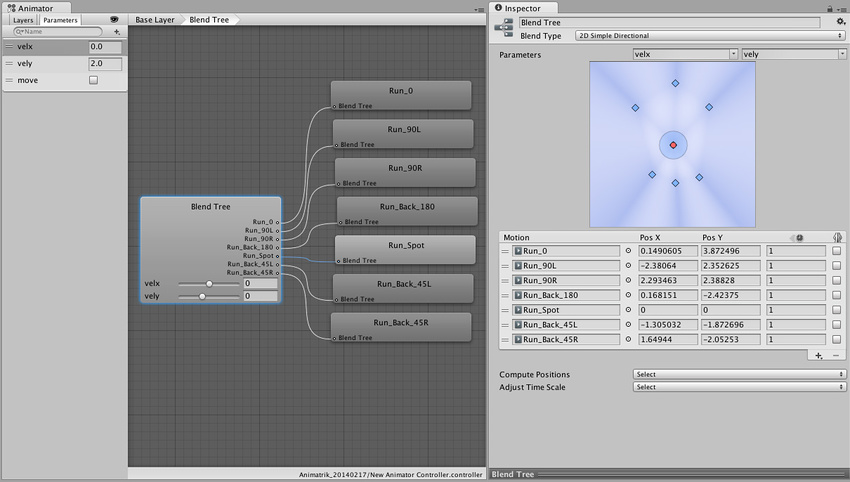

ナビメッシュおよび[ナビメッシュエージェント](https://docs.unity3d.com/ScriptReference/AI.NavMeshAgent.html)を用いるとUnityで簡単に3D上での経路探索及び移動が実装できますが、
ナビメッシュエージェントはアタッチされたゲームオブジェクトを自律的に動かすためにそのまま利用するとアニメーションの足滑りなどが発生していまします。

この記事では、ナビメッシュエージェントを用いて足滑りの無いアニメーションを実現する方法について検討します。[Coupling Animation And Navigation](https://docs.unity3d.com/Manual/nav-CouplingAnimationAndNavigation.html)を参考にしています。

## アニメーションと移動を同期するフロー

基本的な方針として[`NavMeshAgent.updatePosition`](https://docs.unity3d.com/ScriptReference/AI.NavMeshAgent-updatePosition.html)を`false`にして**位置更新を手動で行うこと**で、事前にエージェントの移動する速度を元にアニメーションを再生して足滑りを緩和します。
[Coupling Animation And Navigation](https://docs.unity3d.com/Manual/nav-CouplingAnimationAndNavigation.html)では、下記のフローでアニメーションとエージェントの移動を同期させています。

1. 次のエージェントの行動を[`NavMeshAgent.nextPosition`](https://docs.unity3d.com/ScriptReference/AI.NavMeshAgent-nextPosition.html)から算出する
2. 1.で計算した速度からアニメーションを再生するためのパラメータを生成して設定する
3. キャラクターを移動させる

`NavMeshAgent.nextPosition`にはエージェントが次に移動する予定の座標をワールド座標で格納されています。現在の座標と合わせて次のフレームのエージェントの移動速度を算出することができます。

```cs
var agent = gameObject.GetComponent<AI.NavMeshAgent>();
agent.updatePosition = false;

// nextPositionからdeltaPositionを算出
var worldDeltaPosition = agent.nextPosition - transform.position;

// キャラクターを基点にしたxz平面に射影したdeltaPosition
var dx = Vector3.Dot (transform.right, worldDeltaPosition);
var dy = Vector3.Dot (transform.forward, worldDeltaPosition);
Vector2 deltaPosition = new Vector2 (dx, dy);

// Time.deltaTimeから速度を算出
var velocity = deltaPosition / Time.deltaTime;
```

次に速度に対応するアニメーションを再生します。[Coupling Animation And Navigation](https://docs.unity3d.com/Manual/nav-CouplingAnimationAndNavigation.html)ではアニメーションコントローラの`velx`および`vely`というFloatパラメータを設定しておくと、そのパラメータに対応するアニメーションを生成するようにブレンドツリーを設定します。下記画像は[Coupling Animation And Navigation](https://docs.unity3d.com/Manual/nav-CouplingAnimationAndNavigation.html)でのアニメーションコントローラおよびブレンドツリーの設定になります。



速度からパラメータの設定する方法は下記のとおりです。

```cs
var animator = gameObject.GetComponent<Animator>();

animator.SetFloat ("velx", velocity.x);
animator.SetFloat ("vely", velocity.y);
```

最後にキャラクターを移動させます。移動は`OnAnimatorMove`で行います。ただしキャラクターを移動させることは一般的に、**アニメーションの品質をとるか、ナビメッシュ移動の品質をとるかトレードオフ**となります。
というのもエージェントが移動しようとした位置(`nextPosition`)には、他のキャラクターだったり障害物の妨げにより、**次のフレームで実際にその位置に移動できる保証がない**からです。
そのような状況下ではアニメーションによる移動を正とすると、キャラクターが他キャラクターや障害物にめり込んでしまい、またナビメッシュエージェントの移動を正とすると足が滑ってしまいます。この辺はゲームごとに最もらしくなるように仕様を決める必要があります。

```cs
void OnAnimatorMove ()
{
    // 案: アニメーションの移動を正とする
    Vector3 position = animator.rootPosition;
    position.y = agent.nextPosition.y;
    transform.position = position;

    // 案: エージェントの移動を正とする
    transform.position = agent.nextPosition;

    // 案: エージェントに追従する方式
    if (worldDeltaPosition.magnitude > agent.radius) transform.position = agent.nextPosition - 0.9f * worldDeltaPosition;

    // 案: エージェントをドリフトさせる方式
    if (worldDeltaPosition.magnitude > agent.radius) agent.nextPosition = transform.position + 0.9f * worldDeltaPosition;
}
```

## CharacterControllerをNavMeshAgentで動かすアイデア

上記で説明した、エージェントの手動更新を応用すると[`CharacterController`](https://docs.unity3d.com/ScriptReference/CharacterController.html)の移動をエージェントの思考をベースに行うことができます。[Using a NavMeshAgent with a CharacterController - Unity Forum](https://forum.unity.com/threads/using-a-navmeshagent-with-a-charactercontroller.466902/)を参考にしています。

ポイントとしてはエージェントを手動更新としたうえで、[`NavMeshAgent.desiredVelocity`](https://docs.unity3d.com/ScriptReference/AI.NavMeshAgent-desiredVelocity.html)により次に移動すべき速度を習得して、[`CharacterController.Move`](https://docs.unity3d.com/ScriptReference/CharacterController.Move.html)にその速度を渡すことで操作します。

```cs
public class NPC : MonoBehaviour
{
    private NavMeshAgent _agent;
    private CharacterController _controller;
    [SerializeField] private Vector3 _destination;
    [SerializeField] private float _speed;

    void Start()
    {
        _agent = gameObject.GetComponent<NavMeshAgent>();
        _controller = gameObject.GetComponent<CharacterController>();
        _agent.updatePosition = false;
        _agent.updateRotation = false;
    }

    void Update()
    {
        _agent.speed = _speed;
        _agent.destination = _destination;
        _controller.Move(_agent.desiredVelocity);
    }
}
```

## まとめ

ナビメッシュエージェントを手動で更新することで、足滑りのないキャラクター移動を実現する方法と、そのアイデアを応用してCharacterControllerをエージェントベースで移動する方法についても紹介しました。
