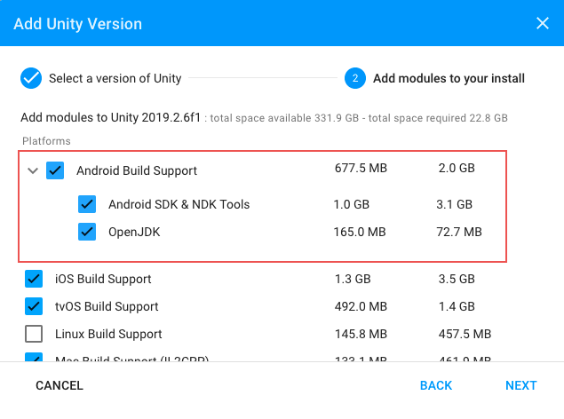
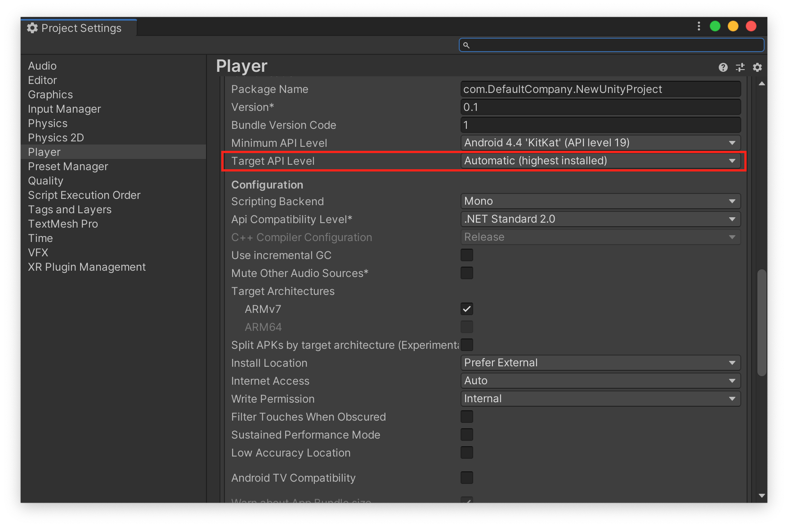
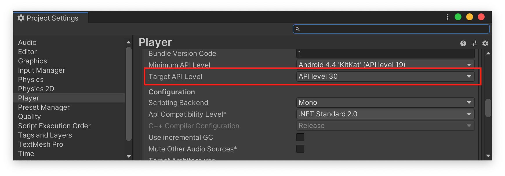
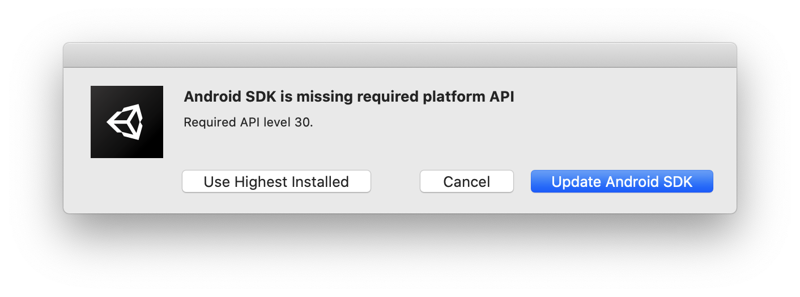

Unityは、2019以降でPlatform moduleにて、**Android Build Support**が利用できるようになりました。
これによって、UnityでAndroidビルドを行う際に必要なOpenSDKやAndroid SDK、NDK Toolsといった外部ライブラリのインストール、およびパスなどの設定をUnityがサポートしてくれます。（参考: [Android 環境の設定 - Unity Manual](https://docs.unity3d.com/ja/2019.4/Manual/android-sdksetup.html)）

設定は非常に簡単で、Unityのバージョンをインストールするときに、追加モジュールを選択できるのですが、下記のように「Android Build Support」にチェックを入れるだけです。



もし、すでにインストール済みのUnityに対してモジュールを追加したい場合は[Adding modules to the Unity Editor - Unity Manual](https://docs.unity3d.com/2019.2/Documentation/Manual/GettingStartedAddingEditorComponents.html)を参考に「Add Modules」ダイアログを開いて、その後「Android Build Support」にチェックを入れることでインストールができます。

ところで話は変わって2020年8月3日以降では、Google Playでアプリを新規で公開するためには**対象APIレベル**、つまり`targetSdkVersion`を「Android 9 (API Level 29)」以上にする必要があります。
すでにGoogle Playに公開済みのアプリの場合でも、2020年11月1日以降では`targetSdkVersion`を29以降にしないとアプリをアップデートすることができなくなります。（参考: [Play Console での対象 API レベルに関する要件](https://support.google.com/googleplay/android-developer/answer/113469?hl=ja#targetsdk)）

`targetSdkVersion`を指定のバージョンでビルドするためには、Android SDKをそのバージョン以降のものをインストールした上で、アプリをビルドを行う必要があります。

では、前述した「Android Build Support」で入るAndroid SDKのバージョンはいくつなのでしょうか？
これは実際にビルドするとわかるのですが、この記事を執筆した2020年9月24日時点では`28`がデフォルトでインストールされています。

Unityで`targetSdkVersion`の設定を行うにはメニューの「File > Build Settings」で「Build Settings」ウインドウを開いた後、そこから「Player Settings」に飛び、下図の赤枠で示した「Target API Level」から行えます。デフォルト値は`Automatic`となっていて、インストールされているSDKからもっとも高いバージョンを自動で選択してビルドしてくれます。



つまり、現状Androidをデフォルト設定のままビルドしてしまうと、下記のように`targetSdkVersion`が`28`の状態のままビルドされてしまい、**そのままではGoogle Playに提出できません**。
下記はビルドしたapkから`targetSdkVersion`を抽出した様子です。 `android:targetSdkVersion(0x01010270)=(type 0x10)0x1c`となっていて、`targetSdkVersion`が`28`であることを確認できます。

```
aapt list -a test-automatic-default.apk | grep SdkVersion
    A: android:compileSdkVersion(0x01010572)=(type 0x10)0x1c
    A: android:compileSdkVersionCodename(0x01010573)="9" (Raw: "9")
      A: android:minSdkVersion(0x0101020c)=(type 0x10)0x17
      A: android:targetSdkVersion(0x01010270)=(type 0x10)0x1c
```

## 手動で新しいバージョンのAndroid SDKをインストールする

UnityのEditor上で新しいAndroid SDKをインストールすることで、この問題を解決できます。方法は至って簡単で、下図のように「Target API Level」の設定でインストールしたいバージョンを選択した状態でアプリをビルドします。



するとビルド時に指定したバージョンが存在しない場合のみ、下図のようにSDKをアップデートを促すダイアログが表示されます。「Update Android SDK」を選択することで、SDKが更新された上でアプリのビルドが行われます。



## CLI(sdkmanager)経由でAndroid SDKを管理する

アプリビルドをJenkinsなどで行う場合、環境の構築はできる限りシェルスクリプトなどを介して自動で行いたいと思います。
上記の操作は、「Android Build Support」によってインストールされたAndroid SDKに内包される[sdkmanager](https://developer.android.com/studio/command-line/sdkmanager)を利用して、CLIで行うことができます。

「Android Build Support」によってインストールされるAndroid SDKは、macOSではデフォルトで `/Applications/Unity/Hub/Editor/{UNITY_VERSION}/PlaybackEngines/AndroidPlayer/SDK`以下にインストールされています。（`{UNITY_VERSION}`にはインストールしたUnityのバージョンが入ります）

このディレクトリ下は、通常`sdkmanager`を用いて配置されるファイル等がそのまま展開された状態になっています。`sdkmanager`はその中の`./tools/bin/sdkmanager`にあります。

たとえば、インストール済みおよび利用可能なパッケージは `sdkmanager --list`コマンドで確認できます。

```
$ pwd
/Applications/Unity/Hub/Editor/2019.3.12f1/PlaybackEngines/AndroidPlayer/SDK
$ ./tools/bin/sdkmanager --list
Installed packages:=====================] 100% Computing updates...
  Path                 | Version | Description                       | Location
  -------              | ------- | -------                           | -------
  platform-tools       | 28.0.1  | Android SDK Platform-Tools 28.0.1 | platform-tools/
  platforms;android-28 | 6       | Android SDK Platform 28, rev 6    | platforms/android-28/
  tools                | 26.1.1  | Android SDK Tools 26.1.1          | tools/

Available Packages:
  Path                                                                                     | Version      | Description
  -------                                                                                  | -------      | -------
  add-ons;addon-google_apis-google-15                                                      | 3            | Google APIs
  add-ons;addon-google_apis-google-16                                                      | 4            | Google APIs
...
```

「Target API Level」を`30`にあげるためには、下記のように`"platforms;android-30"`インストールすれば良いです。

```
$ ./tools/bin/sdkmanager  "platforms;android-30
[=======================================] 100% Unzipping... android-11/framework
$ ./tools/bin/sdkmanager --list
Installed packages:=====================] 100% Computing updates...
  Path                 | Version | Description                       | Location
  -------              | ------- | -------                           | -------
  build-tools;28.0.3   | 28.0.3  | Android SDK Build-Tools 28.0.3    | build-tools/28.0.3/
  platform-tools       | 28.0.1  | Android SDK Platform-Tools 28.0.1 | platform-tools/
  platforms;android-28 | 6       | Android SDK Platform 28, rev 6    | platforms/android-28/
  platforms;android-30 | 3       | Android SDK Platform 30           | platforms/android-30/
  tools                | 26.1.1  | Android SDK Tools 26.1.1          | tools/
...
```

この状態でPlayer Settings内の「Target API Level」を`Automatic`にしてアプリをビルドして、`targetSdkVersion`が正しいか確認しましょう。`aapt`コマンドを使うことでapkから確認できます。

```
$ ./build-tools/28.0.3/aapt list -a test.apk | grep SdkVersion
    A: android:compileSdkVersion(0x01010572)=(type 0x10)0x1e
    A: android:compileSdkVersionCodename(0x01010573)="11" (Raw: "11")
      A: android:minSdkVersion(0x0101020c)=(type 0x10)0x13
      A: android:targetSdkVersion(0x01010270)=(type 0x10)0x1e
```

`A: android:targetSdkVersion(0x01010270)=(type 0x10)0x1e`となっていて、`0x1e`は10進数で30なので、正しく`targetSdkVersion`が指定できたことを確認できました。

余談ですが、デフォルトでbuild-toolsやplatform-toolsがインストールされているため、`aapt`コマンドや、実機デバッグなどで必須な`adb`コマンドがUnityをインストールすることで、セットでインストールされることになります。追加でインストールする必要がないため、適宜パスを通すなどすれば使い勝手が良いかもしれません。

## まとめ

- Unity2019から導入されたplatform moduleの「Android Build Support」では、デフォルトでAndroid SDKのバージョンが`28`である
- そのままビルドするとGoogle Playに提出できないapkが出力される
- `/Applications/Unity/Hub/Editor/{UNITY_VERSION}/PlaybackEngines/AndroidPlayer/SDK`以下にAndroid SDKがインストールされていて`sdkmanater`を経由してCLIでSDKをアップデートできる
