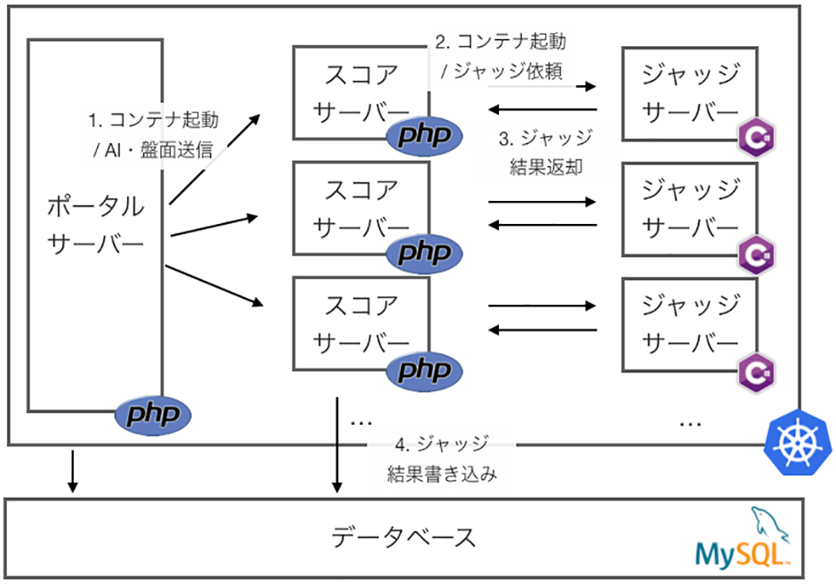

この記事は[Applibot Advent Calendar 2020](https://qiita.com/advent-calendar/2020/applibot)および[CyberAgent Developers Advent Calendar 2020](https://adventar.org/calendars/5711)の10日目の記事です。
昨日は[kbt_](https://qiita.com/kbt_)さんの[個人とチームの習慣化について](https://qiita.com/kbt_/items/99715802e01099995886)とTomomatsu Yutaさんの[Tableauのダッシュボードの限界を引き上げる拡張機能の紹介](https://www.ai-shift.co.jp/techblog/1435)でした。

この記事では、社内のエンジニア向けイベントのヒダッカソンで開催したゲームAIコンテストの設計や実装について、裏側について紹介します。

## ヒダッカソンについて

ヒダッカソンは、サイバーエージェントのゲーム事業部（SGE）の社内エンジニア向けイベントです。ここ数回は隔年ごとに開催されています。参考ですが前々回のヒダッカソンのレポートは[こちら](https://creator.game.cyberagent.co.jp/?p=5425)になります。
クライアントとサーバー部門があり、それぞれイベントごとにお題を変えて開催します。クライアント部門は例年ゲームの仕様書が渡されて、そのゲームの機能の実装量で順位を競うイベントでした。

今回クライアント部門はお題を刷新し、とあるゲームを攻略するAIを実装するイベントとしました。運営メンバーは4人で、私以外にサーバー・インフラ・作問の担当者がいました。私はこのイベントの企画立案から実装・運用を担当しました。

また、クライアント部門のイベントをもとにした1dayインターンを「[ゲームAI×プロコン型インターン](https://www.cyberagent.co.jp/careers/students/event/detail/id=24421)」として開催しました。

### 今回のお題について

今年のイベントは「ゲームAIコンテスト」と題して、とある2DのターンベースなゲームのAIを書いて、そのスコアを競います。
具体的にはゲームルールとそのゲームの複数のステージ（課題）が与えられ、競技者は課題をクリアするプレイヤーAIをそれぞれの課題に提出し、課題を解いた数の総数で競いました。

### ゲームAIの実装方法

競技者はゲームAIを具体的に下記の`PlayerBrain`クラスを継承して実装します。

```cs
public abstract class PlayerBrain
{
    public abstract PlayerCommand Think(Environment environment);
}
```

今回のお題のゲームはターンベースで、この`Think`メソッドがターンごとに呼び出されます。引数に渡される`environment`はそのターンにおけるゲームの状況を表しています。
この引数を元に、プレイヤーはゲームの状況を把握し、戻り値として自プレイヤーのそのターンの行動を返却します。

`Environment`の一部実装は下記のとおりです。このように、現在のフィールドの状況やプレイヤー情報の一覧が配列で格納されています。

```cs
public class Environment
{
    /// 現在のターン
    public int Turn;
    /// フィールド情報の配列
    /// [y座標, x座標]
    public FieldType[,] Fields;
    /// プレイヤー情報の配列
    public Player[] Players;
    /// AIを操作する自身のプレイヤーId
    public int YourPlayerId;
    /// ...
    /// 他にもたくさんある
    /// ...
}
```

ちなみに、このゲームに自プレイヤー以外にも敵プレイヤーが登場するのですが、**システム上はどちらも同じプレイヤーとして実装されているため**、`Players`は配列になっています。
自プレイヤーを把握するために`YourPlayerId`があわせて渡されています。

戻り値のプレイヤーの行動を表す`PlayerCommand`は下記のように実装されています。

```cs
public abstract class PlayerCommand 
{
}

public class PlayerCommandMove : PlayerCommand
{
    public enum Direction
    {
        Up,
        Down,
        Left,
        Right,
    }

    public Vector2 DeltaPosition { get; private set; }

    public PlayerCommandMove(Direction direction)
    {
        switch (direction)
        {
            case Direction.Down:
                DeltaPosition = new Vector2(0, 1);
                break;
            case Direction.Up:
                DeltaPosition = new Vector2(0, -1);
                break;
            case Direction.Left:
                DeltaPosition = new Vector2(-1, 0);
                break;
            case Direction.Right:
                DeltaPosition = new Vector2(1, 0);
                break;
        }
    }
}
/// ...
/// 他にもコマンドがたくさんある
/// ...
```

たとえばえば左に移動したい場合は、`Think`メソッドを下記のように実装します。

```cs
public class MoveOnlyLeftPlayerBrain : PlayerBrain
{
    public override PlayerCommand Think(Environment environment)
    {
        return new PlayerCommandMove(PlayerCommandMove.Direction.Left);
    }
}
```

競技者はお題ごとに適切なクラスを実装し、その正答数で順位を競いました。

## ゲームAIコンテストの設計と実装

コンテストは主業務を持ちながら準備する必要があったため、できる**限り省ける実装は省きたい、でもクオリティに妥協はしたくない**という点が念頭にありました。
そこでアイデアとして[C#大統一理論](https://www.slideshare.net/UnityTechnologiesJapan/unite-2017-tokyocunirx)を参考に、**ゲームクライアント実装から採点サーバー・ツール類の実装言語を揃えてロジックを共有しあう**ことで（複数言語実装と比べて）ムダを省くようにしました。また、重複実装を省くことで、その実装によるバグを埋め込むリスクもなくなりました。

競技者にはAIの実装に集中してほしかったため、ゲームのシミュレーターなどのAI以外の実装はすべて開発キットを用意しました。開発キットの技術選定は、SGEではUnityを使ってゲームを開発している子会社が大半なため、Unity上で実装して（つまりC#で実装して）、そのプロジェクトファイルをそのまま配布しました。
ただし、後述しますがUnity以外のプロジェクトを利用されている方や特定のUnityの機能の熟練度に順位が依存しないように、プレイヤーAIの実装にはUnityのAPIの利用を禁止（厳密にはコンパイルが通らない）とし、C#の基礎が分かれば参加できるような課題を出題しました。

開発キットはC#で固定のため、こちらの[トライアングル論法](https://www.slideshare.net/neuecc/cedec-2018-c-c)的にゲームに深く関わる実装はC#で実装しました。具体的にはゲームを採点するジャッジサーバーと、テストデータなどを作成するツール類はC#で実装しています。

### 採点システムを安定させる

この手の競技イベントでもっとも大事なのは、**採点システムが快適に利用できること**だと思っています。採点が遅かったり、不安定だったりすると、参加者が競技に集中することが難しくなります。

今回のイベントでは採点システムを安定させるために**マシンリソースを増強させるだけで、採点が安定する**ように注意して設計しました。具体的には下図の構成としました。



競技者がポータルサイトで解答となるソースコードを提出すると、ポータルサーバーはまずソースコードをデータベースに保存します。あわせてそのコードを採点するためのスコアサーバーとジャッジサーバーの起動をキックして（起動だけで実行終了を待つわけではありません）リクエストを閉じます。後述しますが、本システムはすべてKubernetes上で動作しており、スコアサーバーとジャッジサーバーはそれらを内包する1つのPodを事前に用意していて、そのPodを起動しています。

スコアサーバーは、ソースコードを採点するためのテストケースをデータベースから読み取った後に、採点をジャッジサーバーにHTTPでリクエストします。
ただし、スコアサーバーはジャッジサーバーのヘルスチェックをおこない、実際に採点をおこなえるようになってから採点をリクエストします。
リクエストを受けつけると、テストケースごとに競技のゲームを実行して、採点結果をHTTPレスポンスとして返却してプロセスが終了します。
その結果をスコアサーバーが受け取ったのち、データベースに採点結果を書き込んで、スコアサーバーもプロセスを終了します。これが採点までの一連の流れになります。

各々のサーバーはそれぞれDockerイメージで管理され、各イメージはKubernetesのPodとしてアプリケーションインスタンスが立ち上げられます。そのため、Kubernetesが立ち上がっている**マシン・クラスターを増強するだけで採点をスケールさせることができるようになっています**。

この構成は、採点のためのジョブキュー・ジョブプール（ジャッジサーバーのプール管理）を作り込んでいないのもこのシステムの特徴となっています。もし何かしらの問題があって採点が正常に行われてない場合は、管理画面で未採点の提出に対してスコアサーバーをキックしたり、一括で採点しなおしたい場合はバッチスクリプトなどで一括でスコアサーバーをキックするだけです。

この部分を作り込まない分、結果的に他の大事な実装に集中できたり、シンプルな設計なため当日の運営がかなり安定したと感じています。
この設計は当時新卒としてポータルサーバーの実装とインフラ構築・運用を手伝ってもらった2人の提案だったのですが（私の当初の構成ではここを作り込むつもりでした）、いざやってみて、かなり機転の利いた良い設計だったのではと個人的には思っています。

余談ですが本来ジャッジサーバーはHTTPサーバーとして立ち上がる必要はまったくないのですが、当初ジャッジサーバーはその名の通りサーバーアプリケーションとして動作させる予定だったため、その名残が残っています。
Dockerイメージとして立ち上がった直後にジャッジサーバーは起動した状態で構築されているので、スコアサーバーはほぼCLIとしてジャッジサーバーを利用しています。

これも結果として、**ジャッジサーバーのメモリ管理をそこまで気にしなくて良くなり（都度起動し直すため、そこでメモリは一括で開放するからです。）**、ジャッジサーバーの実装難易度を下げる要因になりました。

### ゲーム開発キットとジャッジサーバーのゲームロジック共有

先述の通り、競技者がAI開発につかうゲーム開発キットはUnityで、ジャッジサーバーもC#で実装しています。

この2つを同じC#で実装した目的としては、**ゲームのロジックを同じものを利用するため**です。

それぞれ違う言語で開発すると、ゲームのロジックはゲーム仕様に合わせて各々独自実装になるため、ジャッジサーバーと開発キットの採点結果を確実に一致させることが難しくなります。
(実際にはやれるとは思うのですが、ここに神経を尖らせながらイベントの各種開発や運営をしていくのはなかなか厳しいです。)

ゲームロジック自体はジャッジサーバーと開発キットとは別プロジェクト（csproj上、別）に切り出して開発しました。開発キットにはdllを、ジャッジサーバーはそのプロジェクトを参照しています。

プロジェクトは複数ですが、gitレポジトリ上は1レポジトリで管理し、下記のようにディレクトリを切って管理しました。それぞれ`client`が開発キットで、`judge-server`がジャッジサーバー、`logic`がゲームロジックのプロジェクトとなります。

```
.
├── README.md
├── cloudbuild.yaml
├── cloudbuild_prod.yaml
├── hidakkathon-2019-client.sln
└── src
    ├── client
    │   ├── Assets
    │   ├── Packages
    │   └── ProjectSettings
    ├── judge-server
    │   ├── Dockerfile
    │   ├── README.md
    │   ├── judge-server.csproj
    │   └── src
    └── logic 
        ├── src
        └── logic.csproj
```

ゲームロジックプロジェクトの`logic.csproj`は、下記のようにとてもシンプルです。

```xml
<Project Sdk="Microsoft.NET.Sdk">
  <PropertyGroup>
    <OutputType>Library</OutputType>
    <TargetFramework>netstandard2.0</TargetFramework>
    <GenerateDocumentationFile>true</GenerateDocumentationFile>
  </PropertyGroup>
</Project>
```

dll出力を行いたいので`OutputType`は`Library`を指定しています。Unityがdllを利用するために`TargetFramework`は [.NET Standard](https://docs.microsoft.com/ja-jp/dotnet/standard/net-standard)を参考に`netstandard2.0`を指定しました。

また、競技者がdll内に入ったクラスや構造体の実装をRiderやVisual Studioで確認する際にドキュメントがそのまま残っているほうが親切であろうと判断し、[XML コメントを含むコードの文書化](https://docs.microsoft.com/ja-jp/dotnet/csharp/codedoc)を参考に`GenerateDocumentationFile`を`true`に指定しました。

ジャッジサーバーのプロジェクトもゲームロジックのAPIを利用するため、`logic.csproj`を参照する必要があります。ただし、dllを参照する必要はないので、プロジェクトを直接参照しています。ジャッジサーバーのプロジェクト`judge-server.csproj`（の一部）は下記のとおりです。

```xml
<Project Sdk="Microsoft.NET.Sdk">
  <PropertyGroup>
    <OutputType>Exe</OutputType>
    <TargetFramework>netcoreapp3.0</TargetFramework>
    <RootNamespace>Hidakkathon.Server</RootNamespace>
  </PropertyGroup>

  <ItemGroup>
    <ProjectReference Include="..\logic\logic.csproj" />
  </ItemGroup>
</Project>
```

具体的には`ProjectReference`プロパティで、`logic.csproj`を相対パスで参照しています。
`TargetFramework`は、ジャッジサーバーで比較的新しい機能を利用したかったため、`netcoreapp3.0`としました（現在では少し古いですが、社内イベントの開催は今年の2月で、その当時の最新を利用しました）。

余談ですが、dllは難読化するべきかは検討したのですが、デコンパイルしてコードを復元したところで想定解がわかるようなものでもなかったので見送りました。

## コードの採点方法

競技者のコードを採点する際に受け取ったC#のソースコードを、ジャッジサーバー上で動的にコンパイルして、コンパイルしたクラスを`PlayerBrain`クラスのインスタンスとして扱い、ゲームを実行します。

動的にコンパイルを行う方法は、先日書いた[C#でソースをランタイムでコンパイルし、実行する](https://blog.yucchiy.com/2020/11/csharp-compile-sourcecode-runtime/)で詳細を記載しています。具体的にはソースコードを動的にコンパイルして`PlayerBrain`クラスを生成する`PlayerBrainGenerator`の実装の一部は下記のとおりです。

```cs
using System;
using System.Collections.Generic;
using System.IO;
using System.Reflection;
using System.Runtime.Loader;
using System.Text;
using Microsoft.CodeAnalysis;
using Microsoft.CodeAnalysis.CSharp;

public class PlayerBrainGenerator : IDisposable
{
    public PlayerBrainGenerator(CSharpCompilationOptions compilationOptions)
    {
        _compilation = CSharpCompilation.Create(
            Path.GetRandomFileName(),
            options: compilationOptions
        );
    }

    public void AddDefaultReference()
    {
        var references = new List<MetadataReference>();
        var assemblyPath = Path.GetDirectoryName(typeof(object).Assembly.Location);

        // 必要な分リファレンスを追加する
        references.Add(MetadataReference.CreateFromFile($"{assemblyPath}/System.dll"));
        references.Add(MetadataReference.CreateFromFile($"{assemblyPath}/mscorlib.dll"));
        references.Add(MetadataReference.CreateFromFile($"{assemblyPath}/netstandard.dll"));
        // ...

        _compilation = _compilation.AddReferences(references);
    }

    /// <summary>
    /// ソースを追加する(複数追加可能)
    /// </summary>
    public void AddSourceCode(string path, string sourceCode)
    {
        var syntaxTree = CSharpSyntaxTree.ParseText(
            sourceCode,
            options: CSharpParseOptions.Default,
            path
        );
        _compilation = _compilation.AddSyntaxTrees(syntaxTree);
    }

    /// <summary>
    /// コンパイルを実施してアセンブリを生成する
    /// </summary>
    public void Compile(out string message)
    {
        var messageBuilder = new StringBuilder();
        using (var dllStream = new MemoryStream())
        {
            var emitResult = _compilation.Emit(dllStream);

            foreach (var diagnostic in emitResult.Diagnostics)
            {
                var pos = diagnostic.Location.GetLineSpan();
                var location = "(" + pos.Path + "@Line" + (pos.StartLinePosition.Line + 1) + ":" + (pos.StartLinePosition.Character + 1) + ")";
                messageBuilder.AppendLine(
                    $"[{diagnostic.Severity}, {location}] {diagnostic.Id}, {diagnostic.GetMessage()}");
            }

            if (!emitResult.Success)
            {
                // コンパイル失敗
                throw new FailedToCompileException(messageBuilder.ToString());
            }

            dllStream.Seek(0, SeekOrigin.Begin);
            _assembly = AssemblyLoadContext.Default.LoadFromStream(dllStream);
        }

        message = messageBuilder.ToString();
    }

    /// <summary>
    /// コンパイル済みのアセンブリから、ブレインクラスのインスタンスを取得する
    /// </summary>
    public T CreateBrain<T>(string fullName) where T : class
    {
        if (_assembly == null) throw new InvalidOperationException("アセンブリがまだ生成されていません");

        var type = _assembly.GetType(fullName);
        if (type != null) return Activator.CreateInstance(type) as T;

        foreach (var assembly in AppDomain.CurrentDomain.GetAssemblies())
        {
            type = assembly.GetType(fullName);
            if (type == null) continue;

            return Activator.CreateInstance(type) as T;
        }

        throw new ArgumentException($"{fullName}に該当するクラスが存在しません");
    }

    private CSharpCompilation _compilation = null;
    private Assembly _assembly = null;
}
```

上記のクラスを利用して、下記のようにインスタンスを生成します。

```cs
var generator = new PlayerBrainGenerator();
generator.AddDefaultReference();
foreach (var sourceCode in task.sourceCodes)
{
    // FilePathがコードのファイルパスで、
    // Contentにソースコードそのものが格納されているとする
    generator.AddUserSource(
        sourceCode.FilePath,
        sourceCode.Content
    );
}
// コンパイルする。
// 失敗すると例外を吐くので外でキャッチする。
generator.CompileUserSource(out var message);
// 課題は複数題用意されている。
// 競技者にはこの課題はこのクラス名で
// 実装するという取り決めをしている。
// そのクラス名がBrainNameに入っているとする。
var brain = generator
    .CreateBrain<PlayerBrain>(task.BrainName);

// ...

// ゲーム内で競技者の次の1手を取得するときは
// 下記のようにコマンドを得る
var command = brain.Think(environment);
```

C#では、C#のソースコードをスクリプトとして実行する方法もあるのですが、今回は上記のようにソースコードを動的にコンパイルし、かつ`PlayerBrain`クラスのインスタンスとしてリフレクションなしで実行することで**競技者のローカル実行とジャッジサーバーでのリモート実行の差異をできるだけ無くすように**気をつけました。

またジャッジサーバーは、.NET Coreで作成したアプリのためUnityのAPIが利用できません。そのため今回の競技ではAIの実装にUnityのAPIの利用は禁止しました。
ただし、`UnityEngine.Debug.Log`などによるプリントデバッグは多いだろう（そしてそれを消し忘れて提出してしまいコンパイルエラーとなるストレスが多いだろう）と想定し、`UnityEngine.Debug`配下のメソッドなどの呼び出しは許可としました。
内部的には、ジャッジサーバー上では下記のような`UnityEngine.Debug`のスタブ実装（といっても中身は空）を差し込むことで、コンパイルエラーとならないようにしました。

```cs
namespace UnityEngine
{
    public static class Debug
    {
        // stub for https://docs.unity3d.com/2018.4/Documentation/ScriptReference/Debug.html
        public static void Log(object message) { }
        public static void Log(object message, Object context) { }
        // ...つづく...
    }
}
```

UnityのAPIが利用できないのは、ヘッドレスでUnityを実行するための実行環境を構築するコストや、そもそも台数を増やして実行するときのライセンスなど、システム的な要因が大きいです。 ですが今回はこの要因を逆手に取って、こういうイベントをきっかけに **「このAPIが使いたかったらどのように実装するんだろう？」と考えてほしかったり** 、またUnityをメインで使っていないプロジェクトもあるため、**関わっているプロジェクトの開発環境による有利不利を減らすため**に、さらに、サーバーサイドの方にもぜひ参加してほしかったため、UnityのAPIの利用を禁止しました（実際数人参加していただきました。また、上位に食い込む方もおられました）。

## 開発補助・運用のツール類について

開発キットとジャッジサーバーはC#で開発したので、テストケースや問題文などのマスタデータを作成するツールだったり、テストケースや想定解法を一括でテストするためのツール（レポーター）も基本C#で実装しました。
それぞれ下記のツールを利用しました。

- [CommandLineParser](https://github.com/commandlineparser/commandline)
    - CLIの実装に利用。
- [Utf8Json](https://github.com/neuecc/Utf8Json)
    - JSONのシリアライズ・デシリアライズに利用。
- [CSVHelper](https://joshclose.github.io/CsvHelper/)
    - ポータルサイトのデータをCSVで管理していたため書き出しに利用。
- [Markdig](https://github.com/lunet-io/markdig)
    - 問題文はMarkdownで書いていたので、サイト掲載のために、HTML変換するために利用。
- [SkiaSharp](https://github.com/mono/SkiaSharp)
    - GoogleのSkia(Graphics Library)のC#ラッパー。テストケースから盤面を出力する際に利用。
- [Mono.TextTemplating(T4)](https://github.com/mono/t4)
    - テンプレートエンジン。主に問題文の生成に利用。
    - 参考: [.NET CoreでのT4の利用と、実行時テキスト生成の挙動を追ってみる](https://blog.yucchiy.com/2019/12/t4-template-engine-with-dotnet/)

これを実装した当時は、C#でCLI実装をほとんどやったことがなかったのですが、いざやってみるとライブラリはかなり充実していると感じました。

強いていうと画像を扱うライブラリを選定する際に、公式ライブラリの歴史があまりわからず少し苦戦したのですが、Twitterで[フィードバックをいただいたり](https://twitter.com/neuecc/status/1196583415732064257)、[こちらの記事](https://www.hanselman.com/blog/how-do-you-use-systemdrawing-in-net-core)を参考にしてSkiaSharpとしました。

開発キットやジャッジサーバーをすべてC#で作ったので、C#で実装されているツール類もそれらのAPIを直接利用でき、開発コストを下げることができました。
たとえば、テストケースや想定解法のテストツールであるレポーターの実装の際、下記のようにジャッジサーバーをC#レベルでそのまま利用できました。

```cs
// System.Net.Http.HttpClient
using (var client = new HttpClient())
{
    // サーバーを実際に起動してリクエストを待つ
    var server = new JudgeServer();
    var serverTask = server.Run();

    // JudgeJob.JudgeJobRequestはジャッジサーバー側の
    // リクエストクラスをそのまま利用。
    // (ツール用に再定義必要なし)
    // requestはそのデータ。
    var requestString = Encoding.UTF8.GetString(
        Utf8Json.JsonSerializer.Serialize<JudgeJob.JudgeJobRequest>(
            request));
    var content = new StringContent(
        requestString,
        Encoding.UTF8
    );

    // サーバーにリクエストするタスクを生成
    // judgeUrlはジャッジサーバーのURL
    var httpClientTask = client.PostAsync(
        judgeUrl,
        content
    );
    // レスポンス待ち
    httpClientTask.Wait();

    // レスポンスを読み込む
    var receivingResponseTask = httpClientTask.Result.Content.ReadAsStringAsync();
    receivingResponseTask.Wait();

    // レスポンスをJSONに変換
    // JudgeJob.JudgeJobResponseもジャッジサーバー側の
    // レスポンスデータをそのまま利用
    // (ツール用に再定義必要なし)
    var response = Utf8Json.JsonSerializer.Deserialize<
        JudgeJob.JudgeJobResponse>(receivingResponseTask.Result);
}
```

上記のように、**ジャッジサーバーをそのままC#レベルで利用したり**、リクエスト・レスポンスクラスもジャッジサーバーで定義した型をレポーターがそのまま利用したり、とくにツール類についてはすでにあるものを使いまわして実装することができたので、実装コストを抑えることができたと思います。

## まとめ

ゲームAIを題材とした社内イベントの、主にクライアントと採点側の設計および実装について紹介しました。

**実装言語を統一することでムダな実装を省き**、少ない期間・手数で社内イベントの実装・運営をクオリティ高く行えたのではないかと自負しています。

開発キットと採点サーバーでロジックを共有する方法や動的なC#ソースコードのコンパイルと実行、採点サーバーの安定化、ツール類の実装と内容はバラバラですが、少しでも参考になれば幸いです。
