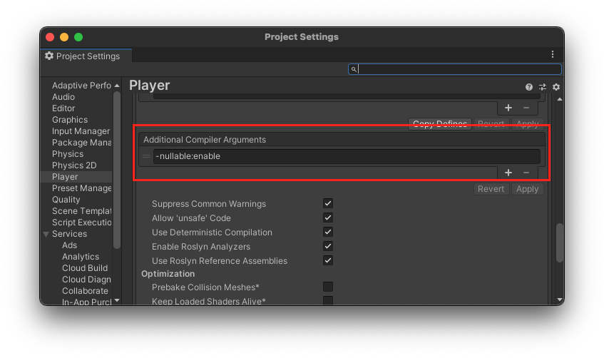

[Unity 2020.2でC# 8が使えるようになりました](https://unity3d.com/unity/whats-new/2020.2.0)。これによって[null許容参照型](https://docs.microsoft.com/ja-jp/dotnet/csharp/nullable-references)が利用できるようになりました。

今日においてnull参照は [one billion-dollar mistake](https://en.wikipedia.org/wiki/Null_pointer#History) と呼ばれるほど避けられるもので、最近の言語、例えばKotlinでは [null安全](https://www.atmarkit.co.jp/ait/articles/1803/15/news012.html) という仕組みを導入することでnull参照を**コンパイル時に検出し、そのようなコードをコンパイルエラーとすること**でこの問題を回避しています。

C#のnull許容参照型も、この問題を解決するために導入されました。ただし、これまでのC#のコードは参照型へのnullの参照を許容しているので、いきなり参照型へのnull代入を完全に非許容とすると多くのコードが動作しなくなるので、警告の出力を行います。さらにこの機能は**オプトイン方式で提供**されています。つまり**基本は無効で、設定を行うことではじめて有効**になります。

## null許容参照型を有効にする

この機能は、ソースコードのこの部分では有効・無効、を切り替えることができます。これを null 許容コンテキストといいます。このコンテキストの切替方法は2つあります。

1. コンパイルオプションで指定する
2. プロジェクト全体での切り替える
3. ソースコードの行単位での切り替える

1.は、Unityでは「PlayerSettings > Player」にある「Additional Compiler Arguments」で`-nullable:enable`を追加します。



2.は、有効にしたいプロジェクトファイル( `*.csproj` )に `Nullable` を設定します。

```xml
<?xml version="1.0" encoding="utf-8"?>
<Project ToolsVersion="4.0" DefaultTargets="Build" xmlns="http://schemas.microsoft.com/developer/msbuild/2003">
  <PropertyGroup>
    <LangVersion>latest</LangVersion>
	  <!-- この行を追加 -->
    <Nullable>enable</Nullable>
  </PropertyGroup>
  <!-- ... -->
```

3.は下記のようにソースコード中に `#nullable` ディレクティブを追記します。このディレクティブはコード中に設定を切り替えたいタイミングで記述できます。

```cs
#nullable enable
// ここからnull許容コンテキストが有効
public static void Check()
{
    // 警告が出る
    string stringNotBeNull = null;
    string? stringMayBeNull = null;

    
#nullable disable
    // ここからnull許容コンテキストが無効
    // そのため下記は警告が出ない
    string stringNotBeNull2 = null;
}
```

ただし手元の環境ではUnityのコンソールにおいて例外を吐くのは1.と3.で、2.はIDEでは有効でした(Riderでは警告を確認できました)。

1.については(当然ですが)**Unityプロジェクト全体で有効になります**。特に**unitypackageで取り込んだサードパーティーのライブラリなど**もコンテキストが有効になってしまうのに注意が必要です。
(ちなみに手元で検証したら、Package Managerで入るコードについてはその対象ではないようでした。)

これは個人的にはasmdefレベル(csprojレベル)で、つまり2.をUnity公式にサポートしてくれるのが理想ではあるのですが、対応してくれると嬉しいのですが。来るといいですね。

PlayerSettingsで設定する方法については、[@_enu](https://twitter.com/_enu)さんにご指摘いただき、2020/12/24に追記しました。ありがとうございました。

<blockquote class="twitter-tweet"><p lang="ja" dir="ltr">PlayerSettingsでも有効にできそうですがいかがでしょうか？ <a href="https://t.co/AitRrwz34J">pic.twitter.com/AitRrwz34J</a></p>&mdash; enu (@_enu) <a href="https://twitter.com/_enu/status/1341211069696512000?ref_src=twsrc%5Etfw">December 22, 2020</a></blockquote> <script async src="https://platform.twitter.com/widgets.js" charset="utf-8"></script>

## 入門 null許容参照型

実際にコードを見ながら動作を確かめてみます。この機能を有効にするとコンパイラでは次の規則が適用されます。

- 参照型のすべての変数が、null非許容参照となります。この参照型にはnullを代入することができません。
- 変数宣言のあとに `?` をつけるとその型はnull許容参照となります。

実際に動作を見てみましょう。

```cs
#nullable enable
public static void Check()
{ 
    // こちらはnull非許容参照型なので警告がでる
    // warning CS8600: Converting null literal or possible null value to non-nullable type.
    string stringNotBeNull = null;
    // こちらはnull許容参照型なので警告が出ない
    string? stringMayBeNull = null;
}
```

上記の規則上`stringNotBeNull` はnull非許容なので、この変数に `null` を代入すると警告がでます。一方で `stringMayBeNull` はnull許容なので `null` を代入しても警告が出ません。このように `?` の有無でその型がnullが代入可能かどうかを明示（アノテーション）することで、コンパイラはnullを代入しても良い型かどうかを認識することができ、その情報を元に警告を出しています。

メソッドの引数と戻り値にも適用されます。まずは引数について見ていきましょう。

```cs
// このメソッドの引数<c>value</c>はnullが非許容
public static void ValueCannotBeNull(string value)
{
    _ = value.Length;
}

public static void ValueMayBeNull(string? value)
{
    // warning CS8625: Cannot convert null literal to non-nullable reference type.
    _ = value.Length;
}
```

`ValueCannotBeNull` メソッドの引数 `value` はnull非許容なためnullが渡ってこないことが期待されます。そのためそのメソッド内の `value.Length` は安全に呼び出されるはずなので、例外は発生しません。一方で、 `ValueMayBeNull` はnull許容のためnullが渡ってくる可能性があるので、 `value.Length` はnull参照の可能性があります。そのためここでは警告が出ます。

コンパイラによるチェックは、（コンテキストが有効であれば）このメソッドの呼び出し側でも行われます。

```cs
string stringNotBeNull = null;
string? stringMayBeNull = null;

// null非許容なのにnullが渡されているので警告
ValueCannotBeNull(null);
// -> warning CS8625: Cannot convert null literal to non-nullable reference type.

// nullでない値が渡されてるので警告が出ない
ValueCannotBeNull("non-null value");

// null非許容参照型の引数に対してnull許容参照型を渡してるので警告
ValueCannotBeNull(stringMayBeNull);
// -> warning CS8625: Cannot convert null literal to non-nullable reference type.

// null非許容参照型だが、手前でnullが代入されているので警告がでる
// (フロー解析とよばれる)
ValueCannotBeNull(stringNotBeNull);
// -> warning CS8604: Possible null reference argument for parameter 'value' in 'void CheckNullableMethod.ValueCannotBeNull(string value)'.

// ただし同じ変数でも、非nullな値が代入されていれば警告が出ない
// (フロー解析)
stringNotBeNull = "non-null value";
ValueCannotBeNull(stringNotBeNull);
```

上記の通り概ね期待通りの動作をしていることが確認できました。１点興味深い点として、null許容参照型はフロー解析という仕組みによって、「コードのこの行で正しい値が代入されているか」をチェックしてくれます。具体的には、 `stringNotBeNull` 変数にははじめ `null` が代入されているので、最初の `ValueCannotBeNull(stringNotBeNull)` という呼び出しは警告がでます。ただし非nullな値を代入してから同じようにメソッドを呼び出すと、この時点では非nullなので警告は出なくなります。

引数と同様、戻り値の型についてもチェックされます。 `ReturnValueMayBeNull` メソッドはnull許容な戻り値を返すため、直接 `returnMayBeNull.Length` を呼び出すと警告が出ます。ただしnullチェックを行うとその変数がnull出ないことを保証できるため、警告が出ません（フロー解析）。

一方で `ReturnValueNotBeNull` メソッドの戻り値はnull非許容のためそのまま `returnNotBeNull.Length` を呼んでも警告は出ません。

```cs
public static string? ReturnValueMayBeNull() => "non-null";
public static string ReturnValueNotBeNull() => null;

public static void Check()
{
    // 戻り値はnull許容
    string returnMayBeNull = ReturnValueMayBeNull();
    // -> warning CS8600: Converting null literal or possible null value to non-nullable type.
    // なのでnull参照の可能性があり警告
    _ = returnMayBeNull.Length;
    // -> warning CS8602: Dereference of a possibly null reference.

    // ただしnull許容の場合はnullチェックをした上でアクセスすれば
    // (nullではない保証がされるので)警告が出ない
    if (returnMayBeNull is not null) _ = returnMayBeNull.Length;

    // 戻り値はnull非許容
    string returnNotBeNull = ReturnValueNotBeNull();
    // 警告は出ない
    _ = returnNotBeNull.Length;
}
```

ちなみにこのフロー解析は下記のように分岐があっても正しく動作します。

```cs
public static void CheckFlowAnalysisWithIf(bool flag)
{
    // フロー解析は、分岐があったとしても、問題なく動作する
    string str = flag ? "non-null" : null;

    // flagがfalseだとnullが入る可能性があるため、
    // このメソッド呼び出しは警告が出る
    _ = str.Length;
    // -> warning CS8602: Dereference of a possibly null reference.

		// どの分岐でも非nullな値が入るために警告は出ない
		string notBeNull = flag ? "non-null" : "null";
		_ = mayBeNull.Length;
}

public static void CheckFlowAnalysisWithSwitch(int value)
{
    string mayBeNull;
    switch (value)
    {
        case 1:
            mayBeNull = "one";
            break;
        default:
            mayBeNull = null;
            break;
    }

    // valueに1以外が入るとnullが入るため警告
    _ = mayBeNull.Length;
    // -> warning CS8602: Dereference of a possibly null reference.

    string notBeNull;
    switch (value)
    {
        case 1:
            notBeNull = "one";
            break;
        default:
            notBeNull = "default";
            break;
    }

    // すべてのケースで非nullのため警告は出ない
    _ = notBeNull.Length;
}
```

### クラスのプロパティの初期化とnull許容参照型

null許容コンテキストを有効にすると、クラスのプロパティはコンストラクタが呼び出された直後にはすべて非nullの値で初期化する必要があり、この規則に違反するとコンパイラは警告を出します。実際に例を見てみましょう。

```cs
public class CheckNullableClass
{
    // デフォルト値で初期化
    public string InitializWithDefault
        = "default";
    // コンストラクタ内で初期化
    public string InitializeInConstructor;
    // 未初期化
    public string NotInitializedValue;
    // -> warning CS8618: Non-nullable field 'NotInitializedValue' is uninitialized. Consider declaring the field as nullable.

    public CheckNullableClassA(string value)
    {
        InitializeInConstructor = value;
    }
}
```

上記のクラスでは `NotInitializedValue` プロパティのみが警告されます。つまり、このクラスのインスタンスを生成した（newした）タイミングで `NotInitliazedValue` は未初期化なためです。（オブジェクト初期化子で初期化すれば初期化済みになるのではという意見もあると思いますが、呼び出し側に強制できないために、初期化済みの保証ができません。）

### null許容演算子（!演算子）

ただし、null許容コンテキストを有効にしたいが、上記のようにコンストラクタ呼び出しまでに初期化できない、といったケースもあるかと思います。こういう場合にnull許容演算子が利用できます。 `NotInitializedValue` でnull許容演算子をデフォルト値として指定することで警告を回避しています。

```cs
public class CheckNullableClassFixed
{
    // デフォルト値で初期化
    public string InitializWithDefault
        = "default";
    // コンストラクタ内で初期化
    public string InitializeInConstructor;
    // 未初期化だがnull許容演算子を指定
    public string NotInitializedValue = null!;

    public CheckNullableClassFixed(string value)
    {
        InitializeInConstructor = value;
    }
}
```

裏を返すと、null許容演算子が指定されたプロパティは、利用者が責任を持って初期化する必要があります。そのためコードレビューなどではこの演算子を使われた場合は初期化をどのようするか議論すると良いのかもしれません。

## Unity利用での注意点について

ここまでで、null許容参照型について紹介しました。ここで、Unityでこれを利用するにあたっていくつか気になった点を挙げます。

1. null許容参照型のプロジェクト全体での有効設定（csprojに記載する方法）は、Unity上では有効にならなかった（コンソール上では表示されなかった）
2. Unityのライフサイクルとnull許容の相性が悪い
3. アノテーション属性は使えない

1.に関しては、Unityのコンソール上では表示されませんでしたが、Riderでは警告が表示されることは確認できたので、利用しているIDE次第なところがあります。

2.に関しては、例えばSerializeFieldです。下記のコードの場合、 `_hogeCache` プロパティは当然警告の対象となります。

```cs

public class HogeBehaviour : MonoBehaviour
{
    [SerializeField]
    private HogeComponent _hogeCache;
}
```

対応はおそらく2通りで、null許容コンテキストを一時的にオフにするか、null許容演算子で初期化するかのどちらかになると思います。

```cs
#nullable enable
public class HogeBehaviour : MonoBehaviour
{
#nullable disable
    // null許容コンテキストを一時的にオフにする
    [SerializeField]
    private HogeComponent _hoge1Cache = null!;
#nullable enable

    // null許容演算子を利用する
    [SerializeField]
    private HogeComponent _hoge2Cache = null!
}
```

また同じような話で、下記のように `Start` などで `GetComponent` することでプロパティを初期化したいケースもあります。この場合も上記と同じような対応を取る必要があるでしょう。

```cs
public class PiyoBehaviour : MonoBehaviour
{
    private void Start()
    {
        _piyoCache = GetComponent<PiyoComponent>();
    }

    private PiyoComponent _piyoCache = null!;
}
```

3.はコンパイラーのフロー解析を補助するための[アノテーション属性がある](https://ufcpp.net/study/csharp/resource/nullablereferencetype/?p=4#annotation-attributes)のですが、Unityで利用可能なC#は.NET 4.x及び.NET Standard 2.0のため、これらは利用できませんでした。

## おわりに

C# 8のnull許容参照型について、Unity利用の観点でいくつかピックアップして紹介しました。
null許容参照型は、いわばコンパイラがnullチェックを手助けしてくれる機能なので、ぜひ積極的に使っていきたいところです。

## 参考

- [null 許容参照型 | Microsoft Docs](https://docs.microsoft.com/ja-jp/dotnet/csharp/nullable-references)
- [null 許容参照型 - C# によるプログラミング入門 | ++C++; // 未確認飛行 C](https://ufcpp.net/study/csharp/resource/nullablereferencetype/)
- [C# 8: Nullable Reference Types - Meziantou's blog](https://www.meziantou.net/csharp-8-nullable-reference-types.htm)
- [Null pointer - Wikipedia](https://en.wikipedia.org/wiki/Null_pointer#History)
