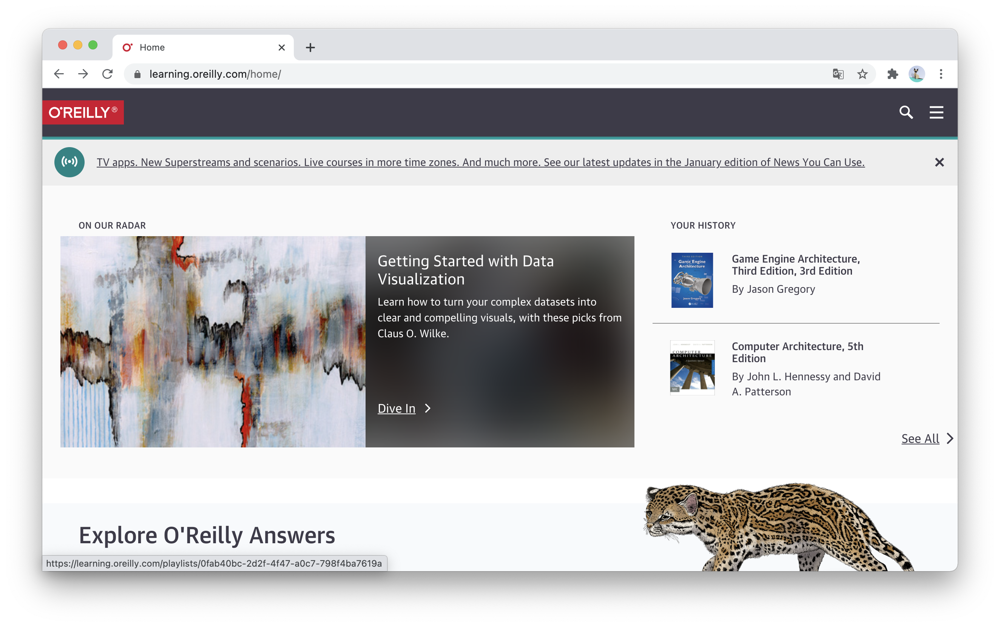

何番煎じ感はあるのですが、自分もACM会員になって、特典のO'Reilly Safariの年間サブスクリプションを購読し始めました。

- [ACM Professional Membershipの登録 - 勘と経験と読経](https://agnozingdays.hatenablog.com/entry/2018/08/02/235021)
- [オライリー本読み放題サブスクO’Reilly online learningを使ってみたらとても良かった - Security Index](https://security-index.hatenablog.com/entry/2020/05/30/163931)
- [技術系の洋書をたらふく読もう！ - SSTエンジニアブログ](https://b.hatena.ne.jp/entry/s/techblog.securesky-tech.com/entry/2018/12/14)
- [O'reilly 本読み放題のためACMに加入した](https://zenn.dev/yohei/articles/2020-12-01-acm-oreilly)

自分はUnityでソーシャルゲームの開発に携わるプログラマですが、きっかけとしてはやはりカバーしている書籍が圧倒的に多いという点でした。

日本語書籍はほとんどないですが、ゲーム関係だと最近日本語訳がでて話題になった[Game Engine Architecture 3rd Edition](https://www.amazon.com/Engine-Architecture-Third-Jason-Gregory/dp/1138035459)だったり、最近グラフィックスについて学ぼうと思っていたのですが、[OpenGLの赤本](https://www.amazon.com/dp/0134495497)や[青本](https://www.amazon.co.jp/dp/0672337479)、[Vulkan Programming Guide](https://www.amazon.co.jp/dp/0134464540)も売っていて、ちょうど読みたかったし、これらを買うだけで$100を超えることを考えると、ものは試しに加入していいなと思い購読を決意しました。

また、今月の初めに[Packt Publishingの$5セール](https://blog.yucchiy.com/2021/01/packt-2021-sale/)に書いたとおり$5でいくつか書籍を購入したのですが、これらの本も見たところほとんど（というか多分全部？）対象に入っていたので、まぁありかなと言う感じで。

加入方法は[こちらの記事](https://agnozingdays.hatenablog.com/entry/2018/08/02/235021)にとても詳しく書いてあるのですが、ざっくりいうと下記の手順で進めます。

1. ACM Professional Membershipに加入する
2. 加入するとACMのアカウントの作成のためのメールが届くので、アカウントを作成する
3. O'Reilly Safariに、上記で作成したACMのアカウントでログインする

それぞれ登録時のメモ。

- ACM Professional Membershipへの登録は、[こちらのページ](https://www.acm.org/membership/join) の「Professionals > ACM Professional Membership」のリンクから行える。
- 登録フォームは順繰り必須項目を埋めていく。「ACM Membership Options」は「Professional Membership -- Yearly Rate: $ 99 (USD)」を選択する。
- 登録フォームを埋めた後に先に登録費を支払う。自分はPayPalで支払った。クレカもいける。
- 支払い後登録が完了すると、「Contact Information」で埋めたメールアドレスにアカウントの作成を完了させるためのリンクが届くので、クリックする(本登録を完了させるためみたいなもの?)。(確か)パスワードを確定させた。
- ACMアカウントのユーザー名は、本登録完了後に「Your ACM Web Account」というメールが届き、そこに「Your web account username is XXX.」という感じで記載されていた。
- その後、O'Reilly Safariへアクセスする。[ACM Learning Center](https://learning.acm.org/)にアクセスして右上の「O'Reilly」にアクセスして、先程のアカウント名とパスワードを入力してログインするか、普通に[O'Reilly](https://www.oreilly.com/)のページから「SIGN IN」にアクセスして、メールアドレスに`アカウント名@acm.org`を入力する。するとSSOログインに飛ばされるので、先でアカウント名とパスワードを入力する。

