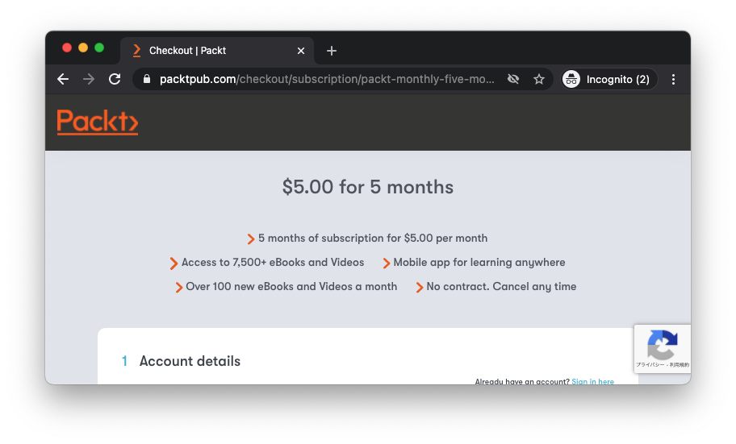

[Puckt Publishing](https://www.packtpub.com/)が$5セールをしていて、全ての書籍とビデオが$5で購入できるようになっている。
セール時期はわからず。新年セール的な立ち位置なのだろうか。ラインナップは[こちら](https://www.packtpub.com/all-products)。だいたい$5になっている(というか全部)。

また、サブスクリプションも今加入すると[5ヶ月間は月$5で購読可能](https://www.packtpub.com/checkout/subscription/packt-monthly-five-month-offer)。

1冊$30よりも高いものも多いのでかなりお得感があり、自分は下記の本を購入した。 ゲーム技術関連でいくつかと、Rust成分多め。

- [C# 9 and .NET 5 – Modern Cross-Platform Development - Fifth Edition](https://www.packtpub.com/product/c-9-and-net-5-modern-cross-platform-development-fifth-edition/9781800568105)
- [Hands-On C++ Game Animation Programming](https://www.packtpub.com/product/hands-on-c-game-animation-programming/9781800208087)
- [Real-Time 3D Graphics with WebGL 2 - Second Edition](https://www.packtpub.com/product/real-time-3d-graphics-with-webgl-2-second-edition/9781788629690)
- [The Complete Rust Programming Reference Guide](https://www.packtpub.com/product/the-complete-rust-programming-reference-guide/9781838828103)
- [Mastering Rust - Second Edition](https://www.packtpub.com/product/mastering-rust-second-edition/9781789346572)
- [Hands-On Data Structures and Algorithms with Rust](https://www.packtpub.com/product/hands-on-data-structures-and-algorithms-with-rust/9781788995528)
- [Hands-On Game Development with WebAssembly](https://www.packtpub.com/product/hands-on-game-development-with-webassembly/9781838644659)
- [Vulkan Cookbook](https://www.packtpub.com/product/vulkan-cookbook/9781786468154)
- [Practical System Programming for Rust Developers](https://www.packtpub.com/programming/practical-system-programming-for-rust-developers)

お買い得なので、ぜひ興味があれば一度、のぞいてみてはどうでしょうか。
