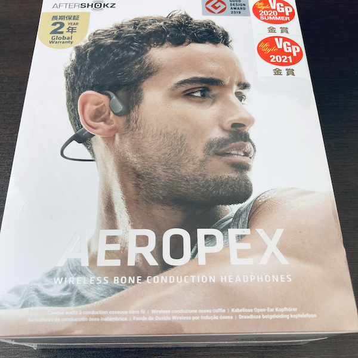
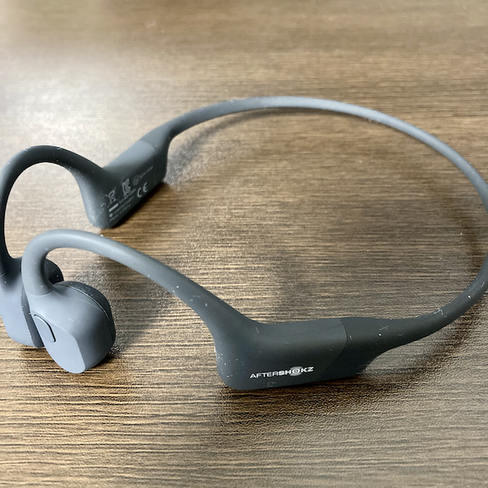

１回のワークアウトでだいたい１時間程度ランニングをするのだが、その時間をPodcastを聴く時間に割り当てられないかと思い、AfterShokz Aeropexを購入した。

少し前に[AirPods Pro](https://blog.yucchiy.com/2020/12/airpods-pro/)を購入していて、外部音取り込みモードで走ればいいのでは？と思って試してみたが、
走る振動でイヤホンが耳からはずれそうになってしまい、それを心配しながら走るのも辛いなと思って別のイヤホンを検討していた。

そこから骨伝導イヤホンを検討していたのだが、会社の方に何人か聞いてみたところ[AfterShokz Aeropex](https://aftershokz.jp/products/aeropex)がおすすめされたので、軽く調べてその日に購入した。

2/6に届いたのでその日に早速ワークアウトで利用したが、とても良かった。

Aeropexは上記のように耳にかけて装着するのと耳にしっかりフィットするので、ランニング程度の振動では滑り落ちてくる心配はまったくなかった。
むしろはじめて装着したときにはきつく感じるぐらいだった。（走っているうちにこれくらいが丁度いいなと感じた。）

耳をふさがないので車のエンジン音や自転車の走ってる音もちゃんと聞こえて安心。

音質は、Podcastで会話を聴く程度だったら十分すぎるぐらいだった。ただし普通の音楽を聴くと、すこしこもったように聞こえたのと低音が弱く感じた。

音漏れについては、自分がよく聞いている[Rebuild](https://rebuild.fm/)や[backspace.fm](https://backspace.fm/)であれば半分程度の音量でランニング中でも十分聞こえ、音漏れも全然気にならない。
ただし当然iPhoneの音量を最大にすれば普通に音漏れする。

これなら家事の最中も、AirPods ProよりAeropexのほうがいいかもしれない。
外部音もよく聞こえるので（というか耳を塞いでないので当然だが）家族に声をかけられたとしても反応しやすいし、AirPods Proより感じが悪くないかもしれない。
