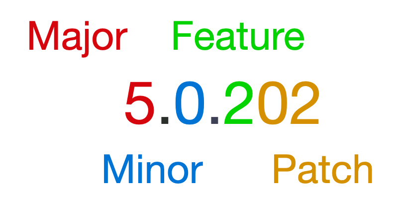

global.jsonで、.NET CLIが利用する.NETのSDKバージョンを指定する方法と、バージョン指定の際のロールフォワードについて説明します。

## global.json

global.jsonファイルを配置すると、そのフォルダ以下で.NET CLIが利用する.NET SDKのバージョンを指定することができます。

global.jsonファイルが存在しない場合は、.NET CLIはインストールされている中で**最新バージョンのSDK**を利用します。

### 作成方法

`dotnet`コマンド経由で作成することができます。

```
dotnet new globaljson
```

成功すると下記のメッセージが出力されます。

```
The template "global.json file" was created successfully.
```

作成されるglobal.jsonで指定されるバージョンは、デフォルトでインストールされている中で最新のバージョンが指定されます。

```
$ cat global.json
{
  "sdk": {
    "version": "6.0.100-preview.2.21155.3"
  }
}
```

SDKのバージョンを指定するには`--sdk-version`オプションを指定します。

```
$ dotnet new globaljson --sdk-version 5.0.100
The template "global.json file" was created successfully.
$ cat global.json 
{
  "sdk": {
    "version": "5.0.100"
  }
}
```

## global.jsonのスキーマ

global.jsonでは下記の３つのプロパティが指定できます。

```json
{
    "sdk": {
        "version": "5.0.202",
        "allowPrerelease": true,
        "rollForward": "latestFeature"
    }
}
```

- `version`: 選択するSDKのバージョンを指定
- `allowPrerelease`: プレリリースバージョン（プレビューリリースなど）の利用を許容するかどうかを指定
- `rollForward`: ロールフォワードポリシーを指定

`version`は文字通りSDKのバージョンを指定するプロパティ、`allowPrerelease`はプレビュー版などプレリリースバージョンの利用を許容するかどうかを指定するプロパティです。

## ロールフォワード

global.jsonによるSDKのバージョン指定はデフォルトで`version`によるバージョンの完全マッチです。例えば`5.0.202`を指定した場合には、同バージョンのSDKが存在する必要があります。

例えば、インストール済みのSDKは下記とします。

```
# 下記コマンドにより、インストール済みの
# SDK一覧が確認可能
$ dotnet --list-sdks
2.1.300 [/usr/local/share/dotnet/sdk]
3.0.100 [/usr/local/share/dotnet/sdk]
3.0.103 [/usr/local/share/dotnet/sdk]
3.1.113 [/usr/local/share/dotnet/sdk]
3.1.115 [/usr/local/share/dotnet/sdk]
3.1.403 [/usr/local/share/dotnet/sdk]
3.1.407 [/usr/local/share/dotnet/sdk]
5.0.100 [/usr/local/share/dotnet/sdk]
5.0.202 [/usr/local/share/dotnet/sdk]
6.0.100-preview.2.21155.3 [/usr/local/share/dotnet/sdk]
```

また、global.jsonでは`5.0.202`が指定されているとします。

```
$ cat global.json
{
  "sdk": {
    "version": "5.0.202"
  }
}
```

この状態で`dotnet run`を実行してみます。すると互換性のあるバージョンのSDKが存在しない旨のメッセージが表示され、`dotnet run`が失敗します。

```
$ dotnet run
Could not execute because the application was not found or a compatible .NET SDK is not installed.
Possible reasons for this include:
  * You intended to execute a .NET program:
      The application 'run' does not exist.
  * You intended to execute a .NET SDK command:
      A compatible installed .NET SDK for global.json version [5.0.300] from [/Users/yucchiy/.ghq/github.com/yucchiy/memo-cli/global.json] was not found.
      Install the [5.0.300] .NET SDK or update [/Users/yucchiy/.ghq/github.com/yucchiy/memo-cli/global.json] with an installed .NET SDK:
        2.1.300 [/usr/local/share/dotnet/sdk]
        3.0.100 [/usr/local/share/dotnet/sdk]
        3.1.403 [/usr/local/share/dotnet/sdk]
        5.0.100 [/usr/local/share/dotnet/sdk]
        5.0.202 [/usr/local/share/dotnet/sdk]
        6.0.100-preview.2.21155.3 [/usr/local/share/dotnet/sdk]
```

これだと少し不便なのですが、（.NET Core 3.0 SDKから）フォールバックによるバージョン指定を`rollForward`プロパティによりその動作を決めることができます。

ロールフォワードではフォールバックで利用されるバージョンを、そのバージョンよりも**新しいバージョンから照合**します。

例えば、先程のSDKのインストール状況で`sdk`に`5.0.200`を、`rollForward`を`latestPatch`で指定すると、`5.0.202`が選択されます

```
$ cat global.json
{
  "sdk": {
    "version": "5.0.200",
    "rollForward": "latestPatch"
  }
}
$ dotnet --version
5.0.202
```

`latestPatch`が指定されるとバージョンが存在しない場合に、指定されたバージョンと同様のメジャー・マイナー・フィーチャーバージョンで、最新のパッチバージョンが指定されます。（つまり、5.0.2xxというバージョンの中からxxが最新のものが選択されます）

### .NET SDKのバージョニング

ロールフォワードの動作を理解するためには、.NET SDKのバージョンがどのように構成されているかを知っておく必要があります。

.NETのSDKのバージョニングについては、下記ドキュメントに詳細が記載されています。

[How the .NET Runtime and SDK are versioned - .NET | Microsoft Docs](https://docs.microsoft.com/en-us/dotnet/core/versions/)

.NET SDKのバージョンは、下記の４セクションで構成されます。



例えば、`5.0.202`の場合はメジャーバージョンが`5`、マイナーバージョンが`0`、フィーチャーバージョンが`2`、パッチバージョンが`02`となります。

## ロールフォワードの挙動について理解する

`rollForward`には下記の９つの値からどれか１つを選択します。９つの値は大きく分けて３つのカテゴリに分類されます。

- ロールフォワードの無効化
    - `disable`: ロールフォワードを利用しない。バージョンの完全一致。
- 保守的なロールフォワード: 指定バージョンにより近いものを利用するポリシー
    - `patch`
    - `feature`
    - `minor`
    - `major`
- 最新版へのロールフォワード: 常に新しいバージョンのSDKを利用するポリシー
    - `latestPatch`
    - `latestFeature`
    - `latestMinor`
    - `latestMajor`    

### ロールフォワードの無効化

`disable`を指定するとロールフォワードが無効化されます。指定されたSDKバージョンが存在しない場合は失敗とします。

### 保守的なロールフォワード

`patch`と`feature`、`minor`と`major`は指定されたバージョンから、より近いものにロールフォワードします。

具体的には`patch`を指定した場合、指定バージョンが**存在しない場合**には`major`と`minor`、`feature`が同じ、**最新の`patch`バージョンを選択**します。もし存在しない場合は失敗します。

`feature`を指定した場合、（指定バージョンの存在有無に関わらず）`major`と`minor`、`feature`が同じ最新の`patch`バージョンを選択します。もし存在しない場合は失敗します。

```
3.0.100
3.0.102
3.1.113
3.1.115
3.1.403
3.1.407
5.0.100
5.0.202
6.0.100-preview.2.21155.3 
```

例えばSDKバージョンが`3.0.100`が選択される場合、`patch`の場合は`3.0.100`がインストール済みため`3.0.100`が選択されます。`feature`の場合は`3.0.1`帯の最新パッチバージョンが選択されるため、`3.0.102`となります。

`minor`が指定されるとまず`patch`が適用されます。`patch`が適用された場合に該当バージョンが見つからない場合は、上位のマイナーバージョンのうち最新のパッチバージョンが適用されます。

`major`が指定されるとまず`patch`が適用され、存在しない場合は`minor`を適用し、さらに存在しない場合は上位のメジャーおよびマイナー、フィーチャーバージョンの最新パッチバージョンが適用されます。

そのためSDKバージョンに`3.0.100`が指定されている場合は、`minor`と`major`を指定しても（`feature`ルール適用の結果、`3.0.102`が適用されているため）`3.0.102`が選択されます。

まとめると下記の表のとおりです。

| ロールフォワード | 選択されるSDKバージョン | 備考                                        |
|:------------- | :------------------- | :----------------------------------------- |
| `patch`       | `3.0.100`            | 完全一致するバージョンが存在するため             | 
| `feature`     | `3.0.102`            | `3.0.1`帯の最新のパッチバージョンが適用されるため | 
| `minor`       | `3.0.102`            | `feature`でバージョンが見つかったため           | 
| `major`       | `3.0.102`            | `feature`でバージョンが見つかったため           | 

ちなみに、下記のようにSDKバージョンに`3.0.300`が指定される場合は、`patch`および`feature`では失敗し、`minor`及び`major`では`3.1.115`が選択されます。
（`feature`で失敗するので`minor`で上位のマイナーの最新パッチバージョンが適用され、`3.1.115`となります。）

```
{
  "sdk": {
    "version": "3.0.300",
    "rollForward": "feature"
  }
}
```

| ロールフォワード | 選択されるSDKバージョン | 備考                                               |
|:------------- | :------------------- | :------------------------------------------------ |
| `patch`       | fail                 |                                                   | 
| `feature`     | fail                 |                                                   | 
| `minor`       | `3.0.115`            | 上位マイナーバージョン `3.1.1`の最新パッチが適用されるため | 
| `major`       | `3.0.115`            | `minor`でバージョンが見つかったため                    | 

このように保守的なロールフォワードが指定される場合は、SDKバージョンが小さい順（パッチバージョン、マイナーバージョン、メジャーバージョンの順）に検索されて、あればそれが利用されるためにより近いバージョンが選択されます。

### 最新版へのロールフォワード

最新版へのロールフォワードは、指定されたバージョン以上の最新のバージョンへロールフォワードします。

`latestPatch`では指定バージョンの最新パッチが、`latestFeature`では指定バージョンのうちの最新フィーチャーおよびパッチバージョンが、`latestMinor`では最新マイナーおよびフィーチャー、パッチバージョンが、`latestMajor`では最新メジャーおよびマイナー、フィーチャー、パッチバージョンが適用されます。

例えば、SDKバージョンに`3.1.100`が指定された場合はそれぞれ下記のとおりです。

| ロールフォワード   | 選択されるSDKバージョン         | 備考                                                    |
|:--------------- | :--------------------------- | :----------------------------------------------------- |
| `latestPatch`   | `3.0.115`                    | 最新パッチバージョンが適用される。                           | 
| `latestFeature` | `3.1.407`                    | 最新フィーチャーおよびパッチが適用される                      | 
| `latestMinor`   | `3.1.407`                    | 最新マイナーバージョンは`3.1`なので`latestFeature`と結果が同様 | 
| `latestMajor`   | `6.0.100-preview.2.21155.3 ` | 最新のメジャーバージョンが適用される| 

ちなみに.NET CLIではデフォルトが`allowPrerelease`が`true`なので`latestMajor`ではプレビュー版がも選択対象になります。`allowPrerelease`を`false`にすると`5.0.202`が選択されます。

## Reference

- [global.json の概要 - .NET CLI | Microsoft Docs](https://docs.microsoft.com/ja-jp/dotnet/core/tools/global-json?tabs=netcore3x)
- [How the .NET Runtime and SDK are versioned - .NET | Microsoft Docs](https://docs.microsoft.com/en-us/dotnet/core/versions/)
