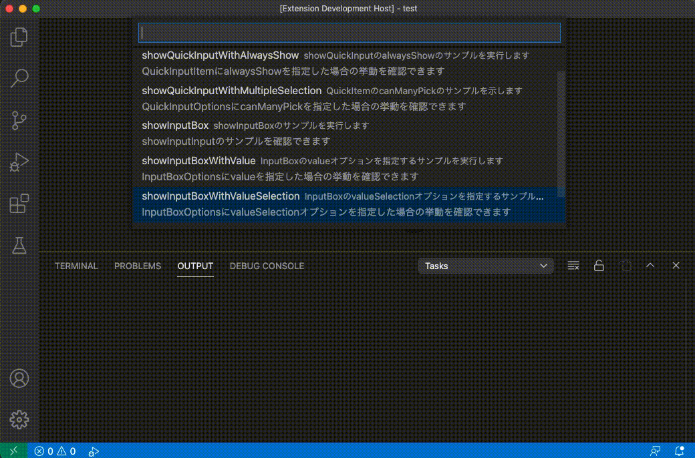

この記事ではVSCodeの拡張機能で、QuickInputとInputBoxを利用してユーザー入力を受け付ける方法について説明します。

## QuickInputとは？

VSCode標準で提供されている要素選択のUIで、たとえばコマンドパレットなどもこのUIで実装されています。


### QuickInputの使い方

まずは、QuickInputの実装を示します。

```ts
// vscode.window.showQuickPickでQuickPickを表示する

// 戻り値はThenable<T>で、Promiseと同様に扱える
// この例ではawaitで結果を待つ
// then/rejectでもOK
const result = await vscode.window.showQuickPick(['one', 'two', 'three'], {
    placeHolder: 'one, two or three',
    // QuickItemでフォーカスがあたった際に呼び出されるコールバック
	onDidSelectItem: item =>
        vscode.window.showInformationMessage(`Focus ${++i}: ${item}`)
});

// 結果を表示する
if (result) {
    // 入力完了
    vscode.window.showInformationMessage(`Got: ${result}`);
} else {
    // 入力がキャンセルされた
    vscode.window.showInformationMessage(`Failed to get`);
}
```

`vscode.window.showQuickInput`を実行するとQuickInputを呼びだします。戻り値は`Thenable<T>`で、`await`と組み合わせると入力の完了（または入力のキャンセル）を待って、その入力値を受け取ることができます。

`showQuickInput`の第１引数は選択する要素を`string`か`QuickPickItem`の配列を、第２引数にはQuickInputの挙動を制御するQuickItemOptionsを指定することができます。

### QuickPickItem

第１引数には選択する要素を`string`か`QuickPickItem`の配列で渡します。`QuickPickItem`は下記のインターフェイスで定義されています。

```ts
export interface QuickPickItem {
    label: string;
    description?: string;
    detail?: string;
    picked?: boolean;
    alwaysShow?: boolean;
}
```

要素を`string[]`で指定した場合は、`QuickPickItem`を`label`のみ指定した表示および挙動となります。`QuickPickItem`の`description`と`detail`を指定すると下記のような表示となります。


詳細は後述しますが、QuickPickの絞り込み検索はデフォルトで`label`のみを対象とします。この挙動は`QuickPickOptions`で変更することができます。

下記のように`QuickPickItem`の`alwaysShow`を`true`として指定すると、絞り込み結果に関わらず必ずその要素が表示されるようになります。

```ts
const items : vscode.QuickPickItem[] = [
    {
        label: "item 1",
        description: "item 1（alwaysShow = false）",
        alwaysShow : false,
    },
    // ...item2 ~ 4もalwaysShow=falseで指定
    {
        label: "item 5",
        description: "item 5（alwaysShow = true）",
        alwaysShow : true,
    },
];

const result = await vscode.window.showQuickPick(items);
if (result) {
    vscode.window.showInformationMessage(`Got: ${result.label}`);
} else {
    vscode.window.showWarningMessage(`Failed to get`);
}
```

上記の指定で、下記のような挙動になります。


## InputBoxとは？

VSCode標準で提供されているテキスト入力UIで、こちらもVSCodeの各種機能で利用されています。


### InputBoxの使い方

まず上記動画の実装コードを示します。

```ts
// InputBoxを呼び出す。awaitで完了を待つ。
const result = await vscode.window.showInputBox();
// ここで入力を処理する
if (result) {
    // 入力が正常に行われている
    vscode.window.showInformationMessage(`Got: ${result}`);
} else {
    // 入力がキャンセルされた
    vscode.window.showWarningMessage(`Failed to get`);
}
```

`vscode.window.showInputBox`を呼び出すことでInputBoxを表示します。戻り値は`showQuickInput`同様`Thenable`なので、`await`で入力の完了を待って、その結果を元に次の処理をおこないます。

この例では指定していないですが、第１引数に`InputBoxOptions`を指定することでInputBoxの挙動を指定することができます。

### InputBoxOptions

InputBoxの挙動を指定するオプションで、下記のインターフェイスで定義されています。

```ts
export interface InputBoxOptions {
    value?: string;
    valueSelection?: [number, number];
    prompt?: string;
    placeHolder?: string;
    password?: boolean;
    ignoreFocusOut?: boolean;
    validateInput?(value: string):
        string | undefined | null |
        Thenable<string | undefined | null>;
}
```

下記のように`value`を指定すると、InboxBoxのデフォルト値を指定することができます。

```ts
const result = await vscode.window.showInputBox({
    value: "default value"
});
if (result) {
    vscode.window.showInformationMessage(`Got: ${result}`);
} else {
    vscode.window.showWarningMessage(`Failed to get`);
}
```


また下記のように`valueSelection`を指定すると、`value`に対して選択済みの範囲を指定することができます。

`value`でプレフィックスやサフィックスを定義しつつ、入力させたい要素を選択済みにすることで、ユーザー入力をよりスムーズにさせることができます。

```ts
const result = await vscode.window.showInputBox({
    value: 'abcdef',
    valueSelection: [2, 4],
});

if (result) {
    vscode.window.showInformationMessage(`Got: ${result}`);
} else {
    vscode.window.showWarningMessage(`Failed to get`);
}
```



`validateInput`はInputBoxの入力値を検証することができます。

`validateInput`には関数を指定します。この関数の検証が通らない限り入力を確定することができません。

検証関数はstringを引数に受け取ります。入力値が正常であれば`null`を、異常値であればその理由を`string`で返却します。

```ts
const result = await vscode.window.showInputBox({
    validateInput: (text) => {
        return text.length >= 6 ? null: "6 or more characters";
    },
});

if (result) {
    vscode.window.showInformationMessage(`Got: ${result}`);
} else {
    vscode.window.showWarningMessage(`Failed to get`);
}
```


## まとめ

VSCodeの拡張実装でよく利用する、QuickInputおよびInputBoxについて、その利用方法を紹介しました。

ちなみに、MicroSoft公式がサンプル実装は[vscode-extension-samples/quickinput-sample at main · microsoft/vscode-extension-samples](https://github.com/microsoft/vscode-extension-samples/tree/main/quickinput-sample)で確認できます。
