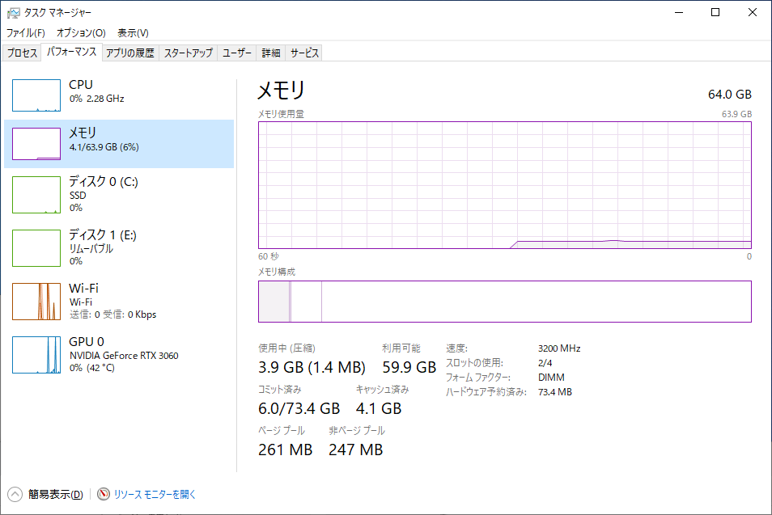
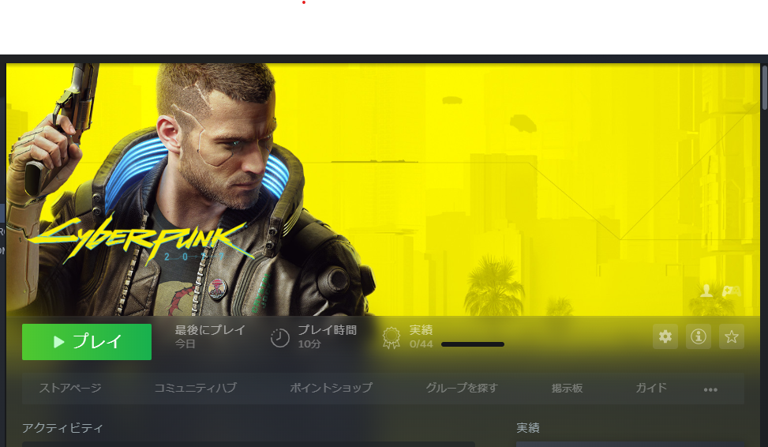

<blockquote class="twitter-tweet">
New my gear… <a href="https://t.co/oG31DCGuuP">pic.twitter.com/oG31DCGuuP</a>
&mdash; ゆっち〜 (Yuichiro MUKAI) (@yucchiy_) <a href="https://twitter.com/yucchiy_/status/1408099274533969920?ref_src=twsrc%5Etfw">June 24, 2021</a></blockquote> 

タイトル通り、メインマシンをWindowsに移行した。

仕事は基本macOSだったがWindowsを用いた開発も増えていきそうで、せっかくだしプライベートの環境もWindowsを導入しようと思ってノートPC（Surfaceなど）を見繕っていた。
しかしある程度納得いくような構成にすると結構な値段になるのと、家だとノートPCもクラムシェルで起動することが多く、そもそもノートPCである必要もないと感じたので思い切ってデスクトップPCの購入を決意した。

デスクトップを購入するのにBTOにするか自分で組むかを検討したが、パーツの相性などを吟味する自信ががなかったしGPUの高騰も単体で買うよりも[BTOであればある程度抑えられることを教えていただき](https://twitter.com/shiena/status/1403609398375682048)、BTOでの購入に決めた。

予算と大まかなスペックを決めて、そのスペックをもとに社内の識者にご意見をいただき（というかほぼ見繕ってもらった！）、[@Sycom](https://www.sycom.co.jp/)で購入した。

あとで拡張したいことを考えて（実際次買うときにどれぐらいパーツを使いまわせるかは正直わからないけど）、箱は普通にタワー型なのと、電源もある程度しっかりしたもので余裕を持ったのと、静音にこだわりたかったので、[Silent-Master NEO](https://www.sycom.co.jp/custom/model?no=000739)をカスタマイズした。

Windowsを使ってみて、はじめはショートカットキーやキーボード入力など混乱したが、1週間も使えばかなり慣れた。
むしろ今となっては、（同スペックではないので比較するのもよくないが）Windowsの起動の速さに驚いたり、アプリもキビキビ動くのでWindowsの使用時間のほうが長くなってきている。

開発で利用しているツール類の心配はあったが、普段使っていたコマンドラインツール類（gitやtigなど）はPowerShell上で問題なく動作するし、Unity開発はそもそもC#を書いているのでWindowsのほうがツールが揃っているわけで、むしろこちらのほうが快適だと思える。最悪困ったらWSL2やDockerを起動すれば良い。

ちなみにこのブログも新しいWindows上で執筆した。Gatsby.jsで作っているのでNode.jsが必要だが、[Scoop](https://scoop.sh/)というパッケージマネージャ経由でそれらをインストールして利用できた。Web開発も全然Windowsで問題なくやれそうな気がする。大学時代にWindowsからMacへ、Unixだからコマンドラインも叩けて便利という点で移ったが、いまならWindowsも選択肢に入るなと感じた。開発環境の構築とかは、そのうちブログにも書こうと思う。

ついでにPC上でPS4コンソール上のゲームもできるし、結構楽しい。せっかくなので（サマーセールということもあり）Cyberpunk2077を買って遊び始めたが、一応グラフィックス設定も落とさず普通に動いた（ただしゲームをガッツリ遊んでるわけではないので長時間プレイでどうなるかはなんとも言えないが...）。なかなか楽しい。

GPUもレイトレーシングができるやつなので、レイトレーシングプログラミングを楽しみたいなとも思う。
