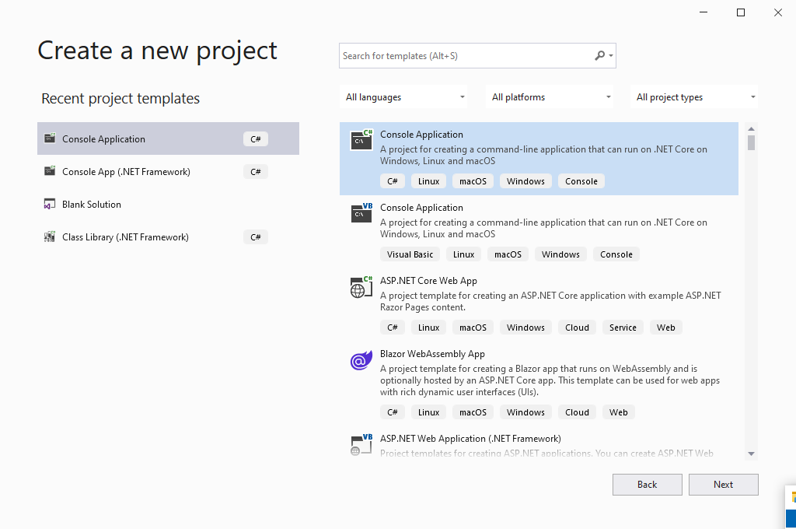
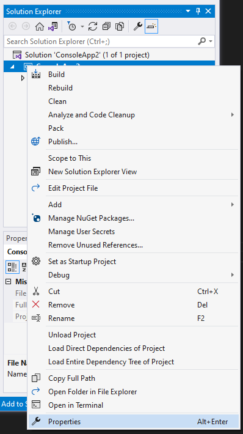
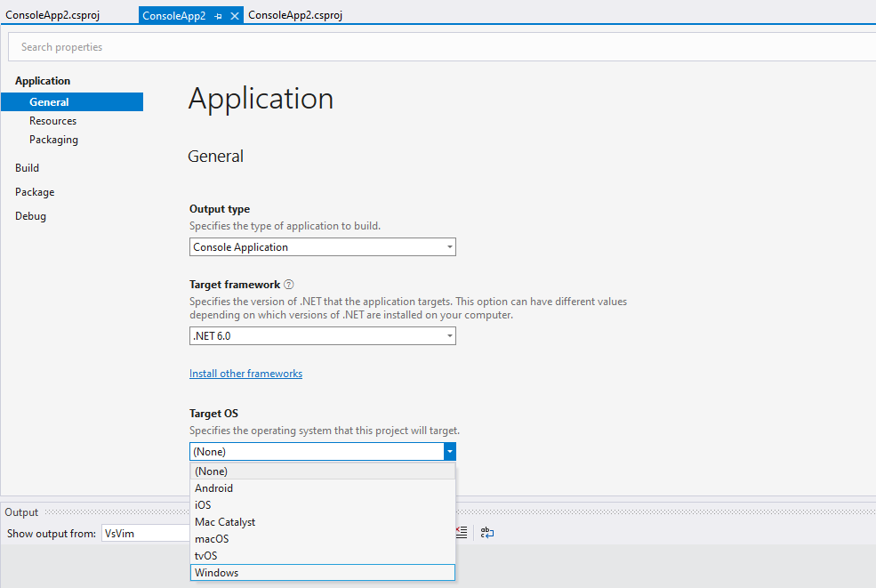
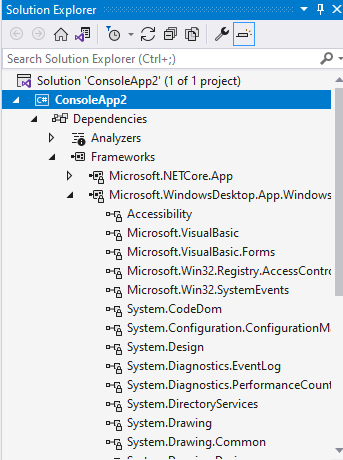
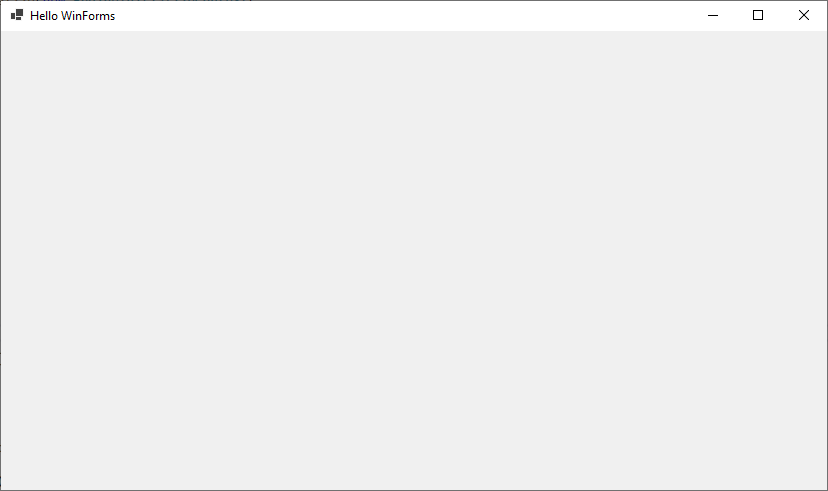

タイトル通りで、.NETアプリケーションでWindowsフォームを利用してウインドウを作成する方法をメモします。

手元の環境は下記のとおりです。

- Windows 10
- Visual Studio 2022 Preview 3 

.NET 6 Preview 7での動作を確認しています。


## プロジェクト作成

.csprojを作成します。テンプレートには下図のように.NETのConsole Applicationを指定します。




## プロジェクト設定

下記のページを参考に設定します。

[Microsoft.NET.Sdk.Desktop の MSBuild プロパティ - .NET | Microsoft Docs](https://docs.microsoft.com/ja-jp/dotnet/core/project-sdk/msbuild-props-desktop#usewindowsforms)

### 概要

設定の要点としては下記のとおりです。

- (.NET 5以降の場合は) SDKターゲットを`Microsfot.NET.Sdk`とします
- TargetFrameworkを`net6.0-windows`に設定します
- WinFormsを利用するために`UseWindowsForms`を`true`に設定します

.NET 5以降とそれ以前では設定が違うようですが、詳細は[ドキュメント](https://docs.microsoft.com/ja-jp/dotnet/core/project-sdk/msbuild-props-desktop#usewindowsforms)を参考にしてください。今回は.NET 6を対象にしているため上記の設定としています。


### .csprojを編集する

概要に示した設定を行います。Visual Studioでの設定を記載しますが、直接 .csproj を編集でも問題ないはずです。

まずSDKターゲットですが、確認のためには.csprojを直接開いて確認します。Solution Explorer上でプロジェクトをダブルクリックするとそのプロジェクトの.csprojを開く事ができます。

開くと下記のような設定が確認できます。ここでSDKターゲットは、1行目の`<Project Sdk="Microsoft.NET.Sdk">`の`Microsoft.NET.Sdk`部分です。


```xml
<Project Sdk="Microsoft.NET.Sdk">

  <PropertyGroup>
    <OutputType>Exe</OutputType>
    <TargetFramework>net6.0</TargetFramework>
    <Nullable>enable</Nullable>
  </PropertyGroup>

</Project>
```

テンプレートのデフォルト値でSDKターゲットが適切なものなっていることが確認できました。もしこの設定が違う場合は適宜設定が必要です。

次にTargetFrameworkですが、上記.csprojの`<TargetFramework>`の項目を`net6.0-windows`に変更することで設定できます。

この設定はVisual StudioのGUI上からも変更できます。.csprojのGUI設定画面は、下図のようにSolution Explorerから「Properties」を選択することで開けます。



設定画面から下図のように「Target Platform」項目で「Windows」を選択することで、同様に`net6.0-windows`を設定できます。




最後の`UseWindowsForms`ですが、こちらはGUI上の設定画面がデフォルトでは表示されていないため、.csprojを直接編集する必要があります。

下記のように`<PropertyGroup>`項目内に設定を追記します。


```xml
<Project Sdk="Microsoft.NET.Sdk">

  <PropertyGroup>
    <OutputType>Exe</OutputType>
    <TargetFramework>net6.0-windows</TargetFramework>
    <!-- これを追記 -->
    <UseWindowsForms>true</UseWindowsForms>
    <Nullable>enable</Nullable>
  </PropertyGroup>

</Project>
```


これで設定完了です。プロジェクトを設定を保存して下図のようにSolution Explorerの「Frameworks」内で「Microsoft.WindowsDesktop.App.Windows」のような項目が確認できたらOKです。





## 動作確認

設定が完了したので、空のウインドウを作成して動作確認してみます。

```cs
using System;
using System.Drawing;
using System.Windows.Forms;

namespace ConsoleApp2
{
    public static class Program
    {
        [STAThread]
        public static void Main(string[] args)
        {
            using var form = new Form
            {
                FormBorderStyle = FormBorderStyle.Sizable,
                Text = "Hello WinForms",
                ClientSize = new Size(800, 600)
            };

            var isRunning = true;
            form.KeyUp += (_, e) =>
            {
                if (e.KeyData == Keys.Escape)
                {
                    isRunning = false;
                }
            };

            form.Show();

            while (isRunning)
            {
                Application.DoEvents();
            }
        }
    }
}
```

上記を実行すると下図のようなウインドウの生成と、Escキーを押すとプログラムが終了することが確認できました。


