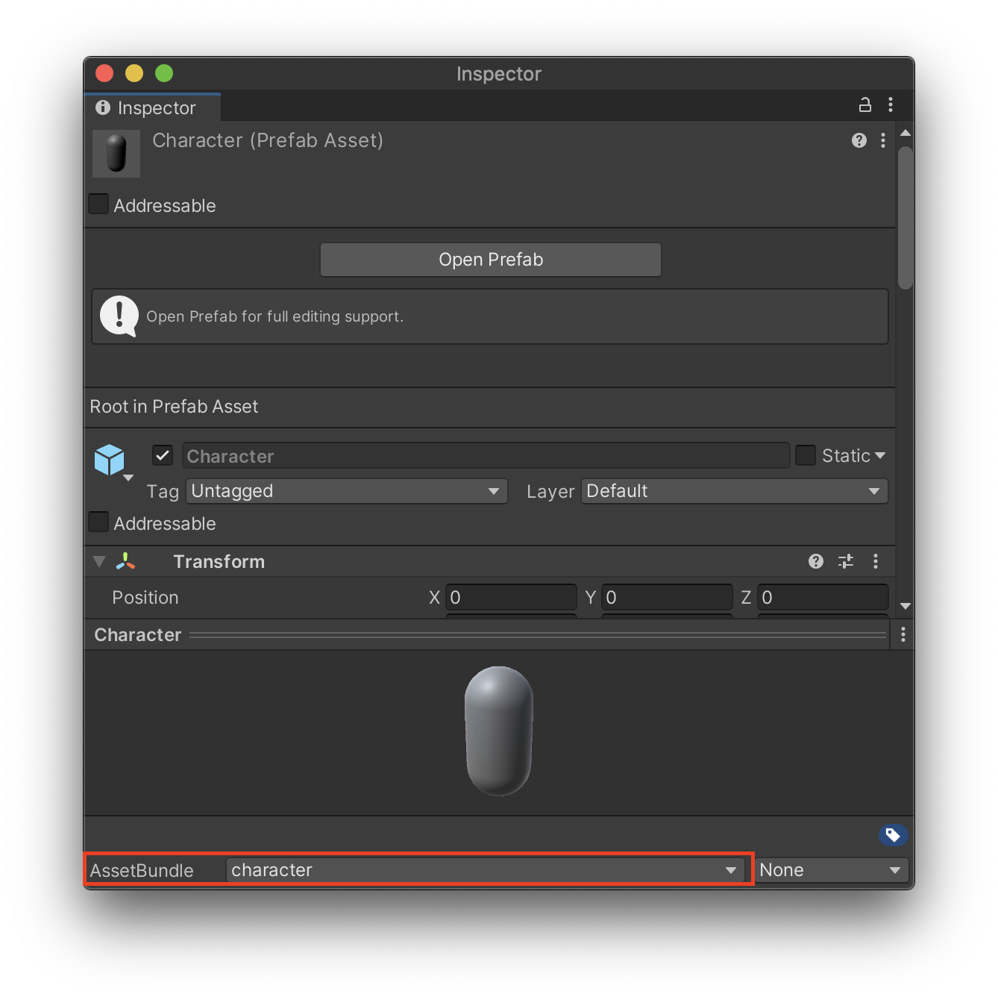
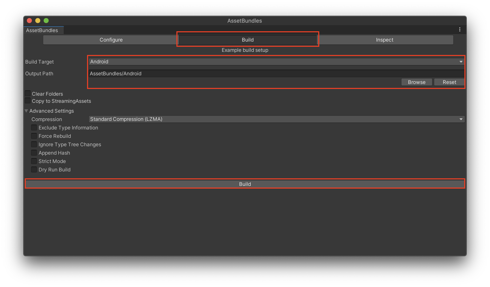
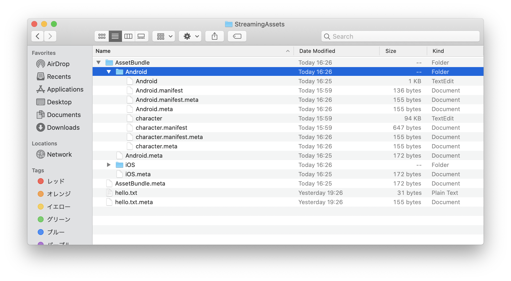
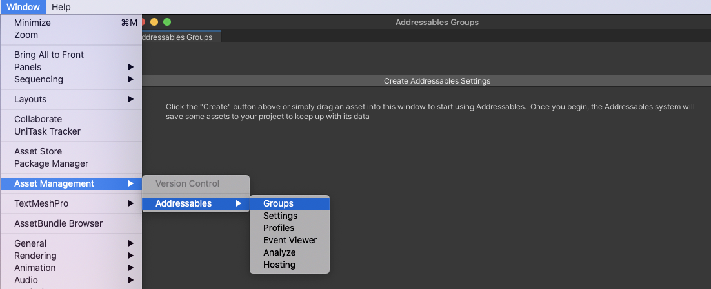
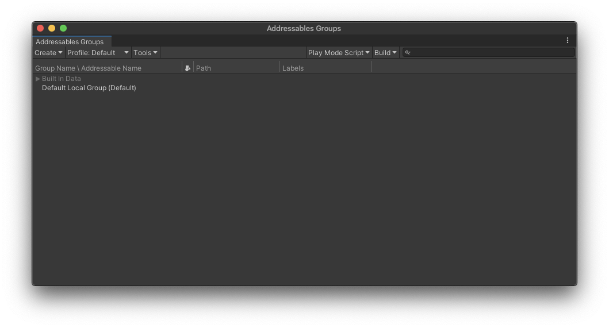
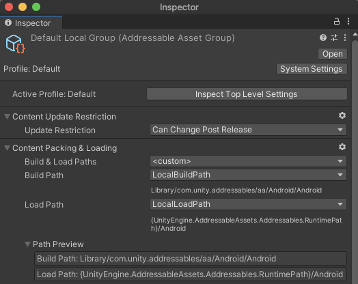
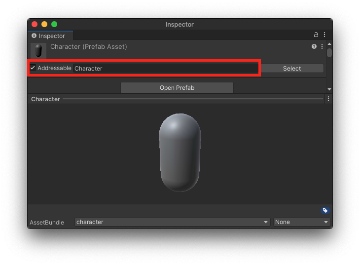
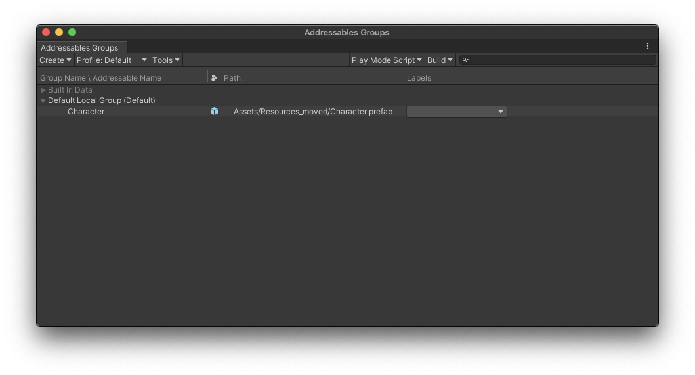
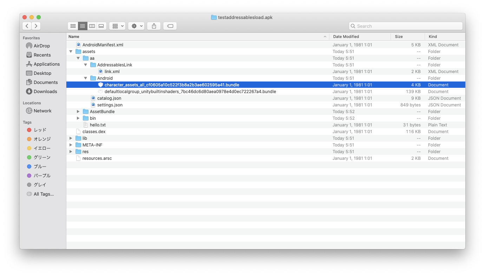

この記事は「[Applibot Advent Calendar 2021](https://qiita.com/advent-calendar/2021/applibot)」の20日目の記事になります。

Unityではアプリ内にアセットを組み込む方法がいくつか存在しますが、それぞれの方法で利用方法や実装上の注意点があります。

アプリ内にアセットを組み込む方法には大きく分けて下記があります。

1. `Assets/Resources` というフォルダを作成してその中にアセットを格納する
2. `Assets/StreamingAssets` というフォルダを作成してアセットを格納する
3. Addressablesを利用してローカルアセットを読み込む

これらの手法について、それぞれ紹介していきたいと思います。

## Assets/Resources内にアセットを組み込む

[Unity - Scripting API: Resources](https://docs.unity3d.com/2020.3/Documentation/ScriptReference/Resources.html)

Assetsフォルダ内にResourcesという名前のフォルダを作成してその中にアセットを配置し、 [ResourcesAPI](https://docs.unity3d.com/ScriptReference/Resources.html?_ga=2.2989232.1050104446.1639550329-353882182.1627870586)を用いてロードします。

```csharp
using UnityEngine;
using System.Collections;

public class ExampleClass : MonoBehaviour
{
    void Start()
    {
        var prefab = Resources.Load<GameObject>("Character");
        GameObject.Instantiate(prefab);
        Resources.UnloadAsset(prefab);
    }
}
```

配置されたデータはビルド時にアプリ（ipaやapk）内に組み込まれるため、外部からのダウンロードを介さずにアセットをロードできます。

### Resourcesを利用する際の注意点

[https://learn.unity.com/tutorial/assets-resources-and-assetbundles](https://learn.unity.com/tutorial/assets-resources-and-assetbundles)

ResourcesはUnity公式としては上記の通り「**Don't use it.**」と、利用は推奨されないようです。具体的には下記の理由のようです。

1. きめ細かいメモリ管理が行えない
2. Resources内のアセットが増えるとアプリの起動時間とビルド時間が長くなる
3. 特定プラットフォーム下へのカスタムコンテンツの配信、コンテンツのアップグレードがしづらくなる

特に「2. アプリの起動時間が長くなる」に関しては、Resourcesシステムの初期化が**アプリケーション起動時のスプラッシュ画面**で行われ、アプリ側ではこの**初期化をずらしたり非同期にできません**。つまり、**Resources内にアセットが増えれば増えるほど、アプリの起動が必ず遅くなることを意味する**ので、個人的にはかなり致命的に感じています。

公式として、Resourcesは下記の用途が適切だと述べています。

1. プロトタイピング
2. アプリ起動中に常に必要なアセット
3. メモリを大量使用しないアセット
4. 頻繁なパッチ更新の必要がないアセット
5. 最小限のブートストラップのために必要なアセット（設定など）

なのでResourcesは、**アプリの設定やゲーム内で常に必須となるようなHUDのアセットやプレハブ**などにとどめて利用するのが良さそうです。

## Assets/StreamingAssets内にアセットを組み込む

[Unity - Manual: Streaming Assets](https://docs.unity3d.com/2020.3/Documentation/Manual/StreamingAssets.html)

Unityでアプリ内にアセットを仕込む方法としてResources以外にStreamingAssetsがあります。

この方法は、Assetsフォルダ下にStreamingAssetsフォルダを作成し、その中にアセットを格納しておくと、ビルド時にアプリ内に（ほぼ）そのままコピーする形でアプリに組み込まれます。 

StreamingAssetsで組み込まれるアセットは、[Application.streamingAssetsPath](https://docs.unity3d.com/2020.3/Documentation/ScriptReference/Application-streamingAssetsPath.html) 内に格納されるので、このプロパティを元にパスを構築します。

ロード方法はプラットフォームごとに若干異なるので注意が必要です。StreamingAssetsは、Resourcesのように専用のAPIは存在せず、通常は構築したパスに対して `System.IO.File.ReadAllText`や `System.IO.FileStream` などでファイルを開いてロードします。

```csharp
using System.IO;
using System.Threading.Tasks;
using UnityEngine;

public class TestStreamingAssetTextLoad : MonoBehaviour
{
    async void Start()
    {
        // StreamingAssets内のhello.txtの中身を表示します
        var filePath = Application.streamingAssetsPath + "/hello.txt";
        Debug.Log(await ReadStreamingAssetsWithIOAsync(filePath));
    }

    async Task<string> ReadStreamingAssetsWithIOAsync(string path)
    {
        using var fileStream = new FileStream(path, FileMode.Open);
        var resultBytes = new byte[fileStream.Length];
        await fileStream.ReadAsync(resultBytes, 0, (int) fileStream.Length);

        return System.Text.Encoding.UTF8.GetString(resultBytes);
    }
}
```

ただし、AndroidではStreamingAssets内のアセットが基本apk内に圧縮して格納されているため、上記のようにそのまま `System.IO.FileStream` を介してのロードが行なえません。またWebGLビルドのアプリについても直接ロードできません。

この問題を回避するために、Unityでは WWW または UnityWebRequestにStreamingAssetsのパスを指定することで、指定パスのファイルを読み込めます。

```csharp
using System.IO;
using System.Threading.Tasks;
using Cysharp.Threading.Tasks;
using UnityEngine;

public class TestStreamingAssetTextLoad : MonoBehaviour
{
    // UnityWebRequest経由でStreamingAssetを読み込む
    async UniTask<string> ReadStreamingAssetsWithWebRequestAsync(string path)
    {
        var request = UnityEngine.Networking.UnityWebRequest.Get(path);
        // UniTaskの機能で非同期に読み込む
        await request.SendWebRequest();

        return request.downloadHandler.text;
    }

    async void Start()
    {
        var filePath = Application.streamingAssetsPath + "/hello.txt";
        // Androidは読み込み方法が異なるため、UNITY_ANDROIDなどで呼び分けする
#if !UNITY_EDITOR && UNITY_ANDROID
        Debug.Log(await ReadStreamingAssetsWithWebRequestAsync(filePath));
#else
        Debug.Log(await ReadStreamingAssetsWithIOAsync(filePath));
#endif
    }

    async Task<string> ReadStreamingAssetsWithIOAsync(string path)
    {
        using var fileStream = new FileStream(path, FileMode.Open);
        var resultBytes = new byte[fileStream.Length];
        await fileStream.ReadAsync(resultBytes, 0, (int) fileStream.Length);

        return System.Text.Encoding.UTF8.GetString(resultBytes);
    }
}
```

このように、**プラットフォームごとにStreamingAssetsの扱いが異なる可能性がある**点に注意が必要です。

また、StreamingAssetsではファイルを原則 `byte[]` または `string` としてロードすることになります。つまりそのまま利用すると**プレハブやScriptableObjectsなどのアセットをロードして、インスタンス化することができません**。

### StreamingAssetsでプレハブやScriptableObjectなどを読み込む方法

StreamingAssetsにアセットを組み込みつつ、プレハブやScriptableObjectsをロードしてインスタンス化するには、StreamingAssets内にアセットバンドルとしてデータを組み込みこんで、[AssetBundleAPI](https://docs.unity3d.com/2020.3/Documentation/ScriptReference/AssetBundle.html)でアセットをロードすることでこれを実現できます。

アセットのAssetBundle化は、プロジェクトの規模が大きくなると設定の自動化やJenkinsのジョブから [AssetBundleBuild](https://docs.unity3d.com/ScriptReference/AssetBundleBuild.html) や [Scriptable Build Pipeline](https://docs.unity3d.com/Packages/com.unity.scriptablebuildpipeline@1.19/manual/index.html) を通してビルドの自動化などのワークフローが組まれることが多いですが、簡易的には [AssetBundle Browser](https://docs.unity3d.com/Manual/AssetBundles-Browser.html) を用いてAssetBundleを用意できます。

まず、アセットバンドルにしたいアセットに名前をつけます。アセットをインスペクタで開き、下記画像赤枠の項目をクリックすると名前をつけられます。



次にAssetBundle Browserを開きます。「Build」タブをクリックし、下の「Build」ボタンをクリックするとアセットバンドルがビルドされます。アセットバンドルはプラットフォームごとに生成が必要なため、対応するプラットフォームに対してそれぞれアセットをビルドする必要があります。



次に、上記のOutput Pathに生成されたアセットバンドルをStreamingAssetsにコピーします。



上記でStreamingAssets以下にアセットバンドルが用意できたので読み込んでみます。アセットバンドルの読み込みには `AssetBundle.LoadFromFileAsync` などファイルパスやストリームを指定してアセットバンドルをロードするメソッドが用意されているのでそれを利用します。

```csharp
using UnityEngine;
using Cysharp.Threading.Tasks;

public class TestStreamingAssetAssetBundleLoad : MonoBehaviour
{
    async void Start()
    {
        var assetBundle = await LoadAssetBundleWithFileIOAsync("character");
        var prefab = await assetBundle.LoadAssetAsync("Character");
        GameObject.Instantiate(prefab);
    }

    string GetFilePath(string assetBundleName)
    {
#if UNITY_IOS
        return Application.streamingAssetsPath + $"/AssetBundle/iOS/{name}";
#elif UNITY_ANDROID
        return Application.streamingAssetsPath + $"/AssetBundle/Android/{assetBundleName}";
#else
        return Application.streamingAssetsPath + $"/AssetBundle/iOS/{name}";
#endif
    }

    async UniTask<AssetBundle> LoadAssetBundleWithFileIOAsync(string assetBundleName)
    {
        var filePath = GetFilePath(assetBundleName);
        return await AssetBundle.LoadFromFileAsync(filePath, 0);
    }
}
```

ただし、前述の通りAndroidの場合は直接ファイルを読み込めないため、UnityWebRequest経由でアセットバンドルをロードします。

```csharp
using UnityEngine;
using Cysharp.Threading.Tasks;

public class TestStreamingAssetAssetBundleLoad : MonoBehaviour
{
    async void Start()
    {
        var assetBundle = await LoadAssetBundleWithUnityWebRequest("character");
        var prefab = await assetBundle.LoadAssetAsync("Character");
        GameObject.Instantiate(prefab);
    }

    string GetFilePath(string assetBundleName)
    {
#if UNITY_IOS
        return Application.streamingAssetsPath + $"/AssetBundle/iOS/{name}";
#elif UNITY_ANDROID
        return Application.streamingAssetsPath + $"/AssetBundle/Android/{assetBundleName}";
#else
        return Application.streamingAssetsPath + $"/AssetBundle/iOS/{name}";
#endif
    }
    
    async UniTask<AssetBundle> LoadAssetBundleWithUnityWebRequest(string assetBundleName)
    {
        var filePath = GetFilePath(assetBundleName);
        var request = UnityEngine.Networking.UnityWebRequestAssetBundle.GetAssetBundle(filePath, 0);
        await request.SendWebRequest();
        
        return UnityEngine.Networking.DownloadHandlerAssetBundle.GetContent(request);
    }
}
```

## Addressablesでアセットを組み込む

[Addressables | Addressables | 1.18.19](https://docs.unity3d.com/Packages/com.unity.addressables@1.18/manual/index.html)

3つ目の方法として、Addressablesを用いて対象のアセットをローカルグループに設定されたものに所属させることで、アセットをアプリ内に組み込む事ができます。

この方法は、内部的には先程のStreamingAssetsにアセットバンドルのデータを組み込んでロードする方法が採用されています。

StreamingAssets内にアセットバンドルを組み込みは、Unity標準でそれらの自動化は存在しないのでアプリ側でワークフローを整える必要がありますが、Addressablesによるアセットのアプリ組み込みは、ある意味2つ目の方法のワークフローをUnity標準のライブラリで整えてくれている、という感じでしょうか。

実際にAddressablesによるアセットの組み込みからロードまでをおこなってみます。まず下図のように**Window > Asset Management > Addressables > Groups** でAddressables Groupsウインドウを開き、「Create Addressables Settings」でAddressablesの設定を作成します。



すると、下図の用にグループの設定が作成されます。このとき「Default Local Group」というグループに所属するアセットは、アプリ内に組み込まれてロードされます。



念の為、「Default Local Group」が組み込みアセットの読み込み設定になっているかを確認しておきます。

Addressables Groupウインドウのグループをクリックするとインスペクター上でグループの設定が確認できます。下図のようにDefault Local Groupの設定のContent Packing & LoadingのBuild PathがLocalBuildPathに、Load PathがLocalLoadPathになっていれば、組み込みアセットからロードを行います。



次に、アセットをこのAddressablesのグループに所属させます。対象アセットをインスペクターで開き、赤枠の「Addressable」のチェックボタンをONにします。合わせてこのアセットのアドレス（アセットを読み込むときに指定する文字列）を指定しておきます。



設定が完了すると、下図のように「Addressables Groups」のDefault Local Group配下にCharacterアセットが追加されていることが確認できます（今回は１グループのみかつデフォルトのグループ設定としてDefault Local Groupに所属しましたが、そうでない場合はアセットを右クリックして「Move Addressable to Group」で所属するグループを変更できます）。



これでアセットの設定は完了したので、実際にロードしてみます。ロード自体は非常にシンプルです。

```csharp
using UnityEngine;
using Cysharp.Threading.Tasks;
using UnityEngine.AddressableAssets;

public class TestAddressablesLoad : MonoBehaviour
{
    async void Start()
    {
        // Addressablesによるアセットのロード
        // awaitはUniTaskで提供される機能を利用しています
        var prefab = await Addressables.LoadAssetAsync<GameObject>("Character");
        // ロードしたPrefabをインスタンス化して表示
        Instantiate(prefab);
    }
}
```

今回の例では、名前を直接指定して`LoadAssetAsync`メソッド経由でロードしましたが、その他にもアセットにあらかじめ設定したラベルを指定して、複数アセットを読み込んだり、[その他にもAPIが存在します](https://docs.unity3d.com/Packages/com.unity.addressables@1.18/manual/RuntimeAddressables.html)。

あとは上記のコンポーネントをゲームオブジェクトにアタッチすればアセットをAddressables経由でロードして表示されます。

方法2と比べると、StreamingAssets配下であることは隠蔽されているので、2つ目に紹介したようなプラットフォームごとの呼び分けを意識する必要がなく（さらにいうとアセットがどこにあるのかも意識していない）、より直感的にアセットのロードを行うことができるようになりました。

アプリ内へ埋め込むアセットバンドルのビルドとStreamingAssetsへの組み込みは、ローカルアセットの場合はアプリビルド時に自動で行われるようです。例えばapkをビルドして、生成されたapkを展開すると、 `assets/aa/Android` 配下（StreamingAssetsに格納したアセットはこの `assets` 下にコピーされる）にAddressablesが組み込んだアセットを確認できました。



## まとめ

アセットをアプリに組み込んで、利用する方法を3つ紹介しました。

- Resourcesによる組み込みはアプリ起動時間の増加やメモリ管理の観点から、ライフサイクルが永続的かつ頻繁な更新が行われないアセットに限定した利用用途の限定が推奨されている。
- StreamingAssetsを用いると上記の問題を回避してアセットを組み込める。ただし一部プラットフォームではアセットの読み込み方法が異なるので注意が必要。
    - StreamingAssets内でプレハブなどUnityのアセットを読み込む場合はアセットバンドルを埋め込む必要がある
- Addressablesを用いるとStreamingAssetsへのアセットバンドルの組み込みとロードを、それらのワークフローをあまり意識することなく実装できる。

## 参考

- [Assets, Resources and AssetBundles - Unity Learn](https://learn.unity.com/tutorial/assets-resources-and-assetbundles)
- [StreamingAssetsについて - テラシュールブログ](https://tsubakit1.hateblo.jp/entry/20120917/1347807947)
- [【Unity】僕はそろそろResourcesフォルダを卒業しようと思う - LIGHT11](https://light11.hatenadiary.com/entry/2020/07/29/202755)
- [【Unity】Addressableアセットシステム入門 - 3つのメリットと基本的な使い方を紹介 - LIGHT11](https://light11.hatenadiary.com/entry/2019/12/26/225232)
- [今更誰も教えてくれない、Unityにおけるアセット読み込みについての基礎知識 - Qiita](https://qiita.com/k7a/items/df6dd8ea66cbc5a1e21d)
