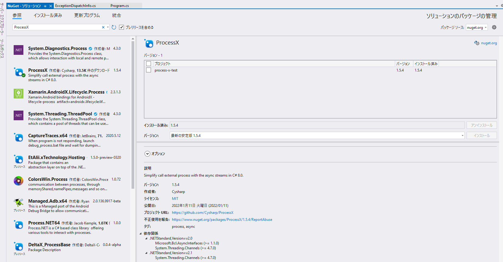
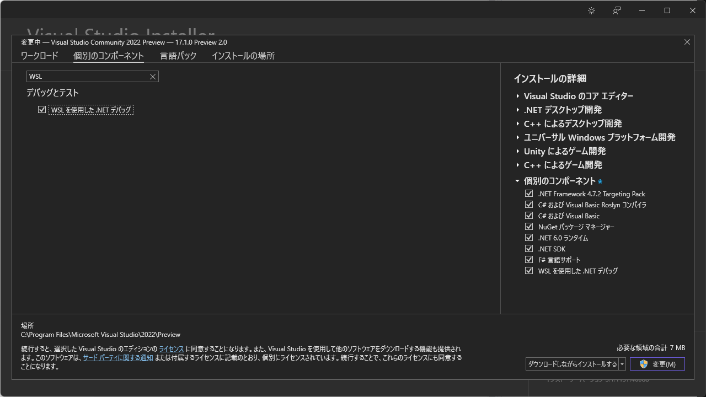
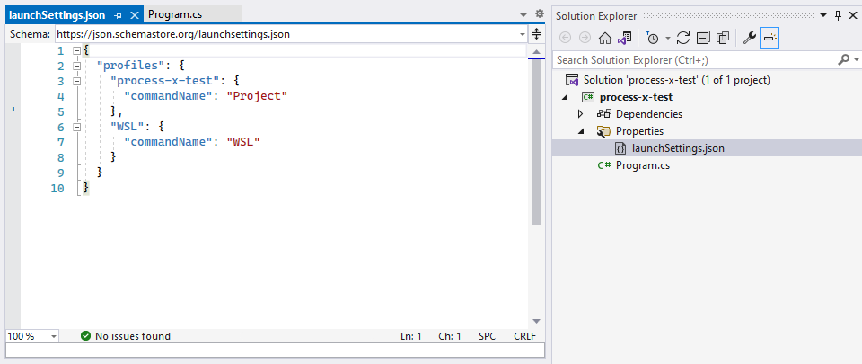
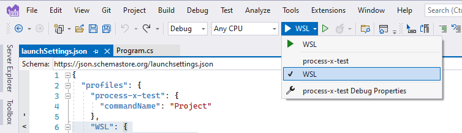
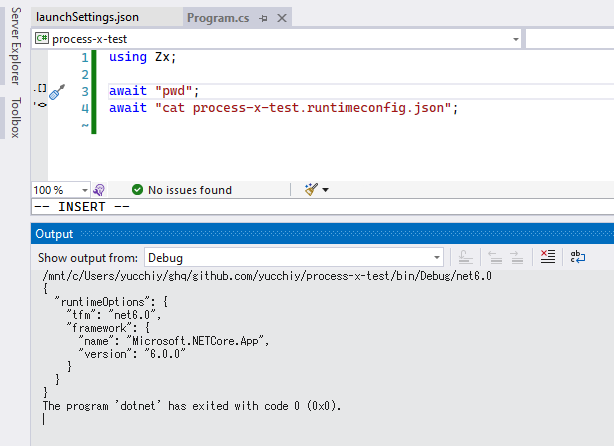

[Cysharp/ProcessX: Simplify call an external process with the async streams in C# 8.0.](https://github.com/Cysharp/ProcessX#zx)
[neue cc - ProcessX - C#でProcessを C# 8.0非同期ストリームで簡単に扱うライブラリ](https://neue.cc/2020/01/30_590.html)

C#でシェルを書くためのライブラリである [Cysharp/ProcessX](https://github.com/Cysharp/ProcessX) を触ってみます。

通常C#でシェルを実行するには、外部プロセスを `System.Diagnostics.Process` クラスなどを介して実行します。ただし[この記事に言及されているよう](https://neue.cc/2020/01/30_590.html)に、`Process.Start`メソッドに渡す`ProcessStartInfo`は指定するフラグが多かったり、また[非同期外部プロセス起動で標準出力を受け取る際の注意点](https://qiita.com/skitoy4321/items/10c47eea93e5c6145d48)にあるようにハマリポイントが多かったりで、結構大変だったりします。（あと指定するフラグも、個人的には少し分かりづらかったりします。）

実行したいコマンドを記述して、その結果をC#の文字列として受け取りたいだけなのに... 、ってのを実現したライブラリが「ProcessX」、という理解です。

## インストール

NuGetからProcessXをインストールできます。Visual StudioなどのIDEではNuGetのウインドウから下図のようにProcessXを探してきてインストールします。



Visual StudioでのNuGet経由でのインストール方法

またはコマンドライン経由でインストールする場合は、プロジェクト配下で

```
$ dotnet add package ProcessX
```

でインストールできます。

## 使い方

本記事では一旦シンプルなコマンド実行にとどめますが（そのうち色々触ったら記事を書くかもです）、単純なコマンド実行であれば、 `ProcessX.StartAsync("zikkoushitai-command")` を呼び出すだけでコマンドを実行し、その結果を文字列で受け取ることができます。

例えば `ls` を実行して、結果を受け取る場合は下記のようにかけます。

```csharp
using Cysharp.Diagnostics;

await foreach (string item in ProcessX.StartAsync("ls"))
{
    // lsの結果を1行ずつコンソールに出力
    Console.WriteLine(item);
}
```

また、コマンドラインの実行結果を全行まとめて受け取る場合には下記が利用できます。

```csharp
string[] result = await ProcessX.StartAsync("ls").ToTask();
```

こんな感じで、ほぼBashなどでのコマンド実行と同じような書き心地で、C#上でコマンドライン実行ができそうです。（ちなみに `ls` の場合は、もしかしたら `[Directory.GetFiles](https://docs.microsoft.com/en-us/dotnet/api/system.io.directory.getfiles?view=net-6.0)` を用いたほうがいい、という話はありそうですが... それはそれとして。）

ちなみに[紹介記事](https://neue.cc/2020/01/30_590.html)にあるように、コマンド実行時のExitCodeが0以外が返ってきた場合、 `ProcessErrorException` 例外は飛んでくる仕様になっています。つまり、Bashなどで`set -e`をつけてスクリプトを記述することと同じようなエラーハンドリングとなっています。

`set -e`の場合はスクリプトが即座に終了してしまいますが、ProcessXで記述する場合は都度例外が飛んでくるので、エラーハンドリングはより柔軟におこなえるのは便利かもしれません。

```csharp
try
{
    await foreach (var item in ProcessX.StartAsync("sonzaishinai-command")) { }
}
catch (ProcessErrorException ex)
{
    // ExitCodeが0以外の場合はここにくる
    Console.WriteLine(ex.ToString());
}
```

## WSL上でのデバッグ

Visual Studio上で実行すると（当然ですが）Windowsのコマンドラインとして実行されます。もしBashなどのシェルスクリプト代わりにプログラムする場合、デバッグ実行をLinux上などで行いたいかもしれません。その場合、WSL上でデバッグ実行すると確認しやすいかもしれません。

Visual Studio 2022のPreview 3から、WSLを用いて.NETのアプリケーションをLinux上でデバッグする機能が追加されています。

[Debug .NET apps in Linux using WSL - Visual Studio (Windows) | Microsoft Docs](https://docs.microsoft.com/en-us/visualstudio/debugger/debug-dotnet-core-in-wsl-2?view=vs-2022)

詳細については上の記事に記載されていますが、今回やりたいLinux上で.NETアプリケーションを実行するところまで触れておきます。

この機能を利用するには、WSLコンポーネントをインストールする必要があります。Visual Studioのメニューから「Tools > Get Tools and Features」を開きます。

Visual Stuiod Installerが開かれるので、「個別のコンポーネント」をクリックし、検索ボックスに「WSL」などと入力して、「WSL を用いた .NET デバッグ」のコンポーネントにチェックを入れて、右下の「変更」をクリックしてインストールします。



次に、 *launchSettings.json*を開いて、下図のようにWSL項目を追記します。



一応、コピペ用にテキストも記載しておきます。

```json
"WSL": {
    "commandName": "WSL"
}
```

`commandName` 項目に `WSL` を記載すればよいわけです。ちなみに、実行するWSLのディストリビューションを明記することもできます。

```json
"WSL": {
    "commandName": "WSL",
    "distributionName": "Ubuntu-20.04"
}
```

あとは下図のようにWSLをデバッグ実行として選択して実行すれば、Linux上で実行されます。実行先のLinuxディストリビューション上に.NET Coreが入っていない場合は、自動的にインストールされますが、その際パスワード（Linux上のユーザーの）を求められるので入力が必要です。





## まとめ

ProcessXの概要から簡単な使い方、WSL上でのデバッグ実行まで取り上げました。

個人的にいくつかのシェルスクリプトをC#で置き換えられたらいいなーと思うことがあり触り始めましたが、わりと雰囲気良さそうな感じです。

またなにか進めば、ProcessX関連で記事を書きたいと思います。

## 参考

- [Cysharp/ProcessX: Simplify call an external process with the async streams in C# 8.0.](https://github.com/Cysharp/ProcessX#zx)
- [neue cc - ProcessX - C#でProcessを C# 8.0非同期ストリームで簡単に扱うライブラリ](https://neue.cc/2020/01/30_590.html)
- [シェルスクリプト風に C# を使えるライブラリ ProcessX 試してみた](https://zenn.dev/okazuki/articles/zx-csharp-intro)
- [非同期外部プロセス起動で標準出力を受け取る際の注意点 - Qiita](https://qiita.com/skitoy4321/items/10c47eea93e5c6145d48)
- [シェルスクリプトを書く時には set -e をつけた方がいいのかな...どうなんだろう - ようへいの日々精進XP](https://inokara.hateblo.jp/entry/2020/06/27/084149)
