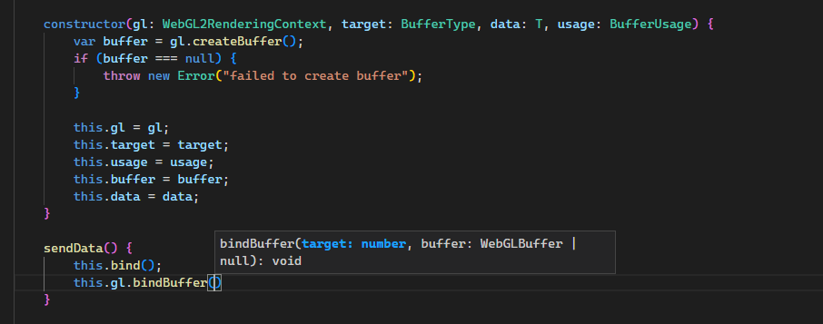

グラフィックスの勉強をちゃんとしたいとふと思い（思い立つが手が動かせてなかった）、興味があったWebGLを触ろうと思い、この環境をwebpackで整えました。


自分がウェブを仕事でやっているわけでなくて詳しくないので、ツッコミなどは大歓迎です。[@yucchiy_](https://twitter.com/yucchiy_) までご連絡いただけると幸いです。

## やりたいこと

* TypeScriptベースで開発したい
* モデルやテクスチャのロード対応
* シェーダーについては別シェーダーのインポート・エクスポートもできるようにしたい


グラフィックス系の実装なので比較的記述するコードが複雑でかつ量も多くなりそうなのと、WebGLのAPIを叩くときの引数や戻り値のヒントとして、ある程度型がついていて、IDEで確認できると良いな、ということでTypeScriptを選択しました。

## 必要なモジュールのインストール

下記モジュールをインストールします。

```javascript
$ npm install --save-dev webpack webpack-cli  webpack-dev-server \
    typescript ts-loader \
    html-webpack-plugin \
    raw-loader glslify-loader
```


主に下記用途です。

* `webpack` ・ `webpack-cli` ・ `webpack-dev-server`
    * webpack本体やwebpackでのローカルサーバー構築。
* `typescript` ・ `ts-loader`
    * TypeScriptでアプリを開発するため。
* `html-webpack-plugin`
    * webpackでHTMLの生成も行う。複数HTMLも生成できる。
* `raw-loader` ・ `glslify-loader`
    * テクスチャやモデル、シェーダー読み込みと、シェーダーのモジュール化のため。
## webpackの設定

そこまで複雑ではないので、まず全文記載します。

```javascript
var path = require('path');
var HtmlWebpackPlugin = require('html-webpack-plugin');

var debug = process.env.NODE_ENV !== 'production';

module.exports = {
    entry: path.resolve(__dirname, 'src/entrypoint.ts'),
    plugins: [
        new HtmlWebpackPlugin({
            templateParameters: {
                title: 'MiniEngein',
            },
            template: path.resolve(__dirname, 'src/index.html'),
            inject: 'body',
        })
    ],
    output: {
        path: path.resolve(__dirname, 'public'),
        filename: 'bundle.js',
    },
    resolve: {
        extensions: ['.tsx', '.ts', '.js']
    },
    module: {
        rules: [
            {
                test: /\.(frag|vert|glsl)$/,
                exclude: '/node_modules/',
                use: [
                    'raw-loader',
                    'glslify-loader'
                ]
            },
            {
                test: /\.(tsx|ts)$/,
                exclude: /node_modules/,
                use: [
                    'ts-loader'
                ]
            }
        ]
    },
    mode: debug ? 'development' : 'production',
    devtool: debug ? 'eval-source-map' : 'source-map',
};
```


[yucchiy/MiniEngine](https://github.com/yucchiy/MiniEngine)でも[確認できます](https://github.com/yucchiy/MiniEngine/blob/bd6bd24a767fa7e67edc88ece1d0f71a7f9d664c/webpack.config.js)。


上記の設定について解説していきます。

### ディレクトリ構成とHTML

今回用意した環境は、大まかに下記のディレクトリ構成となります。

```plain text
.
├── package-lock.json
├── package.json
├── src
│   ├── app
│   │   ├── glsl
│   │   └── ts
│   ├── entrypoint.ts
│   └── index.html
├── tsconfig.json
└── webpack.config.js
```


* `src/entrypoint.ts` がエントリーポイントとなるTypeScipt
    * `src/index.html` が上記エントリーポイントを読み込むHTMLファイル
* `src/app` 以下に実際のアプリを開発する
    * `src/app/glsl` にシェーダーファイルを配置する
    * `src/app/ts` 以下にTypeScriptを配置する
上記の設定を、 `webpack.config.js` 内で下記のように設定しています。

```javascript
module.exports = {
    entry: path.resolve(__dirname, 'src/entrypoint.ts'),
    plugins: [
        new HtmlWebpackPlugin({
            templateParameters: {
                title: 'MiniEngein',
            },
            template: path.resolve(__dirname, 'src/index.html'),
            inject: 'body',
        })
    ],
```


### TypeScriptのロード

開発にTypeScriptを利用したいため、 `ts-loader` を設定します。

```javascript
    resolve: {
        extensions: ['.tsx', '.ts', '.js']
    },
    module: {
        rules: [
            {
                test: /\.(tsx|ts)$/,
                exclude: /node_modules/,
                use: [
                    'ts-loader'
                ]
            }
```


この設定を行うことで、TypeScriptを配置してロードすると読み込み時に自動でJavaScriptにトランスパイルして利用されます。


TypeScriptの設定である `tsconfig.json` は下記のようにしました。

```javascript
{
  "compilerOptions": {
    "target": "ES2015",
    "module": "commonjs",
    "strict": true,
    "esModuleInterop": true,
    "skipLibCheck": true,
    "forceConsistentCasingInFileNames": true
  },
  "$schema": "https://json.schemastore.org/tsconfig",
}
```


### シェーダーのロード

シェーダーもテクスチャと同様に、 `raw-loader` を利用することで、TypeScriptコード中に `import` を用いてロードできるようにしています。ただしシェーダーの場合、シェーダー中に別シェーダーの関数を呼び出したいので、さらに `glslify-loader` を通しています。


下記を `webpack.config.js` に記載します。

```javascript
    module: {
        rules: [
            {
                test: /\.(frag|vert|glsl)$/,
                exclude: '/node_modules/',
                use: [
                    'raw-loader',
                    'glslify-loader'
                ]
            },
```


シェーダーコードは、インポート時に `string` として利用したいので、 `src/app/glsl` 以下に `glsl.d.ts` を配置して、下記を記述します。

```typescript
declare module '*.vert' {
    const src: string;
    export default src;
}

declare module '*.frag' {
    const src: string;
    export default src;
}

declare module '*.glsl' {
    const src: string;
    export default src;
}
```


これで、 `vert` ・ `frag` ・ `glsl` 拡張子のシェーダーファイルをインポートで読み込む際は、下記コードのように `string` としてインポートされます。

```typescript
// "../glsl/HelloTriangleScene/vertex.glsl"と
// "../glsl/HelloTriangleScene/fragment.glsl"をロード
import VertexShaderSource from "../glsl/HelloTriangleScene/vertex.glsl";
import FragmentShaderSource from "../glsl/HelloTriangleScene/fragment.glsl";

export class HelloTriangleScene extends BaseScene {
    constructor(ctx: GameContext) {
        super();
        // VertexShaderSourceおよびFragmentShaderSourceに
        // stringとしてシェーダーコードが格納されている
        var vertexShader = ctx.createVertexShader(VertexShaderSource);
        var fragmentShader = ctx.createVertexShader(fragmentShaderSource);
```


また、 `glslify-loader` を用いることで、下記のようにシェーダーコード内での別シェーダーファイルの読み込みを行えます。

```glsl
// my-function.glsl
float myFunction(vec3 normal) {
  return dot(vec3(0, 1, 0), normal);
}

// myFunctionをエクスポートして別ファイルから利用できるようにする
#pragma glslify: export(myFunction)


// 同フォルダ内のglslファイル
// my-function.glslのmyFunctionをインポートして利用する
#pragma glslify: topDot = require(./my-function.glsl)

topDot(vec3(0, 1, 0)); // 1
```


## ローカルの開発サーバーの立ち上げ

`webpack-dev-server` でローカルの開発サーバーを立ち上げて開発します。また、サーバーを立ち上げている最中にコードを書き換えた場合は、自動でリロードが走るようにします。


`package.json` の `scripts` 項目に下記を追記します。

```json
"scripts": {
    "develop": "webpack-dev-server --progress --hot"
```


実際にサーバーを立ち上げるには、下記コマンドを実行します。

```plain text
# `webpack-dev-server --progress --hot` が呼び出される
$ npm run develop
```


特に設定をしていない場合は、 [http://localhost:8080](http://localhost:8080) で確認できます。

## 成果物の作成

成果物を `public` ディレクトリに書き出すようにします。まず、 `webpack.config.js` の `output` 項目に下記を記述します。

```javascript
    output: {
        path: path.resolve(__dirname, 'public'),
        filename: 'bundle.js',
    },
```


次に `package.json` の `scripts` に下記を記述します。

```json
"scripts": {
    "build": "webpack",
```


実際にビルドするには下記コマンドを実行します。成功すると `public` に成果物が吐き出されるので、これを適当なサーバーに配置します。

```plain text
$ npm run build
```


## エディタ環境

VSCodeに[TypeScriptのプラグイン](https://marketplace.visualstudio.com/items?itemName=ms-vscode.vscode-typescript-next)を導入して開発しています。これによって、WebGLのAPI呼び出し時の補完や型によるヒントが下記のように表示されます。



シンボル名のリネームなどのリファクタリングもある程度しっかりと行えるので、開発体験としてはかなりいい感じです。

## 参考

* [HtmlWebpackPlugin | webpack](https://webpack.js.org/plugins/html-webpack-plugin/)
* [TypeScript | webpack](https://webpack.js.org/guides/typescript/)
* [tsconfig.jsonの全オプションを理解する（随時追加中） - Qiita](https://qiita.com/ryokkkke/items/390647a7c26933940470)
* [WebGLのTypeScript環境作ってみた - Qiita](https://qiita.com/takeokunn/items/fd9e0ee378fac852968e)
* [TypeScriptとWebGLでポリゴンを描画する方法 - shogonir blog](https://blog.shogonir.jp/entry/2020/01/20/005229)
