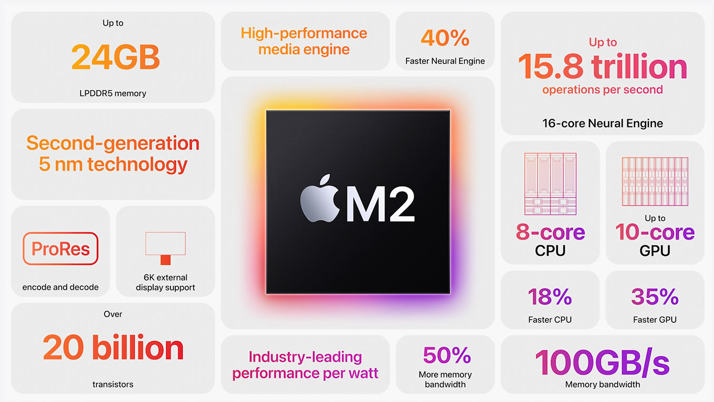
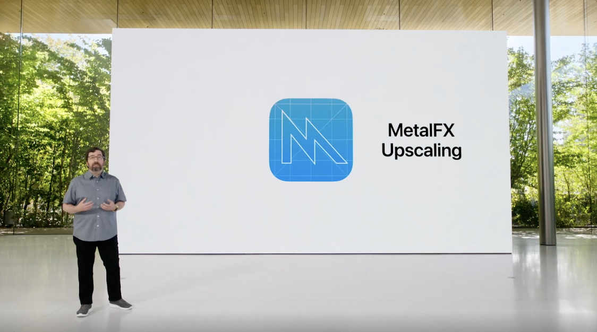

作業のために朝早く起きたら、ちょうどTwitterのタイムラインがWWDC22 で盛り上がっていたので、せっかくだしと思って動画を流しながら作業していた。

個人的に気になったのはMetal3、M2、iOS16、watchOSあたり。

ついこの前M1出たばかりで、[Mac Studioなんで3ヶ月前リリース](https://www.apple.com/jp/newsroom/2022/03/apple-unveils-all-new-mac-studio-and-studio-display/)なのに、今回M2がリリース。

第2世代の5ナノメートル、メモリコントローラーも改良してユニファイドメモリ帯域幅は100GB/s、DDR5のメモリも積んで着実なパフォーマンスアップ。アップルすごいなぁと思った。

[Metal3](https://developer.apple.com/metal/)は、[DLSS](https://www.nvidia.com/en-us/geforce/technologies/dlss/)を代表とするようなアップスケーリング技術のMetalFXと、[Direct Storage](https://devblogs.microsoft.com/directx/directstorage-api-available-on-pc/)のような、GPUとストレージ間をダイレクトに繋げるFast resource loadingなど、割と最近のトレンドとなる技術をしっかり実装してる印象。さらに[バイオハザードヴィレッジがMacで遊べるようになる](https://game.watch.impress.co.jp/docs/news/1415033.html)など人気なIPも引き込む動きがあり、こちらも着実にゲームのパイを取りに行ってる感じで楽しみ。

時間あれば[Metal 3のWWDCのプレゼン](https://developer.apple.com/videos/all-videos/?q=Metal)も見ようかな。[Metal 3もすでに触れるらしい](https://twitter.com/graphicsguyale/status/1533944280506437632)。

今回のWWDC22、ハードもソフトも一通りのアップデートがあってアップルの開発力の高さに驚いた。動画もちゃんと面白いし。

そういえば、WWDC前日にMac Studioを買ってしまって、新製品出る前に手を出すのは流石にタイミング悪かったか？と思ったけど、まさかの当日にレートが変わって、Mac Studioについては3万円の値上げがされてた…。タイミング良すぎた…。

