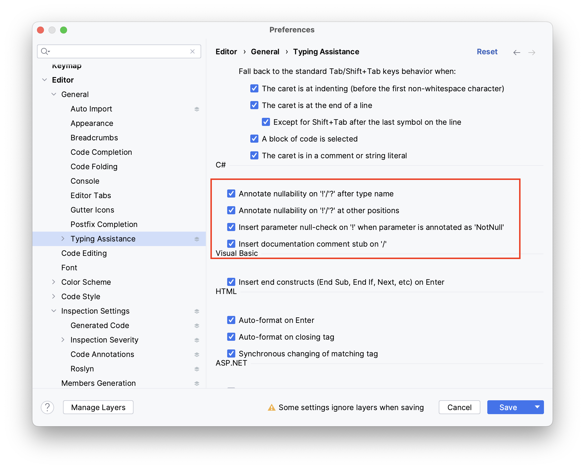

Riderでたとえば下記のようなコードを入力しようとすると、

```csharp
public void Hoge(GameObject? root)
{
}

public void Fuga(GameObject! root)
{
}
```

下記のような変換が自動で行われる場合があります。

```csharp
public void Hoge([CanBeNull] GameObject root)
{
}

public void Fuga([NotNull] GameObject root)
{
}
```

この挙動は、Preferencesを開いて下記赤枠の設定を外すと無効にできます。



参考: [Rider always convert '?' into [CanBeNull]](https://rider-support.jetbrains.com/hc/en-us/community/posts/360004111299-Rider-always-convert-into-CanBeNull-)
