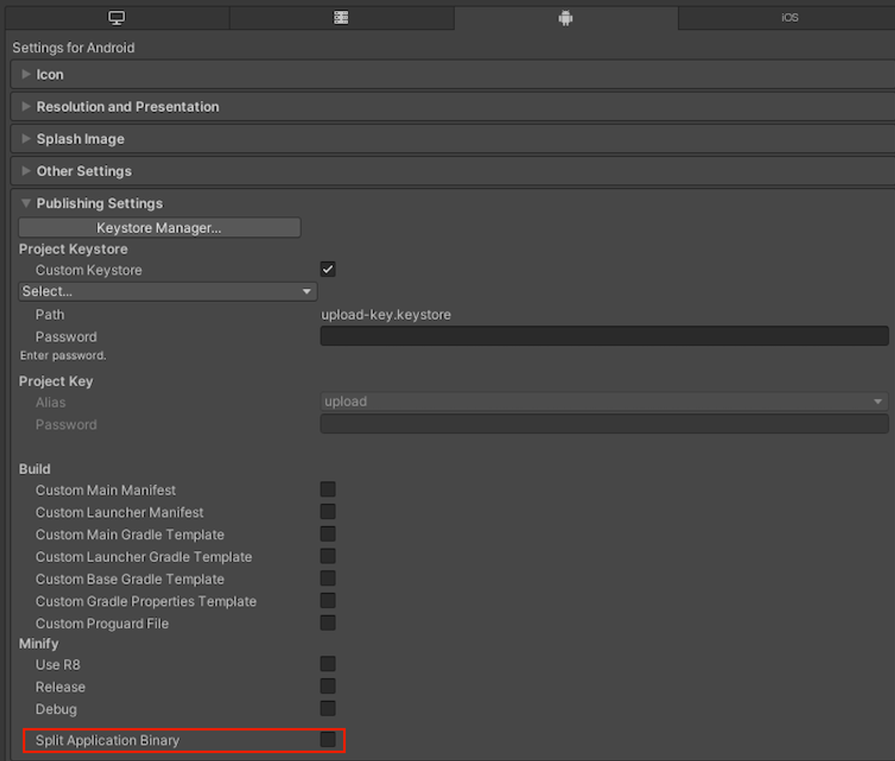
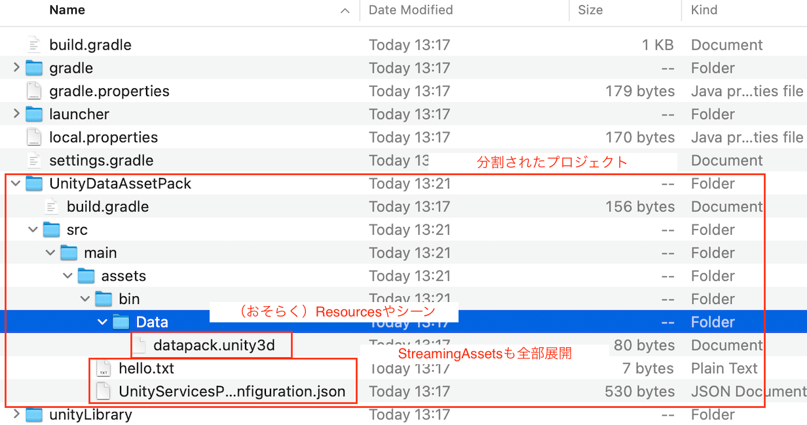

この記事は「[Applibot Advent Calendar 2023](https://qiita.com/advent-calendar/2023/applibot)」の4日目の記事になります。

UnityのAndroidビルド設定に「Split Application Binary」という項目があります。
この機能を用いることで、UnityでビルドしたAndroidアプリにおいて、**実装側でとくにアプリケーションの挙動を変えることなく**、約1GBのアプリケーションを配信できます。

この記事では、「Split Application Binary」の概要からこの機能で内部的に利用されている「Play Asset Delivery」、UnityやGradleプロジェクト上でどのような扱いになっているのかを説明します。
また、Unityアプリでの「Play Asset Delivery」の活用の個人的な所感についても触れます。

## Play Asset Delivery と Android App Bundleについて

「Split Application Binary」の設定の前に、まずは「Android App Bundle」と「Play Asset Delivery」について説明します。

Android App Bundle（AAB）はAndroidアプリのためのフォーマットの1つで、AAB内にはアプリのコンパイル済みのコードとリソースが一式が含まれています。

[Android App Bundle について  |  Android デベロッパー  |  Android Developers](https://developer.android.com/guide/app-bundle?hl=ja)

AABは直接デバイス上で利用できませんが、apkに変換することでアプリをインストールできます。

Google Play Storeに公開する際は、Google PlayにAABをアップロードすると、各デバイスに応じた最適なapkを生成して配布してくれます。

とくにコンテンツの容量が大きくなりがちなゲームにとってのAABのメリットとして、Play Asset Deliveryがあります。

AABのサイズの上限は150MBとなります。そのため多くのUnityで制作されるAndroid向けのゲームでは、主にコンテンツ容量を占めるアセットをUnityのアセットバンドルなどにすることでパッケージから逃がし、追加コンテンツとして必要なタイミングでオンデマンドダウンロード、または一括ダウンロードなどを行うことでこのAABのサイズ上限を回避します。

ただしゲーム体験の改善のためにゲームをインストール直後にある程度ダウンロードなしで遊べるようにしたいなどの要件があった場合、150MBのサイズ上限はかなり厳しい制約となります。

そこで利用できるのがPlay Asset Delivery（PAD）です。PADはその名の通りアセット配信に関する技術で、アセットをアセットパックという単位に分割しておくことで、そのアセットパックに指定された配信モードごとに適切なタイミングで分割したアセットをダウンロードし利用できます。

[Play Asset Delivery  |  Android デベロッパー  |  Android Developers](https://developer.android.com/guide/app-bundle/asset-delivery?hl=ja)

とくにこの中で嬉しいのが、配信モードが`install-time`なアセットパックです。`install-time`なアセットパックは、アプリをストアからインストールする際にダウンロードされ、アプリを起動したタイミングで利用できます。つまり`install-time`なアセットパックは、実質アプリへの埋め込みアセットとして利用できます。 このアセットパックのサイズ上限は1GBとなるため、適切にPADを利用することで150MBのサイズ上限を1GB（厳密には1.15GB？）まで引き上げることができます。

## Split Application BinaryとPAD

*Player Settings > Android > Publishing Settings*の中に「Split Application Binary」という設定があります。



この設定は、もともとAPKの拡張ファイルとしてOBB（Opaque Binary Blob）に分割するための導入されたものですが、出力形式をAABにした場合はPADへの分割を行ってくれます。

分割は下記のルールにしたがって実施されます。

* ベースモジュール: 最初のシーン（ビルドインデックスが0のシーン）の実行ファイル（Javaとネイティブ）、プラグイン、アセットが含まれる
* アセットパック: 残りのシーンやリソース、ストリーミングアセットなど、ベースモジュールに含まれないすべてが含まれる

ただし前述の通りアセットパックにはサイズ制限があり、これを考慮してアセットパックは下記のルールにしたがって分割されます。

* アセットパックの容量が1GB未満の場合は、すべてを1つのアセットパックにまとめ、配信モードを`install-time`として設定する。
* アセットパックの容量が1GBを超える場合、ストリーミングアセットとその他のアセットでアセットパックを分割し、大きい方に配信モードの`install-time`を、それ以外を`fast-follow`を割り当てる。

[Asset packs in Unity - Unity マニュアル](https://docs.unity3d.com/ja/2021.3/Manual/android-asset-packs-in-unity.html)

後述しますが、Split Application Binaryによって`install-time`なアセットパックによるアプリ分割を行った場合（つまりアセットパックの容量が1GB未満の場合）、アプリケーション側では**アセットパックの読み分けをまったく意識することなく**、PADを利用する事ができます。

## Split Application Binaryによるアセットパック分割の詳細

前述の通り、アセットパックの容量が1GB未満の場合、*Player Settings > Android > Publishing Settings*の中の「Split Application Binary」をONにするだけで、Unity実装を変更することなくinstall-timeなアセットパック分割が可能です。

ここでは「Split Application Binary」がどのように実現されているか、軽く触れます。

### Split Application BinaryとUnity実装

「Split Application Binary」がONになると、`Resources`や`StreamingAssets`配下のアセットやビルドインデックスが0以外のシーンはすべてアセットパック側にバンドルされます。そのため、下記のような処理が内部で行われているはずです。

* Androidランタイム下で`Application.streamingAssetsPath`が、ベースモジュールのパスからアセットパックのパスになる。
* `Resources.LoadXXX`などで参照する実際のパスが、ベースモジュールのパスからアセットパックのパスになる。
* `SceneManager.LoadSceneXXX`の参照する実際のパスがベースモジュールのパスからアセットパックのパスになる。

リソースやシーンのロードについてはUnityのコードを読まないと詳細が確認できませんが、ストリーミングアセットについては、`Application.streamingAssetsPath`が「Split Application Binary」のON/OFFで下記のように変化することを確認できます。

| Split Application Binary |                           `Application.streamingAssetsPath`                           |
| :----------------------- | :------------------------------------------------------------------------------------ |
| OFF                      | `jar:file:///data/app/[アプリのID]-[ハッシュ値]/base.apk!/assets`                     |
| ON                       | `jar:file:///data/app/[アプリのID]-[ハッシュ値]/split_[アセットパック名].apk!/assets` |

ちなみに、どちらのパスもapkの中身を指すパスなので、このことからも最終的にはアプリの埋め込みアセットであることがわかります。

このように、ロード先のベースパスを分割したアセットパックのパスに変更することで、開発者がとくに変更を加えることなくアセットパックをロードできるようになっています。

### Split Application BinaryとGradleプロジェクトの関係

つぎに「Split Application Binary」を有効にした場合に、Unityが出力するGradleプロジェクト上でどのような処理が行われるのか確認してみます。

「Split Application Binary」をONにすると、ビルド時にアセット類を別プロジェクトへ移動させ、`launcherTemplate.gradle`がそのプロジェクトを参照します。
具体的には、下図のような`UnityDataAssetPack`というアセットパック用のプロジェクトが作成されます。



このように`UnityDataAssetPack/src/main/assets`配下に分割されたアセットが格納されます。サイズ等から推測するに、`bin/Data/datapack.unity3d`内にシーンや`Resources`配下のアセットがまとめて格納されます。`StreamingAssets`配下のアセットは`UnityDataAssetPack/src/main/assets`配下に展開されます。

また、「Split Application Binary」をONにすると、Androidプロジェクトを生成する時に`launcherTemplate.gradle`の`PLAY_ASSET_PACKS`変数が下記のように展開されます。下記はエクスポートしたAndroidプロジェクトの`launcher/build.gralde`の抜粋です。

```gradle
    packagingOptions {
        doNotStrip '*/arm64-v8a/*.so'
    }

    // この部分が、分割したアセットパックを参照するための設定
    assetPacks = [":UnityDataAssetPack"]
    
    bundle {
        language {
            enableSplit = false
        }
        density {
            enableSplit = false
        }
        abi {
            enableSplit = true
        }
    }
} 
```

`PLAY_ASSET_PACKS`テンプレート変数については下記のドキュメントについて詳細が記載されています。

[Unity - Manual: Set up Play Asset Delivery](https://docs.unity3d.com/Manual/android-asset-packs-set-up.html)

上記の実装上、**設定を入れたのに正しくPAD分割が動作しない場合**、この設定を見直してください。
とくに古いバージョンから開発を開始したプロジェクトをアップデートして利用している場合、`launcherTemplate.gradle`に上記記述がない可能性があります。

また、余談にはなりますが、Gradleのテンプレート変数の一覧は下記ドキュメントから確認できます。

[Unity - Manual: Gradle templates](https://docs.unity3d.com/Manual/gradle-templates.html)

## PADの個人的な活用について

ここまでで、PADの`install-time`なアセットパックのUnityでの活用方法について説明しました。

ちなみにPADの配信モードは、`install-time`以外にも`fast-follow`と`on-demand`があります。こちらの違いについては、公式ドキュメントに詳細が記載されています。（[Play Asset Delivery  |  Android デベロッパー  |  Android Developers](https://developer.android.com/guide/app-bundle/asset-delivery?hl=ja)）。

また、[mad_khaki](https://qiita.com/mad_khaki)さんが[Addressables × Play Asset Deliveryの調査メモ #Unity - Qiita](https://qiita.com/mad_khaki/items/69d836bc7bfbb146b81a)にてわかりやすく違いを纏めてくださっています。以下は[Addressables × Play Asset Deliveryの調査メモ](https://qiita.com/mad_khaki/items/69d836bc7bfbb146b81a)から各配信モードの違いを引用しています。

|  配信モード名  | ダウンロードタイミング | サイズ制限 | ストアのアプリサイズ |                            削除可能性                             |                   注意事項                   |
| :------------- | :--------------------- | :--------- | :------------------- | :---------------------------------------------------------------- | :------------------------------------------- |
| `install-time` | アプリインストール時   | 1GB        | 含まれる             | AABの機能によって1つのapkとしてインストールされるので削除されない |                                              |
| `fast-follow`  | インストール直後       | 512MB      | 含まれる             | アプリの内部ストレージ領域に展開され、削除の可能性がある          | アプリ起動時にDLが完了していない可能性がある |
| `on-demand`    | リクエスト時           | 512MB      | 含まれない           | アプリの内部ストレージ領域に展開され、削除の可能性がある          |                                              |

これらの配信モードの活用についてですが、個人的には**いまのところは`install-time`までにとどめておいて、他はアセットバンドル化で対応が安定した活用方法**、と考えています。

`fast-follow`については前述の通り、「Split Application Binary」でアセット分割を行った際に、1GBを超えたアセットが自動で`fast-follow`に割り当てられるため、実装上はとく意識する必要はありません。

一方で、`install-time`とは違いアプリの内部ストレージに展開されるため、これはユーザーによって削除が可能です。エラーハンドリングをUnityエンジン側でどの程度行ってくれているのかが不明なため、`install-time`までにとどめておいたほうが安全かなと考えています。
（こちらについてはとくに検証・調査ができていないので、もし間違っていたりした場合、ご指摘いただけると幸いです。）

`on-demand`は名前の通りアセットが手元にない場合は都度リクエストする方式です。こちらを利用するにはAddressablesなどを利用して開発者側の対応が必要です。
ちなみにUnity公式でAddressablesでPADを利用するサンプルが公開されています（[Advanced/Play Asset Delivery | Addressables-Sample](https://github.com/Unity-Technologies/Addressables-Sample#advancedplay-asset-delivery)）。
こちらの配信モードを活用することでアセット配信を最適化できたり、通常アセット配信のために必要なアセットサーバーのホスティングおよび配信時の転送量をGooglePlay側に負担してもらえる、などが期待できます。

モバイルプラットフォーム向けにUnityアプリを開発している場合は独自のアセットバンドル配信を行っている場合が多いと思います。この機能はAndroid限定のため、他プラットフォーム（たとえばiOS）に配信する場合はどちらにしてもアセットバンドルによる実装が必要になります。実装からテストなど含めコストがシンプルに倍かかることになります。
そのため、いままでアセットバンドル経由で配信していたアセットをPADに移行する場合は、これらのコストを考慮する必要があります。場合によっては独自のアセット配信による柔軟な機能要件にPAD側が対応しきれない場合もあるかもしれません。

これらのことを踏まえて、いまのところは`install-time`までにとどめておいて、他はアセットバンドルで対応、が無難なのかなと感じています。

## まとめ

PADの概要から「Split Application Binary」によるUnityアプリ上でのアセット分割、UnityのエクスポートするAndroidアプリでどのように分割が行われるのかについて説明しました。

また、Unityアプリでの「Play Asset Delivery」の活用の個人的な所感についても触れました。

「Split Application Binary」を用いると、比較的容易にAndroidアプリのサイズ上限を引き上げることができるので、まだ利用していない方はぜひ試してみていただければと思い、記事を書きました。

この記事がUnityのAndroidアプリ開発の参考になれば幸いです。
