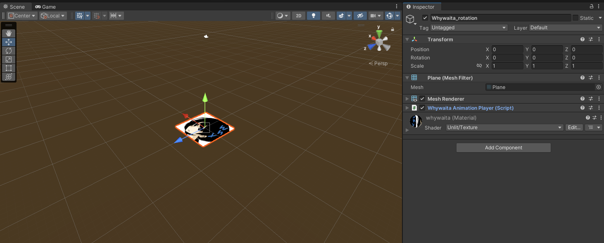
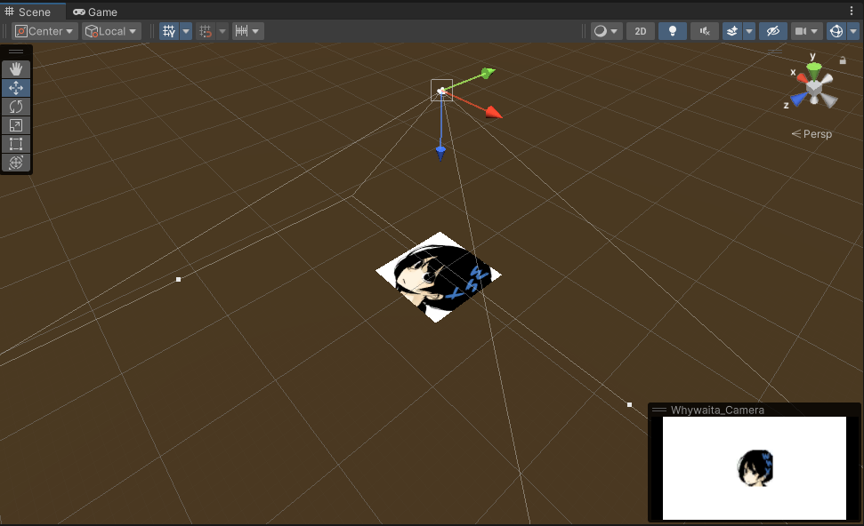
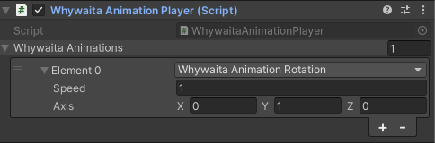
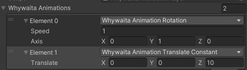

これは [whywaita Advent Calendar 2023](https://adventar.org/calendars/8553) の21日目の記事です。

whywaitaさんとは同じ会社に勤めていて、日頃からプライベートクラウドやself-hosted runner、最近ではポーカーを教えていただくなどお世話になっているので、日頃の感謝を込めてアドカレに記事を寄稿させていただいています。

記事のネタ探しに悩んでいたところ、下記のように「気合でこじつければなんでも良いです」とのことだったので、18日目に「[Flutterアプリでwhywaitaアイコンを回してみた](https://izacchi16.hatenablog.jp/entry/2023/12/18/201418)」という記事が投稿されたので、[Unityエンジニアの自分としては](https://learning.unity3d.jp/speaker/yuuichiro-mukai/)Unityアプリでアイコンを回すことにします（？）。


下図のように回るwhywaitaを実現できます。


ちなみに回転以外の変換やそれらの変換の複数個の組み合わせもできます。


本記事では、このようなアイコンを回すアプリケーションのUnityについて、実装の1手法を紹介します。

著者はUnity 2022.3.15f1にて検証を行いました。


## シーンのセットアップ

まず、アプリケーションのシーンについて簡単に説明します。

whywaitaアイコンはメニューの_GameObject > 3D Object > Plane_ で作成したプリミティブを作成し、その正面がワールド座標の上を向くように配置しています。また、アイコン画像をテクスチャとしたマテリアルを貼り付けています。



下図のように、そのPlaneを上から見下ろすかたちでカメラが配置されています。




## whywaitaを回す（アニメーションする）クラス

下記のようなクラスを用意し、上記のPlaneオブジェクトにアタッチしています。

```cs
using System;
using UnityEngine;
using Matrix4x4 = UnityEngine.Matrix4x4;
using Vector3 = UnityEngine.Vector3;

[RequireComponent(typeof(MeshFilter))]
public class WhywaitaAnimationPlayer : MonoBehaviour
{
    private Mesh _mesh;
    private Vector3[] _originalVertices;

    [SerializeReference, SubclassSelector]
    private IWhywaitaAnimation[] _whywaitaAnimations;

    void Start()
    {
        _mesh = GetComponent<MeshFilter>().mesh;

        _originalVertices = new Vector3[_mesh.vertices.Length];
        Array.Copy(_mesh.vertices, _originalVertices, _mesh.vertices.Length);
    }

    void Update()
    {
        var time = Time.time;

        // メッシュの変形を表す行列
        var matrix = Matrix4x4.identity;
        foreach (var animation in _whywaitaAnimations)
        {
            if (animation != null)
            {
                matrix *= animation.GetMatrix(time);
            }
        }

        var vertices = _mesh.vertices;
        for (var i = 0; i < vertices.Length; i++)
        {
            // 各頂点に変形を適用
            vertices[i] = matrix.MultiplyPoint3x4(_originalVertices[i]);
        }

        _mesh.vertices = vertices;
    }
}
```

このクラスは、毎フレームごとの経過時間に応じたメッシュの変換を行列として表して、`MeshFilter`クラスが持つメッシュの頂点に対して乗算する形で適用しています。

コード中の `IWhywaitaAnimation` は下記のようなインターフェイスで、このインターフェイスを実装する1つのクラスが1つの変換をあらわす形で実装されます。`GetMatrix(float time)` で、時間 `time` における変換を表す行列が取得できるといった形です。

```cs
public interface IWhywaitaAnimation
{
    Matrix4x4 GetMatrix(float time);
}
```

たとえば「一定の速度で回転する変換を表すクラス」は下記コードで実装できます。

```cs
using System;
using UnityEngine;

[Serializable]
public class WhywaitaAnimationRotation : IWhywaitaAnimation
{
    /// <summary>
    /// 回転速度この値が1.0で1秒で1回転とする
    /// </summary>
    [SerializeField] private float _speed;
    
    /// <summary>
    /// 回転軸
    /// </summary>   
    [SerializeField] private Vector3 _axis;

    public Matrix4x4 GetMatrix(float time)
    {
        return Matrix4x4.Rotate(
            Quaternion.AngleAxis(
                _speed * time * 360f,
               _axis 
            )
        );
    }
}
```

一番初めに示したwhywaitaアイコンの単純な回転は、 `WhywaitaAnimationPlayer` の `_whywaitaAnimations` を下図インスペクター画像のように設定することで実現できます。



ちなみ大量の頂点が存在する場合には、このような頂点の変換が伴う実装はCPU側（C#スクリプト上）ではなくGPU側（シェーダー側）で行うのが良いですが、今回はデモというかわかりやすさを意識してこの方式にしています。


## アフィン変換

今回のデモを作成するにあたって、`IWhywaitaAnimation`には、ある時刻における頂点を回転や拡大・縮小などの線形変換と平行移動をあらわす行列を返すクラスを実装しました。

これらの「回転」や「拡大縮小」、平行移動などはアフィン変換と呼ばれます。

アフィン変換の良いところは、2つめのデモのように複数の変換を組み合わせたい場合に、変換を掛けたい順に行列を掛け合わると、複数の変換をまとめた行列が作成できる点です。
`WhywaitaAnimationPlayer`の下記部分が、複数の変換を組み合わせる実装になります。

```cs
        // メッシュの変形を表す行列
        var matrix = Matrix4x4.identity;
        foreach (var animation in _whywaitaAnimations)
        {
            if (animation != null)
            {
                // ここでアフィン変換を表す行列をかけ合わせている
                matrix *= animation.GetMatrix(time);
            }
        }
```

たとえば下図のように、回転したあとにそのアイコンのz方向（下方向）に平行移動を行うような変換を定義すると、



下図のようなアニメーションになります。ちゃんと、回転してから平行移動したようなアニメーションになっていることが確認できました。


## 余談: SerializeReferenceDropdown

今回、`IWhywaitaAnimation` のシリアライズのために[SerializeReferenceDropdown](https://github.com/AlexeyTaranov/SerializeReferenceDropdown)を利用しました。

[AlexeyTaranov/SerializeReferenceDropdown: (Unity) Editor dropdown for SerializeReference Attribute with Copy/Paste](https://github.com/AlexeyTaranov/SerializeReferenceDropdown)

Unity 2019.3以降に `SerializeReference` が実装されたことで、インターフェイスや抽象クラスの参照がシリアライズできるようになりましたが、あくまでも参照のシリアライズにとどまるので、これ単体では微妙に使い勝手が悪いです。

`SerializeReferenceDropdown` を用いることで、内部でそのインターフェイス・基底クラスを実装するサブクラスのインスタンスを作成し、そのインスタンスの参照を設定するようなドロップダウンメニューをインスペクター上に生成できます。

便利なので入れておくと何かとはかどるかもしれません。ちなみに類似ライブラリとして下記のようなものあります。

- [mackysoft/Unity-SerializeReferenceExtensions: Provide popup to specify the type of the field serialized by the [SerializeReference] attribute in the inspector.](https://github.com/mackysoft/Unity-SerializeReferenceExtensions)
- [CareBoo/Serially: Adds a unity-supported, SerializableType class and an inspector for editing SerializeReference fields.](https://github.com/CareBoo/Serially)


## おわりに

whywaitaアイコンを回すUnityアプリの実装と、その中身について簡単に解説しました。
whywaita Advent Calendarは例年インフラ要素が多めだと思いますが、Unityという新たなジャンルを開拓できたので良かったのではと思います（？）。

明日はkyontanさんの記事です。