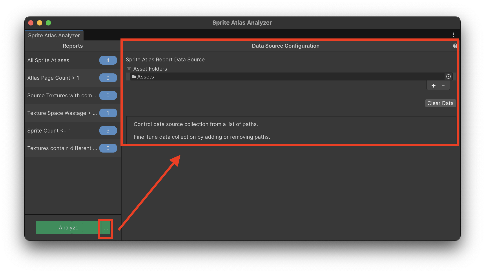
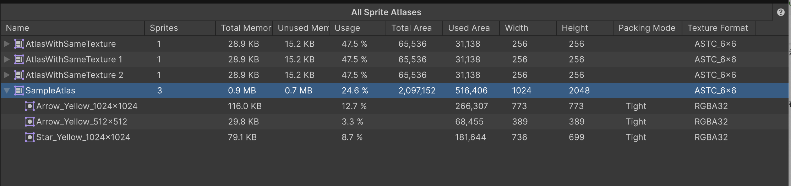
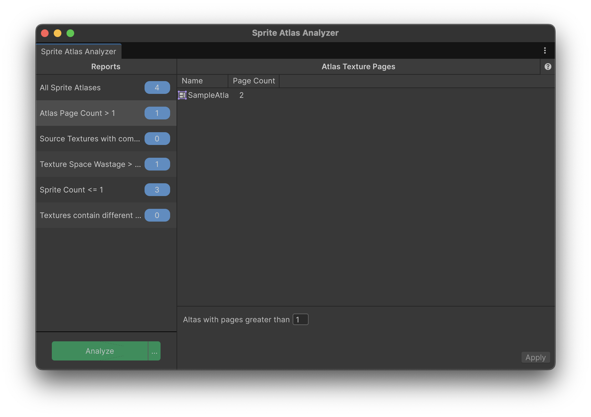

[Applibot Advent Calendar 2025](https://qiita.com/advent-calendar/2025/applibot) の1日目の記事です。

この記事では、Unity 6.3から追加されたSprite Atlas Analyzerの機能と使い方について紹介します。

## はじめに

Sprite Atlasは、2Dの描画パフォーマンスを最適化するために必須の機能です。

しかし、プロジェクトが大規模になるにつれてSprite Atlasの数が増えると、それぞれのAtlasが効率的にパッキングされているか、メモリを無駄遣いしていないかを正確に把握するのが困難になります。

こうした問題を効率的に検出するために、Unity 6.3から「**Sprite Atlas Analyzer**」というツールがUnity公式パッケージとして提供されるようになります。

## Sprite Atlas Analyzerとは

Sprite Atlas Analyzerは、プロジェクト内のSprite Atlasを解析してその問題を報告するツールで、[2D Tooling パッケージ](https://docs.unity3d.com/Packages/com.unity.2d.tooling@1.0)の1ツールとして提供されています。

例えば、以下のような問題を検出できます。

- 同じスプライトが複数のAtlasに含まれている
- Atlasのテクスチャ領域に無駄な空き領域が多い
- ソーステクスチャが圧縮済みで、二重圧縮による品質劣化が起きている

こうした問題を手動で確認するのは、プロジェクトで管理するSprite Atlasの数が増えるにつれて困難になりますが、Sprite Atlas Analyzerを使うことで効率的に検出できます。

このツールの主な特徴として、6種類のビルトインレポートが用意されており、特にカスタマイズせずともSprite Atlasの使用状況をさまざまな観点から分析できます。

また、カスタムレポートやカスタムデータソースを実装することで、プロジェクト固有の分析も可能です。

## インストール方法

先述の通り、Sprite Atlas Analyzerは2D Toolingというパッケージをインストールすることで利用できます。

1. **Window** > **Package Management** > **Package Manager** を開く
2. **Unity Registry** を選択
3. **2D Tooling** パッケージを検索してインストール

ドキュメントでは上記のように記載されていましたが、著者が試した 2025/11/30 時点では、上記の方法でインストールできませんでした。
（正確には、2D ToolingというパッケージがUnity Registryに見つかりませんでした。）

上記でインストールできない場合、下記の方法でもインストールできます。

### 1. Package Managerからパッケージ名を指定してインストール

1. **Window** > **Package Manager** を開く
2. 左上の **+** ボタンをクリックし、**Add package by name...** を選択
3. 以下の情報を入力して **Add** をクリック
   - **Name**: `com.unity.2d.tooling`
   - **Version**: `1.0.0`
      - 省略してもOK

### 2. `manifest.json` にパッケージ名を記載してインストール

`Packages/manifest.json` を開き、`dependencies` に以下を追加します。

```json
{
  "dependencies": {
    "com.unity.2d.tooling": "1.0.0"
  }
}
```

## 使い方

Sprite Atlas Analyzerを起動するには、**Window** > **Analysis** > **Sprite Atlas Analyzer** を選択します。下図のようなウインドウが表示されます。


ウィンドウが開いたら、左下の **Analyze** ボタンをクリックすることで、プロジェクト内のSprite Atlasの分析が開始されます。分析が完了すると、画面右側にレポートが表示されます。


上図に示す通り、Sprite Atlas Analyzerウインドウは、左ペインに分析項目の一覧が表示され、右ペインには選択した分析項目の詳細情報が表示されます。

### データソースの設定

下図のように **Analyze** ボタン右側の **...** ボタンから **Data Source Configuration** パネルを開くと、分析対象のフォルダパスを追加・削除できます。特定のフォルダのみを分析対象としたい場合に便利です。



## ビルトインレポート

Sprite Atlas Analyzerには、以下の6種類のビルトインレポートが用意されています。

### All Sprite Atlases

下図に示すように、Sprite Atlasの詳細情報をテーブル形式で表示します。



表示される項目は下記の通りです。

| カラム         | 説明                                                 |
| -------------- | ---------------------------------------------------- |
| Name           | Sprite AtlasまたはSpriteの名前                       |
| Sprites        | Sprite Atlas内のSprite数                             |
| Total Memory   | ランタイムメモリ使用量                               |
| Unused Memory  | 未使用メモリ量                                       |
| Usage          | Spriteパッキングに使用されているテクスチャ領域の割合 |
| Total Area     | テクスチャの総面積                                   |
| Used Area      | Spriteパッキングに使用されている面積                 |
| Width          | テクスチャの幅                                       |
| Height         | テクスチャの高さ                                     |
| Packing Mode   | Spriteのパッキングモード                             |
| Texture Format | テクスチャフォーマット                               |

それぞれのSprite Atlasの左側の三角ボタンをクリックすることで、そのSprite Atlasに含まれるSprite情報（Sprite名・テクスチャのメモリ量・Atlas中のメモリ量の割合・テクスチャサイズ・テクスチャフォーマットなど）を確認できます。
また、Sprite AtlasやSpriteを選択すると、エディター上で選択アセット扱いになるため、プロジェクトビュー上でフォーカスされたり、インスペクタービューで情報を確認できます。

ちなみに、**Texture Format** などの項目は、**現在のエディターのプラットフォーム** におけるフォーマットが表示されます。

### Atlas Page Count

設定した閾値以上のページ数を持つSprite Atlasを検出します。



上図の画面右下の「Atlas with pages greater than XXX」の「XXX」でページ数を設定できます。

Unityは同じテクスチャページを共有するSpriteのみバッチ処理できるため、複数ページにまたがるAtlasはパフォーマンス問題の原因となりえます。

### Source Textures with Compression

Sprite Atlasにパッキングされる前にすでに圧縮されているソーステクスチャを検出します。


上図では、`Star_Yellow_1024x1024` というAtlasを、**RGB(A) Compressed ASTC 6x6 block** で圧縮した上で、さらにSprite Atlasの方も **RGB(A) Compressed ASTC 6x6 block** で圧縮しています。

ソーステクスチャがパッキング前に圧縮されていると、Sprite Atlasにパッキングされる際に二重圧縮となり、テクスチャ品質が劣化する可能性があります。

### Texture Space Wastage

設定した閾値（KB単位）以上の未使用領域（ここで未使用領域とは、ピクセルの色が透明な箇所）を持つSprite Atlasを検出します。


閾値は、上図の画面右下の「Texture Wastage size grater than XXX KB」の「XXX」によって調整できます。

パッキングされたSprite間の未使用領域が多いと、利用することのない箇所を多く含むテクスチャをGPUに転送することにより、結果的にメモリ効率が悪くなります。

この分析結果をもとにテクスチャ上の無駄な領域を減らすことで、より効率的にメモリを扱うように最適化できます。

### Sprite Count

設定した数以下のSpriteしか含まないSprite Atlasを検出します。


閾値は、上図の画面右下の「Sprite Count is less than or equals to XXX」の「XXX」によって調整できます。

少数のSpriteしか含まないSprite Atlasを特定することで、少量のSprite Atlas同士を統合したり、そもそも単体でしか使うことのできないSpriteはSprite Atlasを作らないなど、Spriteのパッキング方法を工夫できます。

### Secondary Texture Count Mismatch

Sprite Atlas内で、個々のSpriteのセカンダリテクスチャ数が異なるものを検出します。

セカンダリテクスチャ数の不一致は、テクスチャ空間の無駄につながる可能性があります。

## カスタムレポートの作成

Sprite Atlas Analyzerには、6種類のレポートがビルトインされていますが、独自のレポートを実装することで、プロジェクト固有のレポートを生成することもできます。

2D Toolingパッケージには、カスタムレポートの作成方法を示すサンプルが2つ含まれています。Package Managerの **Samples** タブからインポートできます。


- **Sample Sprite Atlas Report**: ビルトインの `SpriteAtlasDataSource` を利用したカスタムレポートの実装例
- **Sample Sprite Data source And Report**: 独自のデータソースとレポートを作成する実装例

カスタムレポートの基礎を紹介した後、**Sample Sprite Data source And Report** の実装を確認しながらカスタムレポートについて説明します。

### AnalyzerIssueReportBase

カスタムレポートは `AnalyzerIssueReportBase` を継承して実装します。

このクラスを継承することで、Sprite Atlas Analyzerのレポート一覧に自動的に登録されます。

概ね、下記コードのような形式で記載することになると思います。

```csharp
using UnityEditor.U2D.Tooling.Analyzer;
using UnityEngine.UIElements;

class MyCustomReport : AnalyzerIssueReportBase
{
    public MyCustomReport()
        // 基底のコンストラクターに、このレポートのデータソースの型を渡す
        : base(new[] { typeof(MyDataSource) })
    {
        // レポートを初期化する
        SetReportListItemName("My Custom Report");
        SetReportListemCount("0");
        // ビューなどもこの段階で初期化する
        // ...
    }

    // レポートUIを渡す（UI Toolkit）
    public override VisualElement reportContent => /* レポートUI */;
    // 設定UIを渡す（UI Toolkit）
    public override VisualElement settingsContent => /* 設定UI */;
    // レポートタイトル
    public override string reportTitle => "My Custom Report";

    // データソースが更新された時のコールバック
    protected override void OnReportDataSourceChanged(
        IReportDataSource reportDataSource) { /* データ更新処理 */ }
}
```

それぞれの実装について紹介していきます。

#### コンストラクタ

コンストラクタでは、主に下記の処理を記載します。

- データソース型の紐付け
- レポートの初期化
- レポートクラスの各フィールドの初期化

基底クラスのコンストラクタには、依存するデータソースの型を配列で渡します。後述する `IReportDataSource` を実装した独自のデータソースを指定します。

コンストラクタ内で、以下のメソッドを呼び出してレポートの初期設定を行います。

| メソッド                        | 説明                               |
| ------------------------------- | ---------------------------------- |
| `SetReportListItemName(string)` | レポート一覧に表示される名前を設定 |
| `SetReportListemCount(string)`  | レポート一覧に表示される件数を設定 |

#### 実装が必要なプロパティ

`AnalyzerIssueReportBase` では、下記に示すプロパティをそれぞれ実装する必要があります。

| プロパティ        | 説明                                                 |
| ----------------- | ---------------------------------------------------- |
| `reportContent`   | レポートのUI要素を返却する。                         |
| `settingsContent` | 設定UIを返却する。不要な場合は `null` を返す。       |
| `reportTitle`     | 右ペインに表示されるレポートのタイトル名を返却する。 |

`reportContent` や `settingsContent` は、`VisualElement` 型の要素を返却します。つまり、Sprite Atlas AnalyzerのUI要素は **UI Toolkit** を用いて構築することになります。

サンプルやビルトインのレポート実装を見る限り、`reportContent` は `MultiColumnListView` や `MultiColumnTreeView` などの UI Toolkitがデフォルトで用意しているリストビューやツリービューの実装を用いていることが多いようです。

また `settingsContent` は、UI Builderなどを用いてUXMLやUSSを用意し、それをコンストラクタで読み込んで利用していました。

#### OnReportDataSourceChanged

`OnReportDataSourceChanged` は、`AnalyzerIssueReportBase` で実装が必要なメソッドです。

Analyzeボタンが押されてデータソースが更新されたときに呼び出されます。このメソッド内でデータをフィルタリングし、UIを更新します。

```csharp
protected override async void OnReportDataSourceChanged(
    IReportDataSource reportDataSource)
{
    if (reportDataSource is MyDataSource dataSource)
    {
        isFilteringReport = true;
        var filteredData = await FilterData(dataSource.data);
        m_ReportContent.itemsSource = filteredData;
        m_ReportContent.Rebuild();
        isFilteringReport = false;
        SetReportListemCount($"{filteredData.Count}");
    }
}
```

上記は **Sample Sprite Atlas Report** サンプルの `OnReportDataSourceChanged` の実装になります。

大量のデータを処理する場合は、上記のように非同期処理を利用しながら、`isFilteringReport` プロパティを `true` に設定することで、処理中であることをUIに通知できます。

### `IReportDataSource`

カスタムレポートで利用するデータソースは、`IReportDataSource` を実装して作成します。`IReportDataSource` は下記の定義になります。

```csharp
public interface IReportDataSource
{
    bool capturing { get; }
    public string name { get; }
    public long lastCaptureTime { get; }

    event Action<IReportDataSource> onDataSourceChanged;
    event Action<IReportDataSource> onCaptureStart;
    event Action<IReportDataSource> onCaptureEnd;

    void Capture(string[] assetSearchPath);
    void StopCapture();

    void Save(ISaveFile saveData);
    void Load(ISaveFile saveData);

    void Dispose();
}
```

#### 実装が必要なプロパティ

`IReportDataSource` では、下記に示すプロパティをそれぞれ実装する必要があります。

| プロパティ        | 説明                                           |
| ----------------- | ---------------------------------------------- |
| `name`            | データソースの名前。UIなどの表示に使われます。 |
| `lastCaptureTime` | 最後にデータを収集した時刻を指定します。       |
| `capturing`       | データ収集中かどうかを指定します。             |

#### 実装が必要なイベント

`IReportDataSource` では、下記に示すイベントをそれぞれ実装する必要があります。

| イベント              | 説明                                       |
| --------------------- | ------------------------------------------ |
| `onDataSourceChanged` | データが更新されたときに発火するイベント。 |
| `onCaptureStart`      | データ収集開始時に発火するイベント。       |
| `onCaptureEnd`        | データ収集完了時に発火するイベント。       |

上記のイベントは、実装した上で、後述する `Capture` メソッド内で適切なタイミングで呼び出します。

#### 実装が必要なメソッド

`IReportDataSource` では、下記に示すメソッドをそれぞれ実装する必要があります。

| メソッド            | 説明                                                                                        |
| ------------------- | ------------------------------------------------------------------------------------------- |
| `Capture(string[])` | Analyzeボタンが押されたときに呼び出されます。引数は分析対象のフォルダパスの一覧になります。 |
| `StopCapture()`     | データ収集のキャンセル時に呼び出されます。                                                  |
| `Save(ISaveFile)`   | 収集したデータを保存する際に呼び出されます。                                                |
| `Load(ISaveFile)`   | 保存されたデータを読み込みます。                                                            |
| `Dispose()`         | 実装したクラスで確保したリソースを解放します。                                              |

実装のメインは `Capture(string[])` で、このメソッド内で、引数で渡されたフォルダパス内から必要なデータを収集します。

また、Sprite Atlas Analyzerは、レポート結果の永続化もサポートしています。各々のレポートの保存方法を `Save(ISaveFile)` および `Load(ISaveFile)` で実装します。

## サンプルからカスタムレポート実装を紐解く

ここまでで、カスタムレポートを作成するための基本的なクラスやインターフェイスについて説明しました。

ここでは、サンプルとして提供されている **Sample Sprite Data source And Report** を題材に、カスタムレポートの具体的な実装を説明します。

### Sample Sprite Data source And Report

このサンプルでは、**独自のデータソースを作成し、Spriteのメッシュ情報（頂点数・ポリゴン数）を収集・分析するレポート** が実装されています。

以下が、サンプルを構成する主要ファイル一覧になります。

| ファイル                  | 説明                                                             |
| ------------------------- | ---------------------------------------------------------------- |
| `SpriteCaptureData.cs`    | 収集したデータを格納するクラス。`ISaveData` を実装します。       |
| `SpriteDataSource.cs`     | `IReportDataSource` を実装したカスタムデータソース。             |
| `SpriteMeshSizeReport.cs` | カスタムレポートクラス。`AnalyzerIssueReportBase` を継承します。 |

データの流れとしては、下記のように説明していきます。

1. `IReportDataSource` でのデータ収集（`Capture`）
2. データ格納と通知
3. `AnalyzerIssueReportBase` でのデータのフィルタリングと表示

### `SpriteCaptureData.cs`

このファイルは、収集したデータを格納するためのデータ構造を定義しています。

```csharp
[Serializable]
class SpriteData
{
    public string name;
    public string spriteGlobalID;
    public int triangleCount;
    public int vertexCount;
}

[Serializable]
class SpriteAssets
{
    public string assetPathGuid;
    public long fileModifiedTime;
    public long metaFileModifiedTime;
    public List<SpriteData> spriteData = new();
}

[Serializable]
class SpriteCaptureData : ISaveData
{
    public List<SpriteAssets> spriteData = new();
    public long lastCaptureTime;
}
```

各クラスには `[Serializable]` 属性を付与し、永続化できるようにしています。

`SpriteCaptureData` は `ISaveData` を実装していることで、後述する `IReportDataSource` の `Load` と `Save` で利用できるようにしています。

### `SpriteDataSource.cs`

このファイルは `IReportDataSource` を実装したカスタムデータソースです。

#### プロパティとイベントの実装

```csharp
class SpriteDataSource : IReportDataSource
{
    SpriteCaptureData m_Capture = new();
    bool m_Cancel;
    Task<SpriteCaptureData> m_CaptureTask;

    public event Action<IReportDataSource> onDataSourceChanged;
    public event Action<IReportDataSource> onCaptureStart;
    public event Action<IReportDataSource> onCaptureEnd;

    public bool capturing { get; private set; }
    public string name => "Sprite Report Data Source";
    public long lastCaptureTime => m_Capture.lastCaptureTime;

    // 収集したデータへのアクセサ
    public List<SpriteAssets> data => m_Capture.spriteData;
}
```

`IReportDataSource` の各プロパティ・イベントを実装しています。`data` プロパティは `IReportDataSource` には定義されていませんが、レポートクラスからデータにアクセスするために独自に追加されています。

#### `Capture` メソッドの実装

Analyzeボタンが押されて、分析が開始されたら呼び出されるメソッドです。

このメソッドでは `assetSearchPath` から自身が扱うスプライトのデータを収集し、収集が完了したら `onDataSourceChanged` イベントを呼び出すことでシステムに通知します。

```csharp
public async void Capture(string[] assetSearchPath)
{
    m_Cancel = false;
    capturing = true;
    onCaptureStart?.Invoke(this);
    m_CaptureTask = GetSpriteData(m_Capture, assetSearchPath);
    await m_CaptureTask;
    m_Capture = m_CaptureTask.Result;
    capturing = false;
    onCaptureEnd?.Invoke(this);
    onDataSourceChanged?.Invoke(this);
}
```

`GetSpriteData` で実際のデータの収集を行なっています。

#### データ収集の実装

`GetSpriteData` の実装は下記のとおりです。

```csharp
async Task<SpriteCaptureData> GetSpriteData(
    SpriteCaptureData prevCapture, string[] assetSearchPath)
{
    var capture = new SpriteCaptureData();

    // 本来の実装は前回のキャプチャデータの差分を考慮した実装が入るが
    // 今回は収集の実装に特化しています

    // パスの中から、Spriteデータを対象にする
    string[] guids = AssetDatabase.FindAssets("t:Sprite", assetSearchPath);
    HashSet<string> pathVisited = new();

    for (int i = 0; i < guids.Length && !m_Cancel; ++i)
    {
        var path = AssetDatabase.GUIDToAssetPath(guids[i]);

        // 同じパスは1度だけ処理
        if (!pathVisited.Add(path))
            continue;

        // アセットを読み込んでSprite情報を収集
        var sprites = AssetDatabase.LoadAllAssetsAtPath(path);
        var spriteAssets = new SpriteAssets()
        {
            assetPathGuid = guids[i],
            fileModifiedTime = File.GetLastWriteTimeUtc(path).ToFileTimeUtc(),
            metaFileModifiedTime = File.GetLastWriteTimeUtc(
                AssetDatabase.GetTextMetaFilePathFromAssetPath(path)).ToFileTimeUtc()
        };
        // 頂点データを収集
        for (int j = 0; j < sprites.Length; ++j)
        {
            if (sprites[j] is Sprite sprite)
            {
                spriteAssets.spriteData.Add(new SpriteData()
                {
                    name = sprite.name,
                    vertexCount = sprite.GetVertexCount(),
                    triangleCount = sprite.triangles.Length / 3,
                    spriteGlobalID = GlobalObjectId.GetGlobalObjectIdSlow(sprite).ToString()
                });
            }
        }
        capture.spriteData.Add(spriteAssets);
        await Task.Delay(10);
    }

    capture.lastCaptureTime = DateTime.UtcNow.ToFileTimeUtc();
    return capture;
}
```

まず、`AssetDatabase.FindAssets("t:Sprite", assetSearchPath)` で今回対象にしたい `Sprite` 型のアセットを収集しています。

データ数が多いことを考慮して、`GetSpriteData` メソッドの戻り値を `Task<SpriteCaptureData>` で定義して、非同期呼び出しによりUIをブロッキングせずに実行できるようにしています。

#### 保存と読み込み

収集したデータを保存・読み込みできるように `Load` と `Save` メソッドを実装します。

```csharp
public void Save(ISaveFile saveData)
{
    saveData.AddSaveData(m_Capture);
}

public void Load(ISaveFile saveData)
{
    List<SpriteCaptureData> saveDataList = new();
    saveData.GetSaveData(saveDataList);
    if (saveDataList.Count > 0)
        m_Capture = saveDataList[0];
    else
        m_Capture = new();
    onDataSourceChanged?.Invoke(this);
}
```

`ISaveFile` を介してデータの永続化を行います。`m_Capture` は 先ほど紹介した `SpriteCaptureData` クラスのインスタンスで、 `ISaveData` を実装しています。

そのため、`Load` と `Save` が引数で渡す `ISaveFile` の `GetSaveData` および `AddSaveData` を用いることで、データの読み込み・保存ができます。

`Load` 後は `onDataSourceChanged` を発火して、レポートに読み込み完了を通知します。

### `SpriteMeshSizeReport.cs`

このファイルは `AnalyzerIssueReportBase` を継承したレポートクラス `SpriteMeshSizeReport` の実装が含まれています。データソースから受け取ったデータをフィルタリングし、UIに表示します。

#### コンストラクタ

```csharp
public SpriteMeshSizeReport() : base(new[] { typeof(SpriteDataSource) })
{
    SetReportListItemName("Sprite Mesh Size");
    SetReportListemCount("0");

    m_ReportContent = new MultiColumnListView();
    m_ReportContent.selectionChanged += OnSelectionChanged;
    // スタイルシートの読み込み
    var path = AssetDatabase.GUIDToAssetPath(k_USSPath);
    var styleSheet = AssetDatabase.LoadAssetAtPath<StyleSheet>(path);
    m_ReportContent.styleSheets.Add(styleSheet);
    // カラムの初期化
    SetupColumns();

    // 設定UIの構築
    m_Settings = new(m_VertexCountFilter, m_TriangleCountFilter);
    m_Settings.onApplyClickedEvent += OnApplyClicked;
}
```

コンストラクタでは、基底クラスに `SpriteDataSource` 型を渡し、レポート名を設定しています。`reportContent` として返却する `MultiColumnListView` のインスタンス化や、スタイルシートの読み込みも行います。

#### データのフィルタリング

`OnReportDataSourceChanged` が呼び出されると、`FilterData` メソッドでデータをフィルタリングします。

データソースにはキャプチャしたデータの一覧が格納されています。この中から表示したいものだけをフィルタリングして `m_Filtered` に格納し、`MultiColumnListView` にバインドします。

```csharp
async Task FilterData(SpriteDataSource dataSource)
{
    m_Filtered = new();
    var t = Task.Run(() =>
    {
        for (int i = 0; i < dataSource?.data?.Count; ++i)
        {
            var spriteAsset = dataSource.data[i];
            for (int j = 0; j < spriteAsset.spriteData.Count; ++j)
            {
                var spriteData = spriteAsset.spriteData[j];
                // 閾値未満のデータはスキップ
                if (spriteData.vertexCount < m_VertexCountFilter &&
                    spriteData.triangleCount < m_TriangleCountFilter)
                    continue;

                m_Filtered.Add(new SpriteMeshSizeFilteredData()
                {
                    spriteData = spriteData,
                    name = spriteData.name,
                    vertices = spriteData.vertexCount,
                    triangles = spriteData.triangleCount,
                });
            }
        }
    });
    isFilteringReport = true;
    await t;

    // フィルターしたデータをバインド
    m_ReportContent.itemsSource = m_Filtered;
    m_ReportContent.Rebuild();

    isFilteringReport = false;
    SetReportListemCount($"{m_Filtered.Count}");
}
```

`Task.Run` を使ってバックグラウンドでフィルタリング処理を行い、UIスレッドをブロックしないようにしています。フィルタリング結果は `m_Filtered` リストに格納し、`MultiColumnListView` の `itemsSource` に設定してUIを更新します。

`m_Filtered` は `List<SpriteMeshSizeFilteredData>` 型で、以下のような構造です。

```csharp
[Serializable]
record SpriteMeshSizeFilteredData
{
    public string name;
    public int vertices;
    public int triangles;
    public SpriteData spriteData;
}
```

#### カラムの設定

`SetupColumns` メソッドで、`MultiColumnListView` に表示するカラムを設定しています。

```csharp
void SetupColumns()
{
    var columns = new[]
    {
        new Column()
        {
            title = "Name",
            width = Length.Pixels(100),
            makeCell = () =>
            {
                var ve = new VisualElement() { name = "cell" };
                var icon = new VisualElement() { name = "icon" };
                var label = new Label() { name = "name", text = "Name" };
                ve.Add(icon);
                ve.Add(label);
                return ve;
            },
            bindingPath = "name"
        },
        new Column()
        {
            title = "Vertices",
            width = Length.Pixels(80),
            makeCell = () => new Label() { name = "vertices", text = "Vertices" },
            bindingPath = "vertices"
        },
        // Triangles カラムも同様
    };

    // データバインディングの設定
    for (int i = 0; i < columns.Length; ++i)
    {
        var bindingPath = columns[i].bindingPath;
        columns[i].bindCell = (e, k) =>
        {
            var label = e.Q<Label>();
            label.SetBinding("text", new DataBinding()
            {
                dataSourcePath = new PropertyPath(bindingPath)
            });
            e.dataSource = m_Filtered[k];
        };
    }

    for (int i = 0; i < columns.Length; ++i)
        m_ReportContent.columns.Add(columns[i]);
}
```

各カラムは `Column` クラスで定義し、`makeCell` でセルのUI要素を生成、`bindCell` でデータをバインドします。`PropertyPath` と `DataBinding` を使ってデータバインディングを行うことで、データソースの変更時に自動的にUIが更新されます。

### 設定UIについて

サンプルには `SpriteMeshSizeReportSettings.cs` も含まれており、頂点数・ポリゴン数の閾値を設定するUIを提供しています。UIはUXMLファイルで定義し、`onApplyClickedEvent` イベントを介してレポートクラスと連携しています。

## まとめ

Unity 6.3から追加されたSprite Atlas Analyzerについて、この概要から基本的な使い方、カスタムレポーターの実装まで一通り紹介しました。

## 参考

- [Sprite Atlas Analyzer in Unity 6.3 Beta](https://discussions.unity.com/t/sprite-atlas-analyzer-in-unity-6-3-beta/1683242)
- [2D Tooling package](https://docs.unity3d.com/Packages/com.unity.2d.tooling@1.0/manual/index.html)