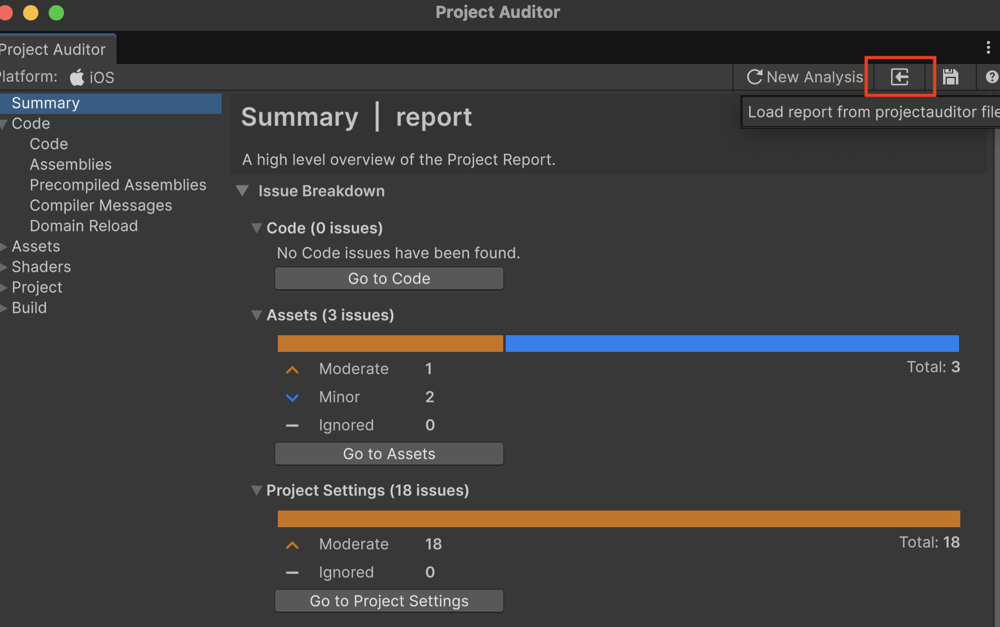

この記事では、Project Auditorをプログラム上やコマンドラインから実行するための方法について焦点を当てて説明します。

## Project Auditorをプログラムから実行する

Project Auditorによる静的解析は、`ProjectAuditor` インスタンスを生成して `Audit` メソッドまたは `AuditAsync` メソッドを実行することでプログラム上で実行できます。

エディター拡張から実行する場合、同期メソッドの方が都合が良いので、大抵のケースでは `Audit` を呼び出すことになると思います。

```csharp
var projectAuditor = new ProjectAuditor();
// 解析の実行
var report = projectAuditor.Audit();
```

もし、Window上などで呼び出したい場合は `AuditAsync` を用いることで、エディターのメインスレッドを停止させることなく、進捗を表示しながら解析を実行できます。

`AuditAsync` には第2引数に `IProgress` インターフェイスを渡すことができます。このインターフェイスに解析状況が逐次報告されるので、ProgressBarを表示するなどをします。

下記に、`EditorUtility.DisplayProgressBar` で進捗を表示する実装を示します。

```csharp
// EditorUtility.DisplayProgressBar
class ProgressBar : IProgress
{
    private int _current;
    private int _total;

    string _description;
    string _title;

    bool _isCancelled = false;

    public void Advance(string description = "")
    {
        if (_isCancelled) return;
        if (!string.IsNullOrEmpty(description)) _description = description;

        _current++;
        var currentFrame = Mathf.Clamp(0, _current, _total);
        var progress = _total > 0 ? (float)currentFrame / _total : 0f;

        _isCancelled = EditorUtility.DisplayCancelableProgressBar(_title, description, progress);
        if (_isCancelled)
            EditorUtility.DisplayProgressBar("Cancelling...", "Please wait while the operation is cancelled", 0f);
    }

    public void Start(string title, string description, int total)
    {
        if (_isCancelled) return;

        _current = 0;
        _total = total;

        _title = title;
        _description = description;

        _isCancelled = EditorUtility.DisplayCancelableProgressBar(_title, _description, _current);
        if (_isCancelled) EditorUtility.DisplayProgressBar("Canceling...", "Please wait while the operation is cancelled", 0f);
    }

    public void Clear()
    {
        EditorUtility.ClearProgressBar();
    }

    public bool IsCancelled => _isCancelled;
}

// parameterは解析の挙動を調整する変数。後述します
projectAuditor.AuditAsync(parameter, new ProgressBar());
```

`Audit` メソッドは解析結果を `Report` 型のインスタンスとして返却します。`FindByCategory(IssueCategory)` を用いて特定のカテゴリのIssueの一覧を確認したりできます。

```csharp
// 例えば、Codeから問題のインパクトが大きいものを検索
var codeIssues = report.FindByCategory(IssueCategory.Code)
    .Where(i =>
        i.Severity == Severity.Critical ||
        i.Severity == Severity.Error ||
        i.Severity == Severity.Major ||
        i.Severity == Severity.Moderate)
    .ToArray();

Debug.Log($"Project Auditor found {codeIssues.Length} code issues");
// それらを列挙する
foreach (var issue in codeIssues)
{
    // CodeにはLocationが存在し、これがファイルのどの場所が問題かを保持している
    Debug.Log($"[{issue.Severity}][{issue.Id}][{issue.Location.FormattedPath}] {issue.Description}");
}
```

また、解析結果は、`Report.Save(string)` メソッドを用いることで、Project Auditor Windowが読み込める形式で保存できます。

```csharp
// Application.dataPath から一つ上の階層 = プロジェクトルートに保存
var reportPath = Path.Combine(Application.dataPath, "..", "report.projectauditor");
report.Save(reportPath);
```

上記のように保存したファイルは、_メニュー > Window > Analysis > Project Auditor_ で Project Auditor Window を開いて、下図の赤枠に示したボタンをクリックすることで読み込むことができます。



### CLIから実行する

例えば、下記のような実装をエディターアセンブリに定義します。

```csharp
public sealed class ProjectAuditorCLI
{
    public static void Execute()
    {
        var parameters = new AnalysisParams
        {
            // 解析するカテゴリ
            Categories = new[] { IssueCategory.Code },
            // コードを解析の際に、アセンブリを指定することができる
            AssemblyNames = new[] { "Assembly-CSharp" },
            // 解析する際のプラットフォーム
            Platform = BuildTarget.Android,
            // コード解析時のコンパイルの最適化オプション
            CodeOptimization = CodeOptimization.Debug
        };

        var additionalRules = new List<Rule>();
        additionalRules.Add(new Rule
        {
            Id = new DescriptorId("PAA8000"),
        });
        parameters.WithAdditionalDiagnosticRules(additionalRules);

        var projectAuditor = new ProjectAuditor();
        var report = projectAuditor.Audit(parameters);
        // var report = projectAuditor.Audit();

        var codeIssues = report.FindByCategory(IssueCategory.Texture)
            .Where(i =>
                i.Severity == Severity.Critical ||
                i.Severity == Severity.Error ||
                i.Severity == Severity.Major ||
                i.Severity == Severity.Moderate)
            .ToArray();

        Debug.Log($"Project Auditor found {codeIssues.Length} code issues");

        var reportPath = Path.Combine(Application.dataPath, "..", "report.projectauditor");
        report.Save(reportPath);
    }
}
```

上記の `ProjectAuditorCLI.Execute` を、下記のようなコマンドで実行できます。

```
/path/to/unity/executable -batchmode -quit -projectPath /path/to/your/project -executeMethod ProjectAuditorCI.Execute
```

また、[`EditorApplication.Exit(int)`](https://docs.unity3d.com/ja/2022.3/ScriptReference/EditorApplication.Exit.html) を呼び出すことで、コマンドラインの戻り値を明示的に設定しつつ終了できるので、適宜活用します。

```csharp

var codeIssues = report.FindByCategory(IssueCategory.Texture)
    .Where(i =>
        i.Severity == Severity.Critical ||
        i.Severity == Severity.Error ||
        i.Severity == Severity.Major)
    .ToArray();

// 特定のSeverityのIssueの数に応じてコマンドラインの戻り値を1にする=異常終了を伝える
EditorApplication.Exit(codeIssues.Length > 0 ? 1 : 0);
```


## 解析パラメーターの指定

`Audit` または `AuditoAsync` メソッドには、`AnalysisParams` というパラメーターを渡すことができます。

```csharp
var parameters = new AnalysisParams
{
    // 解析するカテゴリ
    Categories = new[] { IssueCategory.Code },
    // コードを解析の際に、アセンブリを指定することができる
    AssemblyNames = new[] { "Assembly-CSharp" },
    // 解析する際のプラットフォーム
    Platform = BuildTarget.Android,
    // コード解析時のコンパイルの最適化オプション
    CodeOptimization = CodeOptimization.Debug,
};

var projectAuditor = new ProjectAuditor();
// パラメーターを指定して解析
var report = projectAuditor.Audit(parameters);
```

例えば、解析したレポートを各担当に報告したい場合、全てのカテゴリをレポートするとノイズが多いです。
その場合は、例えばプログラマー向けの解析は `IssueCategory.Code` だけ解析して渡すなどが検討しても良いでしょう。

また、コード解析の場合、デフォルトでそのプロジェクトが読み込んだ全てのアセンブリから解析を行います。
しかしそれだと、サードパーティーライブラリのコードも解析対象に入ってしまい、それがノイズになるケースもあるかと思います。

そのため、プロジェクトのアセンブリがあらかじめわかるのであれば、解析時に対象のアセンブリを限定して実行すると良いでしょう。

### 通常無効の解析を特定の解析で有効にする

解析が重たいなどの理由で、エディター上（Project Auditor Window）での実行では無効にしておきたいが、CI/CDなどで詳細に解析する時に有効にしたい解析がある場合、
`AnalysisParameter` の `WithAdditionalDiagnosticRules` というAPIを用いることで、指定の解析を特定の処理でのみ有効にすることができます。

これには、まずカスタムアナライザーを実装する時に、`Descriptor` の `IsEnabledByDefault` を `false` として定義して、
さらに `Analyzer` メソッドにて `context.IsDescriptorEnabled(Descriptor)` による判定を追加します。

下記は「[Project Auditorでカスタムアナライザーを実装する](https://blog.yucchiy.com/2025/12/project-auditor-custom-analyzer)」で紹介した `MyTextureSizeAnalyzer` に対して判定を追加する例になります。

```csharp
private static readonly Descriptor k_Descriptor = new(
    k_Id,
    "Texture: Exceeds Maxmum Size",
    Areas.Memory | Areas.Quality,
    "テクスチャが最大サイズを超えています",
    $"Max Sizeを{k_MaxTextureSize}以下にしてください"
)
{
    MessageFormat = "Texture '{0}' size is {1}x{2}",
    DocumentationUrl = "https://yucchiy.com/path/to/documentation.html",
    // IsEnabledByDefault を false にすることで、通常の解析からは外れる
    IsEnabledByDefault = false,
    Fixer = (issue, analysisParams) =>
    {
        var importer = AssetImporter.GetAtPath(issue.RelativePath) as TextureImporter;
        if (importer != null)
        {
            importer.maxTextureSize = k_MaxTextureSize;
            importer.SaveAndReimport();
        }
    }
};

public override IEnumerable<ReportItem> Analyze(TextureAnalysisContext context)
{
    // 下記のように判定を追加します
    if (context.IsDescriptorEnabled(k_Descriptor))
    {
        if (context.Texture.width > k_MaxTextureSize ||
            context.Texture.height > k_MaxTextureSize)
        {
            yield return context.CreateIssue(
                    IssueCategory.AssetIssue,
                    k_Id,
                    context.Name,
                    context.Texture.width,
                    context.Texture.height
                )
                .WithSeverity(Severity.Major)
                .WithLocation(context.Importer.assetPath);
        }
    }
}
```

これによって、Project Audtior Windowの解析では、この解析が行われなくなります。
（厳密には、`Analyze` メソッドは呼び出されるが、 `IsDescriptorEnabled` が `false` になることで、解析が行われない。）

プログラムから実行する際に、下記のようにルールを設定します。

```csharp

var parameters = new AnalysisParams
{
    // 解析するカテゴリ
    Categories = new[] { IssueCategory.Texture },
    // 解析する際のプラットフォーム
    Platform = BuildTarget.Android,
    // コード解析時のコンパイルの最適化オプション
    CodeOptimization = CodeOptimization.Debug
};

// ここで、ルールを明示的に有効にします
var additionalRules = new List<Rule>();

// PAA8000 を 有効にします
additionalRules.Add(new Rule
{
    Id = new DescriptorId("PAA8000"),
});
// ルールを適用します
parameters.WithAdditionalDiagnosticRules(additionalRules);

var projectAuditor = new ProjectAuditor();
var report = projectAuditor.Audit(parameters);
```

これによって、`MyTextureAnalyzer` の解析が実行されるようになります。
ちなみに、`Rule` には `Severity` というフィールドがありますが、これが `None` でなければ有効になりますが、それ以外を設定していても、このルールの `Severity` に変更されるわけではないようです。


## 参考

- [Run Project Auditor from the command line | Project Auditor | 1.0.2](https://docs.unity3d.com/Packages/com.unity.project-auditor@1.0/manual/run-from-command-line.html)

