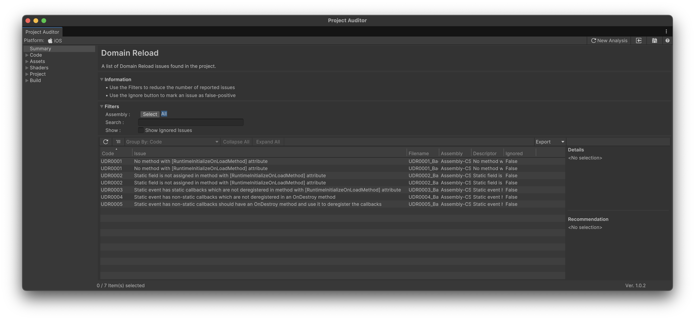

## Domain Reloadとは

Domain Reloadとは、UnityがC#スクリプトのアプリケーションドメインを破棄して再生成するプロセスです。

Enter Play Mode時にもこのプロセスが実行され、Domain Reloadが実行されると、スクリプティングの状態がリセットされます。

具体的には、全てのstaticフィールドの値がデフォルト値に戻り、登録されたイベントハンドラーも解除されます。

### Domain Reloadのパフォーマンス問題

Domain Reloadでは、全てのマネージドアセンブリのアンロードと再ロードが行われます。

プロジェクトの規模が大きくなりアセンブリ数が増えるほど、このプロセスに時間がかかるようになります。

大規模プロジェクトではこの処理に時間がかかり、開発のイテレーション速度を大きく低下させます。

### Enter Play Mode Settingsによる高速化と問題点

Unity 2019.3以降では、_Edit > Project Settings > Editor_ の「Enter Play Mode Settings」からDomain Reloadを無効化できます。

上記の設定でDomain Reloadを無効にすると、Enter Play Mode時にアプリケーションドメインの再生成がスキップされるため、Play Modeへの遷移が高速化されます。

しかし、Domain Reloadを無効にした場合、**staticフィールドの値がPlay Modeに入る前の状態のまま保持されます**。
また、静的イベントに登録されたハンドラーも解除されないため、Play Modeを繰り返すたびにハンドラーが重複登録されていきます。

これらの挙動によって、staticフィールドやイベントの状態がPlay Mode開始時にリセットされることを前提としたコードを記述している場合、正しく動作しなくなる可能性があります。

例えば、下記のコードでは敵の撃破数をstaticフィールドでカウントしています。

Domain Reloadが有効な場合、Play Modeに入るたびに `s_defeatedCount` は `0` にリセットされます。
しかし、Domain Reloadを無効にすると、前回のPlay Modeの値がそのまま残るため、2回目以降のPlay Modeでは前回の撃破数から加算されていきます。

```csharp
public class EnemyCounter : MonoBehaviour
{
    private static int s_defeatedCount = 0;

    public void OnEnemyDefeated()
    {
        s_defeatedCount++;
        // Domain Reload無効時: 2回目のPlay Modeでは
        // 0からではなく前回の値から加算されてしまう
        Debug.Log($"Defeated: {s_defeatedCount}");
    }
}
```

このような問題を解決するには、`[RuntimeInitializeOnLoadMethod]` を利用してPlay Mode開始時にstaticフィールドを明示的にリセットする必要があります。

```csharp
public class EnemyCounter : MonoBehaviour
{
    private static int s_defeatedCount = 0;

    [RuntimeInitializeOnLoadMethod(RuntimeInitializeLoadType.SubsystemRegistration)]
    private static void ResetStatics()
    {
        s_defeatedCount = 0;
    }

    public void OnEnemyDefeated()
    {
        s_defeatedCount++;
        Debug.Log($"Defeated: {s_defeatedCount}");
    }
}
```

しかし、プロジェクト規模が大きくなるほど、このような対処の漏れが増えるリスクが高まります。


## Project AuditorによるDomain Reload診断

Project Auditorには、Domain Reloadを無効化した際に問題となるコードパターンを検出するRoslyn Analyzerが同梱されています。
このアナライザーは5種類のルール（UDR0001〜UDR0005）でstaticフィールドやイベントハンドラーに関する問題を検出します。

また、この診断結果を確認するための専用の「Domain Reload」ビューも用意されています。




## 検出ルールと対処方法

アナライザーはUDR0001〜UDR0005の5種類のルールを提供しています。
大きく分けて、staticフィールドの初期化に関するルール（UDR0001・UDR0002）と、静的イベントへのデリゲート登録に関するルール（UDR0003〜UDR0005）の2カテゴリがあります。

以下、各ルールについて検出されるコード例と対処方法を紹介します。

### UDR0001: No method with [RuntimeInitializeOnLoadMethod] attribute

静的フィールドを持つクラスに `[RuntimeInitializeOnLoadMethod]` 属性のメソッドが存在しない場合に検出されます。
Domain Reload無効時、静的フィールドは前回のPlay Modeの値を保持したままになるため、初期化メソッドが必要です。

検出は各静的フィールドに対して行われるため、静的フィールドが複数ある場合はその数だけIssueが報告されます。

例えば、下記のコードでは `s_Score` と `s_IsInitialized` の2つの静的フィールドに対してそれぞれUDR0001が検出されます。
`Start()` で代入していても、`[RuntimeInitializeOnLoadMethod]` がないため検出対象となります。

```csharp
public class UDR0001_Bad : MonoBehaviour
{
    private static int s_Score = 0;              // UDR0001 検出
    private static bool s_IsInitialized = false; // UDR0001 検出

    void Start()
    {
        s_Score = 0;
        s_IsInitialized = true;
    }
}
```

対処するには、`[RuntimeInitializeOnLoadMethod]` メソッドを追加して全ての静的フィールドを初期化します。

`[RuntimeInitializeOnLoadMethod]` では、引数に処理の実行タイミングを指定できますが、[公式ドキュメント](https://docs.unity3d.com/2022.3/Documentation/Manual/DomainReloading.html)では `RuntimeInitializeLoadType.SubsystemRegistration` が使用されています。

```csharp
public class UDR0001_Good : MonoBehaviour
{
    private static int s_Score = 0;
    private static bool s_IsInitialized = false;

    [RuntimeInitializeOnLoadMethod(RuntimeInitializeLoadType.SubsystemRegistration)]
    private static void Initialize()
    {
        s_Score = 0;
        s_IsInitialized = false;
    }

    void Start()
    {
        s_Score = 0;
        s_IsInitialized = true;
    }
}
```

### UDR0002: Static field is not assigned in method with [RuntimeInitializeOnLoadMethod] attribute

`[RuntimeInitializeOnLoadMethod]` メソッドは存在するが、一部の静的フィールドの初期化が漏れている場合に検出されます。

下記の例では、`s_Score` は `Initialize()` 内で代入されているため検出されませんが、`s_HighScore` と `s_PlayerName` は初期化が漏れているためUDR0002が検出されます。

```csharp
public class UDR0002_Bad : MonoBehaviour
{
    private static int s_Score = 0;
    private static int s_HighScore = 0;      // <- UDR0002 検出
    private static string s_PlayerName = ""; // <- UDR0002 検出

    [RuntimeInitializeOnLoadMethod(RuntimeInitializeLoadType.SubsystemRegistration)]
    private static void Initialize()
    {
        s_Score = 0;
        // s_HighScore と s_PlayerName の初期化が漏れている
    }
}
```

対処するには、全ての静的フィールドを初期化メソッド内で代入します。

```csharp
public class UDR0002_Good : MonoBehaviour
{
    private static int s_Score = 0;
    private static int s_HighScore = 0;
    private static string s_PlayerName = "";

    [RuntimeInitializeOnLoadMethod(RuntimeInitializeLoadType.SubsystemRegistration)]
    private static void Initialize()
    {
        s_Score = 0;
        s_HighScore = 0;
        s_PlayerName = "";
    }
}
```

### UDR0003: Static event has static callbacks which are not deregistered in method with [RuntimeInitializeOnLoadMethod] attribute

静的イベントに静的メソッドをデリゲートとして登録しているが、`[RuntimeInitializeOnLoadMethod]` メソッド内で購読解除していない場合に検出されます。

なお、`[RuntimeInitializeOnLoadMethod]` メソッド自体がない場合はUDR0001が先に検出され、UDR0003は検出されません。

下記の例では、`Initialize()` 内で静的フィールドは初期化していますが、`OnGameStart` への静的メソッド `HandleGameStart` の購読解除が漏れているためUDR0003が検出されます。

```csharp
public class UDR0003_Bad : MonoBehaviour
{
    public static event Action OnGameStart;
    private static int s_Count = 0;

    private static void HandleGameStart()
    {
        Debug.Log("Game Started");
    }

    [RuntimeInitializeOnLoadMethod(RuntimeInitializeLoadType.SubsystemRegistration)]
    private static void Initialize()
    {
        // 静的フィールドは初期化するが、OnGameStart の購読解除をしていない
        s_Count = 0;
    }

    void Awake()
    {
        OnGameStart += HandleGameStart; // <- UDR0003 検出
    }
}
```

対処するには、`[RuntimeInitializeOnLoadMethod]` 内で `-=` により購読解除します。


```csharp
public class UDR0003_Good : MonoBehaviour
{
    public static event Action OnGameStart;

    private static void HandleGameStart()
    {
        Debug.Log("Game Started");
    }

    [RuntimeInitializeOnLoadMethod(RuntimeInitializeLoadType.SubsystemRegistration)]
    private static void Initialize()
    {
        OnGameStart -= HandleGameStart;
    }

    void Awake()
    {
        OnGameStart += HandleGameStart;
    }
}
```

### UDR0004: Static event has non-static callbacks which are not deregistered in an OnDestroy method

非静的メソッド（インスタンスメソッド）を静的イベントに登録しており、`OnDestroy()` メソッドは存在するが、その中で購読解除していない場合に検出されます。

下記の例では、`OnDestroy()` は定義されていますが、その中で `OnPlayerDeath -= HandlePlayerDeath` を行っていないためUDR0004が検出されます。

```csharp
public class UDR0004_Bad : MonoBehaviour
{
    public static event Action OnPlayerDeath;

    private void HandlePlayerDeath()
    {
        Debug.Log("Player died");
    }

    void Awake()
    {
        OnPlayerDeath += HandlePlayerDeath; // <- UDR0004 検出
    }

    void OnDestroy()
    {
        // OnPlayerDeath -= HandlePlayerDeath; が必要だが書いていない
        Debug.Log("Destroyed");
    }
}
```

対処するには、`OnDestroy()` 内で `-=` により購読解除します。

```csharp
public class UDR0004_Good : MonoBehaviour
{
    public static event Action OnPlayerDeath;

    private void HandlePlayerDeath()
    {
        Debug.Log("Player died");
    }

    void Awake()
    {
        OnPlayerDeath += HandlePlayerDeath;
    }

    void OnDestroy()
    {
        OnPlayerDeath -= HandlePlayerDeath;
    }
}
```

### UDR0005: Static event has non-static callbacks should have an OnDestroy method and use it to deregister the callbacks

非静的メソッドを静的イベントに登録しているが、`OnDestroy()` メソッド自体が存在しない場合に検出されます。
UDR0004との違いは、`OnDestroy()` の有無です。

下記の例では、インスタンスメソッド `HandleLevelComplete` を静的イベントに登録していますが、`OnDestroy()` が定義されていないためUDR0005が検出されます。

```csharp
public class UDR0005_Bad : MonoBehaviour
{
    public static event Action OnLevelComplete;

    private void HandleLevelComplete()
    {
        Debug.Log("Level Complete");
    }

    void Awake()
    {
        OnLevelComplete += HandleLevelComplete; // <- UDR0005 検出
    }

    // OnDestroy() メソッドが存在しない
}
```

対処するには、`OnDestroy()` を追加して購読解除を行います。

```csharp
public class UDR0005_Good : MonoBehaviour
{
    public static event Action OnLevelComplete;

    private void HandleLevelComplete()
    {
        Debug.Log("Level Complete");
    }

    void Awake()
    {
        OnLevelComplete += HandleLevelComplete;
    }

    void OnDestroy()
    {
        OnLevelComplete -= HandleLevelComplete;
    }
}
```

## 参考

- [Domain reloading issues | Project Auditor | 1.0.2](https://docs.unity3d.com/Packages/com.unity.project-auditor@1.0/manual/domain-reloading-issues.html)
- [Unity - Manual: Enter Play mode with domain reload disabled](https://docs.unity3d.com/Manual/domain-reloading.html)
