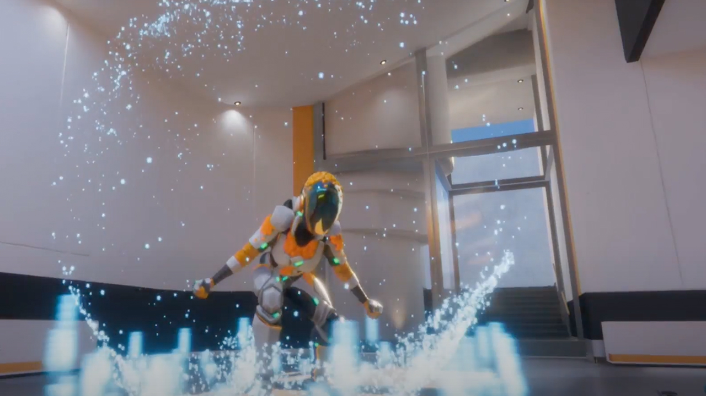
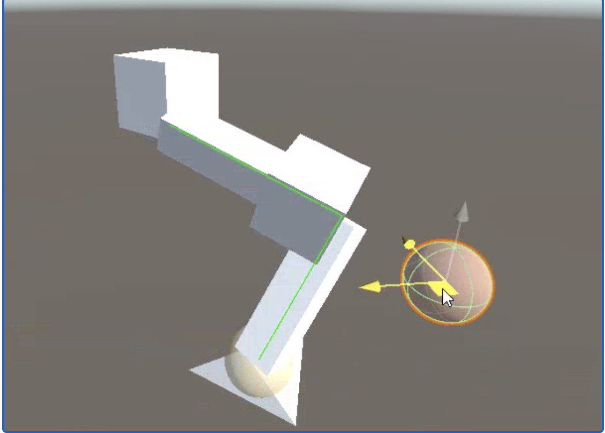
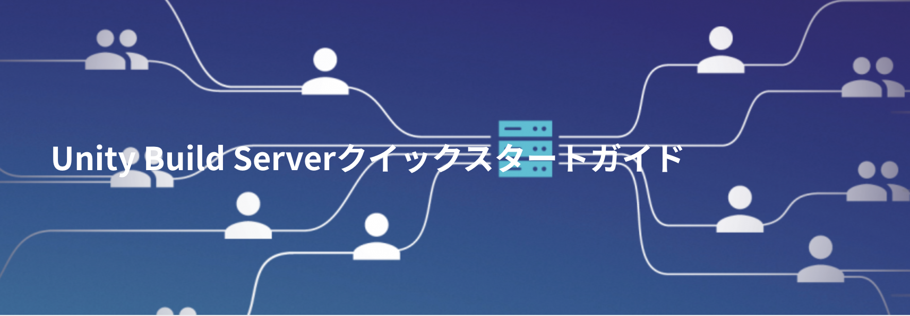
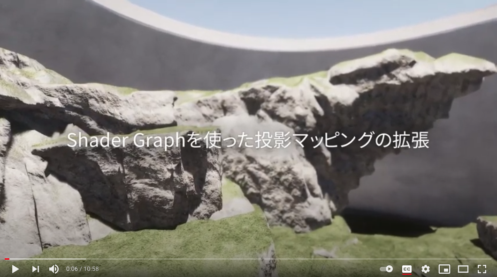
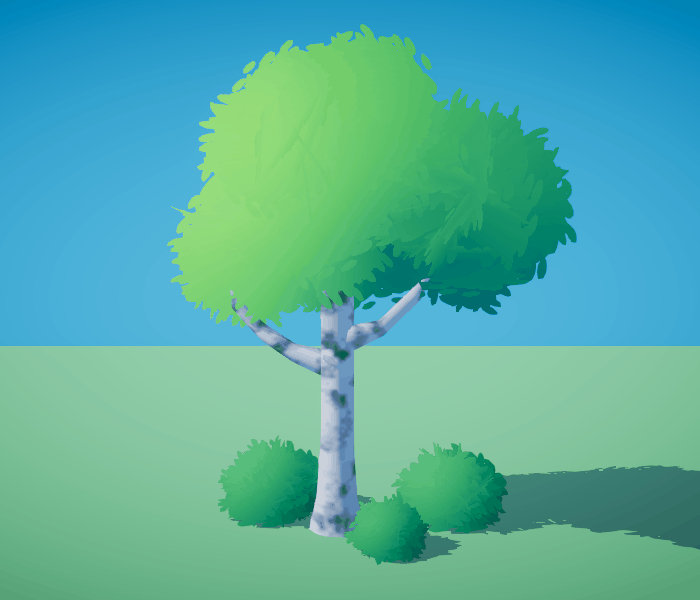
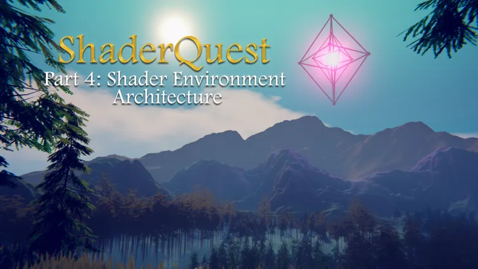
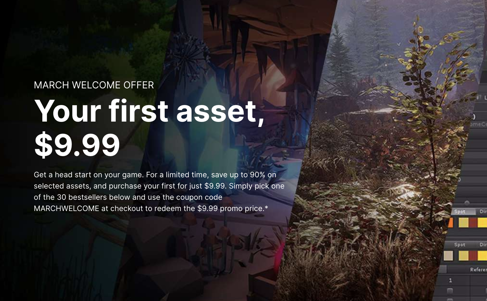

## Unity at GDC Showcase 2021: Visual scripting, new releases, and other moments from the keynote

[Unity at GDC Showcase 2021: Visual scripting, new releases, and other moments from the keynote - Unity Technologies Blog](https://blogs.unity3d.com/jp/2021/03/16/unity-at-gdc-showcase-2021-visual-scripting-new-releases-and-other-moments-from-the-keynote/)

- [GDC Showcase 2021](unity.com/ja/events/gdc2021)にてUnityの基調講演がありました。そのなかでUnityの最新技術や今後登場する機能の紹介、2020 LTSおよび2021のTechストリームの機能の概要紹介などがありました。
- 最新のリリースの中でも特にビジュアルスクリプティング、ネットコード、レンダーパイプラインの、3つの分野が重点的に紹介されました。
    - 2021のTECHストリームで[ビジュアルスクリプティング](https://blogs.unity3d.com/jp/2021/02/04/the-road-to-2021-visual-scripting-in-unity/)がUnityエディタのコアな機能として利用できるようになります。ノードベースなグラフを用いることで、コードを書かずともゲームのインタラクションや動作を実装することができます。
    - ネットコードはオンラインなマルチプレイヤーゲームを実装するためのソリューション。最初の実験的なUnityパッケージが3/23にTECHストリームにリリースされます。また、サンプルゲームとして小規模な協力型マルチプレイヤーゲーム「Boss Room」が4/7に[こちら](https://unity.com/ja/demos/small-scale-coop-sample)のページでダウンロードできるようになります。
    - レンダーパイプライン Unity 2021.1にコアエンジンに統合されます。これにより、最新の検証済みグラフィックスコード（URPやHDRP、Shader Graph、Visual Effect Graphの最新バージョン）を常に使用できるようになります。
- その他にも2Dグラフィックスのパフォーマンス向上やAIによるアセット作成アシスタントアーティストリである[ArtEngine](https://unity.com/ja/products/unity-artengine)、[Unity Game Simulation](https://unity.com/ja/products/game-simulation)の導入事例などが紹介されました。

## 「Unity」Simple Inverse Kinematics implementation

[「Unity」Simple Inverse Kinematics implementation – 株式会社ロジカルビート](https://logicalbeat.jp/blog/6235/)

- この記事ではInverse Kinematics(IK)の説明とゲームでの利用例、IKのアルゴリズムの1つである[FABIK(リンク先はPDF)](http://andreasaristidou.com/publications/papers/FABRIK.pdf)について説明しています。
- 紹介されたFABIKをUnityでフルスクラッチで実装しています。またエフェクターの実装や、それぞれの実装について評価を行っています。

## Unity Build Serverクイックスタートガイド 

[Unity Build Serverクイックスタートガイド – Unity for Pro](https://forpro.unity3d.jp/unity_pro_tips/2021/03/17/1851/)

- この記事では[Unity Build Server](https://unity.com/products/unity-build-server)の導入方法および各種設定方法について紹介しています。
- Unity Build Serverは、バッチ起動のみのサポートだが、フローティングライセンスによりビルドマシンのライセンス運用が容易になり、また機能が制限されている分お得に利用できるように設計されている。主にCI環境を自前で構築されている方におすすめのライセンス体系。

## ShaderGraphを使った投影マッピングの拡張 - Material Tips #2

[ShaderGraphを使った投影マッピングの拡張 - Material Tips #2 - YouTube](https://www.youtube.com/watch?v=HvrMofJMJ38)

- [前回](https://www.youtube.com/watch?v=nMAMniAlJJ4)はUnity HDPRで実装されたPlanar MappingおよびTri-Planar Mappingについてとその利用シーンについて紹介されたが、今回はShader Graphを使ってTri-Planar Mappingを拡張する方法について紹介しています。
- Tri-Planar MappingはShader Graphに専用のノードがあるので、テクスチャパラメータをそのノードにつなげてその出力を利用するだけでTri-Planar Mappingの挙動を簡単に実装することができる。
- 動画では更に、通常ワールドスペースで投影されるTri-Planar Mappingをオブジェクトスペースに切り替える方法、複数枚のテクスチャを使ったTri-Planar Mappingの実装について紹介しています。

## Soft Foliage Shader Breakdown

[Soft Foliage Shader Breakdown | Cyanilux](https://www.cyanilux.com/tutorials/soft-foliage-shader-breakdown/)

- この記事では、上記の画像のような葉を描画するシェーダーのShader Graphによる実装方法について紹介しています。
- 葉っぱメッシュはパーティクルシステムにより交差する四角形メッシュを生成し、そのメッシュをベイク（アセットとして保存）することで作成します。この際ソフトシェーディングのために法線を加工しています。
- 葉っぱテクスチャはマスク画像によりアルファクリップして利用しています。
- 風の動きをシミュレーションするために、正弦波によるVertexDisplacementを行っています。

## ShaderQuest Part 4: Shader Environment Architecture

[ShaderQuest Part 4: Shader Environment Architecture – Harry Alisavakis](https://halisavakis.com/shaderquest-part-4-shader-environment-architecture/)

- [@HarryAlisavakis](https://twitter.com/HarryAlisavakis)さんの、シェーダーチュートリアルであるShaderQuestの第4段。
- Unityのシェーダーのアーキテクチャーについて、ShaderLabのシェーダーコードのそれぞれのブロックがどのような役割なのか説明しています。

## March Welcome Offer - Asset Store

[March Welcome Offer - Asset Store](https://assetstore.unity.com/browse/new-to-unity)

- 2021/03/31まで初めてアセットストアでアセットを購入される方限定で、全てのアセットを$9.99で購入することができる。
