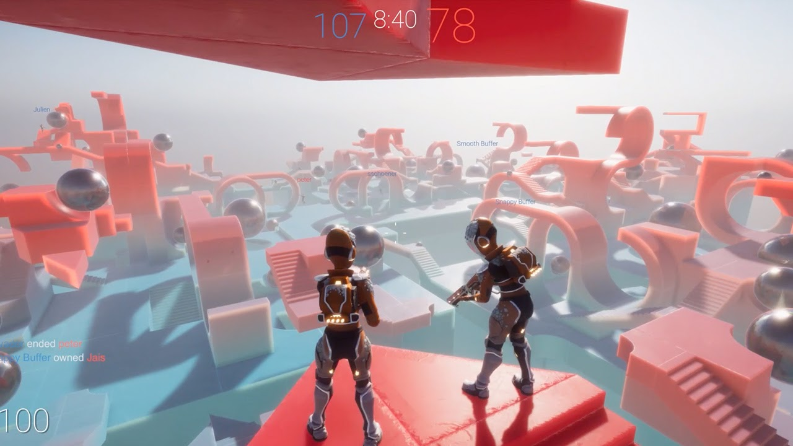
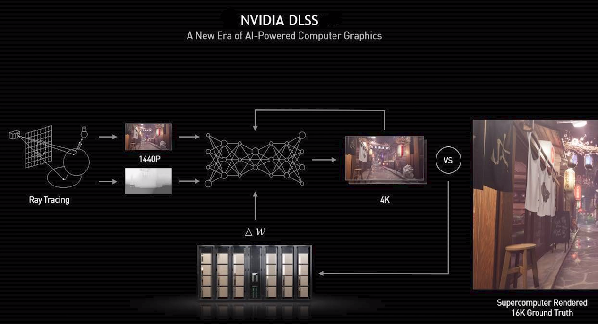

## Bursting into 2021 with Burst 1.5

[Bursting into 2021 with Burst 1.5](https://blogs.unity3d.com/jp/2021/04/14/bursting-into-2021-with-burst-1-5/)

- この記事では、Burst 1.5で行われた主要な改善点について、おもにArm Neonのハードウェア組み込み関数、Direct Call、最適化機能が紹介されています。
- Arm Neonの[ハードウェア組み込み関数](https://developer.arm.com/architectures/instruction-sets/simd-isas/neon/intrinsics)が正式にサポートされました。NeonはArmのSIMD拡張命令です。
- マネージドコード内からBurst Compilerのコンパイル済みの関数を呼び出すには、Brust 1.5以前では関数ポインタを経由する必要がありましたが、1.5からは直接呼び出せるようになりました（厳密にはコンパイラが関数ポインタ経由の呼び出しに変換して呼び出します）。
- 最適化のためにコンパイラへヒントを提供する関数である、`Hint.Likely`と`Hint.Unlikely`、`Hint.Assume`が追加されました。また、コンパイル時に式が定数式として評価されるかどうかを判定する`IsConstantExpression`も実装されました。

## NVIDIA DLSS Natively Supported in Unity 2021.2

[NVIDIA DLSS Natively Supported in Unity 2021.2 | NVIDIA Developer Blog](https://developer.nvidia.com/blog/nvidia-dlss-natively-supported-in-unity-2021-2/?ncid=so-twit-162141-vt10)

- Unity 2021.2でNVIDIAのDLSS(Deep Learning Super Sampling)が対応されます。
- DLSSはゲームエンジンが低解像度の画像を出力し、その画像をニューラルネットワークベースな超解像を適用することでそれぞれの端末の解像度の画像を生成する技術です。これにより主にGPUの負荷を軽減できます。

## Find out what’s new for the Addressable Asset System

[Find out what’s new for the Addressable Asset System](https://blogs.unity3d.com/2021/04/14/find-out-whats-new-for-the-addressable-asset-system/)

- Addressablesパッケージの1.17.4以降で、同期的APIが追加されました。これにより`Resources.Load`を用いた実装と制御フローを変えずにこれを置き換えることが可能になりました。
- 具体的には、`Addressables.LoadAssetAsync`メソッドの戻り値である`AsyncOperationHandle`に対して`WaitForCompletion`メソッドが実装されました。このメソッドを呼び出すと、同期的にアセットのロードを行うことができます。
- 詳細についてはこちらのブログでも取り上げられています（[【Unity】Addressableアセットシステムで同期ロードが公式サポート、Resources.Loadを置き換え可能に - LIGHT11](https://light11.hatenadiary.com/entry/2021/04/13/194929)）

## Unity Future .NET Development Status

[Unity Future .NET Development Status - Unity Forum](https://forum.unity.com/threads/unity-future-net-development-status.1092205/)

- Unityの.NET対応の現状について紹介、議論するためのフォーラムが立ち上げられました。
- Unity2021.2では.NET Standard 2.1追加、C#8およびC#9への対応、（.NET5をスキップし）.NET6の対応を予定しているとのことです。また、いくつかの大きなハードルもあり(.NET CoreではDomain Reloadingに対応していない点、CLRに移行するかmonoをアップデートすることで対応するかなど)作業が十分に進んでいない状況についても説明されています。
