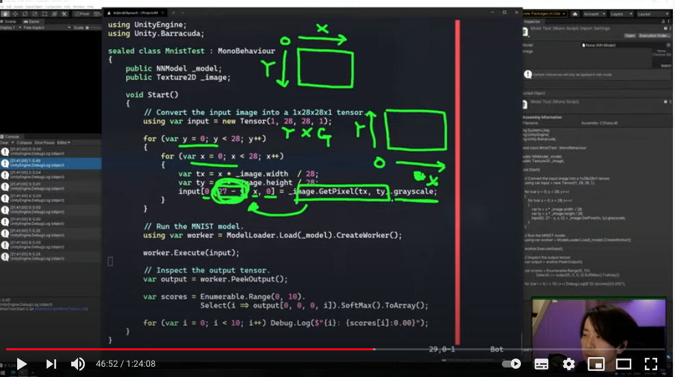
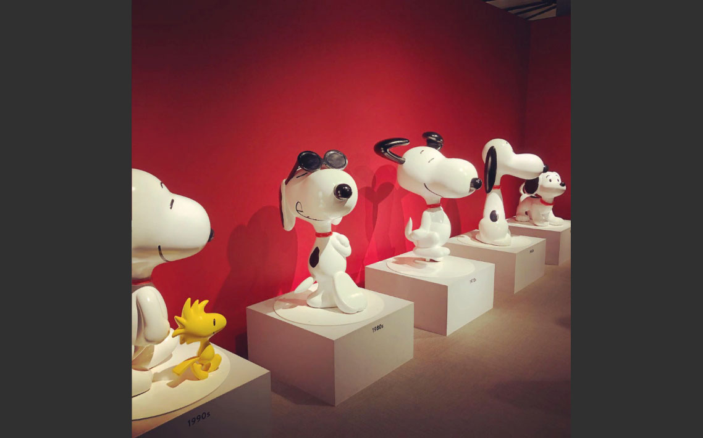
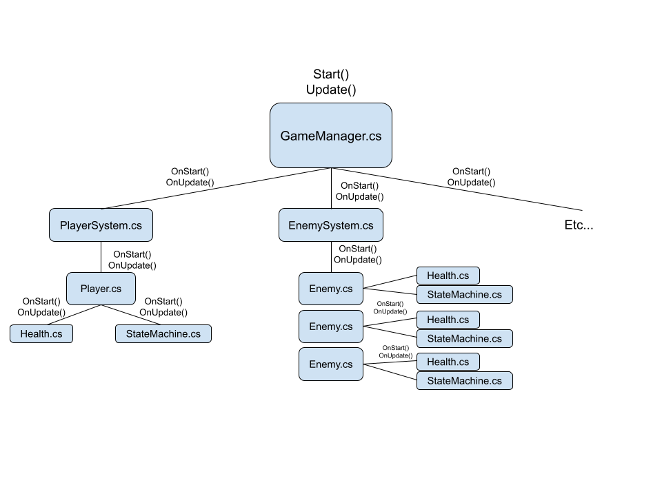
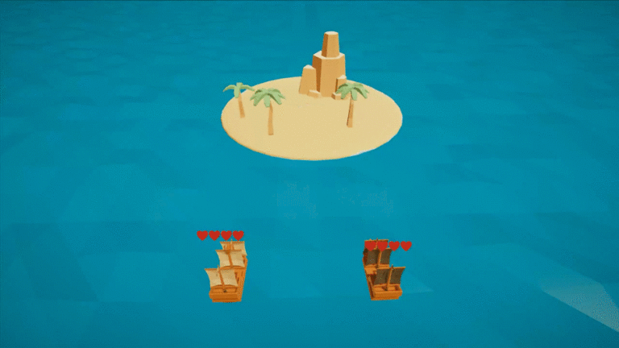

## ニューラルネットで何でもできちゃう！？ Unity Barracudaで遊ぼう！

[ニューラルネットで何でもできちゃう！？ Unity Barracudaで遊ぼう！ - Unityステーション - YouTube](https://www.youtube.com/watch?v=5oKgj8q83ec)

- この動画ではUnityのニューラルネットワーク推論ライブラリである[Unity Barracuda](https://docs.unity3d.com/Packages/com.unity.barracuda@1.0/manual/index.html)について紹介しています。
- Barracudaはニューラルネットワークのランタイム部分（推論部分）のみを提供するライブラリです。そのためモデル生成は別のライブラリなどで行う必要があります。推論モデルはフォーマットとしてONNX（Open Neural Network Exchange）をサポートしています。
- 動画ではBarracudaについての簡単な説明とサンプルプロジェクトとして[NNCam](https://github.com/keijiro/NNCam)や[FaceMeshBarracuda](https://github.com/keijiro/FaceMeshBarracuda)などの紹介、最後に手書き文字データセットの[MNISTをBarracudaで識別するサンプル](https://github.com/keijiro/MnistBarracuda)についての解説を行っています。
- BarracudaのサポートしているONNXのオペレータはまだ少ないそうです（参考: [Supported ONNX operators | Barracuda | 1.0.4](https://docs.unity3d.com/Packages/com.unity.barracuda@1.0/manual/SupportedOperators.html)）
- 動画で紹介されているレポジトリなどは下記のとおりです。
    - [keijiro/NNCam: Virtual background with Unity Barracuda](https://github.com/keijiro/NNCam)
    - [keijiro/FaceMeshBarracuda: Lightweight facial capture package for Unity](https://github.com/keijiro/FaceMeshBarracuda)
    - [keijiro/UltraFaceBarracuda: "Ultra-Light-Fast-Generic-Face-Detector-1MB" face detector for Unity Barracuda](https://github.com/keijiro/UltraFaceBarracuda)
    - [keijiro/Waifu2xBarracuda: Waifu2x Unity Barracuda implementation](https://github.com/keijiro/Waifu2xBarracuda)
    - [UnityLabs/barracuda-style-transfer: Companion code for the Unity Style Transfer blog post, showcasing realtime style transfer using Barracuda.](https://github.com/UnityLabs/barracuda-style-transfer)
    - [keijiro/BlazeFaceBarracuda: BlazeFace face detection model for Unity Barracuda](https://github.com/keijiro/BlazeFaceBarracuda)
    - [keijiro/TinyYOLOv2Barracuda: Tiny YOLOv2 on Unity Barracuda](https://github.com/keijiro/TinyYOLOv2Barracuda)
    - [onnx/models: A collection of pre-trained, state-of-the-art models in the ONNX format](https://github.com/onnx/models)
    - [PINTO0309/PINTO_model_zoo: A repository that shares tuning results of trained models generated by TensorFlow / Keras. ...](https://github.com/PINTO0309/PINTO_model_zoo)
    - [axinc-ai/ailia-models: Pretrained models for ailia SDK](https://github.com/axinc-ai/ailia-models)
    - [keijiro/MnistBarracuda: MNIST on Unity Barracuda](https://github.com/keijiro/MnistBarracuda)

## TypeCacheを使って指定したアトリビュートが付いている型を高速に取得する

[【Unity】【エディタ】TypeCacheを使って指定したアトリビュートが付いている型を高速に取得する - LIGHT11](https://light11.hatenadiary.com/entry/2021/04/26/202054)

- この記事ではUnityEditorが内部でキャッシュしている型情報を取得できるTypeCache APIについて紹介しています。
- このAPIは「指定したアトリビュートがついているプロパティを取得する」、「指定したアトリビュートがついている型を取得する」などエディタ実装で必要そうなユースケースに特化した機能を提供します。
- TypeCacheは上記の情報をキャッシュされた型情報を元に返却するため、リフレクションによる実装と比べると高速に取得することができます。

## Unityで動かすOpenCVサンプル集 20選 

[Unityで動かすOpenCVサンプル集 20選 - おもちゃラボ](https://nn-hokuson.hatenablog.com/entry/2021/04/26/103948)

- この記事ではUnityで利用できるOpenCVライブラリ[OpenCV plus Unity](https://assetstore.unity.com/packages/tools/integration/opencv-plus-unity-85928)の紹介と、そのライブラリを活用したサンプルを20個紹介しています。
- UnityのTexture2DをOpenCVのMat（OpenCVでは画像を扱う際にMat）の相互変換方法からグレースケールや２値化、ガウシアンブラーなどの基本的な画像変換、Sobelフィルターやハイパスフィルターなどの画像へのフィルターの適用方法、顔検出まで網羅的に紹介されています。

## Hashing Space

[Hashing Space](https://catlikecoding.com/unity/tutorials/pseudorandom-noise/hashing-space/)

- この記事はCatlike Codingさんの[疑似ランダムノイズ](https://catlikecoding.com/unity/tutorials/pseudorandom-noise/)シリーズの第2弾です。
- この記事では[前回の記事](https://catlikecoding.com/unity/tutorials/pseudorandom-noise/hashing/)でhashingにより算出したUV整数空間を任意のグリッドや形状に変換して利用できるようにします。（前回の記事については[Unity Weekly #007](https://blog.yucchiy.com/project/unity-weekly/007/#hashing-in-pseudorandom-noise-tutorial-series)で取り上げています。）
- また上記の変換を手動でベクトル化することで、Brust CompilerによりジョブがSIMD命令を実行し、ハッシュ計算を４つ並列で計算するようにしています。

## Unity Architecture Pattern: the Main loop 

[Unity Architecture Pattern: the Main loop – Bronson Zgeb](https://bronsonzgeb.com/index.php/2021/04/24/unity-architecture-pattern-the-main-loop/)

- この記事ではUnityでメインループパターンを実装する方法と、そのメリットについて述べています。
- 典型的なMonoBehaviourを複数個配置するパターンは、実行順序や初期化順の観点からシーンが複雑になるにつれてシステムの複雑さが増し、可読性の低下やメンテナンスコストの増加を招く傾向にあると説明しています。
- GameManagerなどのシーンに単一のMonoBehaviourを配置し、そこからシーン上のオブジェクトを初期化・更新することで実行順を完全に制御下におくことができ、上記の問題を解決することができると述べています。また、`Update`および`FixedUpdate`も1つになることはパフォーマンス上メリットがあることにも触れられています。

## Create a health bar that hovers over the player with UI Toolkit

[Create a health bar that hovers over the player with UI Toolkit - GameDev Resources](https://gamedev-resources.com/create-a-health-bar-that-hovers-over-the-player-with-ui-toolkit/)

- この記事ではUI Toolkitを用いて3Dプレイヤー上にUIを配置する方法について紹介しています。
- ワールドスペース内のプレイヤー位置からUI Toolkit上のUIスペースの変換は、[RuntimePanelUtil](https://docs.unity3d.com/Packages/com.unity.ui@1.0/api/UnityEngine.UIElements.RuntimePanelUtils.html)を用いて行うことができます。この記事中ではCameraTransformWorldToPanelというメソッドを用いて、プレイヤー位置からUI位置を計算しています。

## Facade

[Facade](https://www.notion.so/Facade-b48dc31153384c428795ad7ad97dd7eb)

- この記事ではFacadeパターンのUnityへの適用について説明しています。
- インスタンスオブジェクトをstaticで定義してアクセスすると、将来そのインスタンスをサブクラスにしたり、そのインスタンスを別のインスタンスに置き換えることができなくなります。
- Facadeパターンを用いることで、シングルトン化したいクラス自体はstaticで定義する必要がなくなります。これにより、クラスの拡張や置き換えが容易になります。また、`using static`ディレクティブを用いることでより簡素に記述することができます。
