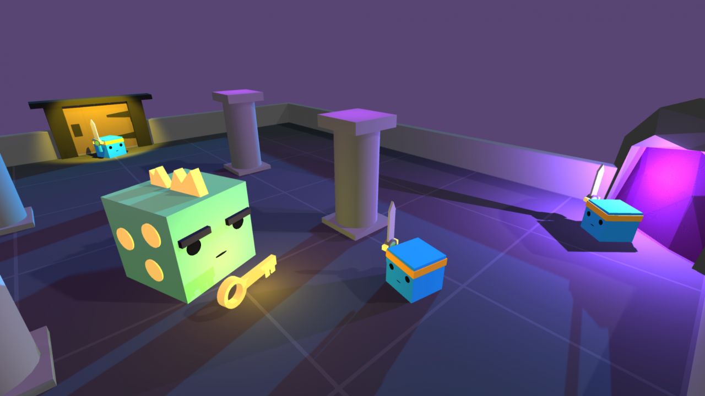

## ML-Agents v2.0 release: Now supports training complex cooperative behaviors

[ML-Agents v2.0 release: Now supports training complex cooperative behaviors - Unity Technologies Blog](https://blogs.unity3d.com/2021/05/05/ml-agents-v2-0-release-now-supports-training-complex-cooperative-behaviors/)

- ML-Agent 2.0がUnity 2021.2向けにリリースされました。1.0が2020.1向けにリリースされてからこの1年間で、ユーザーワークフローや新しいトレーニングアルゴリズムや機能の実装、大幅なパフォーマンス改善などの15以上の主要な機能の更新が行われました。
- この記事では、協調動作（cooperative behaviors）の学習とエージェントが環境下で様々なエンティティを監視する機能、タスクのパラメータ化を利用した複数のタスクをトレーニングをサポートする機能について焦点を当てて説明しています。
- 複数のエージェントを利用したトレーニング自体はサポートしていましたが、相互に目標を持ったエージェントグループは定義できませんでした。[Release 15](https://github.com/Unity-Technologies/ml-agents/releases/tag/release_15)で、MA-POCA（**PO**sthumous**C**redit**A**ssignment）と呼ばれるトレーニングが追加され、協調動作のトレーニングをサポートしました。
    - サンプルトレーニングとして、[Cooperative Push Block](https://github.com/Unity-Technologies/ml-agents/blob/release_17/docs/Learning-Environment-Examples.md#cooperative-push-block)と[DungeonEscape](https://github.com/Unity-Technologies/ml-agents/blob/release_17/docs/Learning-Environment-Examples.md#dungeon-escape)の2プロジェクトが提供されました。またドキュメントは[こちら](https://github.com/Unity-Technologies/ml-agents/blob/release_17/docs/Learning-Environment-Design-Agents.md#groups-for-cooperative-scenarios)から確認できます。
- [Release 15](https://github.com/Unity-Technologies/ml-agents/releases/tag/release_15)で「observation buffer」と呼ばれる機能を用いて、任意の数のエンティティを観測することができるようになりました。エージェントは、さまざまな数の観測値をエンコードして処理する[Attention Module](https://arxiv.org/abs/1706.03762)を介して任意サイズのバッファーを利用する方法を学習します。
    - ドキュメントは[こちら](https://github.com/Unity-Technologies/ml-agents/blob/release_17/docs/Learning-Environment-Design-Agents.md#variable-length-observations)から確認できます。
- [Release 17](https://github.com/Unity-Technologies/ml-agents/releases/tag/release_17)では[HyperNetworks](https://arxiv.org/abs/1609.09106)を用いて、複数のタスクにおいて個別タスクの一部を再利用することで全体的なトレーニング時間を短縮することができます。具体的には「Goal Signal」と呼ばれる新しい観測値と「HyperNetwork」と呼ばれる小さなニューラルネットワークを用いて別のより大きなニューラルネットワークの重みを生成します。
    - ドキュメントは[こちら](https://github.com/Unity-Technologies/ml-agents/blob/release_17/docs/Learning-Environment-Design-Agents.md#goal-signal)から確認できます。
- v1.0とv2.0を比べて[3DBall](https://github.com/Unity-Technologies/ml-agents/blob/release_17/docs/Learning-Environment-Examples.md#3dball-3d-balance-ball)と[GridWorld](https://github.com/Unity-Technologies/ml-agents/blob/release_17/docs/Learning-Environment-Examples.md#gridworld)のサンプルシーンで、ガベージコレクションメトリック（ステップごとのメモリ確保）を約98%削減しています。

## iOSネイティブプラグイン開発を完全に理解する

[【Unity】iOSネイティブプラグイン開発を完全に理解する - Qiita](https://qiita.com/mao_/items/5b33c90e533a538570b8)

- この記事では、UnityのiOSネイティブプラグイン開発の基礎を体系的に解説しています。
- [ログ出力とintの戻り値を返すシンプルなObjCのメソッドのC#からのP/Invokeでの呼び出し方法](https://qiita.com/mao_/items/5b33c90e533a538570b8#%E6%9C%80%E5%B0%8F%E6%A7%8B%E6%88%90%E3%81%8B%E3%82%89%E8%A6%8B%E3%82%8B%E3%83%8D%E3%82%A4%E3%83%86%E3%82%A3%E3%83%96%E3%83%97%E3%83%A9%E3%82%B0%E3%82%A4%E3%83%B3%E5%9F%BA%E7%A4%8E)から[同サンプルのSwift実装](https://qiita.com/mao_/items/5b33c90e533a538570b8#swift%E3%81%A7%E3%81%AE%E3%82%B5%E3%83%B3%E3%83%97%E3%83%AB%E5%AE%9F%E8%A3%85)、[ネイティブコード側でインスタンス化したオブジェクトの管理](https://qiita.com/mao_/items/5b33c90e533a538570b8#%E3%83%8D%E3%82%A4%E3%83%86%E3%82%A3%E3%83%96%E3%82%B3%E3%83%BC%E3%83%89%E5%81%B4%E3%81%A7%E3%82%A4%E3%83%B3%E3%82%B9%E3%82%BF%E3%83%B3%E3%82%B9%E5%8C%96%E3%81%97%E3%81%9F%E3%82%AA%E3%83%96%E3%82%B8%E3%82%A7%E3%82%AF%E3%83%88%E3%81%AE%E7%AE%A1%E7%90%86)、[ネイティブコード側からC#側のコールバックメソッドを呼び出す方法](https://qiita.com/mao_/items/5b33c90e533a538570b8#%E3%83%8D%E3%82%A4%E3%83%86%E3%82%A3%E3%83%96%E3%82%B3%E3%83%BC%E3%83%89%E3%81%8B%E3%82%89c%E3%81%AE%E3%83%A1%E3%82%BD%E3%83%83%E3%83%89%E3%82%92%E5%91%BC%E3%81%B3%E5%87%BA%E3%81%99)について説明しています。
- [Swift実装におけるUnity設定の注意点](https://qiita.com/mao_/items/5b33c90e533a538570b8#--postprocessbuild%E3%81%A7swift%E3%81%AE%E3%83%90%E3%83%BC%E3%82%B8%E3%83%A7%E3%83%B3%E6%8C%87%E5%AE%9A%E3%82%92%E8%87%AA%E5%8B%95%E5%8C%96)や[Xcodeの設定の自動化方法](https://qiita.com/mao_/items/c678f93ee04608492788)、[プラグインの設計](https://qiita.com/mao_/items/15d05d25a99ab290fa50)や[実装](https://qiita.com/mao_/items/88aeac26adb17194ebdc)方法などの補足情報も丁寧に紹介されています。

## 2021年のC# Roslyn Analyzerの開発手法、或いはUnityでの利用法

[neue cc - 2021年のC# Roslyn Analyzerの開発手法、或いはUnityでの利用法](http://neue.cc/2021/05/08_600.html)

- この記事では、Roslyn Analyzerについての紹介とその開発方法、UnityでAnalyzerを利用するためのプラクティスが紹介されています。
- Visual Studio 2019 16.10でRoslyn Analyzerを開発する方法と、設定についてのいくつかの注意点が説明されています。
- Unity2020.2でサポートされたRoslyn Analyzerサポートされたが、IDE側とAnalyzer設定が共有できない問題と、それを解決するための[CsprojModifier](https://github.com/Cysharp/CsprojModifier)について紹介されています。

## Cysharp/CsprojModifier

[Cysharp/CsprojModifier: CsprojModifier performs additional processing when Unity Editor generates the .csproj.](https://github.com/Cysharp/CsprojModifier)

- CsporjModifierは、Unity Editorが.csprojを生成する際に追加の処理を差し込むことで、IDEの開発体験を向上させるためのツールです。
- 生成された.csprojに対して追加のプロジェクトを`Import`要素で追加できます。これによりBannedSymbols.txtを`AdditionalFiles`で追加することができ、[BannedApiAnalyzer](https://github.com/dotnet/roslyn-analyzers/tree/main/src/Microsoft.CodeAnalysis.BannedApiAnalyzers)をUnity Editor上でも正常に機能させることができます。
- 生成された.csprojに対して追加のAnalyzerの参照を追加できます。これによりIDEとUnity Editor上で共通のRoslyn Analyzerを動作させることができます。

## Game Package Registry (GPR) by Google will shut down on May 19, 2021 

[[Question] Game Package Registry (GPR) by Google will shut down on May 19, 2021 · Issue #1030 · firebase/quickstart-unity](https://github.com/firebase/quickstart-unity/issues/1030)

- Googleの提供するGame Package Registry (GPR) が2021年5月19日をもってシャットダウンする予定があります。
- この対応によってFirebase Unity SDKの、GRP経由でのUPMインストールができなくなり、代わりに unitypackage 形式でのインストールが推奨されます。
