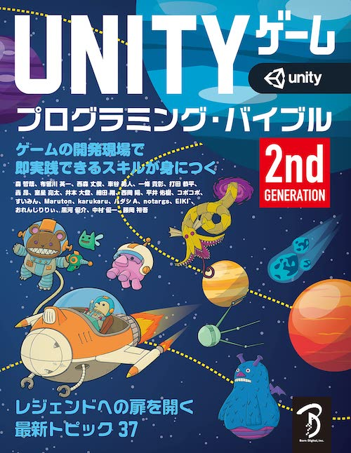
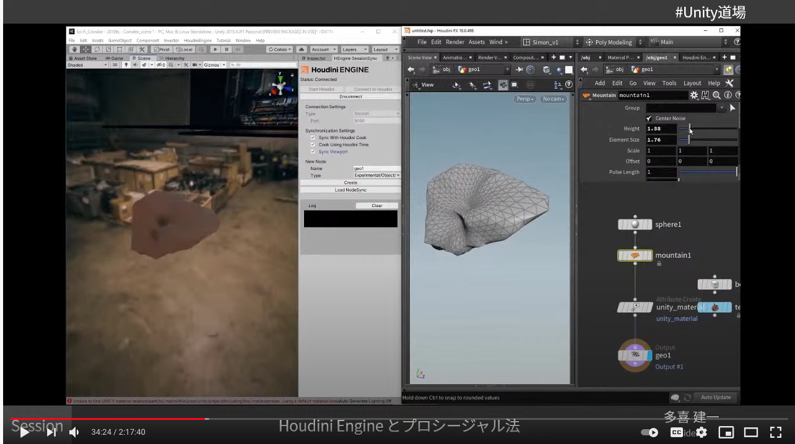
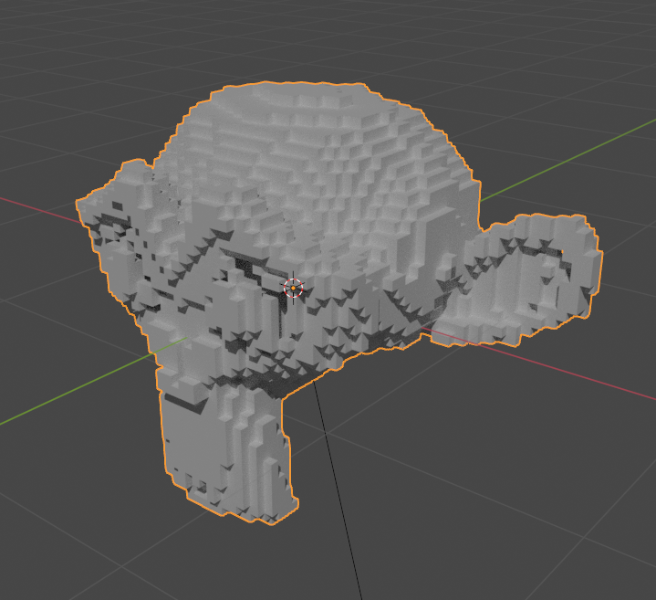
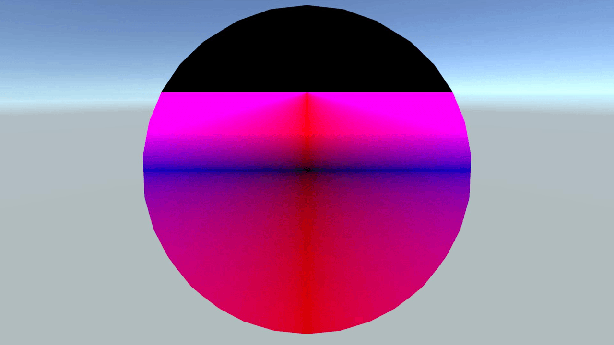
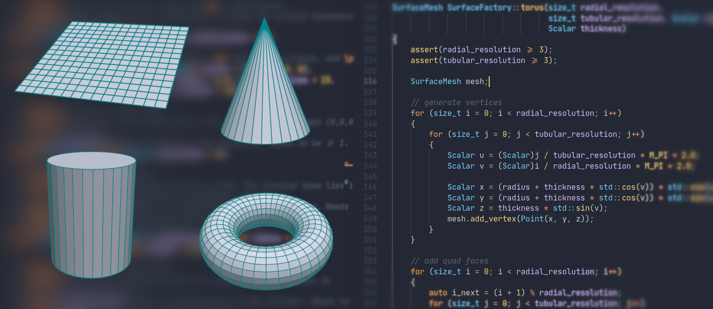

## Unityゲーム プログラミング・バイブル 2nd Generation

[Amazon.co.jp: Unityゲーム プログラミング・バイブル 2nd Generation](https://www.amazon.co.jp/dp/4862465072/)

- [Unityゲーム プログラミング・バイブル](https://www.amazon.co.jp//dp/4862464130/)シリーズの第２弾が6/29に発売されます。
- 下記（抜粋）のようにURPやBOLTなど最新トピックスも含め、合計３７セクション1120ページと網羅的な内容になっています。
    - 基本コンポーネント(5セクション): Prefab/カメラワーク/TextMesh Pro/Particle System/NavMesh
    - グラフィックス(4セクション): Light 2D/URP/シェーダー言語/Timeline
    - 拡張コンポーネント(7セクション): Terrain/2D Animation/Anmation Rigging/Visual Effect Graph/ShaderGraph/Bolt/Unity ML-Agents
    - ネットワーク(3セクション): Firebase/Photon/MLAPI
    - リソース/IO/xR(4セクション): AR/VR/サウンド/Genvid
    - C#スクリプティング(7セクション): DOTS/C# JobSystem/C#新機能/UniRx/Zenject/システム設計
- Unity Japanの方や各分野で著名な方などが執筆されています

## Unity x Houdini

[Unity道場 Houdini編 - YouTube](https://www.youtube.com/watch?v=MkcmAwzjulE)

- Unity道場のHoudini編が5/13にオンラインで開催されました。
- 本イベントは[Houdini Engineとプロシージャル法](https://www.youtube.com/watch?v=9eXOglQ6Klc)と[HoudiniとUnityマテリアル連携のいろいろ](https://www.youtube.com/watch?v=qrEsP1glPC0)、UnityとHoudiniで作るRealtimeVFX実践解説の[前編](https://www.youtube.com/watch?v=8nHK7bYDUy4)と[後編](https://www.youtube.com/watch?v=8qM-OAuPujM)の４セクションからなります。
- [Houdini Engineとプロシージャル法](https://www.youtube.com/watch?v=9eXOglQ6Klc)ではSurface Operation(SOPS)を用いてモデルアセットを指定したモデルアセットで埋める（例ではラバートイアセットをレゴブロックのようなアセット）例や、HoudiniとMaya、Unityなどの連携概要、Building Generatorによる建造物自動生成例、VEX Operators（VOPS）やRendering Operators（ROPS）などのその他オペレーターの解説、PDGを用いたプロシージャルな地形構築とUnity連携の紹介、について扱っています。
- [HoudiniとUnityマテリアル連携のいろいろ](https://www.youtube.com/watch?v=qrEsP1glPC0)ではHoudini EngineとUnity間でマテリアル作成の連携方法について、Houdini Engine for UnityのURPとHDRPへの対応方法、Unity Materialノードを用いたUnity連携、FBXファイルを用いた際のHoudiniで生成したパラメータをUnityに受け渡す方法、Vertex Animation Textureを用いる際のマテリアル設定、について解説しています。
- UnityとHoudiniで作るRealtimeVFX実践解説[前編](https://www.youtube.com/watch?v=8nHK7bYDUy4)・[後編](https://www.youtube.com/watch?v=8qM-OAuPujM)ではHoudiniの「FlowMap」および「Rigid Body Dynamics（RBD）」を活用してRealtimve VFXをHoudini上で実際に制作し、Unity連携する方法を解説しています。

## Simple Mesh Voxelization

[Simple Mesh Voxelization in Unity – Bronson Zgeb](https://bronsonzgeb.com/index.php/2021/05/15/simple-mesh-voxelization-in-unity/)

- この記事では、Unity上でメッシュをシンプルなアルゴリズムでボクセル化する方法について紹介しています。入力モデルからボクセルデータを生成する方法までを扱っています。
- ボクセル化するサイズをもとに3D空間をグリッド分割します。それぞれのグリッドに対して入力モデルのメッシュと交差するかを確認し、交差していればグリッドをボクセル化します。交差判定には入力モデルのメッシュに対して`MeshCollider`をアタッチし、`Physics.CheckBox`メソッドを用いてそのグリッドとメッシュが交差しているかを判定しています。
- この記事で扱っているプロジェクトは[bzgeb/UnityMeshVoxelizer: A simple mesh voxelizer for Unity](https://github.com/bzgeb/UnityMeshVoxelizer)でダウンロードできます。

## Line intersections

[Math: line intersections – Kelvin van Hoorn](https://kelvinvanhoorn.wordpress.com/2021/05/11/math-line-intersections/)

- この記事では線と形状の交差について、その方程式の解き方について説明しています。
- 形状を表す方程式について、平面と二次曲面、条件付けと組み合わせで分類して紹介し、楕円形の円柱、楕円体、双曲面、放物面、シリンダーなど形状の方程式について具体的に説明しています。

## Generating Primitive Shapes

[Daniel Sieger · Generating Primitive Shapes in C++](https://www.danielsieger.com/blog/2021/05/03/generating-primitive-shapes.html)

- この記事では、プログラムでプリミティブな形状のメッシュを生成する方法について説明しています。
- 具体的には平面、コーン、シリンダー、トーラスの生成をする方法についてC++ソースコード付きで解説しています。
