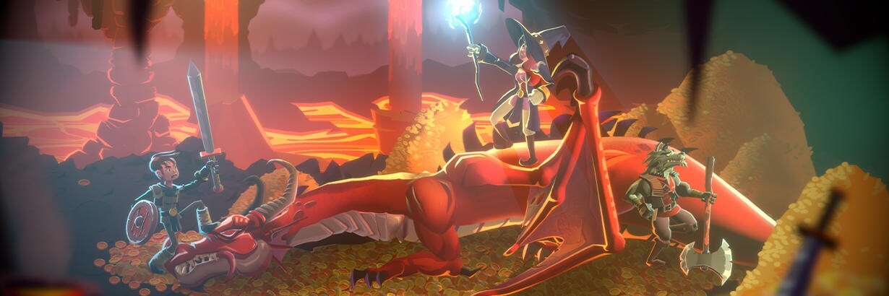
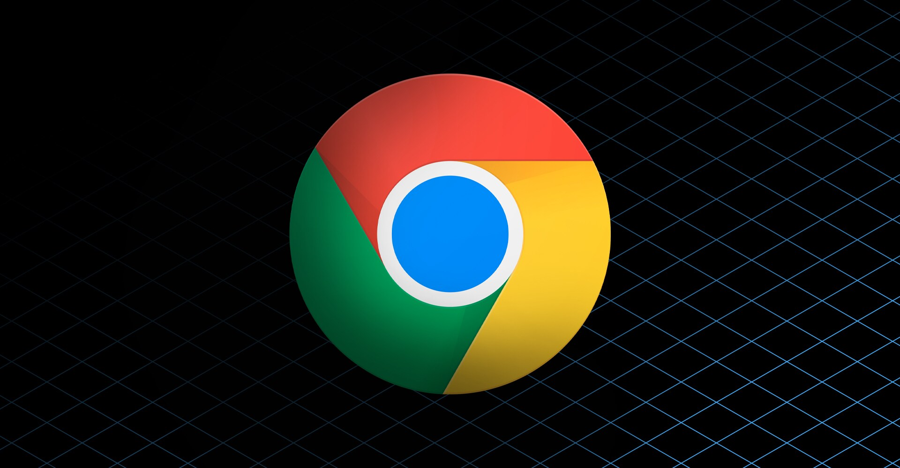
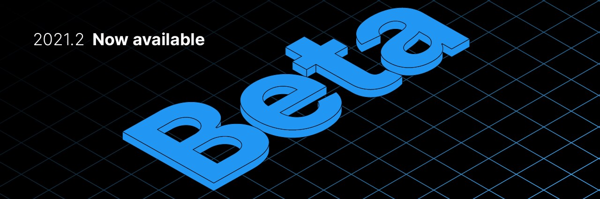
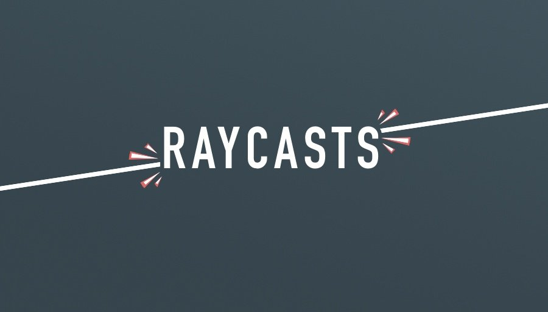

## Optimize your mobile game performance: Tips on profiling, memory, and code architecture from Unity’s top engineers 

[Optimize your mobile game performance: Tips on profiling, memory, and code architecture from Unity’s top engineers | Unity Blog](https://blog.unity.com/technology/optimize-your-mobile-game-performance-tips-on-profiling-memory-and-code-architecture)

- この記事は、モバイル開発（iOSとAndroid）でパフォーマンスを最適化するための方法を紹介しています。
- Profilerを用いてどのようにボトルネックを検出するか、メモリのプロファイリング方法と最適化、スクリプティングやUI、グラフィックスなどのそれぞれのセクションにおける最適化方法を広く説明しています。
- 完全な情報は[eBook](https://create.unity3d.com/optimize-mobile-game-eBook)で公開されています。

## Unity で URP 向けのファーシェーダを書いてみた 

[Unity で URP 向けのファーシェーダを書いてみた - 凹みTips](https://tips.hecomi.com/entry/2021/06/27/185835)

- この記事では、ファーシェーダーをUniversal Render Pipeline（UPR）で実装する方法について紹介しています。
- ファーを描画するための手法の比較から、ジオメトリシェーダーを用いた1Passでの実装、風や重力による毛の揺れ、影およびLit相当のライティング対応、法線マップを用いた法線計算、リムライトなどについてそれぞれ説明しています。

## Chrome OS 向けビルドおよび移植機能

[Chrome OS 向けビルドおよび移植機能 | Unity Blog](https://blog.unity.com/ja/technology/build-and-port-for-chrome-os)

- この記事では、Unity2021.2から利用できるChrome OS向けのアプリビルド機能について紹介しています。
- Unity2021.2以降でChrome OS向けのビルドが行なえます。この機能は今年の後半には2021.1および2020 LTSにも追加されます。Unityではx86とx64、Armで動作するChrome OSをサポートします。
- Androidアプリケーションの中にChrome OS向けの機能も追加できるようになります。そのため、プラットフォームにAndroidを選択して、プレイヤー設定でChrome OS向けビルドを行うかどうかを選択することで、Chrome OS向けのビルドを行えるようになります。
- 入力はプレイヤー設定の「Chrome OS Input Emulation」を設定すると基本Androidの操作が引き継がれますが、新しいInput Systemを用いて独自の入力制御もプログラミングできます。また、ウインドウ管理はフリーフォームモードとフルスクリーンモード、分割画面モードをサポートします（現在はピクチャー・イン・ピクチャー機能をサポートしていません）

## Unity 2021.2 ベータ版公開

[Unity 2021.2 ベータ版公開。フィードバック募集中です | Unity Blog](https://blog.unity.com/ja/technology/unity-20212-beta-is-available-for-feedback)

- この記事では、2021.2ベータ版の公開についての告知と、2021.2で追加された機能について紹介されています。
- ベータ版では3000を超えるバグフィックスと720を超える新機能と変更点が盛り込まれています。この記事では、主要な新機能や改善がスクリーンショットつきでまとめられています。

## Raycasts in Unity, made easy 

[Raycasts in Unity, made easy - Game Dev Beginner](https://gamedevbeginner.com/raycasts-in-unity-made-easy)

- この記事では、Unityでレイキャストを利用するための方法について網羅的に説明しています。
- レイキャスト機能の説明からRaycastメソッドの使い方、レイヤーマスクの設定方法、複数オブジェクトへのレイキャストやNon-Allocなレイキャストの利用方法、レイキャストの利用タイミングについてそれぞれ詳細に解説されています。

