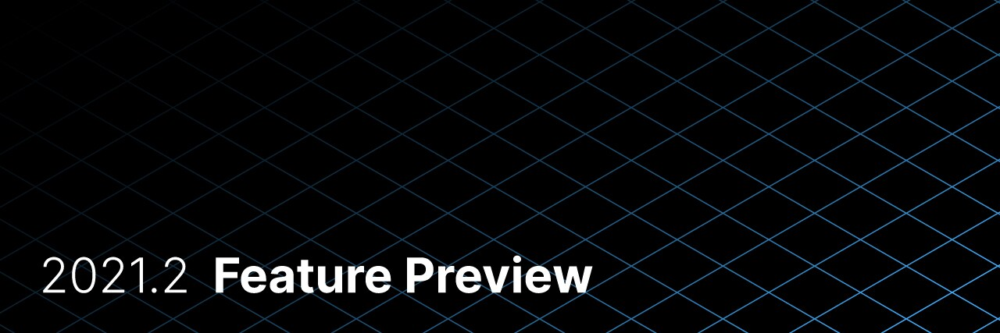
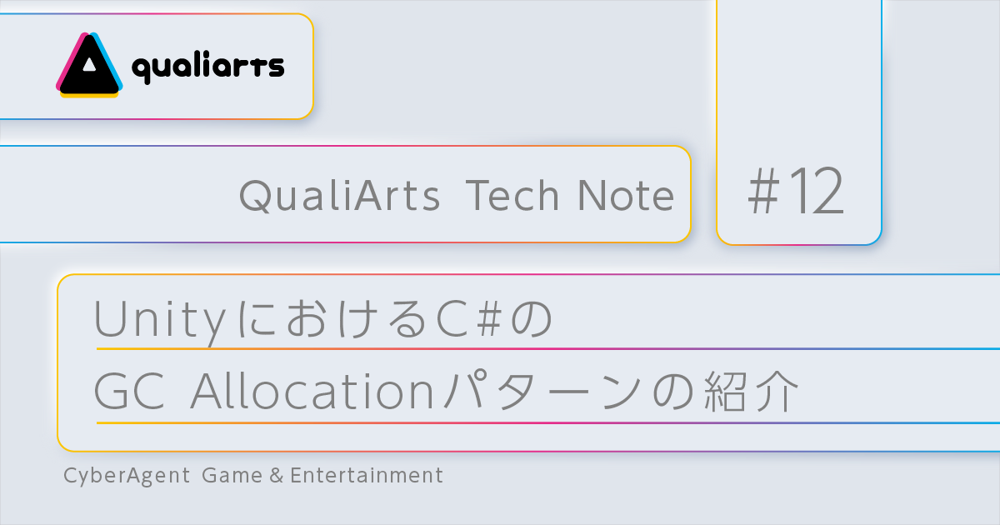
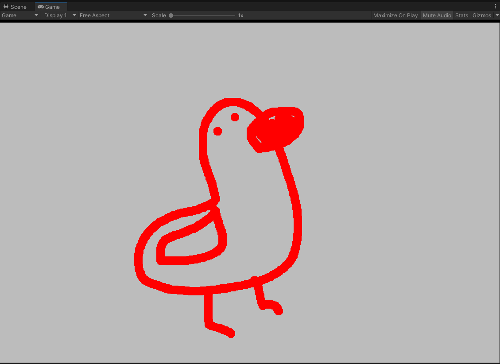
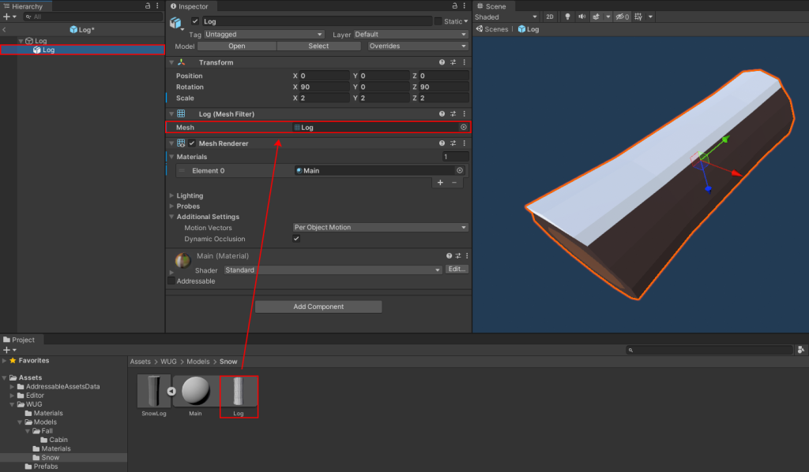

## UI Toolkit の新機能紹介  

[UI Toolkit の新機能紹介 | Unity Blog](https://blog.unity.com/ja/technology/whats-new-in-ui-toolkit)

- この記事ではUnity2021.2でのUI Toolkitのランタイムサポートについて紹介しています。UI Toolkitは2019.1にUI Elementsとして、エディターUIの実装のために開発されましたが、2021.2でランタイムUIのオーサリングをサポートしたため、ゲーム内UIの開発の開発も可能になりました。
- TextMeshProのサポート、UIのトランジションアニメーションの実装、uGUIとの共存、テクスチャレスUIについてそれぞれ説明しています。

## UnityにおけるC#のGC Allocation（ヒープメモリ確保）パターンの紹介

[UnityにおけるC#のGC Allocation（ヒープメモリ確保）パターンの紹介 | CyberAgent](https://creator.game.cyberagent.co.jp/?p=8645)

- この記事ではUnityでGC Allocation（ヒープ領域へのメモリ確保）が行われるパターンについて紹介しています。
- リストのキャパシティ指定、IListにおけるForeachでのBoxing、クロージャー、Unityのプロパティなど、それぞれのパターンでGC　Allocationについて説明しています。

## A Simple GPU-based Drawing App in Unity

[A Simple GPU-based Drawing App in Unity – Bronson Zgeb](https://bronsonzgeb.com/index.php/2021/07/03/a-simple-gpu-based-drawing-app-in-unity/)

- この記事ではCompute Shaderを用いてGPUベースなお絵かきアプリケーションをUnityで実装する方法について紹介しています。
- 毎フレームマウスの入力情報を渡してCompute Shader内で描画情報を更新します。描画結果はレンダーテクスチャを`RWTexture2D`としてCompulte Shaderを渡し、テクスチャに書き込みます。
- 基本的な描画操作からブラシサイズ、マウスの移動が大きい場合の補完実装まで説明しています。

## Stream content from a remote catalog with Addressables

[Stream content from a remote catalog with Addressables - GameDev Resources](https://gamedev-resources.com/stream-content-from-a-remote-catalog-with-addressables/)

- この記事ではAddressablesでCloud Content Delivery（CCD）にホストされているリモートカタログを読み取り、ストリーミングされているアセットを切り替える方法を紹介します。
- CCDへのプロジェクトの作成方法からCCDへのバケット作成、差し替えアセットをリモートカタログからストリーミングダウンロードする設定への変更方法、コンテンツアップロード、アセットの切り替え方法について説明しています。

## Data-Oriented Design (Or Why You Might Be Shooting Yourself in The Foot With OOP)

[Data-Oriented Design (Or Why You Might Be Shooting Yourself in The Foot With OOP) – Games from Within](https://gamesfromwithin.com/data-oriented-design)

- この記事ではデータ指向設計（Data-Oriented Design）についてその利点と欠点、データ指向設計の適用方法について紹介しています。
- データ指向設計はオブジェクト指向設計と比べると、並列化やキャッシュヒット率、モジュール性やテストのしやすさの観点からパフォーマンスが優れていることを説明しています。
- データ指向設計を適用するために、システムの必要なデータ入力やシステムが生成するデータの種類を明確にすること。またそのデータの特性（読み込みか書き込みか両方か）やデータの利用プロセスに着目することでキャッシュ率を向上させたり並列化、ベクトル演算の適用が可能になることを述べています。
