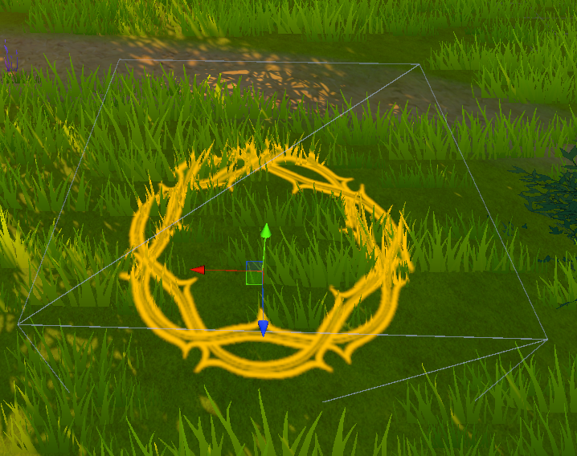

## Unity 2021.2 Feature Preview

[Unity のワークフロー高速化の舞台裏 | Unity Blog](https://blog.unity.com/ja/technology/behind-the-scenes-speeding-up-unity-workflows)
[パッケージマネージャーの柔軟な機能セットを活用して必要なツールを見つけよう | Unity Blog](https://blog.unity.com/ja/technology/discover-the-tools-you-need-with-flexible-feature-sets-in-package-manager)

- この記事ではUnity 2021.2で導入された、ワークフローの高速化とパッケージマネジャーの機能セットについて紹介しています。
- [Unity のワークフロー高速化の舞台裏](https://blog.unity.com/ja/technology/behind-the-scenes-speeding-up-unity-workflows)では、2021.2で以前のバージョンから改善されたワークフローのうち、エディターの起動速度最適化、モデルやテクスチャインポートの高速化、大規模なヒエラルキー構造下でのエディター操作の高速化、IL2CPPの高速化、アセットバンドル読み込みのメモリ効率化について説明しています。
- [パッケージマネージャーの柔軟な機能セットを活用して必要なツールを見つけよう](https://blog.unity.com/ja/technology/discover-the-tools-you-need-with-flexible-feature-sets-in-package-manager)ではパッケージマネジャーで新たに導入された、機能を実現するために複数の設定済みパッケージをまとめ、そのセットをインストールできるようにした機能セット（Feature sets）について紹介しています。

## Noise Variants

[Noise Variants](https://catlikecoding.com/unity/tutorials/pseudorandom-noise/noise-variants/)

- この記事はCatlike Codingさんの[Pseudorandom Noise](https://catlikecoding.com/unity/tutorials/pseudorandom-noise/)の第5回目のチュートリアルです。
- 複数のオクターブのノイズを組み合わせてフラクタルパターンを作成する方法、パーリンノイズとバリューノイズにTurbulenceオプションを追加する方法、タイルノイズの実装についてそれぞれ解説しています。

## How Does the StringBuilder Work in .NET?

[How Does the StringBuilder Work in .NET? (Part 1) - Steve Gordon - Code with Steve](https://www.stevejgordon.co.uk/how-does-the-stringbuilder-work-in-dotnet-part-1)
[How Does the StringBuilder Work in .NET? (Part 2) - Steve Gordon - Code with Steve](https://www.stevejgordon.co.uk/how-does-the-stringbuilder-work-in-dotnet-part-2)

- この記事では、.NETのStringBuilderがどのように動作するか紹介しています。
- パート1ではstringの結合とStringBuilderによる文字列の結合の効率について、実際にプロファイリングを取りながら説明しています。
- パート2ではパート1のStringBuilderのプロファイリング結果の解説を、StringBuilderの内部構造を踏まえて解説しています。

## CA.unity #2

[CA.unity #2 - Unity Meetup](https://meetup.unity3d.jp/jp/events/1307)

- CA.unityの第2回目がオンラインで開催されました
- 資料や配信内容は、後日一部の発表のみ[Unity Learning Materials](https://learning.unity3d.jp/)にて公開される予定とのことです。

## Mesh Deformation in Unity

[Mesh Deformation in Unity – Bronson Zgeb](https://bronsonzgeb.com/index.php/2021/07/10/mesh-deformation-in-unity/)

- この記事では頂点シェーダーでメッシュを変形する方法について紹介しています。
- メッシュの変形については[こちらのGDCのトーク](https://www.youtube.com/watch?v=c7HBxBfCsas)を参考に、この実装を頂点シェーダーで行っています。
- 頂点を操作することで影響する法線の向きを正しい向きに修正する方法と、マウスによる操作の実装方法についても合わせて説明しています。

## Array iteration performance in Csharp

[Array iteration performance in C# — Branching and parallelization | by Antão Almada | Jun, 2021 | Medium](https://antao-almada.medium.com/array-iteration-performance-in-c-branching-and-parallelization-d0705adbf425)

- この記事では、C#の繰り返しのパフォーマンスのうち、とくに分岐予測と並列化について解説しています。
- 繰り返し中にifによる分岐を取り除くことで分岐予測を効率よく行い、パフォーマンスの向上ができることを示しています。
- sum関数をSIMD命令が有効になるように書き直すことで、もとのsum関数よりも高速に動作することを示しています。

## Coloring Raymarched Volumetric Light as it passes through Stained Glass

[Coloring Raymarched Volumetric Light as it passes through Stained Glass | by Valerio Marty | Jul, 2021 | Medium](https://valeriomarty.medium.com/coloring-raymarched-volumetric-light-as-it-passes-through-stained-glass-a19846def1cd)

- この記事では、ステンドグラスを通過する際色付きのVolumetric Lightをレイマーチで実装する方法について紹介しています。

## ZipでUnityのexeファイルを配るの止めたい。InnoSetupを使おう 

[ZipでUnityのexeファイルを配るの止めたい。InnoSetupを使おう - Qiita](https://qiita.com/neon-izm/items/d200838cbb7875dde621)

- この記事では、Unityで作成したWindowsのexeのインストーラーを簡単に作成できるInnoSetupというツールと、その利用方法について紹介しています。
- 設定をGUIで行いexeファイルを指定するだけで、Program Filesにアプリケーションを配置するインストーラーが作成できます。VSCodeのインストーラーもInno Setupで作成されているようです。

## Unlit Dynamic Decals/Projection 

[Unlit Dynamic Decals/Projection | Ronja's tutorials](https://www.ronja-tutorials.com/post/054-unlit-dynamic-decals/?utm_source=pocket_mylist)

- この記事では、Unlitなデカールを実装する方法について紹介しています。
- デカールの実装はのテクスチャの参照をフラグメントシェーダー内で、デプスバッファーによる深度とカメラからオブジェクトへのベクトルをもとにオブジェクトのワールド座標を再構築して、その値をもとにテクスチャのuv値を計算しています。
- 上記のワールド座標の再構築の際に利用する深度は、そのままカメラからの距離を表しているわけではないため画面端ではズレるので、カメラの向きとカメラからオブジェクトへの向きの内積をもとに補正する方法も説明してます。

## Optimizing performance of Unity games

[Optimizing performance of Unity games - M2H](https://www.m2h.nl/optimizing-performance-of-unity-games/)

- この記事では、Unityで作成したゲームのパフォーマンスを最適化するときのよくある間違いから最適化のための計画、CPUやGPUのボトルネックやスパイクなどのそれぞれの項目のために何を最適化するべきかなどについて解説しています。
- 最適化を計画する上で最も弱いプラットフォームをベースラインにすること、プロファイリングを簡単に行えるように準備すること、最適化時に見るべき箇所、[Profile Analyzer](https://docs.unity3d.com/Packages/com.unity.performance.profile-analyzer@1.1/manual/index.html)などを用いてパフォーマンスをドキュメント化することなどの重要性を説明しています。
- 最適化の際にボトルネックになりやすい典型や、それらに対して有効な手法についていくつの例を紹介しています。

## Start Profiting From Texture Compression in Unity 

[Start Profiting From Texture Compression in Unity | The Gamedev Guru](https://thegamedev.guru/unity-gpu-performance/texture-compression-and-formats/)

- この記事では、Unityにおけるテクスチャ圧縮の必要性について説明しています。
- そもそもなぜテクスチャを圧縮する必要があるのか、適切なテクスチャフォーマットを選択する必要があるのかを解説しています。
- Unityにおけるテクスチャ圧縮のための設定項目とその説明、テクスチャフォーマットなどを選択する際に考慮する観点を説明しています。

## Introduction to Unity 2D 

[Introduction to Unity 2D | raywenderlich.com](https://www.raywenderlich.com/11409307-introduction-to-unity-2d)

- この記事は、1つのゲーム制作を題材にUnity 2Dの設定から利用方法までを解説するチュートリアルです。
- 2Dプロジェクトの作成からスプライトの作成、2Dカメラの設定の説明、Physics 2Dコンポーネントを利用した衝突判定や2Dアニメーションの実装方法、スプライトとレイヤーの関係について説明しています。
