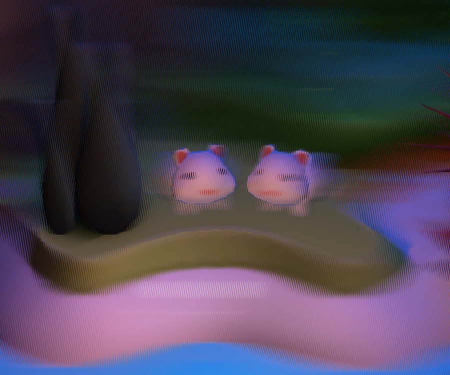
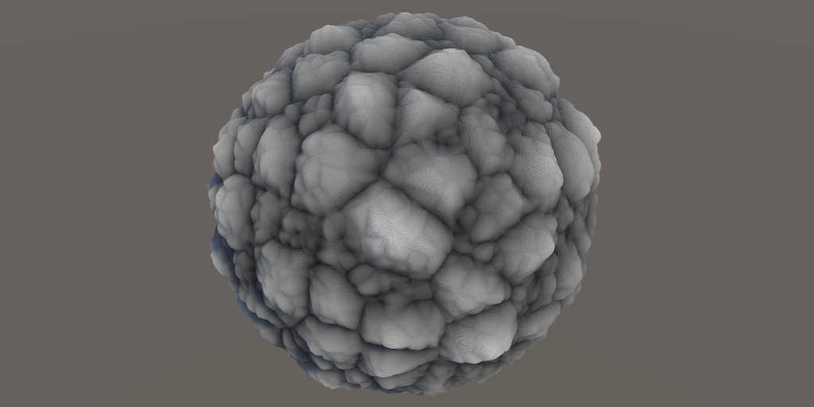
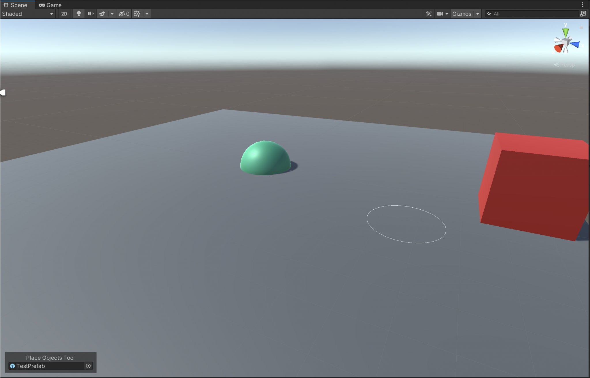
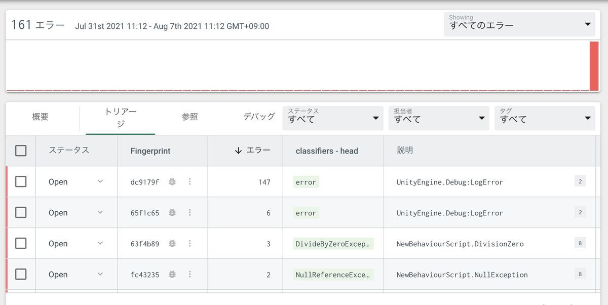
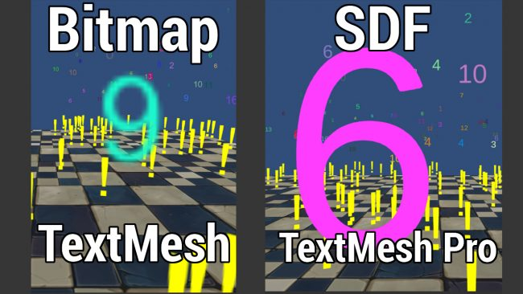
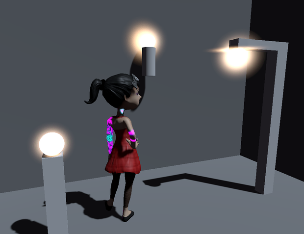

## モバイルゲームのパフォーマンスを最適化しよう：専門家が語るグラフィックスとアセットに関するヒント

[モバイルゲームのパフォーマンスを最適化しよう：専門家が語るグラフィックスとアセットに関するヒント | Unity Blog](https://blog.unity.com/ja/technology/optimize-your-mobile-game-performance-expert-tips-on-graphics-and-assets)

- この記事は、Integrated Successチームによるモバイルゲームのパフォーマンス最適化について紹介されています。この記事の内容の全容は[E-book](https://create.unity3d.com/optimize-mobile-game-eBook)で公開されています。
- Player Settingsの最適化、アセット（テクスチャ圧縮、メッシュ読み込み設定、AssetPostprocesssorによる自動化）、グラフィックスとGPU最適化について解説しています。

## Looking Glass Portrait を手に入れたので Unity 向けの仕組みを調べてみた

[Looking Glass Portrait を手に入れたので Unity 向けの仕組みを調べてみた - 凹みTips](https://tips.hecomi.com/entry/2021/08/10/012810)

- この記事では、裸眼立体視ディスプレイであるLooking Glass PortraitをUnityで利用するためのSDKの仕組みについて説明しています。
- セットアップからLooking Grassの立体視の概要（キルト画像）、SDKで提供されるコンポーネントおよびパラメータの説明、パフォーマンスについての考察についてそれぞれ解説しています。

## Voronoi Noise

[Voronoi Noise](https://catlikecoding.com/unity/tutorials/pseudorandom-noise/voronoi-noise/)

- この記事は、catlikecodingさんの[擬似ランダムノイズチュートリアル](https://catlikecoding.com/unity/tutorials/pseudorandom-noise/)の6本目の記事です。本記事ではボロノイノイズ（セルノイズ）による擬似ノイズの実装について紹介しています。
- 1Dボロノイノイズによるボロノイノイズの解説から2D・3Dへの拡張、１番目と２番目の近傍点によるボロノイ関数（F1、F2）とF2MinusF1、距離メトリック変更によるバリアントなどについてそれぞれ解説しています。

## Unity Editor Tools: The Place Objects Tool

[Unity Editor Tools: The Place Objects Tool – Bronson Zgeb](https://bronsonzgeb.com/index.php/2021/08/08/unity-editor-tools-the-place-objects-tool/)

- この記事では、エディタのGameObjectやComponentの操作を拡張するEditorTool APIで、独自のオブジェクト配置ツールを作成する方法について解説しています。
- EditorTool APIについての概要から`OnToolGUI`によるツールの定期購読の実装方法、Handles APIを用いたシーンビューでのGUI描画、シーン・エディタGUI間の座標変換についてそれぞれ説明しています。

## Unity公認のクラッシュ管理プラットフォーム Backtrace

[Unity公認のクラッシュ管理プラットフォーム Backtrace【Backtrace】【Unity】 - (:3[kanのメモ帳]](https://kan-kikuchi.hatenablog.com/entry/Backtrace?utm_source=feed)

- この記事では、Unity公認のクラッシュ管理プラットフォームであるBacktraceについて実際の利用方法を交えて紹介しています。
- Backtraceのサービス登録から導入方法、実際に例外を発生させてどのような情報が収集できるのかについてそれぞれ解説しています。

## Introduction to TextMesh Pro in Unity  

[Introduction to TextMesh Pro in Unity | raywenderlich.com](https://www.raywenderlich.com/22175776-introduction-to-textmesh-pro-in-unity)

- この記事では、UnityでTextMesh Proを利用する方法について導入から各種設定について解説しています。
- TextMesh Proがどのように動作するのか、TextMesh Pro導入から各種テキストパラメータについての紹介、フォントアセットの作成方法、マテリアルプリセットの作成および利用法についてそれぞれ説明しています。

## No Bloom? No Problem: Glowing Stuff without Post Effects 

[No Bloom? No Problem: Glowing Stuff without Post Effects | Team Dogpit on Patreon](https://www.patreon.com/posts/no-bloom-no-post-53965598)

- この記事では、ポストエフェクトなしでブルームのような輝く効果を実現する方法について紹介しています。
- 事前テクスチャ書き込みによるブルーム表現のアイデアと、ビルボードによる常に正面を向いたエフェクトの配置についてそれぞれ解説しています。
