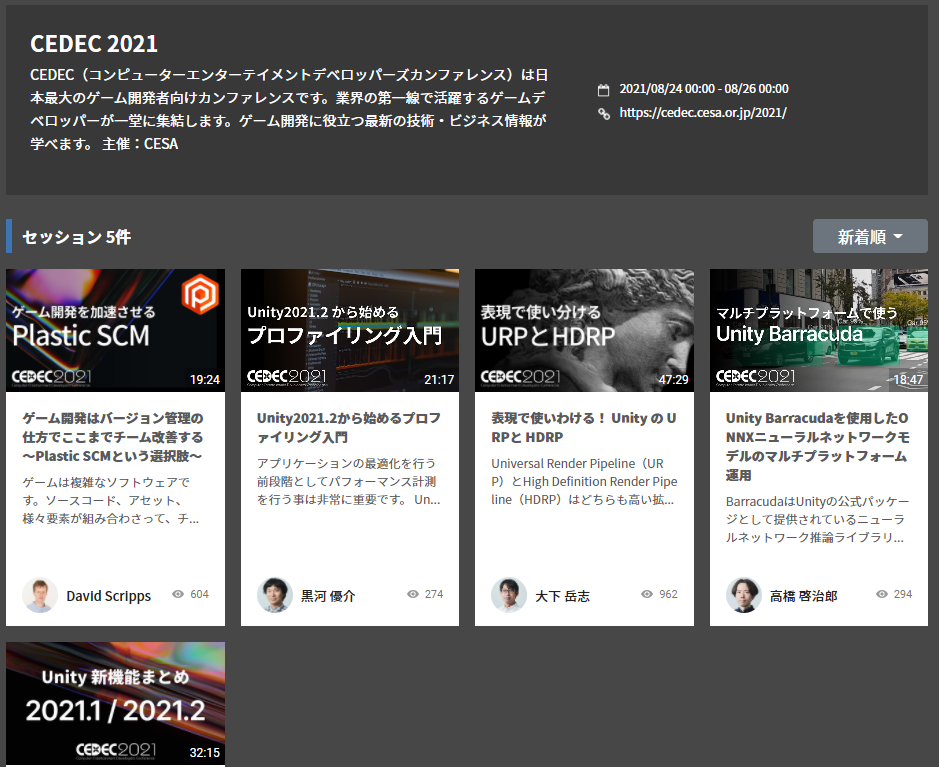

## CEDEC 2021 | Unity Learning Materials

[CEDEC 2021 | Unity Learning Materials](https://learning.unity3d.jp/event/cedec-2021/)

- 2021/08/24 ~ 8/26にオンライン開催されたCEDEC 2021で、Unity Technology Japanの発表のスライド資料および動画が、Unity Learning Materialsにて公開されています。
    - [ゲーム開発はバージョン管理の仕方でここまでチーム改善する ～Plastic SCMという選択肢～ | Unity Learning Materials](https://learning.unity3d.jp/7564/)
    - [Unity2021.2から始めるプロファイリング入門 | Unity Learning Materials](https://learning.unity3d.jp/7562/)
    - [表現で使いわける！ Unity の URPと HDRP | Unity Learning Materials](https://learning.unity3d.jp/7555/)
    - [Unity Barracudaを使用したONNXニューラルネットワークモデルのマルチプラットフォーム運用 | Unity Learning Materials](https://learning.unity3d.jp/7557/)
    - [Unity 2021 アップデートまとめ | Unity Learning Materials](https://learning.unity3d.jp/7552/)

## Unity uGUI アドバンスド・リファレンス

[heppoko/Unity_uGUI_Advance_Reference: Unity uGUI Advance Reference](https://github.com/heppoko/Unity_uGUI_Advance_Reference)

- [@heppoko](https://twitter.com/heppoko)さんによるuGUI アドバンスド・リファレンスがPDFで公開されました。
-  uGUI の基本原理を深く理解したい読者を対象に、全11章でCanvasの基本原理からレンダリング、各種コンポーネント、AutoLayout、EventSystem、プロファイリングについて詳細に解説しています。

## よりリアルなロボットシミュレーションへ。Unity 2021.2 ベータ版での物理演算の新機能

- [よりリアルなロボットシミュレーションへ。Unity 2021.2 ベータ版での物理演算の新機能 | Unity Blog](https://blog.unity.com/ja/technology/simulate-robots-with-more-realism-whats-new-in-physics-for-unity-20212-beta)

- この記事では、Unity2021.2ベータ版で追加された物理演算の新機能について紹介しています。
- ArticulationBodyのインスペクタ及びジョイントツールの改良（[参考フォーラム](https://forum.unity.com/threads/articulation-body-visualisation-gizmos.1129364)）、Physics Debugerのプレハブ対応、Physics Profilerへのメトリクス追加、パッチ摩擦の改良、接触の修正APIなどについて解説しています。

## Experimental contacts modification API - Unity Forum

[Experimental contacts modification API - Unity Forum](https://forum.unity.com/threads/experimental-contacts-modification-api.924809/)

- Unity 2021.2ベータからContacts Modification APIが利用できるようになります。これによりnarrow-phase内でのコリジョンの接触情報をコンストレイント制約を解く直前に修正できるようになります。
- APIの概要は[こちら](https://docs.google.com/document/d/1lyvZ_Epm7W5iQSuLkF0kHKsHNshKDoyp4U73JO8Zt1M/edit)から確認できます。

## Unityをはじめるアーティストにおすすめの機能ガイド

[Unityをはじめるアーティストにおすすめの機能ガイド | Unity for Pro](https://forpro.unity3d.jp/unity_pro_tips/2021/08/19/2347/)

- この記事では、Unityに内包されている機能やパッケージのうち、特にアーティスト向けの機能についてその概要や参考となるUnity公式の資料（blogやUnity for Pro、Unity Learning Materialなど）、解説動画を紹介しています。

## Mirrativ×Unity as a Library 活用事例と開発テクニック

[Mirrativ×Unity as a Library 活用事例と開発テクニック - Mirrativ tech blog](https://tech.mirrativ.stream/entry/2021/08/24/191503)

- この記事では、ライブ配信サービス「Mirrativ」におけるUaaL（Unity as a Library）の活用事例を紹介しています。
- サーバー通信やUI部分はSwiftやKotlinでネイティブ実装し、3Dアバターなど3D描画部分やミニゲーム機能をUaaLとして実装しています。
- ネイティブとUnity間の通信方法と、UaaLでの開発の難しさや課題、開発を効率よく行うための動作確認ツールの実装についてそれぞれ解説しています。

## PlayStation®5 の次世代機ならではのパフォーマンスで、臨場感あふれる『原神』の世界を体験しよう

[PlayStation®5 の次世代機ならではのパフォーマンスで、臨場感あふれる『原神』の世界を体験しよう | Unity Blog](https://blog.unity.com/ja/games/explore-the-immersive-world-of-genshin-impact-with-next-gen-performance-on-playstationr5)

- この記事は、『原神』のテクニカルディレクターである Zhenzhong Yi 氏へのインタビューの内容のうち、特にPS5に関する内容をまとめています。
- PS5版「原神」のコンテンツのアップグレードやグラフィックパイプライン、独自のファイル読み込みシステムなどについて触れています。

## #unitytips で生産性を上げ、仕事を半分に減らそう

[#unitytips で生産性を上げ、仕事を半分に減らそう | Unity Blog](https://blog.unity.com/ja/community/unity-tips-for-productivity)

- この記事は、[Twitterで #unitytips タグをつけて共有されたもの](https://twitter.com/search?q=%23unitytips&src=typed_query)から特に良いものをまとめています。

## 新公開の「Photo Mode」デモでゲーム内での写真撮影システムについて学ぼう

[新公開の「Photo Mode」デモでゲーム内での写真撮影システムについて学ぼう | Unity Blog](https://blog.unity.com/ja/games/exploring-in-game-photography-with-the-new-photo-mode-demo)

- この記事では、ゲーム内で写真撮影のオプションを追加する方法を学ぶためのパッケージ「[Photo Mode](https://github.com/UnityTechnologies/PhotoMode)」について紹介しています。
- Photo Modeがどのようなしくみで動作しているのか、UIや入力やカメラ、ポストプロセスボリューム、シェーダーグラフ、カスタムスティッカーシステムなどそれぞれ簡単に説明しています。
