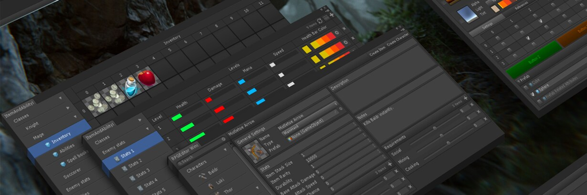
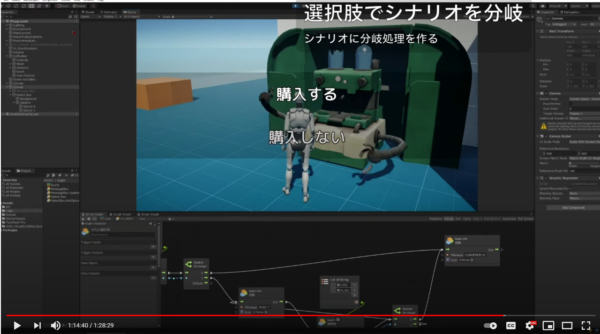
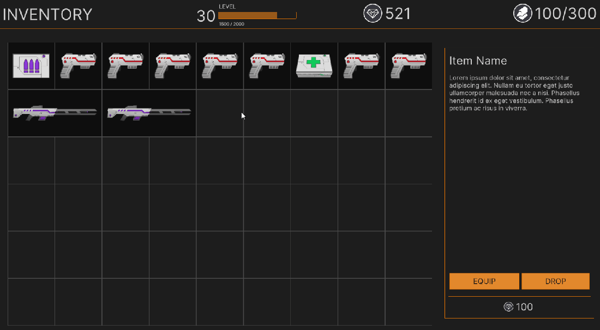

## Unity Blog

### ツールを作るためのツール：Odin で生産性を向上させるためのヒント

[ツールを作るためのツール：Odin で生産性を向上させるためのヒント | Unity Blog](https://blog.unity.com/ja/games/productivity-tips-with-odin-a-tool-for-making-tools)

この記事では、インスペクター＆シリアライザーの拡張アセットである[Odin](https://assetstore.unity.com/packages/tools/utilities/odin-inspector-and-serializer-89041)の利用方法のヒントを5つ紹介しています。

- Odin Inspectorに搭載されているグループ属性を用いて、文字列ベースでインスペクター上の変数を整理できます。
- 属性の多くでメンバーを便利に参照したり、評価の対象となるC#式を含む文字列パラメーターを含めることができます。これによりOdinの属性に簡単にカスタムロジックや動作を追加できます。
- [ChildGameObjectsOnly](https://odininspector.com/attributes/child-game-objects-only-attribute)や[ValidateInput](https://odininspector.com/attributes/validate-input-attribute)、[Required](https://odininspector.com/attributes/required-attribute)属性などを用いてデータの検証を行うことができます。また、カスタムのグローバル検証ルールをOdin Inspectorに導入することもできます。
- `OdinEditorWindow`や`OdinMenuEditorWindow`を用いると、編集したいプロパティや呼び出したいメソッドにOdinの属性をつけるだけでエディタGUIのコードを書くことなくエディタGUIをレンダリングできます。
- Odin Serializerを用いて、辞書やポリモーフィックなデータ構造をシリアライズできます。
- 年内にOdin Validatorのメジャーアップデートを含む新機能をリリース予定です。個人向けのパッケージは[Asset Store](https://assetstore.unity.com/packages/tools/utilities/odin-inspector-and-serializer-89041)から、またエンタープライズ・ソリューションも合わせて[用意されています](https://unity.com/ja/products/odin)。[YouTubeのビデオ](https://www.youtube.com/channel/UCWpLqoOZdE5ZWZNonkBd9eA/featured)では、Odinの利用方法のヒントを確認できます。

### 正式発表：Parsec が Unity ファミリーの一員になりました

[正式発表：Parsec が Unity ファミリーの一員になりました | Unity Blog](https://blog.unity.com/ja/news/parsec-is-now-part-of-unity)

この記事ではPersecがUnityファミリーの一員に参加したことを紹介しています。Parsecは超低遅延・60fps・HD品質の解像度でのストリーミングを強みにしたリモートデスクトップサービスです。

## Unity Videos

### Unityで始めるバーチャルプロダクション

[Unityで始めるバーチャルプロダクション - Unityステーション - YouTube](https://www.youtube.com/watch?v=Fygh7stEafU&t=690s)

現在開発中の[Live Captureパッケージ](https://docs.unity3d.com/Packages/com.unity.live-capture@1.0/manual/index.html)とVirtual Cameraアプリを用いてリアルタイムに映像制作（バーチャルプロダクション）を行う方法について紹介しています。

- Live CaptureパッケージとVirtual Cameraアプリの導入方法、基本的な操作方法、Unityエディタと連携して映像を制作する方法について解説しています。
- [スライド資料](https://www.slideshare.net/UnityTechnologiesJapan/unitystation210909)および[セットアップ資料](https://drive.google.com/file/d/1S9wjz9q4TJIBxoOGUswUn6Tqy2rijOzw/view)も合わせて公開されています。

### UnityグラフィックスAPI総点検！切り抜き版

- [UnityグラフィックスAPI総点検！切り抜き版（前編） - YouTube](https://www.youtube.com/watch?v=FvjfoigAGGc&t=11s)
- [UnityグラフィックスAPI総点検！切り抜き版（後編） - YouTube](https://www.youtube.com/watch?v=n5M5BFg-FhY)

8/31のUnity ステーションで公開された「[グラフィックス API 総点検](https://www.youtube.com/watch?v=7tjycAEMJNg)」のダイジェスト版です。

- 配信のうち、APIの紹介部分をピックアップして編集されています。元動画が約90分に対して前後編合わせて20分程度にまとめられているため、要点をサクッと抑えたい方は切り抜きを見ると良いでしょう。
- [Unity Weekly #030にもまとめています](https://blog.yucchiy.com/project/unity-weekly/030/#unity%E3%82%B0%E3%83%A9%E3%83%95%E3%82%A3%E3%83%83%E3%82%AF%E3%82%B9api%E7%B7%8F%E7%82%B9%E6%A4%9C%EF%BC%81%E3%80%9C%E6%9C%80%E8%BF%91%E3%81%93%E3%82%93%E3%81%AA%E3%81%AE%E5%A2%97%E3%81%88%E3%81%A6%E3%81%BE%E3%81%97%E3%81%9F%E3%80%9C%EF%BC%88youtube%EF%BC%89)ので興味があれば参照ください。

### UnityのVisual Scripting (旧:Bolt) で会話イベントを作ってみる

[UnityのVisual Scripting (旧:Bolt) で会話イベントを作ってみる - Unityステーション - YouTube](https://www.youtube.com/watch?v=F5_T6URcPIM)

UnityのVisual Scriptingで分岐付きの会話イベントのようなギミックを実装する方法について紹介しています。

- [StarterAssets](https://www.youtube.com/watch?v=PzykP8NENvk)を拡張して、プレイヤーがNPCに近づいたらアイコンを表示し、選択すると2Dテキスト表示による分岐付きの会話イベントが始まるようなギミックをVisual Scriptingでライブコーディングで実装しています。
- コリジョンイベントによるステートマシンの遷移、新Input Systemによるボタン入力の受け取り方、会話ウインドウUIとVisual Scriptingの連携、制御の分岐、マウスカーソルのロック解除、イベント実行とシナリオ管理の分離方法についてそれぞれ説明しています。
- 作成したプロジェクトは[こちら](https://github.com/tsubaki/Unity_DialogSample)で公開されています。

## Articles

### #unity インポートしたキャラモデルにモーションを流したら関節がくにゃった時の対処法（補助ボーンとRotation Constraintコンポーネントの話）

[#unity インポートしたキャラモデルにモーションを流したら関節がくにゃった時の対処法（補助ボーンとRotation Constraintコンポーネントの話） - 土屋つかさの技術ブログは今か無しか](https://someiyoshino.info/entry/2021/09/04/194356)

UnityにfbxなどをHumanoidとしてインポートした際に、補助ボーンがある場合に描画がおかしくなる不具合と、それをRotation Constratintコンポーネントによって対処する方法について紹介しています。

### Unityのビルドサイズを小さくするには

[Unityのビルドサイズを小さくするには - フレームシンセシス](https://framesynthesis.jp/tech/unity/buildsize/)

主にWebGL向けのUnityアプリケーションのビルドサイズを小さくするTipsを紹介しています。Build Report Inspectorパッケージによるビルド内容の解析、テクスチャ圧縮設定、WebGLビルド最適化のための各種設定についてそれぞれ説明しています。

### OpenCV for Unityで画像変換する備忘録

[OpenCV for Unityで画像変換する備忘録 - e.blog](https://edom18.hateblo.jp/entry/2021/09/19/181110)

OpenCV for Unityを用いてUnityで画像変換をする方法を紹介しています。

- `CvType`や`Mat`、`OpenCVForUnity.UnityUtils`などの画像変換で利用するための基本的なクラスの紹介
- Unityの`Texture2D`とOpenCVの`Mat`を相互変換する方法と`WebCamTexture`を`Mat`に変換する方法
- グレースケールや2値化、ブラーやSobelフィルター、ガウシアンブラーなどの画像変換
- 射影変換や輪郭検出、輪郭近似から抽出した輪郭を切り抜く方法

### Enemy AI in Unity Games with ML-Agents Toolkit

[Enemy AI in Unity Games with ML-Agents Toolkit - Pav Creations](https://pavcreations.com/enemy-ai-in-unity-games-with-ml-agents-toolkit/)

敵AIの行動ロジックをML-Agentsで訓練して作成する方法について紹介しています。ML-Agentsの概要からツールのセットアップ方法、敵AIを訓練するための環境の用意と`Agent`の実装、実装したエージェントを用いた実際の訓練方法を説明しています。

### Code the grid based inventory system

[Code the grid based inventory system - GameDev Resources](https://gamedev-resources.com/code-the-grid-based-inventory-system-grid-series-part-2/)

- [前回の記事](https://gamedev-resources.com/create-a-spatial-inventory-with-ui-toolkit-part-1/)でUI Toolkitを用いたランタイムで動作するグリッドスタイルなインベントリをデザインする方法について解説しましたが、今回の記事では作成したデザインに対してドラッグアンドドラッグによってアイテムを移動するロジックを追加します。
- 独自の`VisualElement`の作成からマウスイベントのハンドリング方法について紹介しています。

