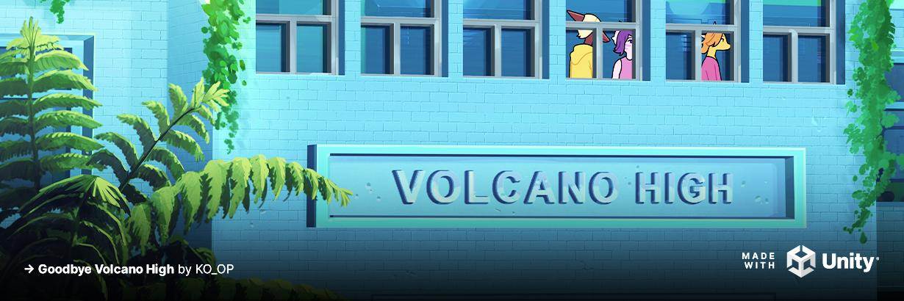
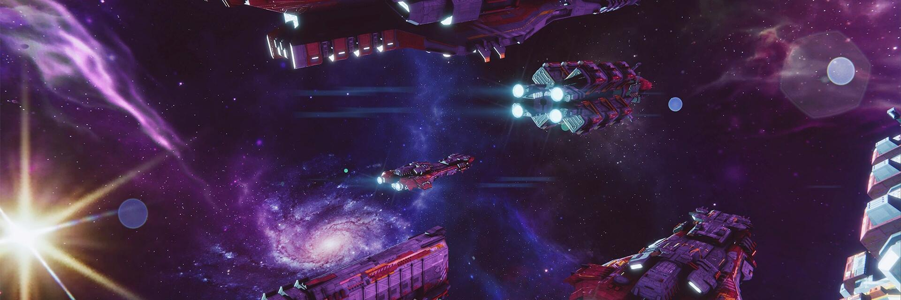
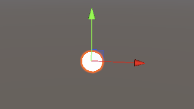
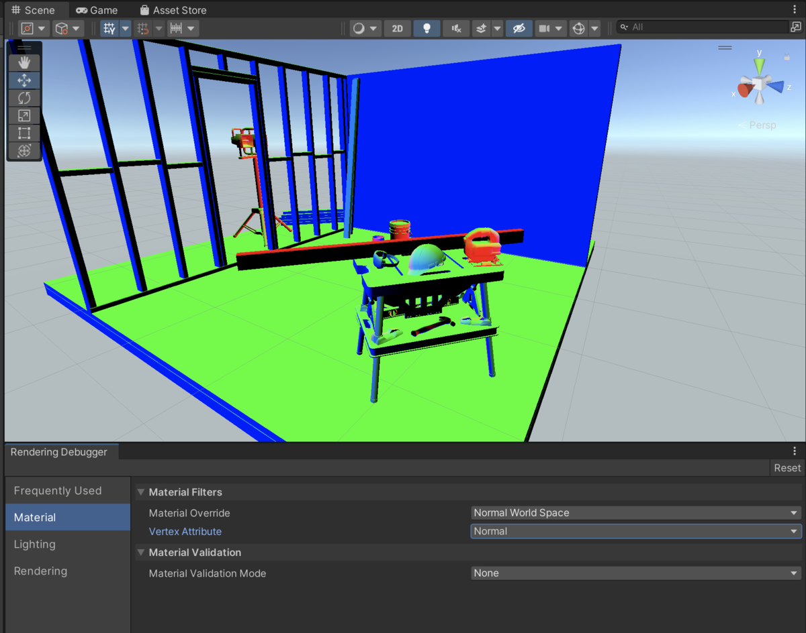
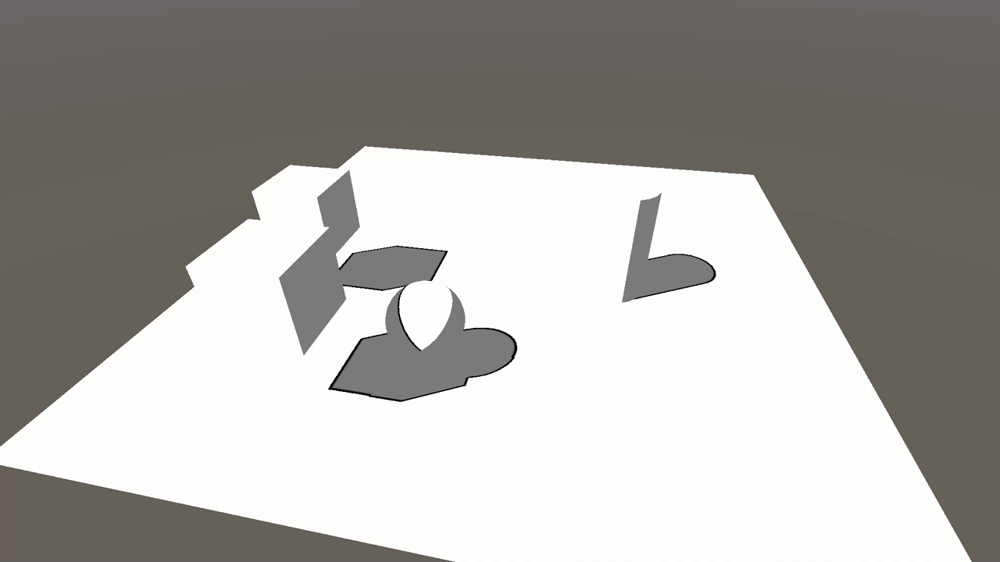
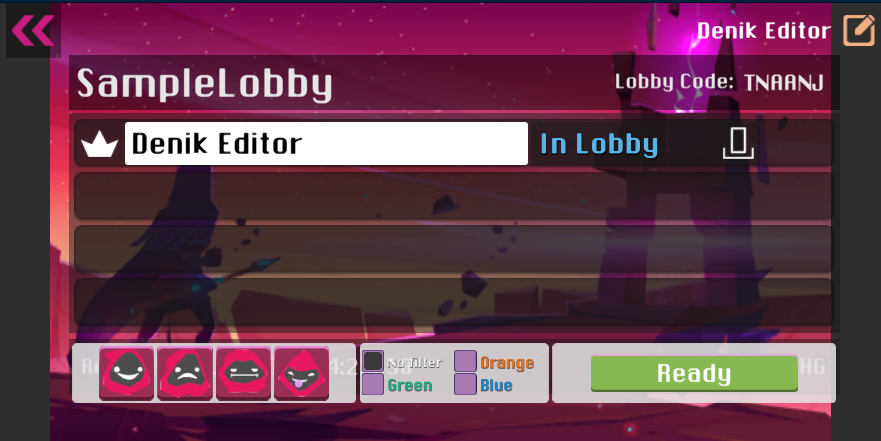
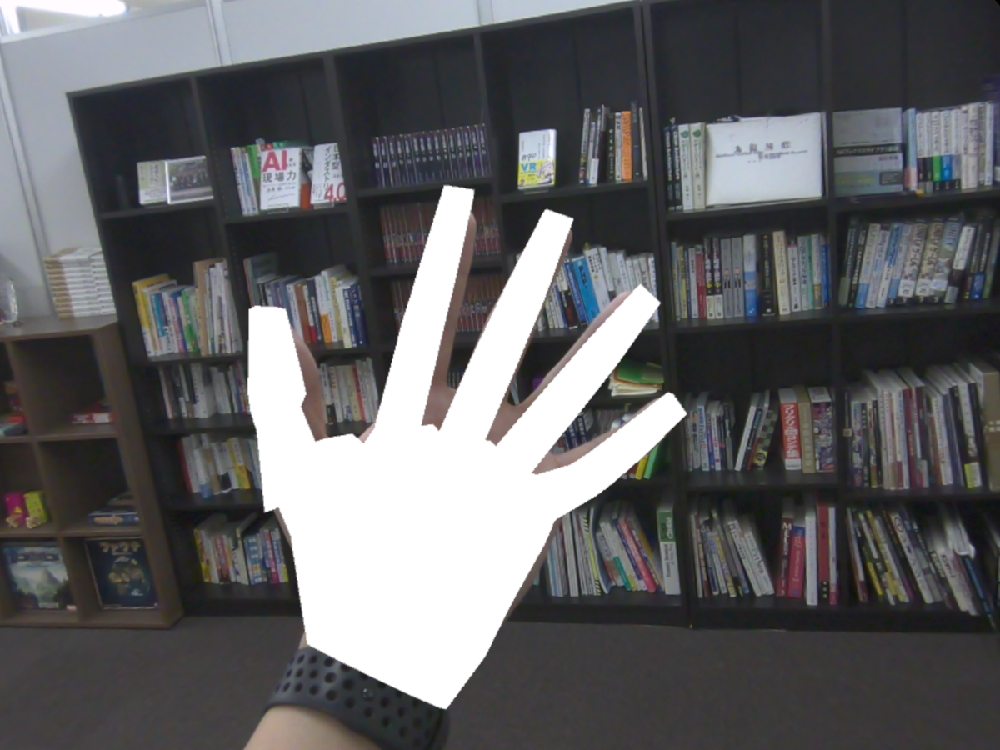
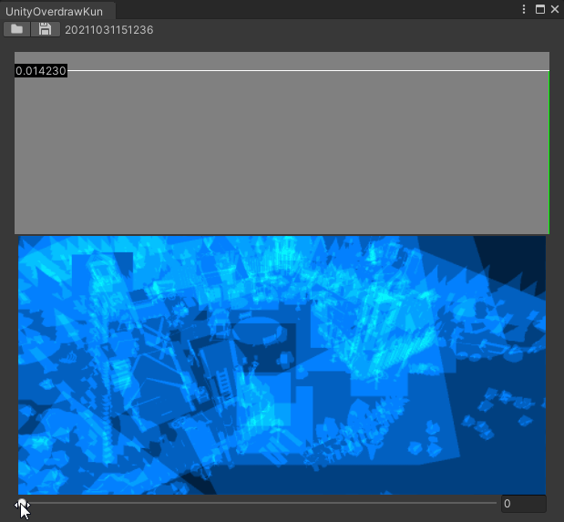

# Unity Official

## Unity 2020 LTS で注目すべきプレハブ周りの最適化

[Unity 2020 LTS で注目すべきプレハブ周りの最適化 | Unity Blog](https://blog.unity.com/ja/technology/dont-miss-the-prefab-optimizations-in-unity-2020-lts)

Unity 2020 LTSではPrefab周辺で、最適化が行われたようです。この記事では、Prefab編集のワークフロー、Nested Prefabのパフォーマンス最適化、Prefabのインポートと開発体験の向上について取り上げています。

Prefab編集については、Unity2020 LTSに[シーン文脈に基づいて編集する機能](https://docs.unity3d.com/ja/current/Manual/EditingInPrefabMode.html)が追加され、シーンを開きながらPrefab単体を編集する、などという操作を行えるようになりました。

Unity2020 LTSではNested Prefabの実装に最適化が施されたようです。この最適化により、Nested Prefabのエディタ内での読み込み速度が最大20倍高速化しているようです。

Prefabのインポート周りに改修が行われたようです。インポート処理（ `AssetPostprocessor` の `OnPostprocessPrefab` ）に変更が入り、この処理を通して追加されたオブジェクトは `HideFlags.DontSaveInEditor` フラグが立てられるようになり、元のPrefabに変更が適用されないようになりました。

また、インポート処理が強化され、MonoBehaviour を含むPrefabがスクリプトと直接同期するようになり、コンパイルエラーが発生しても参照が失われなくなったようです。

## Unity 2021.2 のアーティスト・デザイナー向け新機能

[Unity 2021.2 のアーティスト・デザイナー向け新機能 | Unity Blog](https://blog.unity.com/ja/technology/whats-new-for-artists-and-designers-in-unity-20212-0)

先日公開されたUnity 2021.2 TECH ストリームに追加されたアーティスト・デザイナー向けの新機能を紹介しています。記事ではそれぞれのアップデートを詳細に解説していますが、ここでは概要を箇条書きで紹介します。

- 2021.2ではUI Toolkitを用いて、エディタだけでなくゲームやアプリケーションのランタイムUIを実装可能に。TextMesh Pro統合により高解像度でもきれいなフォントの描画、再利用可能なUIアニメーション実装、テクスチャレスUIも利用できるようになりました。
- Unityの新しいTerrain Tools（以前取り上げた記事は[こちら](https://blog.yucchiy.com/project/unity-weekly/035/#using-the-terrain-tools-in-unity)）が2021.2のタイミングで実験的パッケージからリリース済みパッケージに移行しました。今回のリリースに際して、地形の接続、クローン、ノイズ付与、テラス作成、およびツイスト作成に新しい地形スカルプトブラシの追加、Erosion ハイトマップベースのツール（浸食、風、熱による地形変化を再現）を利用できるようになりました。
- High Definition Render Pipeline（HDPR）に、SpeedTree 8で作成したアセットを直接インポートできるようになりました。
- デカールがUniversal Render Pipeline（URP）でも利用可能になりました。また、デカール配置ツールのUXの改善、さらにHDPRには法線ブレンドオプションが追加されました。
- ライティングにも改善が行われ、EnlightenのHDPR・URP対応、Apple Slicon、PS5、Xbox Series X対応、プログレッシブGPUライトマッパーのタイリングでより大きい解像度のライトマップのベイク、URPへのライトレイヤーサポート、HDPRのScreen Space Global Illmination（SSGI）、アンビエントオクルージョンやベント法線マップ利用におけるスペキュラーオクルージョン改善、エリアライトのファブリック対応によりヘアの描画対応などが行われました。
- URPおよびHDPRにおいてレンダリングデバッガーが利用できるようになり、マテリアル、パス、レンダリングエフェクト、ボリュームのデバッグが可能になりました。
- URPおよびHDRPにおいてレンズフレアシステムが刷新されました。
- 新しいLive Captureアプリを用いることで、ARデータを活用してフェイスキャプチャやバーチャルカメラによるカメラワークの作成をおこなうことができます。
- Visual Effect Graphで様々な機能の追加・改善が行われています。
    - PCやコンソール向けにURP向けのLitパーティクルのサポート
    - URPに2D Rendererが追加。これにより3Dパーティクルと2Dを混在させるような表現が可能に
    - Visual Effect Graphをターゲットにしたシェーダーグラフのカスタムシェーダーを利用できるようになり、HDRPの新しいライティングモデルの使用や、パーティクルの頂点修正をシェーダー経由で行えるようになりました。
    - Unity上で直接SDFのベイクができるようになりました。
    - C#で大規模なデータをやり取りするためのグラフィックスバッファが利用できるようになりました。
- シェーダーグラフでは、URP でのサーフェスオプションのサポート、カスタムインターポレーター、ビルトインレンダーパイプラインをターゲットにする機能、Blackboard のカテゴリ、ビルドインパイプラインの対応が行われました。
- URPではリフレクションプローブのブレンド追加、ライトプローブにBox Projectionのサポート、ライトクッキーサポートが行われました。
- HDPRでは、新しい雲とボリューメトリックのレンダリングがサポート、ヘア描画に Marshner/Disney ベースの物理モードの追加、パフォーマンスの改善が行われました。

## 新しい e ブック：知っておきたい 2022 年以降のモバイルゲームのトレンド

[新しい e ブック：知っておきたい 2022 年以降のモバイルゲームのトレンド | Unity Blog](https://blog.unity.com/ja/games/new-e-book-the-mobile-gaming-trends-you-need-to-know-for-2022-and-beyond)

2022年とそれ以降でのモバイルゲームのトレンドについて、Unityチームが市場調査・顧客支援してきた経験をもとにまとめたe-Book「[The mobile gaming trends you need to know for 2022 and beyond](https://create.unity3d.com/mobile-gaming-trends-2022-e-book)」を公開しました。この記事ではそのe-Bookの中で主要な3つのトレンドとして、「モバイルはゲーム関連で最も成長スピードの速いセグメントである」、「スタジオはジャンル戦略と収益化のプラクティスを洗練している」、「プレイヤーはよりつながった体験を求めている」をそれぞれ紹介しています。

e-Bookには、これらを含めた合計6つのトレンドが紹介されています。

- モバイルはゲーム関連で最も成長スピードの速いセグメントである。
- プレイヤーは、すべてのデバイスで AAA 品質の体験を求めている。
- プレイヤーは、よりつながった体験を求めている。
- スタジオはジャンル戦略と収益化のプラクティスを洗練している。
- クロスプレイやスピンオフが、ブランド力の強化を推進する。
- プライバシーへの配慮が、マネタイズの戦術を複雑にしている。

e-Bookは[こちら](https://create.unity3d.com/mobile-gaming-trends-2022-e-book)からダウンロードできます。

# Articles

## カスタムRoslyn AnalyzerをUPMパッケージで配布する

[カスタムRoslyn AnalyzerをUPMパッケージで配布する - やらなイカ？](https://www.nowsprinting.com/entry/2021/11/01/083258)

Unity2020.2で利用できるようになったRoslynアナライザを、Unity Package Manager（UPM）でパッケージとして配布する方法について紹介しています。

また、RiderやVisual Studioなど各IDEのプラグインが配布されたRoslynアナライザに対応できない問題と、その解決方法して `AssetPostprocessor.OnGeneratedCSProject` をフックして、 `.csproj` 生成時にアナライザの参照を追加するスクリプトの実装についても触れています。

## [Unity]ローカライズ拡張例

[[Unity]ローカライズ拡張例 - Qiita](https://qiita.com/yuji_yasuhara/items/694c8a32e86fda871dd5)

Unity標準の[ローカライズパッケージ](https://docs.unity3d.com/Packages/com.unity.localization@1.0/manual/index.html) の変数に対して関数を適用する方法と、独自の関数を実装する方法について紹介しています。

変数の導入の仕方からカスタム関数の定義方法、カスタム関数の実装例として、摂氏華氏変換や順位表示など4つの事例を踏まえつつ解説しています。

また、ランタイムで変数の内容を変更する方法についても触れています。

## 【Unity】【URP】Cutoffシェーダのアウトラインと選択領域をSceneビューで正常に表示する

[【Unity】【URP】Cutoffシェーダのアウトラインと選択領域をSceneビューで正常に表示する - LIGHT11](https://light11.hatenadiary.com/entry/2021/11/04/195940)

この記事ではシーンビューのオブジェクト選択時のアウトラインと、オブジェクトピッキング時のオブジェクトの形状をシェーダーごとにカスタマイズする方法について紹介しています。

`SceneSelectionPass` と `Picking`というパスをシェーダーに実装することでシーンビューでの上記挙動を調整できることの紹介と、Cutoffシェーダーを題材として、そのシェーダーに対してそれぞれ `SceneSelectionPass` と `Picking` というパスを実装する方法についてそれぞれ解説しています。

## 【Unity】Unity2021.2からのScene Debug View Modes - うどんてっくメモ

[【Unity】Unity2021.2からのScene Debug View Modes - うどんてっくメモ](https://myudon.hatenablog.com/entry/2021/10/31/200428)

この記事では、先日リリースされたUnity 2021.2から利用できるScene Debug View Modesについて紹介しています。

このモードを用いてシーン上の描画物に対して、マテリアル（法線や頂点カラー表示など）やライティング（Cascade Shadowやノーマルマップの反映有無の切り替えなど）、レンダリング（シャドウマップのオーバードローやMSAAやポストプロセスの表示切り替えなど）をデバッグ表示する方法について解説しています。

## Shadow outlines tutorial

[Shadow outlines tutorial – Kelvin van Hoorn](https://kelvinvanhoorn.wordpress.com/2021/11/02/shadow-outlines-tutorial/)

上記のような、影にたいしてアウトラインを描画するシェーダーを、URPで行う方法について紹介しています。

影が描画されてないhlslシェーダーからはじめて、Unity組み込みの関数からリアルタイムシャドウを表示する方法からシャドウマップのサンプリング設定とシャドウカスケード、標準の影にランバート照明モデルの適用、エッジ検出によるアウトライン描画についてそれぞれ解説しています。

## Unity Lobby β でマルチプレイ用のロビーを作成する【Unity Gaming Services】

[Unity Lobby β でマルチプレイ用のロビーを作成する【Unity Gaming Services】 - デニッキ！](https://xrdnk.hateblo.jp/entry/2021/11/03/203105)

この記事では、先日リリースされたUnity Lobby βを用いてマルチプレイにおけるルームを用いたマッチメイクの実装を行う方法について紹介しています。

ロビーの作成・検索・更新・取得・削除などのロビーに関する一連の操作から、作成したロビーに対してプレイヤーをジョイン・リムーブする実装について、それぞれ解説しています。

## Varjo XR-3を使ってハンドトラッキングを試してみる(Ultraleap Plugin for Unity編)

[Varjo XR-3を使ってハンドトラッキングを試してみる(Ultraleap Plugin for Unity編) - Synamon’s Engineer blog](https://synamon.hatenablog.com/entry/2021/11/01/190000)

この記事ではUnityでVarjo XR-3を利用するための導入手順とパススルー機能を利用するためのAPI呼び出し、ハンドトラッキングを手動でセットアップするための設定についてそれぞれ紹介しています。

## Unity Hub の CLI (コマンドラインでの処理)の使い方

[Unity Hub の CLI (コマンドラインでの処理)の使い方 - 強火で進め](https://nakamura001.hatenablog.com/entry/2021/11/05/_Unity_Hub_%E3%81%AE_CLI_%28%E3%82%B3%E3%83%9E%E3%83%B3%E3%83%89%E3%83%A9%E3%82%A4%E3%83%B3%E3%81%A7%E3%81%AE%E5%87%A6%E7%90%86%29%E3%81%AE%E4%BD%BF%E3%81%84%E6%96%B9)

この記事では、Unity Hub 2.1以降で利用できるCLIの利用方法について紹介しています。

Unity Hub 2.4.5においてCLIでのヘルプの確認方法から実際の利用方法をWindowsとMacの2プラットフォームでそれぞれ紹介しています。

## 【Unity】Overdraw を計測して解析できる「UnityOverDrawKun」紹介

[【Unity】Overdraw を計測して解析できる「UnityOverDrawKun」紹介 - コガネブログ](https://baba-s.hatenablog.com/entry/2021/11/04/090000)

描画におけるOverdrawを可視化するためのツールである [katsumasa/UnityOverDrawKun](https://github.com/katsumasa/UnityOverDrawKun) について、導入及び利用方法について紹介しています。

## UnityTimeline関連のコードがストリップされ、正常に再生されなくなる現象

[UnityTimeline関連のコードがストリップされ、正常に再生されなくなる現象 - Qiita](https://qiita.com/KyoheiOkawa/items/0cf9cc09679eababec75)

il2cppビルドされたアプリにおいて、タイムラインアセットをアセットバンドル化したときに（ビルトインに含めないときに）タイムラインが正常に再生されなくなる問題について取り上げています。

具体的な症状としてコードストリッピングの解説と、対応のために link.xml を用いてタイムライン関連のストリッピングを防ぐ方法について取り上げています。

## Android 12 端末に Unity で Android ビルドしたアプリがインストールできない問題に対する対処

[Android 12 端末に Unity で Android ビルドしたアプリがインストールできない問題に対する対処 - デニッキ！](https://xrdnk.hateblo.jp/entry/2021/11/05/115104)

この記事では、AndroidアプリをAndroid 12端末でインストールできない問題の紹介とその対応について紹介しています。

Android 12 から要求される `AndroidManifest.xml` におけるアクティビティ定義の `android:exported` の明示と、Custom Main Manifest を用いて独自にマニフェストファイルを用いてその問題に対応する方法について解説しています。

## 【Unity】Shaderを用いて斜めHPバーを作ってみた

[【Unity】Shaderを用いて斜めHPバーを作ってみた - Qiita](https://qiita.com/Putinu/items/5c250704405bf0244385)

この記事では、斜めに傾いたHPバーの実装について紹介しています。標準のuGUIの機能（ImageのfillAmount）だけではゲージを斜めに傾けることができないので、HPバー独自のシェーダー内でアルファで斜めに切り抜く実装と、スクリプトでのHPバー増減の連携方法について解説しています。

## TextMeshPro のテキストに URL 文字列が存在する時，ハイパーリンク化する

[TextMeshPro のテキストに URL 文字列が存在する時，ハイパーリンク化する - デニッキ！](https://xrdnk.hateblo.jp/entry/2021/10/31/121518)

TextMeshProのテキスト内にURLが含まれている場合に、その文字列をウェブのハイパーリンクに変換し、クリックするとリンクを開くような実装について紹介しています。
