12/1からAdvent Calendar 2021が始まりました。こちらの記事の一覧は[Advent Calendar 2021特集 その1 - Unity Weekly #043](https://blog.yucchiy.com/project/unity-weekly/043/)にまとめていますので、興味ありましたらこちらもご一読ください。

# Official

## ようこそ、SyncSketch！

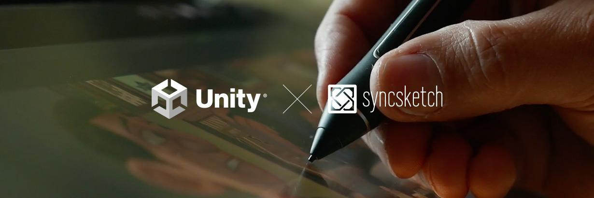

[ようこそ、SyncSketch！ | Unity Blog](https://blog.unity.com/ja/news/welcome-syncsketch)

Unityがリアルタイムコラボレーションツールの開発元である「SyncSketch」を買収しました。

SyncSketchを用いると、URLをシェアするだけでコラボレーションできるため、アーティスト間のコラボレーションを容易にします。

## Cinemachine 2.6 のもたらす精密な制御、改善されたワークフロー、それらが実現するカメラワーク

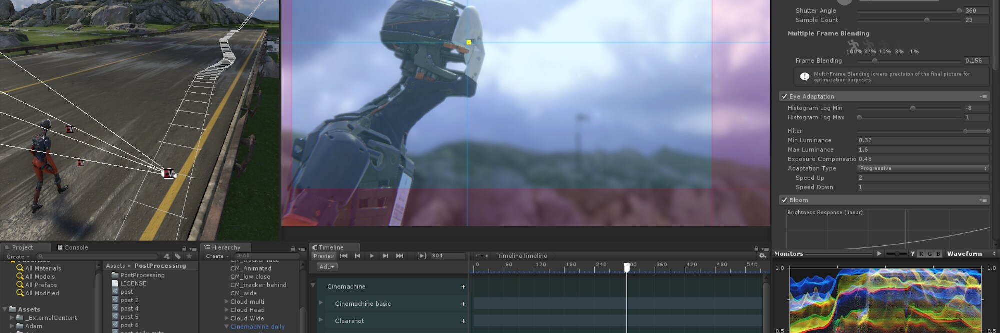

[Cinemachine 2.6 のもたらす精密な制御、改善されたワークフロー、それらが実現するカメラワーク | Unity Blog](https://blog.unity.com/ja/technology/the-magic-of-cinemachine-26-in-unity-2020-lts-unparalleled-precision-workflows-and-more)

バーチャルカメラオペレーターライブラリであるCinemachineのアップデートについて取り上げています。

Cinemachine は2.5で、社内QAやユーザーの検証によって「検証済み」パッケージとなりました。

Cinemachine 2.6で追加された機能と改善点、新しく追加されたサンプルについてそれぞれ紹介しています。

2.6では、インパルス伝播速度という機能が追加されました。Impulse Souce（外乱を発生させるソース）とImpulse Listener（外乱の影響を受ける対象）に対して速度の項目が追加されることで、タイミングを下記のように調整でき、表現のリアリティを向上させられます。

[https://blog-api.unity.com/sites/default/files/2020/05/Propagation-speed-1.mp4](https://blog-api.unity.com/sites/default/files/2020/05/Propagation-speed-1.mp4)

改善項目として、Lookaheadと入力システムのサポートが向上しました。Lookaheadはよりスムーズに、効率的に動作するように改良されました。

入力システムとして`Cinemachine.AxisState.IInputProvider` が新しく用意されました。これまでの `CinemachineCore.GetInputAxis(string name)` はグローバルのデリゲートで、また呼び出しが文字列ベースでしたが、新しい入力システムはバーチャルカメラごとにそれぞれ個別のプロバイダーを持つことができるようになりました。これにより特定のプレイヤーに特定の設定をマッピングすることが容易になります。

また、新しい Input System がインストールされていれば、 `CinemachineInputProvider` をバーチャルカメラに追加するだけでマッピングが可能です。

新しいサンプルとして、「三人称エイミングリグ」と「Dual-targetリグ」、「カメラを引きつける磁石」が追加されました。それぞれ、「3rd Person Follow Behaviour」と「Cinemachine 3rd Person Aim」コンポーネント、複数コンポーネントを連携させた複雑な動作の実現、CinemachineTargetGroupコンポーネントの使い方についての実例を紹介しています。

## 新しい LookDev Studio プロトタイプを今すぐお試しください

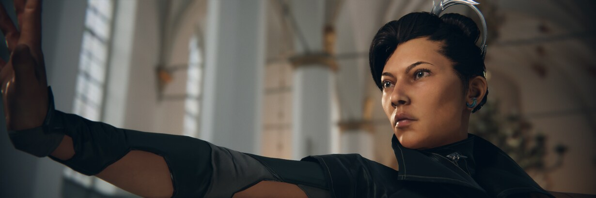

[新しい LookDev Studio プロトタイプを今すぐお試しください | Unity Blog](https://blog.unity.com/ja/technology/try-the-new-lookdev-studio-prototype-today)

Unityのアーティスト向けのプロトタイプツールである「LookDev Studio」の利用方法と、新しいリリースである 0.2.0 の概要、 これまでのリリースである0.1.0の機能ハイライトについて紹介しています。

0.2.0のアップデートとしてカスタマイズ関連のアップデートと機能改善が行われましたが、大きなトピックスとして、High Definition Render Pipeline（HDRP）に加えて Universal Render Pipeline（URP）バージョンのプロジェクトが利用になりました。

## ArtEngine の Chrome Ball ノードによるフォトメトリックステレオを使って、リアルなマテリアルを作る

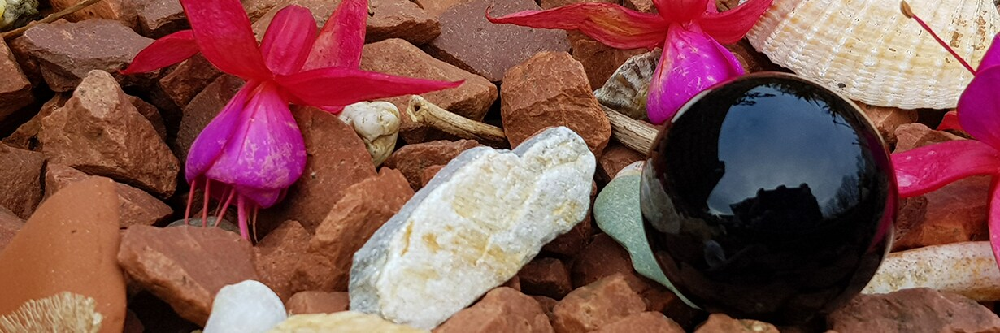

[ArtEngine の Chrome Ball ノードによるフォトメトリックステレオを使って、リアルなマテリアルを作る | Unity Blog](https://blog.unity.com/ja/technology/create-realistic-materials-using-photometric-stereo-via-chrome-ball-in-artengine)

ArtEngineに新しく実装された Chrome Ballノードについて紹介しています。 Chrome Ballノードは、クロムボール（光を反射する球体）を配置して撮影した複数枚の写真を解析して、詳細なアルベドマップと法線マップを自動生成します。

この記事では、クロムボールを用いた撮影の方法とその仕組み、ArtEngineでの処理についてそれぞれ解説しています。

## より良いチームワークを作り上げる、KO_OP のバージョン管理活用法

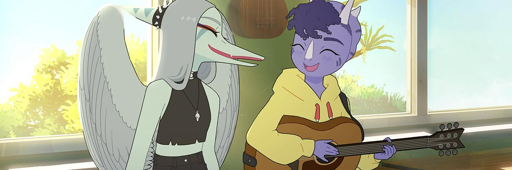

[より良いチームワークを作り上げる、KO_OP のバージョン管理活用法 | Unity Blog](https://blog.unity.com/ja/games/koop-case-study)

カナダのスタジオのKO_OPによるPlustic SCMの導入事例について紹介しています。

Plastic SCM導入前のスタジオにおけるアーティストとエンジニア間のコラボレーションの課題と、Plastic SCM導入時のアーティストチームの様子、導入後の様子やほかツールとの連携・統合のためのDevOpsツールの開発についてそれぞれふれています。

## MARS 1.4、公開準備完了！

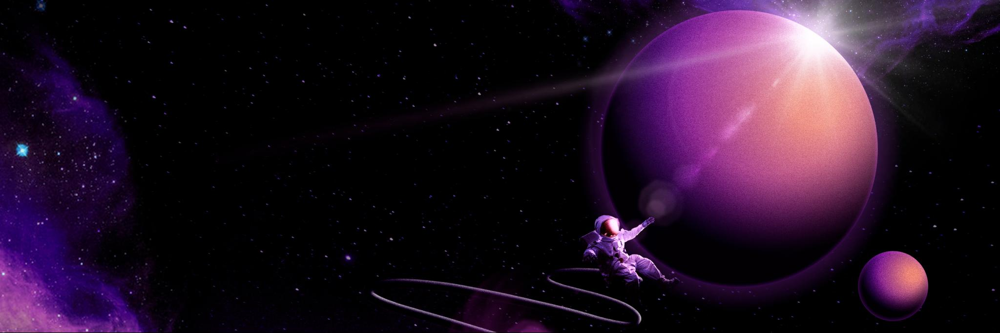

[MARS 1.4、公開準備完了！ | Unity Blog](https://blog.unity.com/ja/technology/mars-14-is-ready-for-takeoff)

AR/MR 開発のUnity拡張機能である [Unity MARS](https://unity.com/products/unity-mars) の 1.4がリリースされました。この記事では、1.4に実装されている機能の紹介と、MARSを学習する上でのリソースが紹介されています。

また、期間限定で記事中のバーチャーコードを用いてライセンスを50%オフで購入できます。

# Articles

## NOVA Shader: Uber shader for Particle System

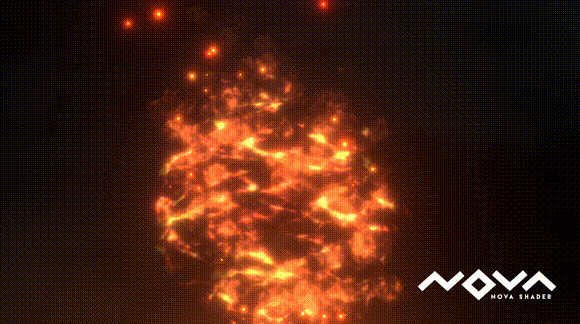

[CyberAgentGameEntertainment/NovaShader: Multi-functional shader for the Particle System that supports Universal Render Pipeline (URP) of Unity.](https://github.com/CyberAgentGameEntertainment/NovaShader)

Universal Render Pipeline（URP）対応の多機能（Uber）パーティクルシェーダーがリリースされました。

フローマップ、Flip-Book（連番テクスチャアニメーション）、ディゾルブ、フェード、回転、アニメーション可能なTintマップ、エミッション、ディストーションなど、VFXでよく使われる汎用的な機能をまとめたシェーダーで、現在Unlitに対応しています。

## ShaderGraphコンパイル後のアセンブリコードを読んでみる

[ShaderGraphコンパイル後のアセンブリコードを読んでみる](https://zenn.dev/r_ngtm/articles/shadergraph-assembly)

UnityのShaderGraphがコンパイル後に実際に吐くアセンブリコード（d3d asm）を評価して、ShaderGraphの計算負荷について調査しています。

ShaderGraphからアセンブリコードが生成されるまでの仕組みからコンパイルされたコードの確認方法、ShaderGraphとShaderLabの生成するコードについてPassとFragment（Pixel）シェーダー、Vertexシェーダーを比較しています。

また、生成されるアセンブリコード単位でのShaderGraphのノードを最適化の方法や、ShaderGraphのノードの内、計算負荷が重たいノードについても言及しています。

## Square Grid

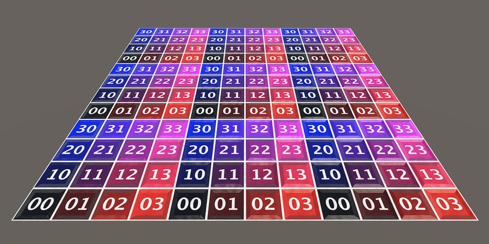

[Square Grid](https://catlikecoding.com/unity/tutorials/procedural-meshes/square-grid/)

この記事はCatlike Codingの[Procedural Meshes](https://catlikecoding.com/unity/tutorials/procedural-meshes/)シリーズの2記事目で、Advanced Mesh APIとBrust jobを用いてプロシージャルなメッシュ生成を実装するための方法と、正方形グリッドを生成する方法について紹介しています。

## uOSC v2 をリリースしました

[uOSC v2 をリリースしました - 凹みTips](https://tips.hecomi.com/entry/2021/11/29/234527)

この記事の著者が開発する [hecomi/uOSC](https://github.com/hecomi/uOSC) の v2の紹介記事です。

パッケージのアップデートの紹介からインストール方法、基本的な利用方法についての紹介、v2に入った機能のTipsについてそれぞれ解説しています。

## Mastering Tessellation Shaders and Their Many Uses in Unity

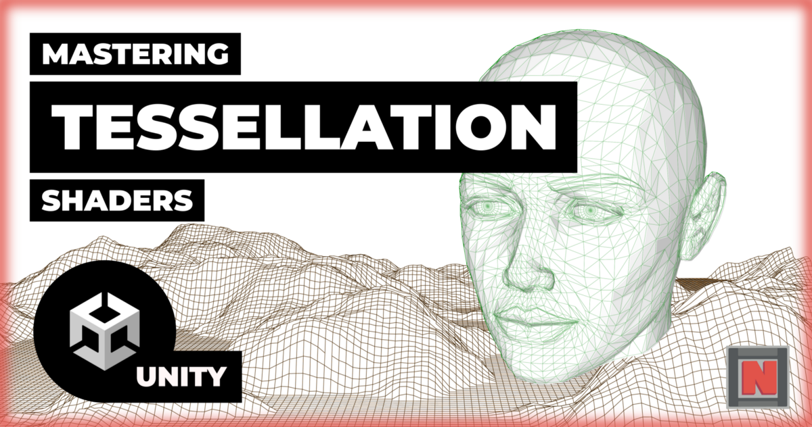

[Mastering Tessellation Shaders and Their Many Uses in Unity | by NedMakesGames | Nov, 2021 | Medium](https://nedmakesgames.medium.com/mastering-tessellation-shaders-and-their-many-uses-in-unity-9caeb760150e)

この記事ではUnityでテッセレーションシェーダーを用いたテッセレーションの実装方法について、その原理からテッセレーションシェーダーおよびドメインシェーダーの記述方法について紹介しています。

また、カリングや動的なテッセレーション係数の調整によるテッセレーションの最適化や、メッシュのジオメトリをなめらかにする手法としてフォンテッセレーションの実装の紹介、ハイトマップを用いたテッセレーションについてそれぞれ解説しています。

## Making an After-Image Mesh effect(Updated for URP)

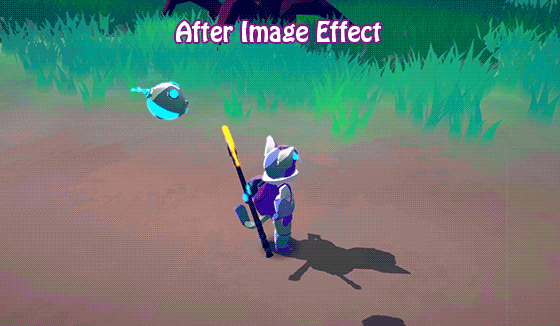

[Making an After-Image Mesh effect(Updated for URP) | Minions Art on Patreon](https://www.patreon.com/posts/making-after-for-58726256)

キャラクターの残像メッシュ効果をURPで実装する方法について紹介しています。

残像のためのメッシュは、アニメーションされたものは [SkinnedMeshRenderer.BakeMesh](https://docs.unity3d.com/ScriptReference/SkinnedMeshRenderer.BakeMesh.html) を、アニメーションしないメッシュは [MeshFilter.sharedMesh](https://docs.unity3d.com/ScriptReference/MeshFilter-sharedMesh.html) を 取得し、 [CombilneInstance](https://docs.unity3d.com/ScriptReference/CombineInstance.html) を用いてメッシュを結合し描画しています。

また、オブジェクトプールを利用することで残像を生成するごとにメッシュを生成・破棄しないようにしています。

## Addressablesのビルド時間の調査

[【Unity】Addressables のビルドでどこに時間がかかっているのか調べる方法 - コガネブログ](https://baba-s.hatenablog.com/entry/2021/12/01/090000)

[【Unity】Addressables でアセットバンドルを圧縮するかどうかでビルド時間が変わるか - コガネブログ](https://baba-s.hatenablog.com/entry/2021/12/03/090000)

[【Unity】Addressables でアセットを変更していないのにビルドに時間がかかる場合 - コガネブログ](https://baba-s.hatenablog.com/entry/2021/12/02/090000)

[【Unity】Addressables で依存関係が増えるほどビルド時間がどのくらい長くなるか - コガネブログ](https://baba-s.hatenablog.com/entry/2021/11/30/090000)

これらの記事では、Addressablesのビルド時間がどのような要因でどのように増えるのかについて、その調査方法から依存関係を追加することでどれぐらいビルド時間が長くなるか、アセットバンドルの圧縮設定との関係について検証しています。

また、カタログの生成時間についても言及しています。

## シーンの初期設定をカスタマイズ出来るテンプレート機能 Scene Templates

[シーンの初期設定をカスタマイズ出来るテンプレート機能 Scene Templates【Unity】 - (:3[kanのメモ帳]](https://kan-kikuchi.hatenablog.com/entry/Scene_Templates?utm_source=feed)

Unity 2020.2から利用できる シーンを新規作成時のシーン情報を設定できる Scene Templates について基本的な使い方について紹介しています。

## 【Unity】Localizationパッケージ入門 - アセットをサクッとローカライズする

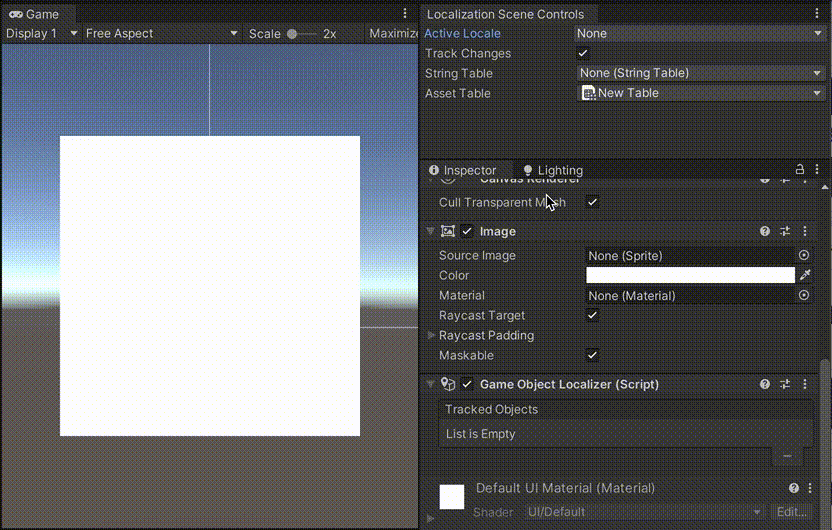

[【Unity】Localizationパッケージ入門 - アセットをサクッとローカライズする - LIGHT11](https://light11.hatenadiary.com/entry/2021/12/02/200205)

Unityの Localizationパッケージについてそのセットアップ方法と、テクスチャと静的・動的な文字列のローカライズ、ローカライズで利用されるアセット（テクスチャ）とAddressablesとの関係についてそれぞれ紹介しています。

## Niantic Lightship ARDKの機能調査

[Niantic Lightship ARDKの機能調査 - Qiita](https://qiita.com/Hibiro22/items/ef0e4e29b5492143206f)

Niantic Lightship ARDKについて、MappingやUnderstanding、Sharingなどの機能概要についての紹介しています。また、調査時にハマったことや重要な点についても触れています。

## InputSystem：MouseのSensitivityはどこ・・・？

[【Unity】InputSystem：MouseのSensitivityはどこ・・・？ - Qiita](https://qiita.com/LuminousNeco/items/7bfb982b38901efa3193)

新しいInput Systemで、旧Input Systemの Sensitivity（感度）設定の代替を[Processors](https://docs.unity3d.com/Packages/com.unity.inputsystem@1.0/manual/Processors.html)という機能を用いて実装する方法について紹介しています。

## 【Unity】オブジェクトを複製したときにスペース「 (1)」などがつくのを変更する

[【Unity】オブジェクトを複製したときにスペース「 (1)」などがつくのを変更する - Qiita](https://qiita.com/im0039kp/items/578e4bbcb9bd8b04426f)

ヒエラルキー上でオブジェクトをコピーしたときのサフィックスの設定を変更するための方法について解説しています。

## Scriptable Render Pipline入門

[Scriptable Render Pipline入門 - Qiita](https://qiita.com/tsune2ne/items/7e52ba8b15f965042359)

Scriptable Render Pipeline（SRP）を作成して、Skyboxの描画からカメラ設定の反映、カリング、オブジェクトの描画、半透明オブジェクトの描画タイミングの制御までの実装方法について紹介しています。
