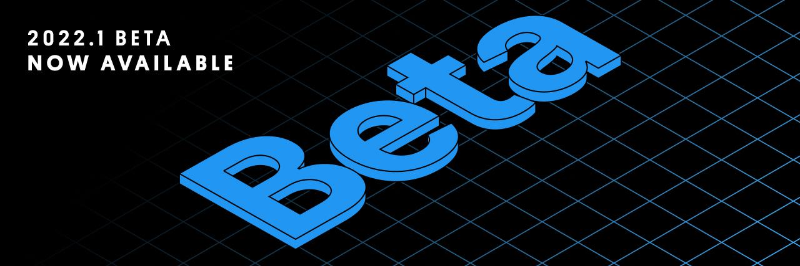
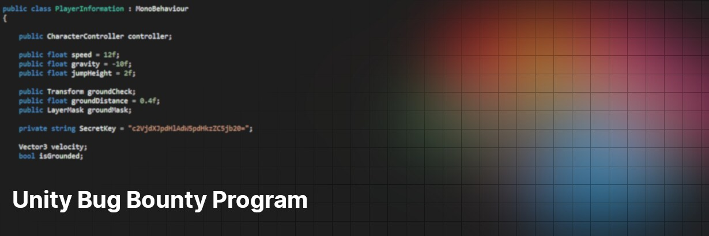
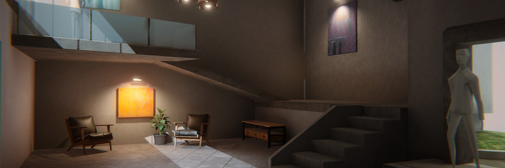
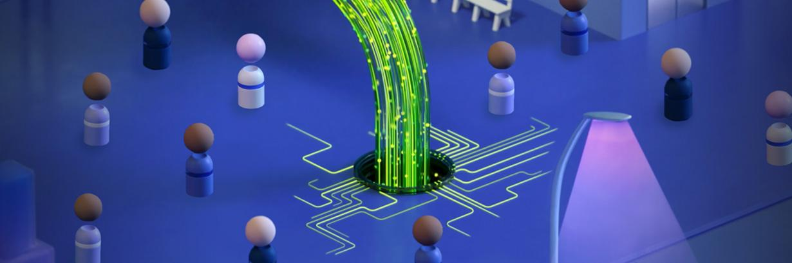
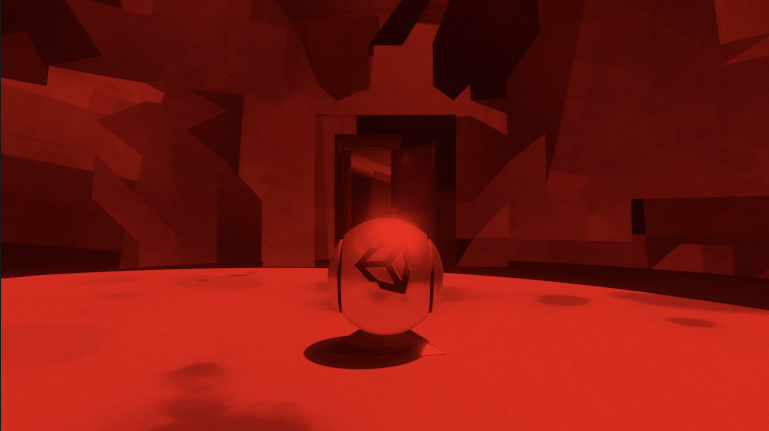
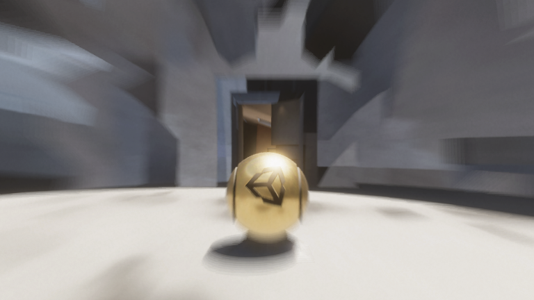
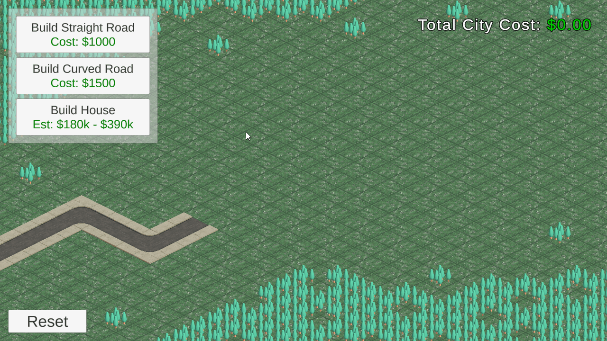

[Unity 2022.1 ベータ版、公開 | Unity Blog](https://blog.unity.com/ja/technology/unity-20221-beta-is-now-available-for-feedback)

Unity 2022.1のベータ版が公開されました。この記事では2022.1に入った新機能について下記を紹介しています。

- イテレーション時間の短縮
    - シーン保存の高速化による再生モード移行の高速化、マルチスレッドの使用による静的バッチとパーティクルの事前ウォーミングアップの高速化、一部のパッケージの初期化時間のコスト削減
    - スクロールやオブジェクトの選択が高速化、小さなファイルのインポート時間が最大 60% 短縮、大規模な配列を対象とした取り消し操作が最大 100 倍高速化、大きなスプライトの読み込みやスプライトのアウトラインの抽出が高速化
    - Unity 2021.2 で導入された、Windows、Mac、Linux、WebGL、Android 向けのインクリメンタルなプレイヤービルドのプロセスが、iOS や Xbox 向けのビルド作成にも対応
- エディターワークフロー
    - Quick Searchの改善、パッケージマネジャーのキャッシュ設定、パッケージマネジャーウインドウで複数パッケージを選択して追加、更新、削除可能に
    - [Dependency Viewer](https://github.com/Unity-Technologies/com.unity.search.extensions/wiki/Dependency-Viewer) を実験的な機能に追加
- エディタ拡張
    - UI Toolkitでより多くのUI Widgetにアクセス可能、カスタムシェイプやプロパティドロワーを記述できるように
    - [新しいスプラインオーサリングツール](https://docs.unity3d.com/Packages/com.unity.splines@1.0/manual/index.html)がプレリリース版パッケージとして提供される
- プロファイリングと実行時パフォーマンス
    - IL2CPPがすべての汎用メソッドに完全な共有バージョンを生成するように
    - Frame Timing Managerが全プラットフォームおよびエディタで利用可能に
        - [https://forum.unity.com/threads/update-for-frame-timing-manager.1191877](https://forum.unity.com/threads/update-for-frame-timing-manager.1191877)
    - System Metrics Mali を用いてモバイルの例レベルのメトリクスにアクセス可能に
- NetCode が正式にプレリリース状態へ移行
- テクニカルアーティスト向け機能の全体的な改善
    - マテリアルのバリアントが追加され、テンプレートとなるマテリアルプレハブが作成可能に
    - Visual Effect Graphにパーティクルをカメラの距離、深度、時間経過、カスタム入力によってソートするモードの提供、マルチビュー編集機能
    - テクスチャインポートがより細かく制御可能に
- 2D の改良
    - 2D PSD Importerのレイヤー機能の改善、インポート設定のためのAPIセットが用意された
    - 2D Animationのアニメーションウィンドウでのスプライトスワップのキーフレームを効率化、アニメーションプレビューウィンドウでのスプライト変形、スプライトスワップ、IK ソルバーのサポート
    - 2D物理でドローネテッセレーションが用意され、より少ないポリゴンでコリジョンを表現できるように
    - Universal Render Pipeline（URP）のShader Graph 2Dマスタースタックにブレンディングモードが追加、2D Pixel Perfect Cameraが強化され、ブラーを抑えたアップスケールフィルタが追加
- シネマティックツール
    - ツールの強化が行われ、Cinemachineのバーチャルカメラのプロパティを直接シーン上から編集可能に
    - Unity Face CaptureとUnity Virtual Cameraコンパニオンアプリによるデータキャプチャの動機

## Unity のセキュリティに関する公開バグ報奨金プログラム

[Unity のセキュリティに関する公開バグ報奨金プログラム | Unity Blog](https://blog.unity.com/ja/technology/public-bug-bounty-program)

Unity製品のセキュリティに関するバグ報酬金プログラムは2021年7月に一般公開され、だれでも参加可能になりました。

詳細は [Unity BugCrowd](https://www.bugcrowd.com/unity/) から確認できます。

## ArtEngine 2021.15.1 の素晴らしい機能の数々。今年のホリデーシーズンはケーキの他にも「ベイク」しよう

[ArtEngine 2021.15.1 の素晴らしい機能の数々。今年のホリデーシーズンはケーキの他にも「ベイク」しよう | Unity Blog](https://blog.unity.com/ja/technology/discover-the-stunning-possibilities-of-artengine-2021151-and-bake-more-than-a-cake-this)

この記事ではArtEngine 2021.15.1で新しく追加された機能である「クローンスタンプ」と「Baker」、「Plane Generator」、「High Definition Render Pipeline（HDRP）リアルタイムレンダラ」について紹介しています。

## 新しい学習パスウェイを活用して、クリエイティブ制作を始めよう

[新しい学習パスウェイを活用して、クリエイティブ制作を始めよう | Unity Blog](https://blog.unity.com/ja/community/get-your-start-in-creative-production-with-this-new-learning-pathway)

Unity Learnに新しく公開された、自己学習を目的としたプログラムである Creative Core パスウェイについて紹介しています。

## 事実か、虚構か。ネットコードに関する 3 つの誤解を解く

[事実か、虚構か。ネットコードに関する 3 つの誤解を解く | Unity Blog](https://blog.unity.com/ja/games/netcode-facts-fiction)

この記事では、ネットコード（ここでのネットコードはマルチプレイヤーゲームのクライアント・サーバー間のネットワークや同期の総称）においてよくある３つの誤解を取り上げ、その理由と対処方法について取り上げています。

## 完璧なゲームコンテンツパイプラインを作る方法

[完璧なゲームコンテンツパイプラインを作る方法 | Unity Blog](https://blog.unity.com/ja/games/how-to-perfect-your-game-content-pipeline)

Unityの [Cloud Content Delivery](https://unity.com/ja/products/cloud-content-delivery)（CCD）を用いてコンテンツパイプラインを改善し、チームの作業負荷を削減する方法について紹介しています。

# Articles

## パッケージ用のスクリプティングAPIで何ができるのか

[パッケージ用のスクリプティングAPIで何ができるのか](https://zenn.dev/fumo/articles/f70dd679f8ff88)

Package Managerを操作するためのAPIである [PackageManager.Client](https://docs.unity3d.com/ja/2021.1/ScriptReference/PackageManager.Client.html) についてパッケージの追加や削除、一覧取得などの一連の操作について紹介しています。また、これらの操作の都度コンパイルが実行されるために、連続でAPIを叩く際の注意点についても言及しています。

## Modified Grid

[Modified Grid](https://catlikecoding.com/unity/tutorials/procedural-meshes/modified-grid/)

この記事では、[前回の記事](https://catlikecoding.com/unity/tutorials/procedural-meshes/square-grid/)でプロシージャルに作成したグリッドに対して、シェーダーを介してアニメーションをつける方法について紹介しています。

## Sword Slash Shader Breakdown

[Sword Slash Shader Breakdown | Cyanilux](https://www.cyanilux.com/tutorials/sword-slash-shader-breakdown/)

<blockquote class="twitter-tweet">
Did a magic sword slash effect as part of <a href="[https://twitter.com/HarryAlisavakis?ref_src=twsrc^tfw](https://twitter.com/HarryAlisavakis?ref_src=twsrc%5Etfw)">@HarryAlisavakis</a>'s discord <a href="[https://twitter.com/hashtag/TechnicallyAChallenge?src=hash&amp;ref_src=twsrc^tfw](https://twitter.com/hashtag/TechnicallyAChallenge?src=hash&amp;ref_src=twsrc%5Etfw)">#TechnicallyAChallenge</a> (theme is "Weapon slashes / attack VFX")<a href="[https://twitter.com/hashtag/madewithunity?src=hash&amp;ref_src=twsrc^tfw](https://twitter.com/hashtag/madewithunity?src=hash&amp;ref_src=twsrc%5Etfw)">#madewithunity</a> <a href="[https://twitter.com/hashtag/shaders?src=hash&amp;ref_src=twsrc^tfw](https://twitter.com/hashtag/shaders?src=hash&amp;ref_src=twsrc%5Etfw)">#shaders</a> <a href="[https://twitter.com/hashtag/vfx?src=hash&amp;ref_src=twsrc^tfw](https://twitter.com/hashtag/vfx?src=hash&amp;ref_src=twsrc%5Etfw)">#vfx</a> <a href="[https://t.co/ZebeRutRIb](https://t.co/ZebeRutRIb)">[pic.twitter.com/ZebeRutRIb](http://pic.twitter.com/ZebeRutRIb)</a>
— Cyan ✨ (@Cyanilux) <a href="[https://twitter.com/Cyanilux/status/1467533351091376136?ref_src=twsrc^tfw](https://twitter.com/Cyanilux/status/1467533351091376136?ref_src=twsrc%5Etfw)">December 5, 2021</a></blockquote> 

上記のような件を振ったときの斬撃表現をShader Graphで実装する方法について紹介しています。

## HDRPでカスタムポストエフェクトを実装する

[【Unity】HDRPでカスタムポストエフェクトを実装する - LIGHT11](https://light11.hatenadiary.com/entry/2021/12/09/191156)

HDRPで[ユーザー定義のポストプロセスエフェクト](https://docs.unity3d.com/Packages/com.unity.render-pipelines.high-definition@10.7/manual/Post-Processing-Main.html)を実装する方法を紹介しています。

ポストプロセスエフェクト用のシェーダーの実装方法からそのシェーダーを用いたポストプロセスボリュームコンポーネント（`CustomPostProcessVolumeComponent`）の定義方法、シーンに適用するための設定についてそれぞれ紹介しています。

## Radial Blur（放射状ブラー）のポストエフェクトを実装する

[https://light11.hatenadiary.com/entry/2021/12/09/193848](https://light11.hatenadiary.com/entry/2021/12/09/193848)

HDRPのポストプロセスボリュームコンポーネント（`CustomPostProcessVolumeComponent`）でRadial Blur（放射状ブラー）を実装する方法について解説しています。

## transform が操作された時にログ出力できる「Unity.TransformSetterInterceptor」紹介

[【Unity】transform が操作された時にログ出力できる「Unity.TransformSetterInterceptor」紹介 - コガネブログ](https://baba-s.hatenablog.com/entry/2021/12/07/090000)

`Transform` のそれぞれの値が更新されたときに、その情報をログ出力する [Unity.TransformSetterInspector](https://github.com/handzlikchris/Unity.TransformSetterInterceptor) について紹介しています。

## UniversalRPで出来るだけシンプルなRendererFeatureを作って画面に色をかぶせる

[UniversalRPで出来るだけシンプルなRendererFeatureを作って画面に色をかぶせる - Qiita](https://qiita.com/ScreenPocket/items/390acb8b13211c4dc3cb)

URPのsRendererFeatureを用いて画面全体に色をかぶせる実装を行う方法について紹介しています。

`RenderingUtilis.fullscreenMesh` を用いて全画面を覆うメッシュを、かぶせたい色で描画する実装を RendererFeature で行うことで色をかぶせています。

## Introduction to Asynchronous Programming in Unity

[Introduction to Asynchronous Programming in Unity | raywenderlich.com](https://www.raywenderlich.com/26799311-introduction-to-asynchronous-programming-in-unity)

この記事ではUnity上で非同期なプログラミングを行うための方法について紹介しています。非同期メソッドの定義からタスクの待ち方、タスクのキャンセル方法、例外キャッチ、コルーチンによる非同期実装との比較について取り上げています。

## Unity2018でAndroid12ビルド対応

[Unity2018でAndroid12ビルド対応 - Qiita](https://qiita.com/owenc4a4/items/b4430f3eadb25e87fc84)

[Unity2018.4 Android対応その２ - Qiita](https://qiita.com/owenc4a4/items/d231289243758e6de6d8)

Unity 2018でAndroid12（Target API 31）対応するための方法を紹介しています。JDKとAndroid SDKの切り替えからGradleのアップデート、 `mainTemplate.gradle` について取り上げています。

## UniTaskで簡単なProcessをサクッと実行して結果を文字列で得る

[UniTaskで簡単なProcessをサクッと実行して結果を文字列で得る - Qiita](https://qiita.com/dwl/items/9b9f51e404a8682c553b)

ProcessとUniTaskでコマンドの実行を非同期で実行する方法について紹介しています。例として `git rev-parse` を実行して、Gitのリビジョン情報を取得する方法について取り上げています。
