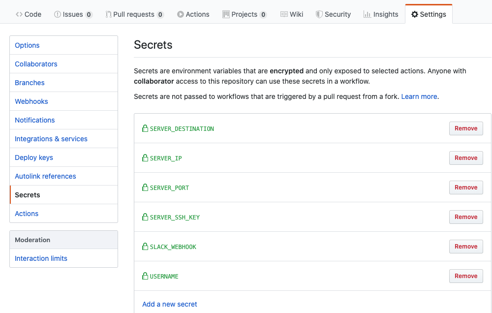
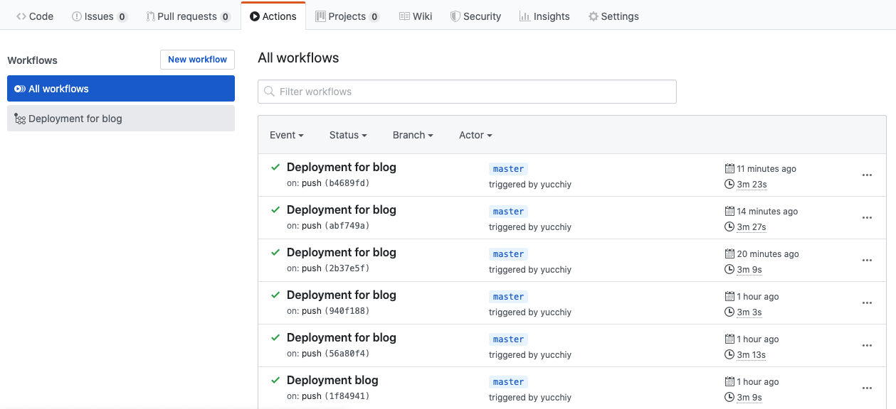

[Yucchiy's Note](https://blog.yucchiy.com/)は2019/02/13時点で、[Gatsby.js](https://www.gatsbyjs.org/)で作成していて、sakura VPSに立ち上げたサーバー上でホストしています。

このブログを[Github Actions](https://help.github.com/en/actions)を用いてサーバーにデプロイしてみます。

ただし下記を前提とします。

- サーバーに対して公開鍵認証でSSHができる
- サーバー上ではnginxが構築されている(nginxである必要はないが)
- レポジトリ直下にGatsby.jsコンテンツが配置されている(`package.json`などが直下に配置されている)

## workflow fileの作成

Github Actionsを設定するためには、まずworkflow fileと呼ばれるファイルを`.github/workflows`ディレクトリ以下に作成する必要があります。このディレクトリ下に`.yml`または`.yaml`拡張子でファイルを配置したものをworkflow fileとして認識します。

今回、デプロイ設定を記述するworkflow fileは`.github/workflow/deployment.yml`で作成します。このファイルは下記の処理を行います。

1. Gatsby.jsを動作させるためにNode.jsを利用できるようにする
2. Gatsby.jsを動かしてブログをビルドする
3. 2.で作成した成果物をサーバーにrsyncで配信する
4. Slackにデプロイ通知をする

早速ですが、上記の処理を行う`.github/workflow/deployment.yml`は以下となります。

```yaml
name: Deployment for blog

on:
  push:
    branches:
      - master

jobs:
  build-deploy:
    runs-on: ubuntu-latest
    steps:
    - uses: actions/checkout@v2
    - name: Use Node.js ${{ matrix.node-version }}
      uses: actions/setup-node@v1
      with:
        node-version: 10.x
    - name: Cache dependencies
      uses: actions/cache@v1
      with:
        path: ~/.npm
        key: ${{ runner.os }}-node-${{ hashFiles('**/package-lock.json') }}
        restore-keys: |
          ${{ runner.os }}-node-
    - run: npm install
    - run: npm run build --if-present
    - name: deploy to server
      uses: AEnterprise/rsync-deploy@v1.0
      env:
        DEPLOY_KEY: ${{ secrets.SERVER_SSH_KEY }}
        ARGS: "-avzr --delete"
        SERVER_PORT: ${{ secrets.SERVER_PORT }}
        FOLDER: "./public/"
        SERVER_IP: ${{ secrets.SERVER_IP }}
        USERNAME: ${{ secrets.USERNAME }}
        SERVER_DESTINATION: ${{ secrets.SERVER_DESTINATION }}
    - uses: actions/checkout@v2
    - name: Slack Notification
      uses: rtCamp/action-slack-notify@v2.0.0
      env:
        SLACK_WEBHOOK: ${{ secrets.SLACK_WEBHOOK }}
```

## ワークフローのトリガーイベントの設定

まず、このワークフローの名前とワークフローの呼び出しトリガーとなるイベントを設定します。該当箇所を抜粋すると以下のとおりです。

```yaml
# このワークフローの名前
name: Deployment for blog

# トリガーは、`on:`で記述
on:
  push:
    branches:
      - master
```

ワークフロー名は`Deployment for blog`とし、`master`にプッシュされたタイミングでこのワークフローを実行しています。
ちなみにイベントは複数指定できますし、`branchs`を省く事もできます。その時は全てのプッシュイベントに対してワークフローが呼び出されます。

詳細は[Events that trigger workflows - GitHub Actions / Reference](https://help.github.com/en/actions/reference/events-that-trigger-workflows#webhook-events)に記載されています。
[スケジュールジョブ](https://help.github.com/en/actions/reference/events-that-trigger-workflows#scheduled-events-schedule)を実行することもできますし[外部からWebHook経由でイベントを実行](https://help.github.com/en/actions/reference/events-that-trigger-workflows#external-events-repository_dispatch)することもできそうです。また、[レポジトリに対しての各種イベントのハンドリング](https://help.github.com/en/actions/reference/events-that-trigger-workflows#webhook-events)も簡単そうです。

## ジョブを記述する

このワークフローでやることを書きます。`job`の`steps`に順繰り処理の内容を書いていきます。まずはそのジョブの環境を下記のように記載します。

```yaml
jobs:
  # build-deployというジョブを記述する。複数定義すると並列に動く?
  build-deploy:
    # ジョブはubuntu-latest上で実行される
    runs-on: ubuntu-latest
    # ここからジョブの内容を記載していきます。書いてあることが上から順次実行されます。
    steps:
```

ここから`steps`項目以下に処理について説明していきます。

### Node.jsのセットアップ

Gatsby.jsの動作にはNode.jsが必要です。下記のように記述します。

```yaml
    - uses: actions/checkout@v2
    - name: Use Node.js ${{ matrix.node-version }}
      uses: actions/setup-node@v1
      with:
        node-version: 10.x
    - name: Cache dependencies
      uses: actions/cache@v1
      with:
        path: ~/.npm
        key: ${{ runner.os }}-node-${{ hashFiles('**/package-lock.json') }}
        restore-keys: |
          ${{ runner.os }}-node-
```

やっていることとしては、`10.x`のNode.jsを利用できるようにしています。
また、`package-lock.json`ファイルが同じ内容なら`~/.npm`ディレクトリをキャッシュすることで、パッケージのインストールを高速化しようとしています。

### Gatsby.jsでブログをビルドする

配信するためのhtmlやcss、jsなどの成果物をGatsby.jsでビルドします。手順は下記のとおりです。

```yaml
    - run: npm install
    - run: npm run build --if-present
```

特に難しいことはしてないのですが`npm install`してパッケージをインストール後、`npm run build`でGatsby.jsによるビルドを実施しています。ここまで成功すると`./public`に成果物が生成されます。
ここをカスタマイズするとjs製の静的サイトジェネレーターでも応用が効くかもしれません。

### rsyncでサーバーに成果物をデプロイする

デプロイって言っても`rsync`コマンドでコピーしているだけなんですが。
[Marketplace](https://github.com/marketplace)から探してきた[Deploy with rsync](https://github.com/marketplace/actions/deploy-with-rsync)経由でrsyncを叩いています。

```yaml
    - name: deploy to server
      uses: AEnterprise/rsync-deploy@v1.0
      env:
        DEPLOY_KEY: ${{ secrets.SERVER_SSH_KEY }}
        ARGS: "-avzr --delete"
        SERVER_PORT: ${{ secrets.SERVER_PORT }}
        FOLDER: "./public/"
        SERVER_IP: ${{ secrets.SERVER_IP }}
        USERNAME: ${{ secrets.USERNAME }}
        SERVER_DESTINATION: ${{ secrets.SERVER_DESTINATION }}
```

注意点として(ってほどでもなく当然やるべきなんですが)、秘密鍵情報などセキュリティの観点から秘密にするべき情報は[Secrets](https://help.github.com/en/actions/configuring-and-managing-workflows/creating-and-storing-encrypted-secrets)を用いてを隠しています。



設定はレポジトリ単位で行え、「Settings > Secrets」でアクセスするか `https://github.com/{username}/{repository}/settings/secrets`でアクセスできます。設定したSecretは、`${{ secrets.設定した名前 }}`でアクセスできます。

_あと、rsyncの引数はちょっと自信がないです..._

### Slack通知を送る

最後に成功したら今どきっぽく(?)Slackで通知します。Marketplaceの[Slack Notify](https://github.com/marketplace/actions/slack-notify)を利用しています。

```yaml
    - uses: actions/checkout@v2
    - name: Slack Notification
      uses: rtCamp/action-slack-notify@v2.0.0
      env:
        SLACK_WEBHOOK: ${{ secrets.SLACK_WEBHOOK }}
```

## 動作確認

メニューの「Actions」にアクセスすることで下記のようにGitHub Actionsの動作状況を確認できます。



## まとめ

Gatsby.jsで構築したブログの自動デプロイをGitHub Actionsで構築しました。

軽い気持ちでGitHub Actionsを触ってみましたが、(当然ですが)GitHub単体で(CircleCIとか連携せずに)CI回せるのはとても楽だなっていうのと、[GitHubのイベントのハンドリングがとても簡単なため](https://help.github.com/en/actions/reference/events-that-trigger-workflows#webhook-events)、今まで外部のサーバーにWebHook飛ばしたりして処理してたものをGitHub上で完結できそうでとても楽そうです。

あと[Self-hosted runners](https://help.github.com/en/actions/hosting-your-own-runners)に少し心が惹かれています。

## Reference

- [Building and deploying Gatsby sites with GitHub actions](https://nehalist.io/building-and-deploying-gatsby-sites-with-github-actions/)
- [Gatsby のサイトを GitHub Actions で GitHub Pages にデプロイ - Qiita](https://qiita.com/peaceiris/items/2f6d83802f2aefa66f9d)
