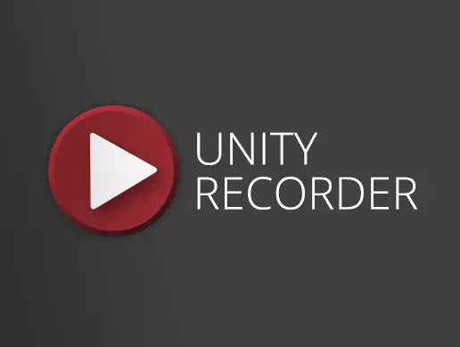
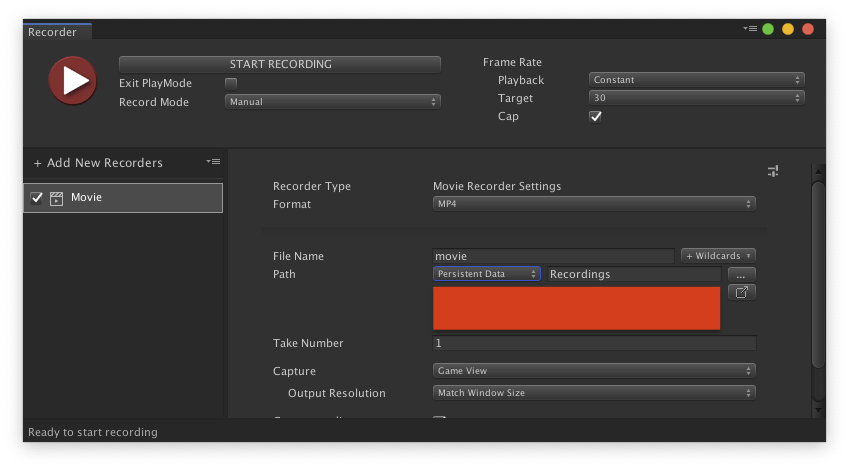
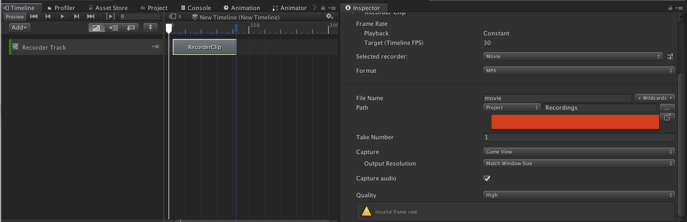
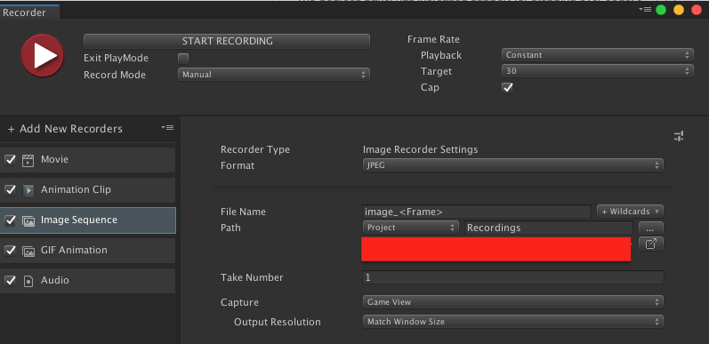

[Unity Recorder](https://assetstore.unity.com/packages/essentials/unity-recorder-94079)はUnity Editor上で実行したシーンの描画結果（例えばゲームビューやRenderTextureなど）を画像や動画として保存するためのアセットです。
Unity RecorderではUI経由およびタイムラインで`RecordTrack`と`RecordClip`を仕込むことで、動画を撮影することができます。

下記画像が、それぞれUnity RecorderのUI(Recorder Window)とタイムライン設定になります。





これだけでもすでに便利なのですが、この記事ではUnity Recorderを **スクリプトから操作する方法** について説明します。
エディタ限定ではありますが、スクリプトから操作できると動画撮影の自動化などがいろいろ捗ったりと、いろいろ便利かもしれません。

[Video - Control Unity Recorder from Script - Unity Forum](https://forum.unity.com/threads/control-unity-recorder-from-script.840946/)を参考にしています。

## UnityEditor.Recorder.RecorderController

Unity Recorderには[RecorderController](https://unitytech.github.io/unity-recorder/api/UnityEditor.Recorder.RecorderController.html)というクラスが`UnityEditor.Recorder`名前空間に実装されていて、このクラスを利用することでスクリプトからレコーダを操作することができます。

### 初期化と設定について

RecorderControllerの初期化時に、レコーダーの動作を設定するための[RecorderControllerSettings](https://unitytech.github.io/unity-recorder/api/UnityEditor.Recorder.RecorderControllerSettings.html)インスタンスをコンストラクタに渡す必要があります。`RecorderControllerSettings`ではフレームレートや録画モードの設定と`RecorderSettings`の追加を行います。

フレームレートの設定は、フレームレート数や[プレイフィードバック](https://docs.unity3d.com/Packages/com.unity.recorder@2.1/api/UnityEditor.Recorder.FrameRatePlayback.html)について設定します。具体的には下記のように設定します。

```cs
// `RecorderControllerSettings`はScriptableObject
var setting = ScriptableObject.CreateInstance<RecorderControllerSettings>();
// フレームレートを30fpsに設定します
setting.frameRate = 30f;
```

録画モードではレコーダーの録画区間を設定します。具体的には、手動で区間を設定するか(後述する`RecorderController`の`StartRecording()`メソッドおよび`StopRecording()`を手動で呼び出して録画するか)、区間を予め明示するかを設定します。

```cs
// 手動設定にする
setting.SetRecordModeToManual();
// フレーム番号指定で１フレームを撮影する。
// この場合は１０フレーム目を録画する。
setting.SetRecordModeToSingleFrame(10);
// 時間で区間を指定して撮影する。この場合は
// 区間が開始が0.5秒で、終了が2.0秒の計1.5秒を撮影する。
setting.SetRecordModeToTimeInterval(0.5f, 2f);
// フレーム番号で区間を指定して撮影する。この場合は
// 区間が開始が15フレームで、終了が45フレームの計30フレームを撮影する。
SetRecordModeToFrameInterval(15, 45);
```

最後に`RecorderSettings`を追加します。Unity Recorderでは下記の図のように撮影結果の出力フォーマットが動画だけではなく音声や連番画像、Gif動画、さらにはアニメーションクリップへの出力もサポートしています。
このように撮影結果を異なるフォーマットで保存できるように、また新しいフォーマット追加の拡張をしやすいようにレコーダー部分を抽象化しています。



今回は動画を撮影したいので、動画出力のためのレコーダーを追加します。具体的には下記のように[MovieRecorderSettings](https://unitytech.github.io/unity-recorder/api/UnityEditor.Recorder.MovieRecorderSettings.html)インスタンスを作成し、設定します。

```cs
// MovieRecorderSettingsもScriptableObject
var movieRecorderSettings = ScriptableObject.CreateInstance<MovieRecorderSettings>();
// 撮影する対象を指定します
// この設定では、ゲームビューを解像度640x480で撮影します
movieRecorderSettings.imageInputSettings = new GameViewInputSettings() {outputWidth = 640, outputHeight = 480,};
// 音声も録画対象に含めます
movieRecorderSettings.audioInputSettings.preserveAudio = true;
// 動画のファイル名を指定します。撮影された動画は、プロジェクトルート直下に、このファイル名で保存されます
movieRecorderSettings.outputFile = "movie-recording";
// 動画のフォーマットを指定します。MP4とWEBMのどちらかを指定します。
movieRecorderSettings.outputFormat = VideoRecorderOutputFormat.MP4;
// レコーダーを有効にします
movieRecorderSettings.enabled = true;
// レコーダーを追加します
setting.AddRecorederSettings(movieRecorderSettings);
```

最後に`RecorderController`を初期化します。

```cs
var recorderController = new RecorderController(setting);
```

### レコーダーコントローラの起動と停止

`RecorderController`を手動で初期化した場合は、録画の開始と停止を行うことで動画を撮影することができます。
具体的には起動には`RecorderController.StartRecording()`を、停止に`RecorderController.StopRecording()`を呼び出します。

```cs
recorderController.StartRecording();
// ここから撮影が開始されるのでコンテンツを動かすなどする

// ここで撮影終了。動画が保存される。
recorderController.StopRecording();
```

録画が停止されたタイミングで、プロジェクトルート以下に`outputFile`に指定したファイル名で動画が保存されます。

### 参考

- [Video - Control Unity Recorder from Script - Unity Forum](https://forum.unity.com/threads/control-unity-recorder-from-script.840946/)
- [Unity Recorder](https://assetstore.unity.com/packages/essentials/unity-recorder-94079) 
