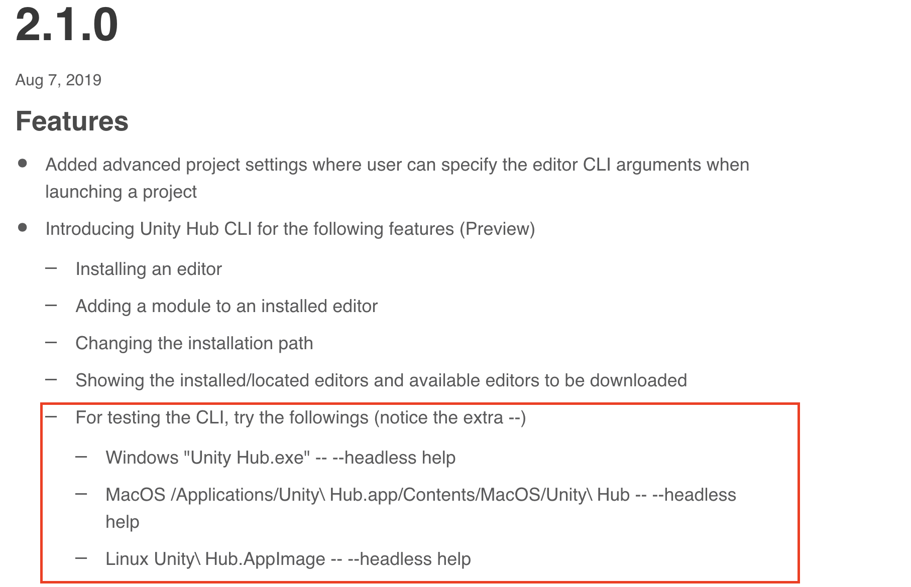
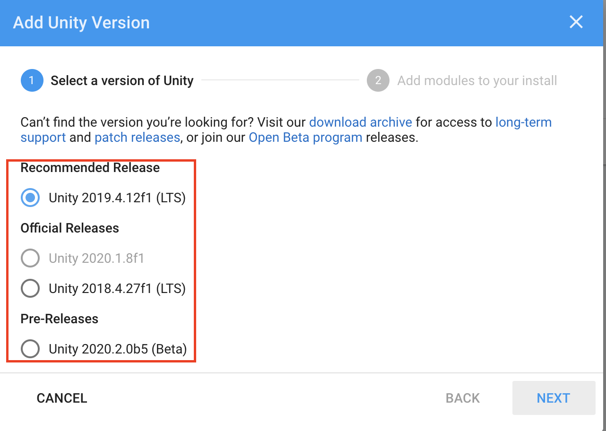

Unity Hubは[2.1.0からプレビュー版としてCLI経由で利用](https://unity3d.com/hub/whats-new)できます。
ただ[リリースノート](https://unity3d.com/hub/whats-new)では下図のようにほぼ詳細が記載されていません。



こちらの利用方法について簡単にメモとして記載しておきます。動作チェックは下記のとおりです。

- macOS Catalina (10.15.6)
- Unity Hub 2.4.1

## Unity HubのCLI起動

Mac標準で、Unity Hubは下記にインストールされます。

```
/Applications/Unity\ Hub.app/Contents/MacOS/Unity\ Hub 
```

これを`--headless`引数をつけて起動することで、CLI経由でHubを操作できます。試しにヘルプを表示してみます。下記コマンドを実行することでヘルプを確認できます。

```
$ /Applications/Unity\ Hub.app/Contents/MacOS/Unity\ Hub -- --headless help
Commands:
	editors
		description: list the releases and installed editors
		alias: e
		example: Unity\ Hub.app/Contents/MacOS/Unity\ Hub -- --headless editors -r
		options:
			[default]		list of available releases and installed editors on your machine combined
			--releases|-r 	only list of available releases promoted by Unity
			--installed|-i 	only list of installed editors on your machine
...続く
```

CLIは下記のように利用します。

```
/path/to/Unity\ Hub -- --headless {command} [options]
```

`{command}`には現在 `editors`、`install-path`、`install`、`install-modules`が利用できます。それぞれ順に説明します。

### `editors`: エディター一覧の確認方法

`editors`は、インストール済みのエディターや利用可能なエディター一覧を確認するコマンドです。

`--releases`または`-r`をオプションとして指定するとリリースされているUnityエディターのバージョン（の最新の一部？）を一覧表示します。この一覧はおそらくGUIの下図赤枠のバージョン一覧かと思います。
`--installed`または`-i`は操作しているインストール済みのエディターを一覧表示します。



また、指定しない場合は両方一覧表示します。

```
# リリース済み一覧表示
$ /Applications/Unity\ Hub.app/Contents/MacOS/Unity\ Hub  -- --headless editors --releases
2018.4.27f1
2019.4.12f1
2020.1.8f1
2020.2.0b5

# インストール済み一覧表示
$ /Applications/Unity\ Hub.app/Contents/MacOS/Unity\ Hub  -- --headless editors --installed
2019.3.12f1 , installed at /Applications/Unity/Hub/Editor/2019.3.12f1/Unity.app
2019.4.11f1 , installed at /Applications/Unity/Hub/Editor/2019.4.11f1/Unity.app
```

### `install-path`: Unityのインストールパスの確認・設定 

`install-path`は、Unityエディターをインストールするパスを指定または設定するためのコマンドです。

```
$ /Applications/Unity\ Hub.app/Contents/MacOS/Unity\ Hub -- --headless install-path -s /Users/yucchiy/UnityEditor/
# 以降Unityが/Users/yucchiy/UnityEditor/にインストールされる

$ /Applications/Unity\ Hub.app/Contents/MacOS/Unity\ Hub -- --headless install-path  --get 
/Users/yucchiy/UnityEditor/
```

ちなみにこの値が設定されていない場合は、デフォルトパスにインストールされます。筆者の環境では下記にインストールされます。

```
/Applications/Unity/Hub/Editor/
```

### `install`: Unityエディターのインストール

`install`は、Unityエディターをインストールするためのコマンドです。

`--version`でインストールするバージョンを指定します。これは必須で設定する必要があります。
`--module`では、追加でインストールしたいモジュールを指定します。複数ある場合は `--module mod1 --module mod2`のように指定します。モジュールには下記があります。(`:`の右側の文字列を指定します。)

```
Documentation: documentation
Standard Assets: standardassets
Example Project: example
Android Build Support: android
iOS Build Support: ios
tvOS Build Support: appletv
Linux Build Support: linux-mono
SamsungTV Build Support: samsung
Tizen Build Support: tizen
WebGL Build Support: webgl
Windows Build Support: windows
Facebook Gameroom Build Support: facebook-games
MonoDevelop / Unity Debugger: monodevelop
Vuforia Augmented Reality Support: vuforia-ar
Language packs: language-ja, language-ko, language-zh-cn, language-zh-hant, language-zh-hans
Mac Build Support (IL2CPP): mac-il2cpp
Windows Build Support (Mono): windows-mono
Android SDK & NDK Tools: android-sdk-ndk-tools
OpenJDK: android-open-jdk
Lumin OS (Magic Leap) Build Support: lumin
```

`--childModules`では上記パッケージをインストールする際に自動で依存パッケージをインストールします。基本ONでもいいかもしれません。

`2020.1.8f1`をiOSとAndroidのPlayback Engineモジュールつきでインストールするのは下記のとおりです。

```
$ /Applications/Unity\ Hub.app/Contents/MacOS/Unity\ Hub  -- --headless install --version 2020.1.8f1 --module ios --module android --childModules
```

モジュールのインストールは、後述する `install-modules` で後から追加インストールすることもできます。

### `install-modules`: モジュールの追加インストール

`install-modules`は、インストール済みのエディターに対してモジュールの後からインストールをするコマンドです。

`--version`で対象のエディターを指定し、インストールしたいモジュールを`--modules`で指定します。こちらは `install` コマンドと同じです。

`2020.1.8f1`に追加でDocumentationをインストールするには下記のコマンドを発行します。

```
$ /Applications/Unity\ Hub.app/Contents/MacOS/Unity\ Hub  -- --headless install-modules --version 2020.1.8f1 --module documentation
```

## まとめ

Unity HubをCLI経由で利用する方法について説明しました。
