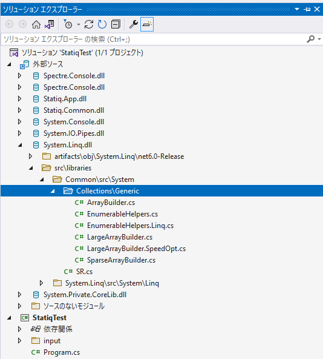
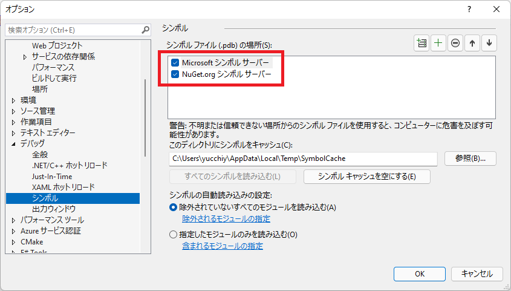
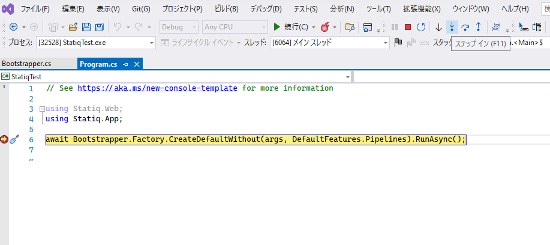
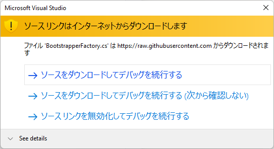

[Debugging External Sources with Visual Studio - Visual Studio Blog](https://devblogs.microsoft.com/visualstudio/debugging-external-sources-with-visual-studio/)

ほぼ上の記事の紹介になるんですが（というかそのままか）、便利だったのでメモ代わりにブログに残しておきます。

外部ライブラリを使っていると、ブレークポイントによるデバッグで、ライブラリ側のソースコードもステップインしたいことってありませんか？

Visual Studio 2022 Preview 3から、下図に示すようにソリューションエクスプローラーに外部ソースノードが追加されました。これはデバッグ中に表示されて、ソースサーバーの情報を含む、ロードされたシンボル情報（.pdb）が表示されるようになりました。

設定すると（これは後述します）、デバッグ中に外部ソースにステップインしようとすると、ソースサーバーから該当ソースを取得して、実際にステップ実行できます。もちろん実際のコードをソリューションエクスプローラーからも参照できます。

これにより外部ソースを含めたデバッグが格段にしやすくなります。

## 設定

まず、メニューの「ツール > オプション」を開いて、「デバッグ」項目の「マイコードのみを有効にする」のチェックを外します。

次に、「デバッグ」の左トグルをクリックして出てくる「シンボル」をクリック、「シンボルファイル（.pdb）の場所」でデバッグに追加したいシンボルサーバーにチェックを入れます。「Microsoftシンボルサーバー」を追加すると標準ライブラリなどが、「NuGet.orgシンボルサーバー」を追加すると、nugetで追加したライブラリを外部ソースとして追加できます。

また、「シンボルの自動読み込みの設定」で、読み込まれるモジュールを細かく制御できます。依存するモジュールが増えた場合、サーバーからの取得に時間がかかるため、気になる場合はこれを設定すると良いでしょう。とりあえず全部ってときは「除外されていないすべてのモジュールを読み込む」をチェックすればよいと思います。

## 動作確認

あとは、普通にデバッグで外部ソースにステップインすると、適宜シンボルサーバーからソースを取得します。下図のようにブレークポイントを貼って、外部ライブラリのメソッドにステップインします。

初回の場合はもしかしたら下図のようなウインドウが表示されます。適宜これをOKします。

すると下図のように、必要に応じてシンボルサーバーにシンボルの読み込みが走ります。

読み込みが終わると下図のように、外部ソースでデバッグ実行ができます。

ちなみに外部ソースの取得は、依存が多いと結構時間がかかります。

## まとめ

Visual Studio 2022 Preview 3で追加された外部ソースを含めたデバッグ実行を紹介しました。

ライブラリの挙動について、ソースコードレベルで理解したいときの選択肢の1つとして知っておくと便利な気がします。
