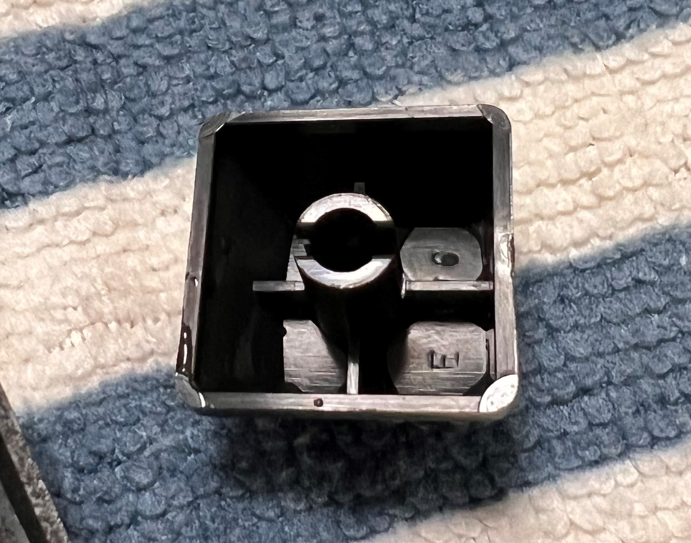
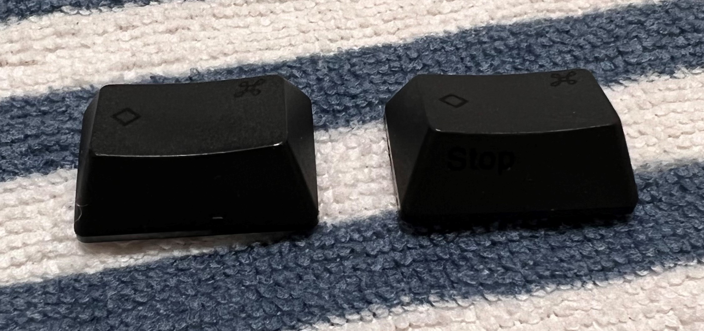

自分はHappy Hacking Keyboard（HHKB）を仕事でも個人でも利用しているんですが、だいたい毎年、年末～年始の休みの間を利用して下記の掃除を行います。

- キートップを外して、キーボード本体の普段手が届かない箇所を含めた掃除
- キートップの水洗い

（普段から軽く拭き掃除はしているが）ほぼ毎日利用しているものなので、1年も経つと結構汚れます。なのでキーボード大掃除は、ここ数年の習慣になりつつあります。

何年かやってコツも掴んだのでメモとしてブログに残します。

HHKBの掃除は工具さえあれば**結構簡単にできるので**、もし気になっておられる方がおられたら、是非お試しください。

## 必要なもの

自分がいつもキーボード大掃除で利用しているものは下記の通りです。

- キートップ引き抜き工具
- 綿棒
- ウェットティッシュ・キッチンペーパー
- （あれば）重曹

必須なのは**キートップ引き抜き工具**で、他はキートップまたはキーボード本体を掃除するために利用します。

HHKBのキートップを引き抜く工具として、HHKB公式のものがあります。

[Amazon.co.jp: PFU カラーキートップセット（HHKB Professionalシリーズ専用） PD-KB400KT01 : パソコン・周辺機器](https://www.amazon.co.jp/dp/B00HC2W0FC)

ちなみにFILCOのキートップ引き抜き工具でも代替できます。自分はこちらの工具を利用しています。

[Amazon.co.jp: FILCO キートップ引抜工具 FILCOKeyPuller プロ仕様 ブラック FKP01 : パソコン・周辺機器](https://www.amazon.co.jp//dp/B0047MQJ4I/)

他のものは家にある他のもので代替できます。綿棒とウェットティッシュはキートップを外したあと、キーボード本体を掃除するときに利用します。キッチンペーパーは、ウェットティッシュやキートップを掃除したあと、水気を取るために利用します。

キートップを外したあとに水洗いするのですが、重曹でつけ置きするとよりきれいに掃除できる気がします。他を調べると、超音波洗浄や、中性洗剤で代替したりできます。

## キートップの引き抜き

まずはじめに、キートップを引き抜きます。

念の為、配置を覚えておくために、**キーボードを下図のようにスクショしておくと**、キートップをつけ直す際に便利です。

ちなみにHHKBの場合は、側面の文字も付け直しに重要だったりするので、側面もスクショしておくといいかもです。

ちなみに撮ってなくても、[公式で配置情報が公開されている](https://www.pfu.fujitsu.com/hhkeyboard/leaflet/hairetu.html)のでこっちを見ていいかもです。（こっちを見たほうがいいかもです）

引き抜きは、先述した工具で行います。

コツとしてほぼ正方形の形をしたキートップは、工具を広げてキートップにはめたあとに、下図のように工具を斜めにして、そのまま斜め方向に工具を横にテコの原理を利用する感じに倒すと外れます。

「Tab」や「Control」キーなどの少しだけ横長のキートップは、工具を斜めに配置したら、真上に力をいれると引き抜きやすいです。

「左Shift」と「Space」キーなどのとても横長なキートップは、工具が入らないのですが、こちらは一通りキートップを外したあと、手で引き抜くと引き抜きやすいです。

こちらは結構力がいりますが、キートップ左右をもって、まっすぐ上に引き抜くと引き抜きやすいです。

「Space」キーを引き抜くと、バネが下に入っているので、これは無くさないように保存しておきます。

## キートップの洗浄

一通りキートップをはずしたら、先にキートップを洗います。

これはキートップを水洗いする場合、クリティカルパスがキートップの乾燥時間になるので、これを一番初めにしたほうが良いです。

自分の場合はキートップを容器に入れて、お湯をヒタヒタまで注いで、そこに少量の重曹を入れて、5分ぐらいつけ置きします。（その間に、キーボード本体の掃除などをしておきます）

つけ置き後はザルに移してお湯でしっかり流して、重曹残りがないようにします。

洗浄後は、キートップをタオルやキッチンペーパーでしっかり拭き取ってから自然乾燥させます。

ただし乾燥に一番時間かかるのが、キートップ裏の中央の筒の中の水分なので、ここの水分を抜いておくと乾燥が早いです。めんどくさいですが綿棒で拭き取ったりや、キートップを手に持って手の腹に軽くたたきつけると水分が抜けます。

キートップ中央筒の中の水分が抜けにくいので、抜いておくと良い

## キーボード本体の掃除

上の合間にキーボード本体を掃除します。大掃除してると、キートップを外した後のキーボード本体が、チリやホコリ、髪の毛が入っていてかなり汚れているので、結構びっくりします。

キーボードの細いところや、キーボードの軸の部分は綿棒で、他はウェットティッシュなどで拭き取るとよいですが、コツとしてはチリやホコリが多い場合は、先に大雑把に綿棒や乾燥したティッシュで落としておきます。このとき、上から下に掃除して、ホコリやチリをキーボード下部にまとめてから掻き出すときれいに掃除できます。

その後にウェットティッシュで拭き、最後にキッチンペーパーや乾燥したティッシュで拭くときれいになります。

## キートップをつけ直す

最後にスクショしてた配置情報をもとに配置し直します。

基本的には、キートップの文字だけでユニークに配置できます。このとき、すぐにカチッと本止めるんじゃなくて、一旦置くだけで仮止めしておき、一通り仮止めしたら、再度配置を見て、OKなら本止めします。こうすることでダブルチェック的になって良いです。

ややこしいのは、左右に同じキーがある、「Shift」と「Alt」、「Command」キーなんですが、「Shift」キーは左右のサイズが違うので識別可能、「Command」キーは下図のように側面をみて、「Stop」が書いてあるのが右のキーとして識別可能です。（ちなみにProfessional 2の配置情報で、もしかしたら他は違うかも？）

「Alt」キーは、多分左右で同じ形なので、どちらに配置しても大丈夫（なはず）です。

## まとめ

全部配置するとこんな感じで、スッキリ。

年末年始にやると、仕事初めをスッキリした気持ちで迎えられ、個人的にはおすすめです。

ちなみに作業自体は、多分慣れると30分程度で掃除ができるので、結構お手軽だと思います。ぜひ興味があれば、キーボードお掃除どうでしょうか？
