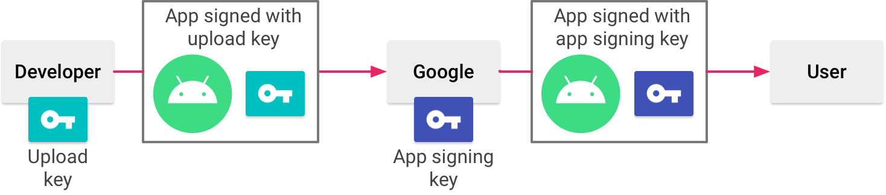
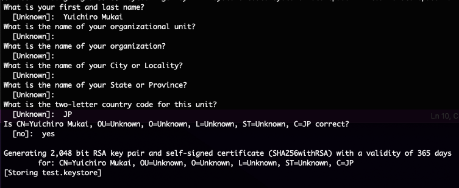
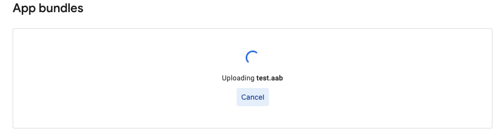

Google Playのアプリは、2021年8月よりAAB（Android App Bundle）形式で提出することが必須となりました。


AABの署名について調べると、（CLI経由で署名を行う場合は）jarsignerで署名すればOKという記事をみて、「あれ、APKの場合はapksignerで署名するのに、AABはjarsignerでいいんだっけ…?」という疑問がよぎり、AABの署名周りの理解が浅いな、と感じたので、メモ代わりにブログに残すことにします。

## TL;DR

（この記事を書いた2022年7月）現在では、AABはアップロード鍵により署名します。実際に配布されるAPKの署名は、Playアプリ署名という仕組みで、事前に設定しておいたアプリ署名鍵によって署名されます。

## APKのアプリ署名についてのおさらい

AABの署名の前に、APKのアプリ署名について簡単にまとめておきます。


Google Playにアプリをリリースする際には必ず、ディベロッパーの証明のために、APKに署名を行う必要があります。

[アプリへの署名 | Android オープンソース プロジェクト | Android Open Source Project](https://source.android.com/security/apksigning?hl=ja)


APKの署名には現在３つの方式が存在します。


* v1 スキーム: JAR署名
* v2 スキーム: Android 7.0で導入されたスキーム
    * [APK 署名スキーム v2 | Android オープンソース プロジェクト | Android Open Source Project](https://source.android.com/security/apksigning/v2?hl=ja)
* v3 スキーム: Android 9.0で導入されたスキーム
    * [APK 署名スキーム v3 | Android オープンソース プロジェクト | Android Open Source Project](https://source.android.com/security/apksigning/v3?hl=ja)
* v4 スキーム: Android11.0で導入されたスキーム
    * [APK 署名スキーム v4 | Android オープンソース プロジェクト | Android Open Source Project](https://source.android.com/security/apksigning/v4?hl=ja)


v1 スキームは、[署名付きJAR](https://docs.oracle.com/javase/jp/1.5.0/tooldocs/windows/jarsigner.html)という方式に基づいています。つまりこの署名は、Android独自のものではなく、Javaエコシステムの署名を利用していると言えます。この署名を行うには `jarsigner` というツールを用いて下記のように署名します。

```plain text
$ jarsigner -verbose \
    -sigalg SHA256withRSA \
    -digestalg SHA-256 \
    -keystore test.keystore \
    test.aab upload
```


一方で、v2スキーム以降の署名はAndroid独自の署名形式です。ツールも `apksigner` というツールを用いて下記のように署名します。

```plain text
$ apksigner sign --ks test.keystore test.apk
```


## Playアプリ署名

Google Playでは、事前に登録しておいたアプリ署名鍵で、ディベロッパーに変わってアプリに署名する仕組みが用意されています。これを「Playアプリ署名」と言います。


[Play アプリ署名を使用する - Play Console ヘルプ](https://support.google.com/googleplay/android-developer/answer/9842756?hl=ja)

[アプリへの署名 | Android デベロッパー | Android Developers](https://developer.android.com/studio/publish/app-signing?hl=ja#enroll)


Playアプリ署名を用いた、アプリの署名フローは下記のとおりです。




Playアプリ署名を用いることで、ディベロッパーに変わってGoogleの安全なインフラ上でアプリの署名鍵が管理されます。アプリの署名鍵をなくすと、アプリのアップデートが行えないとった問題が解消されます。


ちなみにAABを配信する場合は、先程紹介した自分自身でAPK署名を行う手段はないため、**必ずPlayアプリ署名を設定を行う必要があります**。


さらに、2021年8月以降に新規リリースしたアプリはAABでのアプリ提出が必須のため、**現状では実質Playアプリ署名の利用が必須となります。**（2021年8月までにリリースしたアプリはAPKでの提出が可能なため、自身で署名したAPKによるリリースが可能です。）


Playアプリ署名を利用してアプリに署名を行うには、下記の設定を行います。


1. アップロード鍵とキーストアを作成する
1. Playアプリ署名の設定を行う
1. アップロード鍵でAAB（またはAPK）に署名して、Play Consoleでそのアプリを提出する
### アップロード鍵の作成

アップロード鍵を作成するのに[ Android Studioによる鍵の作成方法が公式ドキュメントで紹介されています](https://developer.android.com/studio/publish/app-signing#generate-key)が、 `keytool` での作成方法を紹介します。キー作成の方法は下記のとおりです。

```plain text
$ keytool -genkey -v \
    -keystore test.keystore \
    -storepass himitsu-no-storepass \
    -alias upload \
    -keypass himitsu-no-keypass \
    -keyalg RSA
    -length 2048 \
    -validity 36500
```


鍵が格納されたストアファイルを `test.keystore` に、鍵名を `upload` で作成しています。鍵の有効期限は100年としています。アルゴリズムはRSA、鍵長さは2048です。 `-keypass` および `-keypass` は、この鍵で署名するさいにそれぞれ必要です。適切に管理します。


上記コマンドを実行後に、下記のような内容を確認されますが、適当なものを入力します。入力が完了するとキーストアが作成されます。



キーストアに保存されている鍵を確認するのも `keystore` で行えます。

```plain text
$ keytool -list \
    -keystore test.keystore \
    -storepass himitsu-no-storepass
Keystore type: jks
Keystore provider: SUN

Your keystore contains 1 entry

upload, Jul 21, 2022, PrivateKeyEntry, 
Certificate fingerprint (SHA1): 89:7F:BE:D8:B0:BE:27:C0:D2:86:32:E1:87:0F:A3:E8:28:C5:08:21
```


行最後の `upload, Jul 21, 2022, PrivateKeyEntry` というところが先ほど作った `upload` 鍵のエントリになります。


先述しましたが、aabをCLIで作成したアップロード鍵で署名するには、下記のように `jarsigner` で行なえます。

```plain text
$ jarsigner -verbose \
    -sigalg SHA256withRSA \
    -digestalg SHA-256 \
    -keystore test.keystore \
    -storepass himitsu-no-storepass \
    -keypass himitsu-no-keypass \
    test.aab \
    upload
```


`test.aab` が署名したいAAB、 `upload` が先ほど作成した鍵のエイリアスです。


署名の確認には `keytoole` を利用します。

```plain text
$ keytool -printcert -jarfile test.aab
Signer #1:

Signature:

Owner: CN=Unknown, OU=Unknown, O=Unknown, L=Unknown, ST=Unknown, C=Unknown
Issuer: CN=Unknown, OU=Unknown, O=Unknown, L=Unknown, ST=Unknown, C=Unknown
Serial number: 59381047
Valid from: Fri Jul 22 02:28:04 JST 2022 until: Sat Jun 18 02:28:04 JST 2032
Certificate fingerprints:
	 MD5:  08:6D:1D:D9:04:C9:06:0C:77:B8:4D:83:BA:73:90:48
	 SHA1: B6:96:03:B2:D3:49:A2:DC:A0:EB:94:4E:62:77:66:97:76:48:F2:22
	 SHA256: 5A:D1:4B:D0:9C:24:34:14:79:F9:FE:FF:9D:9E:92:BB:FE:E3:FF:77:DC:CC:38:05:0D:8C:D1:98:90:49:7E:D0
Signature algorithm name: SHA256withRSA
Subject Public Key Algorithm: 2048-bit RSA key
Version: 3

Extensions: 

#1: ObjectId: 2.5.29.14 Criticality=false
SubjectKeyIdentifier [
KeyIdentifier [
0000: C1 6A D4 5D EE 79 2A E3   8E 5A 06 D7 7F 89 71 3F  .j.].y*..Z....q?
0010: 48 66 E8 B5                                        Hf..
]
]
```


### Playアプリ署名の設定

次に、Playアプリ署名の設定です。

こちらの署名にも鍵が必要です。Playアプリ署名で利用する鍵は、先ほどのアップロード鍵とは別のものを利用します。


鍵の作成方法には大きく分けて下記の２つの方法があります。

1. アプリ署名鍵をGoogle Play側で作成する
1. 既存のキーストアから鍵をエクスポートする
特に理由がない限りは 1. の方法で鍵を作成するのが手軽かつ鍵の管理の手間が省けます。また、特に設定しない限り自動的に1. の方法でアプリが署名されるようです。


2. は、「既存のアプリを自身でアプリ署名しているが、今使っている鍵を使ってPlayアプリ署名に切り替えたい」とか「Google Play以外のストアにもアプリを公開していて、そちらのAPK署名に同じ鍵を使いたい」といった場合でしょうか。

### AABのアップロード

署名したAABをストアにアップロードします。




初回に署名したアップロード鍵が、次以降のアップロード鍵として認識されるようなので、このアップロード鍵を無くさないようにします。

## 参考

* [アプリへの署名 | Android オープンソース プロジェクト | Android Open Source Project](https://source.android.com/security/apksigning?hl=ja)
* [JAR File Specification](https://docs.oracle.com/javase/8/docs/technotes/guides/jar/jar.html#Signed_JAR_File)
* [APK 署名スキーム v2 | Android オープンソース プロジェクト | Android Open Source Project](https://source.android.com/security/apksigning/v2?hl=ja)
* [APK 署名スキーム v3 | Android オープンソース プロジェクト | Android Open Source Project](https://source.android.com/security/apksigning/v3?hl=ja)
* [Play アプリ署名を使用する - Play Console ヘルプ](https://support.google.com/googleplay/android-developer/answer/9842756?hl=ja)
* [アプリへの署名 | Android デベロッパー | Android Developers](https://developer.android.com/studio/publish/app-signing?hl=ja#enroll)


