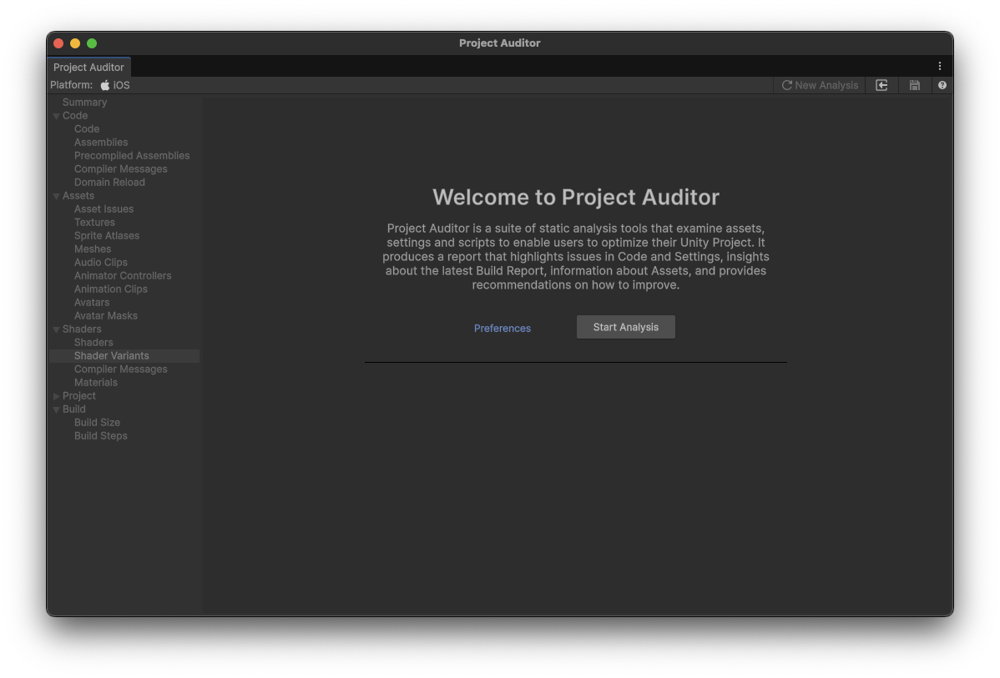
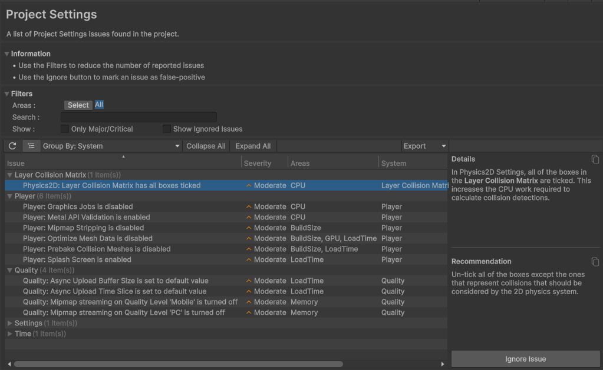
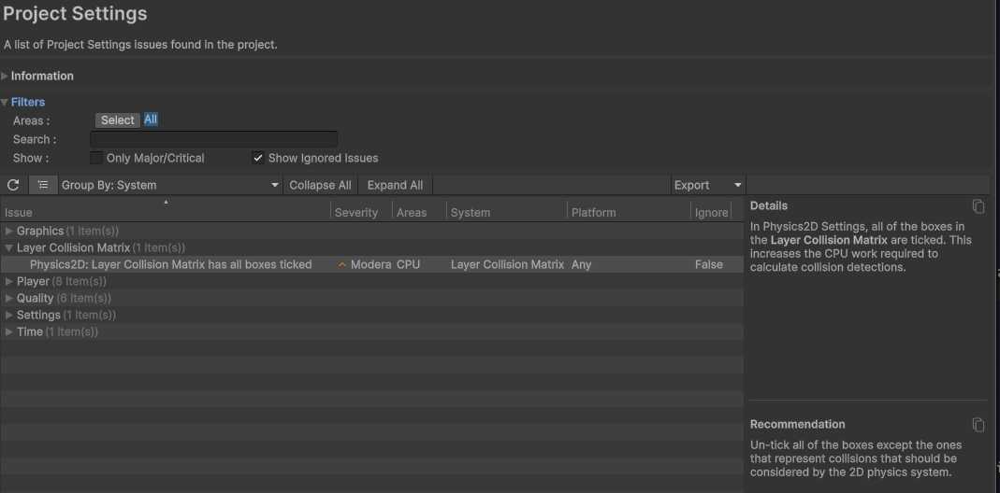
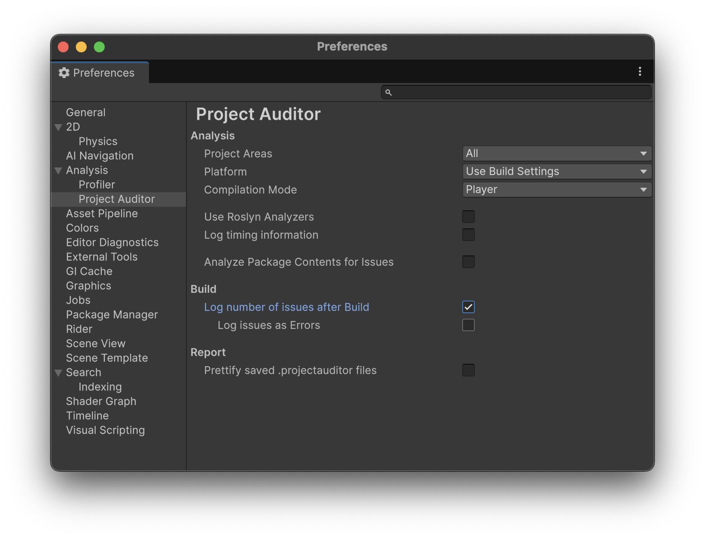

[Unityゲーム開発者ギルド Advent Calendar 2025](https://adventar.org/calendars/12281) の2日目の記事です。

この記事では、Unityプロジェクトを解析するツール「[Project Auditor](https://docs.unity3d.com/Packages/com.unity.project-auditor@1.0/manual/index.html)」についての概要から導入方法、基本的な使い方について紹介します。

## はじめに

ゲーム開発ではプロジェクトの規模が大きくなるにつれて、パフォーマンス問題やメモリに関する潜在的な問題を把握するのが困難になっていきます。

例えば、`Update()`内で`Debug.Log`を呼び出しているようなコードや、圧縮されていない巨大なテクスチャ、リリースするプラットフォーム向けに最適化されていないプロジェクト設定など、多くの問題を手で探し出すのは容易ではありません。

こうした問題を効率的に検出するために、Unity公式から「**Project Auditor**」というツールがパッケージとして提供されています。

### 検証環境

下記のバージョンを用いて検証を行いました。

- Unity: 6000.2.13f1
- Project Auditor: 1.0.2


## Project Auditorとは

Project Auditorは、Unityプロジェクトのコード・アセット・プロジェクト設定を静的解析し、パフォーマンスやメモリに関する問題を検出・レポートするツールです。

Project Auditorでは、主に以下の5つのカテゴリで問題を検出します。

- **コード解析**: C#コードをコンパイル後の中間言語（IL）レベルで解析し、パフォーマンス問題を検出する。例えば、`Update()`などのホットパスで`Debug.Log`を呼び出しているコードや、BoxingによるGCアロケーションなどを検出できる。
- **アセット診断**: テクスチャ、オーディオ、メッシュなどのアセットのインポート設定をチェックする。例えば、圧縮されていないテクスチャや、ストリーミング設定が不適切なオーディオクリップなどを検出できる。
- **シェーダー解析**: シェーダーとシェーダーバリアントを解析する。例えば、コンパイルされたバリアント数が多すぎるシェーダーや、ビルドサイズに影響するシェーダーキーワードなどを確認できる。
- **プロジェクト設定**: Quality SettingsやPlayer Settingsなどのプロジェクト設定を検証する。例えば、モバイル向けに最適化されていないレンダリング設定や、不要な機能が有効になっている設定などを検出できる。
- **ビルドレポート**: ビルド結果を解析し、サイズや依存関係の問題を特定する。例えば、ビルドサイズに大きく影響しているアセットや、意図せず含まれている依存関係などを確認できる。

ビルトインで多くの解析項目が実装されていますが、カスタムアナライザーを実装することで、プロジェクト固有のコーディング規約やルールに基づいた解析も可能です。


## インストール方法

Package Managerから`com.unity.project-auditor`をインストールします。手順は以下のとおりです。

1. Unity Editorで **Window > Package Manager** を開く
2. 左上のプラスボタン（+）をクリックする
3. **Add package by name...** を選択する
4. パッケージ名に `com.unity.project-auditor` を入力する
5. **Add** をクリックする

インストールが完了すると、メニューに **Window > Analysis > Project Auditor** が追加されます。


## 使い方

Project Auditorを起動するには、**Window > Analysis > Project Auditor** を選択します。下図のようなウィンドウが表示されます。



ウィンドウが開いたら、画面右の **Start Analyze** ボタンをクリックすることで解析が開始されます。解析が完了すると下図のような画面に結果が表示されます。


### 解析結果の見方

解析が完了すると、下図のような画面が表示されます。左側のメニューに解析カテゴリが表示され、各カテゴリをクリックすると、右側のペインに検出された問題の一覧が表示されます。


主な解析カテゴリは以下のとおりです。

| カテゴリ | 説明                                                                 |
| ---      | ---                                                                  |
| Summary  | 解析結果のサマリー（問題の総数、カテゴリ別の内訳など）               |
| Code     | コードに関する問題（パフォーマンス、メモリアロケーションなど）       |
| Assets   | アセット（テクスチャ、スプライトアトラス、メッシュなど）に関する問題 |
| Project  | プロジェクト設定やパッケージに関する問題                             |
| Shaders  | シェーダーとシェーダーバリアントの問題                               |
| Build    | ビルドサイズや依存関係の問題                                         |

### 問題の詳細を確認する

問題の一覧から項目を選択すると、右下のペインに詳細情報が表示されます。例えば、**Project > Project Settings** では下図のように詳細情報が表示されます。



基本的にはテーブルビューで問題の一覧が表示されますが、どのようなカラムが含まれるかはカテゴリごとに異なります。

例えば、**Project > Project Settings** では下記のカラムが含まれます。

| カラム   | 説明                                                       |
| ---      | ---                                                        |
| Issue    | 問題の簡潔な説明                                           |
| Severity | 問題の深刻度（Critical、Major、Moderate、Minor）           |
| Areas    | 影響を受ける領域（CPU、Memory、Build Sizeなど）            |
| System   | 関連するProject Settingsのシステム（Physics、Qualityなど） |
| Platform | 問題が影響するプラットフォーム                             |
| Ignored  | 問題が無視されているかどうか                               |

解析結果は、一部のカラムを検索条件に絞り込んで表示できます。下図では、**Areas** が **CPU** で絞り込んで表示しています。


問題をダブルクリックすると、該当するソースコードやアセット、設定にジャンプできます。

また報告された問題のうち、プロジェクトとして問題ないと判断したものは、下図のように該当の問題をクリックして右側に詳細情報を出した後に「Ignore Issues」ボタンをクリックすることで、無視することができます。


ただしこのIgnoreフラグは現状、各解析結果ごとに保持されているため、解析し直すとIgnoreフラグが外れるようです（これが仕様なのかどうかはわからないですが）。

## 問題を確認してみる

実際にProject Auditorで問題を検出してみます。ここでは、コード解析とプロジェクト設定の2つの例を紹介します。

### Update内でのGCアロケーション

Updateなどの毎フレーム呼び出されるメソッド内でアロケーションを行うと、GCによるスパイクが懸念されます。

例えば、下記のようなコードを記述して、問題が報告されるかを確認します。

```csharp
using System.Collections.Generic;
using UnityEngine;

public class SampleApplication : MonoBehaviour
{
    void Update()
    {
        AllocList1();
    }

    void AllocList1()
    {
        var list = new List<string>();
    }

    void AllocList2()
    {
        var list = new List<string>();
    }
}
```

このコードに対してProject Auditorで解析を実行すると、以下のような問題が報告されることが確認できます。


`AllocList1` の方は `Moderate` として、`AllocList2` の方は `Minor` として、どちらも **System.Collections.Generic.List`1<System.String>' allocation** がレポートされています。

静的解析を行っているようで、`AllocList1` の方は `Update` からの呼び出しのため `Moderate` と `AllocList2` よりも重要度が高く報告されていることが確認できます。

### プロジェクト設定（コリジョンマトリックス）

Project AuditorのProjectカテゴリでは、プロジェクト設定を解析します。例えば、Physics Settingsのコリジョンマトリックスで全レイヤー間の衝突が有効になっている場合、下図のように報告されます。



全レイヤー間の衝突判定が有効だと、不要な衝突判定が行われてパフォーマンスに影響を与える可能性があります。
この問題は、**Edit > Project Settings > Physics** のLayer Collision Matrixで、実際に衝突判定が必要なレイヤーの組み合わせのみを有効にすることで対処できます。

このようにProject Auditorを使うことで、コードとプロジェクトなど様々な観点で、パフォーマンスに影響する問題を検知できます。

## レポートの保存と読み込み

解析結果は、ファイルとして保存・読み込みができます。

下図のように、ウィンドウ右上の **Save** ボタン（フロッピーアイコンのボタン）をクリックすると、解析結果を`.projectauditor`形式で保存できます。
また、保存したレポートは、**Load** ボタンから読み込むことができます。


これにより、過去の解析結果との比較や、チームメンバーとの共有が可能になります。


## CLIからの実行

Project AuditorはCLI（コマンドライン）からも実行できます。

CI/CDパイプラインに統合して、プルリクエストやアプリやアセットをビルドする際の品質のチェックに利用できます。

### 実行用スクリプトの作成

CLI実行では、`ProjectAuditor` クラスを自身でインスタンス化して `Audit` メソッドを呼び出すことで解析を行います。

Unityのバッチモードと`-executeMethod`オプションを使用します。以下のような静的メソッドを持つスクリプトを`Editor`フォルダに配置します。

```csharp
using Unity.ProjectAuditor.Editor;
using Unity.ProjectAuditor.Editor.API;
using UnityEditor;
using UnityEngine;

public static class ProjectAuditorCI
{
    public static void AnalyzeAndExport()
    {
        var projectAuditor = new ProjectAuditor();
        var report = projectAuditor.Audit();

        // レポートを保存
        report.Save("ProjectAuditorReport.projectauditor");

        // イシュー数をログ出力
        Debug.Log($"Total issues: {report.NumTotalIssues}");
    }
}
```

上記のスクリプトは、下記のようなコマンドで実行できます。


```bash
/path/to/unity/executable -batchmode -quit -projectPath path/to/your/project -executeMethod ProjectAuditorCI.AnalyzeAndExport
```

ちなみに、レポート結果を元に `EditorApplication.Exit` で `0` 以外の戻り値を返却することで、CI/CDをエラーとして落とすこともできます。

今回触れていませんが、`Audit` には `AnalysisParams` というパラメーターを渡すことで、対象とするコードのアセンブリや重要度などのさまざまな条件を指定して分析ができます。


## ビルド後自動解析

Project Auditorは、Unityのビルド後に自動的に解析を実行する機能もあります。

下図のようにPreferencesを開き、**Analysis > Project Auditor** を選択します。**Build > Log number of issues after Build** を有効化すると、ビルド完了後に自動的にProject Auditorが実行されます。合わせてコンソールにIssue数が出力されます。



また、**Log issues as Errors** を有効にすると、Issueをエラーとしてログ出力し、ビルドを失敗させることもできます。

ちなみに、実行タイミングとしては、`IPostprocessBuildWithReport` の `OnPostprocessBuild` です。

## 終わりに

この記事では、Project Auditorの概要から導入方法、基本的な使い方について紹介しました。

大規模なチームやプロジェクトでは、このような問題を特定するようなツールを開発することが多いです。
ツールの開発やメンテナンスにもそれなりの工数がかかったり、プロジェクトごとにツールが独自で再利用がしづらいこともあるので、このようなツールが標準的になるのは良いことかなと感じました。

一方で、[昨日紹介したSprite Atlas Analyzer](https://blog.yucchiy.com/2025/12/sprite-atlas-analyzer-unity63)と役割が似ているところがあるので、正直どちらかに統一するなどして欲しいな、と思うところがあったりはします。

また、CLIとウインドウビューでフィルタールールが共有できない、Ignoreフラグを解析を跨いで保持できないとかは、おそらくしっかり運用していくと見えてくる課題も多そうだなと感じました。

しかし、手前でも触れましたが、このようなツールが標準であるのはとてもいいことだと思うので、期待したいですし、今後もキャッチアップして発信できればな、と。
この記事で触れられてないカスタムアナライザーやCLIからの呼び出し方の詳細は、後日また記事にできればと思っています。

## 参考

- [Project Auditor package | Project Auditor | 1.0.2](https://docs.unity3d.com/Packages/com.unity.project-auditor@1.0/manual/index.html)
- [Project Auditor introduction | Project Auditor | 1.0.2](https://docs.unity3d.com/Packages/com.unity.project-auditor@1.0/manual/project-auditor-introduction.html)
- [Analyze your project | Project Auditor | 1.0.2](https://docs.unity3d.com/Packages/com.unity.project-auditor@1.0/manual/analyze-project.html)
- [Project Auditor window reference | Project Auditor | 1.0.2](https://docs.unity3d.com/Packages/com.unity.project-auditor@1.0/manual/project-auditor-window.html)
- [Run Project Auditor from the command line | Project Auditor | 1.0.2](https://docs.unity3d.com/Packages/com.unity.project-auditor@1.0/manual/run-from-command-line.html)
