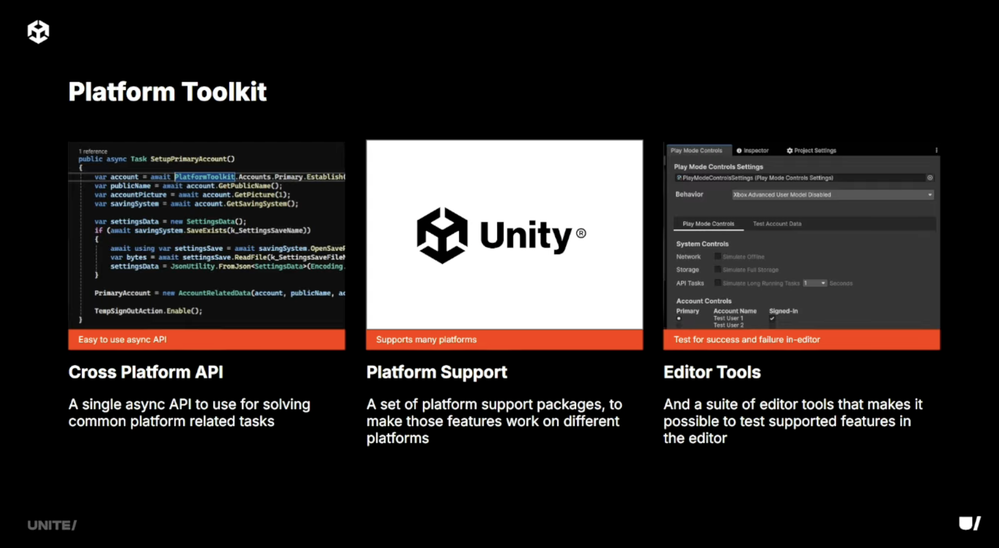
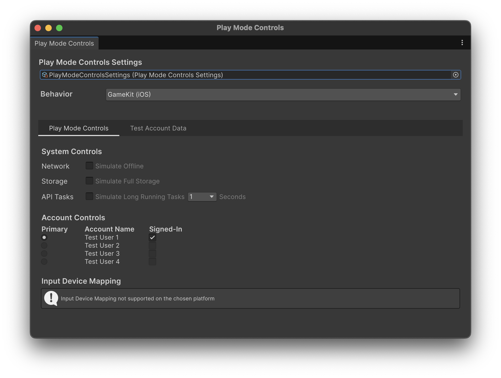
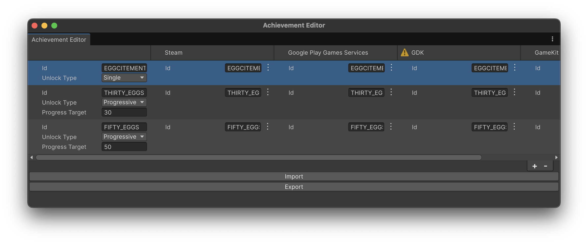

Unity6.3から利用できるUnity公式のパッケージ「[Platform Toolkit](https://docs.unity3d.com/Packages/com.unity.platformtoolkit@1.0/manual/index.html)」の概要と簡単な使い方を紹介します。

この記事はPlatform Toolkitで何ができるのか、を理解するのを主軸に記事を書いているため、iOS・Androidなどの固有のプラットフォーム上での動作確認は行っていません。また、各機能の詳細な説明も省いています。


## 概要

Platform Toolkitは、プラットフォームの提供するアカウントやアチーブメントなどの機能を、複数プラットフォーム跨いで統一的なAPIで扱うことのできるUnity公式のパッケージです。

プラットフォーム固有の機能は基本的にはそれぞれの実機上でしか動作しないため、開発時のテストが難しいですが、Play Mode Controlsという、プラットフォームの挙動をシミュレートすることで、エディター上でPlatform Toolkitのテストを行う仕組みも合わせて提供しています。

今年のUnite 2025のロードマップセッションで、Unity 6.3から利用可能であることが発表されました。


またUnite 2025でも、「[Abstracting platform features with Platform Toolkit | Unite 2025](https://www.youtube.com/watch?v=kvAfczwPVtc)」というタイトルでPlatform Toolkitの解説セッションがありました。




### 対応するプラットフォーム

現在、下記のプラットフォームをサポートしています。

- Android
    - [GooglePlay Game Services](https://developers.google.com/games/services) をサポート
- iOS
    - [GameKit](https://developer.apple.com/documentation/gamekit/) をサポート
- Xbox & Windows
    - [Microsoft Game Development Kit](https://learn.microsoft.com/en-us/gaming/gdk/) をサポート
- Steam
    - [Steamworks](https://partner.steamgames.com/) をサポート

また、下記に示すClosed Platformもサポートしています。

- PlayStation®5
- Xbox Series X|S and Xbox One
- Nintendo Switch™ and Nintendo Switch™ 2

これらのプラットフォーム上での開発は、それぞれのプラットフォームへの開発者申請が必要です。

開発する権限がある場合は、[Game development for console platforms](https://unity.com/solutions/console)を参考に、ドキュメントにアクセスすることで、Platform Toolkitが利用できるようです。


### 主要な機能

Platform Toolkitでは現状、下記の機能を提供しています。

- アカウント管理
    - プラットフォームの提供するアカウントにアクセスできる
- アチーブメント管理
    - プラットフォームの提供するアチーブメント（実績）の管理を行える
- セーブシステム
    - プラットフォームの提供するセーブデータ管理を利用できる


### パッケージ構成

Platform Toolkitは、本体パッケージである `com.unity.platformtoolkit` とプラットフォーム固有のパッケージで構成されています。

現状配布されている、プラットフォーム固有のパッケージの一覧は下記の通りです。

- Android: `com.unity.platformtoolkit.playgamesservices`
    - [Platform Toolkit package for Google Play Games Services | Platform Toolkit for Google Play Games Services | 1.0.0](https://docs.unity3d.com/Packages/com.unity.platformtoolkit.playgamesservices@1.0/manual/index.html)
- iOS: `com.unity.platformtoolkit.gamekit`
    - [Platform Toolkit package for GameKit | Platform Toolkit for GameKit | 1.0.0](https://docs.unity3d.com/Packages/com.unity.platformtoolkit.gamekit@1.0/manual/index.html)
- Xbox & Microsoft: `com.unity.platformtoolkit.gdk`
    - [Platform Toolkit package for GDK | Platform Toolkit for GDK | 1.0.0](https://docs.unity3d.com/Packages/com.unity.platformtoolkit.gdk@1.0/manual/index.html)
- Steam: `com.unity.platformtoolkit.steam`
    - [Platform Toolkit package for Steamworks | Platform Toolkit for Steam | 1.0.0](https://docs.unity3d.com/Packages/com.unity.platformtoolkit.steam@1.0/manual/index.html)

そのため、本体パッケージと対応したいプラットフォームのパッケージをインストールし、各プラットフォームごとの設定をドキュメントに従って設定することで、プラットフォーム側の対応が行えます。


## インストール

前述の通り、Platform Toolkitを利用するためには、本体パッケージと対応したいプラットフォームのパッケージをインストールする必要があります。


### 本体パッケージのインストール

Package Manager経由で `com.unity.platformtoolkit` をインストールします。

1. Unity Editorで `Window` > `Package Manager` を開く
2. 左上の `+` ボタンをクリック
3. `Add package by name...` を選択
4. `com.unity.platformtoolkit` と入力
5. `Add` をクリック


### プラットフォームモジュールのインストール

本体パッケージに加えて、対応したいプラットフォームのモジュールをインストールします。利用可能なモジュールは下記の通りです。

- Android: `com.unity.platformtoolkit.playgamesservices`
- iOS: `com.unity.platformtoolkit.gamekit`
- Xbox & Microsoft: `com.unity.platformtoolkit.gdk`
- Steam: `com.unity.platformtoolkit.steam`

各プラットフォームモジュールも、本体パッケージと同様にPackage Managerからインストールできます。

各パッケージのasmdefが、そのモジュールが利用できるプラットフォームのみ利用できるように設定されているため、複数プラットフォーム対応の際は、基本的には必要なモジュールを全てインストールしておいても問題ないです。

また、どのビルドターゲットに対してどのプラットフォームを利用するかは、「Project Settings > Platform Toolkit」から確認・設定できます。


### `PlayModeControlsSettings` アセットの作成

エディター内でPlatform Toolkitのテストを行うために、`PlayModeControlsSettings`アセットを作成します。

`PlayModeControlsSettings`は、Play Mode Controlsによるエディター上でのテストを行う際の、各機能の挙動やテストアカウントの情報を管理するためのアセットです。



下記の手順で作成します。

1. `Window` > `Platform Toolkit` > `Play Mode Controls` を選択し、ウインドウを開く
2. `Create Play Mode Controls Settings` をクリック
3. 設定アセットの保存場所を指定して、アセットを作成


## 基本的な使い方

Platform Toolkitの基本的な使い方として、アカウントの取得とそれに紐づくシステムへのアクセス方法を紹介します。

### 初期化

Platform Toolkitを利用するには、`PlatformToolkit.Initialize` メソッドを用いて初期化を行う必要があります。

```csharp
private async Task InitializeAsync()
{
    PlatformToolkit.Initialized += () => Debug.Log($"Initialized PlatformToolkit.");
    await PlatformToolkit.Initialize();
}
```

`PlatformToolkit.Initialize` は非同期メソッドなので、awaitなどを用いて完了を待ちます。

await後は初期化が完了しているので、ここから各種機能が利用できますが、もし初期化後のイベントを受け取りたい場合は、`PlatformToolkit.Initialized` というイベントも別途用意されています。


### キャパビリティについて

Platform Toolkitは複数のプラットフォームのそれぞれの機能を抽象化して提供しますが、プラットフォームによってはサポートしていない機能も存在します。

Platform Toolkitでは、キャパビリティ（Capabilities）という、そのプラットフォームがサポートする機能を確認するための仕組みが用意されています。

今実行しているプラットフォームのキャパビリティは、`PlatformToolkit.Capabilities` というインスタンスを介して確認できます。

`PlatformToolkit.Capabilities` は `ICapabilities` インターフェイスで、下記のように定義されています。

```csharp
public interface ICapabilities
{
    /// Indicates, if accounts are supported.
    bool Accounts => false;

    /// Indicates, if the primary account is supported.
    bool PrimaryAccount => false;

    /// Indicates, if account picker is supported.
    bool AccountPicker => false;

    /// Indicates, if input ownership is supported.
    bool InputOwnership => false;

    /// Indicates, if platform has limits on calling <see cref="IPrimaryAccountSystem.Establish"/>.
    bool PrimaryAccountEstablishLimited => false;

    /// Indicates, if accounts support saving.
    bool AccountSaving => false;

    /// Indicates, if accounts support achievements.
    bool AccountAchievements => false;

    /// Indicates if account can be manually signed out by calling <see cref="IAccount.SignOut"/>.
    bool AccountManualSignOut => false;

    /// Indicates, if <see cref="PlatformToolkit.LocalSaving"/> is supported.
    bool LocalSaving => false;
}
```

初期化時に、実行環境に応じて、プラットフォームごとにこのインターフェイスを実装したクラスのインスタンスが `PlatformToolkit.Capabilities` に割り当てられます。

この手の実装を `ifdef` などプリプロセッサディレクティブを用いて分岐すると、プラットフォームが増えるごとにコードが分岐して保守が大変ですが、キャパビリティを用いることでプラットフォームを意識せずに機能実装に集中できます。


### プライマリアカウントの取得

Platform Toolkitにおけるプライマリアカウントとは、アプリ起動時にデバイスまたはプラットフォームにシステムレベルでサインインしているメインのユーザープロファイルのことを指します。

例えばiOSであれば、GameCenterのゲームに紐付けているアカウントがプライマリアカウントになります。

下記に、プライマリアカウントの情報を取得する実装を示します。


```csharp
private async Task GetPrimaryAccountAsync()
{
    if (!PlatformToolkit.Capabilities.PrimaryAccount)
    {
        Debug.LogWarning("Primary account is not supported.");
        return;
    }

    try
    {
        var account = await PlatformToolkit.Accounts.Primary.Establish();
        var accountName = await account.GetName();
        Debug.Log($"Primary account name: {accountName}");
    }
    catch (UserRefusalException e)
    {
        Debug.LogError($"User refused to sign in.");
        Debug.LogException(e);
    }
    catch (TemporarilyUnavailableException e)
    {
        Debug.LogError($"Either a network error or sign in limit was exceeded.");
        Debug.LogException(e);
    }
}
```

プラットフォームがプライマリアカウントをサポートしているかは、`PlatformToolkit.Capabilities` の `PrimaryAccount` プロパティで確認できます。このプロパティが `true` を返すプラットフォームのみ、プライマリアカウントが使えるものとして処理を記述します。

プライマリアカウントを取得するには、`PlatformToolkit.Accounts` プロパティの `Primary.Establish` メソッドを呼び出します。

このメソッドも非同期メソッドになっています。もしユーザーがアカウントログインをしていない場合には、ユーザーのログインを待って、完了した時のユーザー情報を、 `IAccount` インターフェイスで返却します。

そのため、ユーザーがログイン処理を拒否した場合は `UserRefusalException` を投げます。プライマリアカウントが必須なアプリケーション要件の場合は、ここで例外を受け取ったらゲームを進めないなどの実装が必要になるかと思います。

エディター上では、ユーザーのログイン状況はPlay Mode Controlsで確認できます。ログインしていない場合、Play Mode Controls上で下記のようにログインを促されます。


また、ログイン処理はプラットフォームのAPIを叩くなどの外部処理を挟む場合があり、ネットワークの状況によっては成功しない場合があります。その場合は `TemporarilyUnavailableException` を返却します。

Play Mode Controlsの「System Controls > Network > Simulate Offline」をONにすることでエディター上でネットワークエラーの挙動を再現できます。


同項目の「API Tasks > Simulate Long Running Tasks」をONにすることで、APIの応答が、指定した秒数遅延して結果を返却するようになります。低遅延なネットワーク環境を想定したテストをエディター上で行いたい場合は、合わせて利用すると良いでしょう。


### アチーブメントシステムの利用

アチーブメントシステムはその名の通り、プラットフォームの実績を管理するための仕組みです。

最近では、多くのプラットフォームでアチーブメントが実装されており、Platform Toolkitを用いることで、複数のプラットフォームのアチーブメントを同時に実装できます。

Platform Toolkitでは現状、下記の2種類のアチーブメントをサポートしています。

- **Single**: 最初の1回だけ解除されるアチーブメント
    - 例えば、最初のクリスタルを獲得した、などで得られるアチーブメント
- **Progressive**: 特定の進捗で解除されるアチーブメント
    - 例えば、クリスタルを30個獲得した、などで得られるアチーブメント

まず、Platform Toolkitを用いて、アチーブメントを操作する実装を示します。

```csharp
// accountは、PrimaryAccount.Establish() で取得できるものなどを渡す
private async Task UpdateAchievements(IAccount account)
{
    // アチーブメントを利用できるかの判定
    if (!PlatformToolkit.Capabilities.AccountAchievements)
    {
        Debug.LogWarning("Account achievements is not supported.");
        return;
    }

    try
    {
        var achievement = await account.GetAchievementSystem();
        // Singleで定義される実績を解除
        achievement.Unlock("EGGCITEMENT");
        // Progressiveで定義される進捗を更新
        achievement.UpdateProgress("THIRTY_EGGS", 30);
    }
    catch (InvalidAccountException e)
    {
        Debug.LogError($"User already signed out.");
        throw;
    }
}
```

プラットフォームがアチーブメントをサポートしているかどうかは、`PlatformToolkit.Capabilities` の `AccountAchievements` プロパティによって判定できます。

ユーザーのアチーブメントの解除や進捗の更新は `IAccount` インターフェイスの `GetAchievementSystem()` で取得できる `IAchievementSystem` インターフェイスによって行います。

多くのケースでは、プライマリアカウントのアチーブメントを操作することになると思うので、事前に `Primary.Establish` メソッドを用いて得られた `IAccount` インターフェイスのインスタンスを用いることになるかと思います。

ゲーム上のアチーブメントは、「Achievement Editor」を用いてデータを作成します。
下記の手順でアチーブメントを編集します。

1. `Window` > `Platform Toolkit` > `Achievement Editor` を選択し、ウインドウを開く
2. アチーブメントごとに、IDとUnlock Type（Single or Progressive）、Progressiveの場合は達成時の数値をProgress Targetに設定
3. 各プラットフォームごとのIDを設定する。



ちなみにアチーブメントは、[CSVを用いてインポート・エクスポート](https://docs.unity3d.com/Packages/com.unity.platformtoolkit@1.0/manual/achievements/import-achievement-data.html)が行えます。

また、上記の例で「卵を50個」取得するアチーブメントを作成したい場合は、新しいIDを割り振る必要があるようです。

つまり、例えば `FIFTY_EGGS` というIDを割り振り、Unlock Typeを `Progressive` にした上で、Progress Targetを `50` に設定したアチーブメントを新たに作成します。

同じ種類のアイテムの個数違いのアチーブメントの場合でも、別IDを割り振る必要があるため、同じアイテムに対応するアチーブメントには、全て進捗を更新するなどの実装が必要かもしれません。

```csharp
// アカウントに紐づくゲームデータから、卵の個数をとる
var userEggCount = GetUserEggCount(account);
// 全ての卵の個数に関するアチーブメントの進捗を更新する
achievement.UpdateProgress("THIRTY_EGGS", userEggCount);
achievement.UpdateProgress("FIFTY_EGGS", userEggCount);
```


### セーブシステムへのアクセス

セーブシステムでは、プラットフォームのアカウントに対応するゲームのセーブデータを保存・読み込みできます。

セーブシステムの内部実装はプラットフォームごとに異なります。

また、アカウントに依存しないローカルセーブシステムもサポートしています。

下記に、アカウントに紐づくセーブシステムが使えればそちらを、使えなければローカルセーブシステムを取得する例を示します。

```csharp

ISavingSystem savingSystem;
if (PlatformToolkit.Capabilities.Accounts)
{
    try
    {
        savingSystem = await account.GetSavingSystem();
    }
    catch (InvalidAccountException e)
    {
        // Handle signed out account
        throw;
    }
}
else if (PlatformToolkit.Capabilities.LocalSaving)
{
    savingSystem = PlatformToolkit.LocalSaving;
}
else
{
    throw new NotSupportedException($"Saving System not supported.");
}
```

プラットフォームがセーブシステムをサポートしているかどうかは、`PlatformToolkit.Capabilities` の `Accounts` プロパティによって判定できます。また、ローカルセーブシステムのサポートは `PlatformToolkit.Capabilities` の `LocalSaving` プロパティによって判定できます。

アカウントに紐づくセーブシステムは `IAccount` インターフェイスの `GetSavingSystem` メソッドから、ローカルセーブは `PlatformToolkit.LocalSaving` からそれぞれ取得できます。

どちらも `ISavingSystem` インターフェイスを実装しているので、共通のAPIでセーブデータを操作できます。

次に、セーブシステムへのデータの書き込みについて説明します。まず、その実装を下記に示します。

```csharp
var savingSystem = await account.GetSavingSystem();

// 2つデータを用意
var saveData1 = new byte[] { 0, 1, 2, 3, 4, 5, 6, 7, 8, 9 };
var saveData2 = new byte[] { 10, 11, 12, 13 };

// SAVE_DATAという名前でセーブの書き込みハンドラを定義
var writable = await savingSystem.OpenSaveWritable("SAVE_DATA");

// items1というファイルに書き込み
await writable.WriteFile("items1", saveData1);
// items2というファイルに書き込み
await writable.WriteFile("items2", saveData2);
// 実際には、この呼び出しが完了したら、items1とitems2が書き出される
await writable.Commit();

// ちなみにCommitしたらwritableはDisposeされて使えなくなる
// await writable.WriteFile("items1", saveData1);
```

書き込みを行うには、`ISavingSystem` の `OpenSaveWritable` メソッドを用いて、指定した名前のセーブデータの書き込み用ハンドラ（`ISaveWritable`）を取得します。その後、そのハンドラを用いてファイルを書き込みます。

`ISaveWritable` の `Task WriteFile(string name, byte[] data)` メソッドでは、`name` で指定したファイル名のセーブデータに対して `data` で指定したデータを書き出します。`ISaveWritable` では、複数個のファイルに対しての書き込みができます。

ちなみに、セーブシステムは下記のような構造になっています。


ファイルの書き込みは、実際には直ちに実施されるわけではなく、`ISaveWritable` の `Task Commit()` の呼び出しが完了した時に、全てのファイルの書き込みが完了します。

もし、`Commit` メソッドの実行が失敗して例外が投げられた際には、保存内容の変更は全て破棄される、という仕様になっています。

ユーザーのセーブデータは、複数のファイルに書き出したいという要件もあると思うので、この仕様によりセーブデータ更新のアトミック性を担保しようというデザインなのだと思われます。

セーブデータの読み込みについては、書き込み時と同じように、読み込み用のハンドラを取得し、そのハンドラ経由で読み込みを行います。

書き込んだセーブデータを読み込み実装を下記に示します。

```csharp
var readable = await savingSystem.OpenSaveReadable("SAVE_DATA");
// Check items1 exists = True
Debug.Log($"Check items1 exists = {await readable.ContainsFile("items1")}");

var sb = new StringBuilder();
foreach (var t in saveData1)
{
    sb.Append($"{t.ToString()}, ");
}
// saveData1 = { 0, 1, 2, 3, 4, 5, 6, 7, 8, 9,  }
Debug.Log($"saveData1 = {{ {sb} }}");
sb.Clear();

var readData1 = await readable.ReadFile("items1");
foreach (var t in readData1)
{
    sb.Append($"{t.ToString()}, ");
}
// readData1 = { 0, 1, 2, 3, 4, 5, 6, 7, 8, 9,  }
Debug.Log($"readData1 = {{ {sb} }}");
```

エディター上のセーブデータは、PlayModeControls ウインドウから、各ユーザーごとにエクスポート・インポートできます。

## まとめ

Unity 6.3から利用できる Platform Toolkit について、このパッケージの概要から、初期化からキャパビリティによるサポート状況の確認、プライマリアカウントの取得、アチーブメントシステムとセーブシステムなどの基本的なパッケージの利用方法を紹介しました。

Platform Toolkitを利用することで、複数プラットフォームの機能を統一的に扱うことができ、マルチプラットフォーム対応の開発効率の向上が期待できそうです。また、Play Mode Controlsを用いることで、エディター上である程度の動作確認ができる点も便利そうです。

この記事では、基本的な使い方とエディター上での動作をメインで説明しましたが、時間があれば、それぞれの機能の使い方の詳細や、プラットフォーム固有のパッケージの導入についても記事を書きたいと思います。
（と言いつつ、プラットフォーム固有パッケージの方は、個人で検証できるものに限度があるので、できないものは難しいですが...）

## 参考

- [Platform Toolkit - Official cross platform API - now available for 6.3 - Unity Engine - Unity Discussions](https://discussions.unity.com/t/platform-toolkit-official-cross-platform-api-now-available-for-6-3/1698376)
- [Abstracting platform features with Platform Toolkit | Unite 2025 - YouTube](https://www.youtube.com/watch?v=kvAfczwPVtc)
- [The Unity Engine roadmap | Unite 2025 - YouTube](https://www.youtube.com/watch?v=rEKmARCIkSI)
- [Platform Toolkit | 1.0.0](https://docs.unity3d.com/Packages/com.unity.platformtoolkit@1.0/manual/index.html)
- [Platform Toolkit package for Google Play Games Services | Platform Toolkit for Google Play Games Services | 1.0.0](https://docs.unity3d.com/Packages/com.unity.platformtoolkit.playgamesservices@1.0/manual/index.html)
- [Platform Toolkit package for GameKit | Platform Toolkit for GameKit | 1.0.0](https://docs.unity3d.com/Packages/com.unity.platformtoolkit.gamekit@1.0/manual/index.html)
- [Platform Toolkit package for GDK | Platform Toolkit for GDK | 1.0.0](https://docs.unity3d.com/Packages/com.unity.platformtoolkit.gdk@1.0/manual/index.html)
- [Platform Toolkit package for Steamworks | Platform Toolkit for Steam | 1.0.0](https://docs.unity3d.com/Packages/com.unity.platformtoolkit.steam@1.0/manual/index.html)
- [Google Play Game Services](https://developers.google.com/games/services)
- [GameKit | Apple Developer Documentation](https://developer.apple.com/documentation/gamekit/)
- [Microsoft Game Development Kit](https://learn.microsoft.com/en-us/gaming/gdk/)
- [Steamworks](https://partner.steamgames.com/)
- [Game development for console platforms | Unity](https://unity.com/solutions/console)

