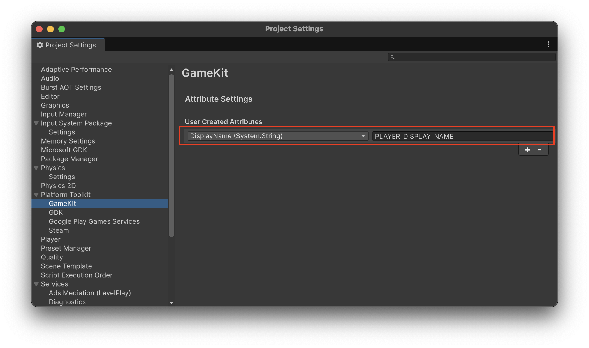

この記事では、Platform Toolkitのアカウントシステムに焦点を当てて説明します。

Platform Toolkitの概要については、「[Unity6.3から利用できるPlatform Toolkitについて](https://blog.yucchiy.com/2026/01/intro-platform-toolkit)」を参考にしてください。


## プライマリアカウントの取得

Platform Toolkitにおけるプライマリアカウントとは、アプリ起動時にデバイスまたはプラットフォームにシステムレベルでサインインしているメインのユーザープロファイルのことを指します。

例えばiOSであれば、GameCenterのゲームに紐付けているアカウントがプライマリアカウントになります。

下記に、プライマリアカウントの情報を取得する実装を示します。


```csharp
var account = await PlatformToolkit.Accounts.Primary.Establish();
```

プライマリアカウントを取得するには、`PlatformToolkit.Accounts` プロパティの `Primary.Establish` メソッドを呼び出します。

このメソッドは非同期メソッドになっていて、ユーザーのログイン完了を待って、ログインユーザー情報を `IAccount` インターフェイスで返却します。


### プライマリアカウント取得時の例外ハンドリング

プライマリアカウント取得時には、下記の例外を投げる可能性があります。

- `UserRefusalException`
    - ユーザーがサインインを拒否した場合
- `TemporarilyUnavailableException`
    - ネットワークエラーなど何かしらの理由でサインインプロンプトが表示できない場合

これを踏まえて、概ね下記のようなエラーハンドリングが必要です。

```csharp
try
{
    var account = await PlatformToolkit.Accounts.Primary.Establish();
    // これ以降ユーザーがログインしている前提で処理を書く
}
catch (UserRefusalException e)
{
    // ユーザーがログインを拒否
    // ログインが必須の場合は、ここでタイトルバックなどを行ってゲームを進行させない
    // 任意の場合は処理を進める
    Debug.LogError($"User refused to sign in.");
}
catch (TemporarilyUnavailableException e)
{
    // 何かしらの理由でログイン処理が行えなかった場合
    // ネットワークエラーなども含むので、リトライ処理が適切？
}
```


### `ICapabilities` の `PrimaryAccountEstablishLimited`

`PlatformToolkit.Capabilities` には、`PrimaryAccountEstablishLimited` というプロパティが存在します。

このプロパティが `false` の場合は、`Establish` メソッドを必要に応じて何度呼び出しても問題ないようです。
コンソールやプラットフォーム上で常にサインインしているようなケースで、このプロパティが `false` になるようです。

逆に `true` の場合、（おそらくAPIリミットなどが設けられていて）期間内での `Establish` の呼び出しに制限がかかる可能性があります。


## アカウント管理に関する主要なキャパビリティ

アカウント管理に関するキャパビリティは下記の通りです。それぞれ機能を利用する前に、キャパビリティを確認する必要があります。

```csharp
public interface ICapabilities
{
    /// アカウントをサポートしているか
    bool Accounts => false;

    // プライマリアカウントをサポートしているか
    bool PrimaryAccount => false;

    // アカウントピッカーをサポートしているか
    bool AccountPicker => false;

    // ユーザーの手動サインアウトをサポートしているか
    bool AccountManualSignOut => false;
}
```

例えば、プライマリアカウントを取得する時には、下記のように実装します。

```csharp
if (PlatformToolkit.Capabilities.PrimaryAccount)
{
    // プライマリアカウントをサポートしているプラットフォーム
    var account = await PlatformToolkit.Accounts.Primary.Establish();
}
```

もし、そのキャパビリティがない場合に代替機能が用意できるのであれば、そのような実装を行います。

例えば、プライマリアカウントのサポート状況によって、ローカルセーブで代替する実装は下記のように実現できます。

```csharp
ISavingSystem savingSystem;
if (PlatformToolkit.Capabilities.PrimaryAccount)
{
    // プライマリアカウントをサポートしているプラットフォーム
    var account = await PlatformToolkit.Accounts.Primary.Establish();
    // プライマリアカウントが取得できる場合は、紐づくセーブシステムを利用
    savingSystem = await account.GetSavingSystem();
}
else
{
    // サポートしていない場合、代替手段を用意できるなら用意する
    if (PlatformToolkit.Capabilities.LocalSaving)
    {
        savingSystem = PlatformToolkit.LocalSaving;
    }
    else
    {
        // 用意できない場合は要件次第だが、無理ならゲームを進行させないなどの対応が必要
        throw new NotSupportedException();
    }
}
```


## ユーザー情報の取得

`IAccount` を介して、ユーザーの名前やユーザーアイコンを取得できます。

```csharp
// string
var name = await account.GetName();
// Texture2D
var picture = await account.GetPicture();
```

また、そのアカウントに紐づくセーブシステムやアチーブメントシステムも、`IAccount` を介して取得できます。

```csharp
// そのユーザーに紐づくアチーブメントの操作を行うシステム
var achievementSystem = await account.GetAchievementSystem();
// そのユーザーに紐づくセーブデータを扱うシステム
var savingSystem = await account.GetSavingSystem();
```

### 属性（Attributes）

Platform Toolkitでは、実行中のプラットフォーム固有の情報を取得するために、属性（Attributes）という仕組みが用意されています。

事前に、各プラットフォームで取得できる情報を、どういう属性名に割り当てるかという設定を行っておくことで、その属性名で値を取得できるようになります。

この設定は「Edit > Project Settings」などでProject Settingsを開き、「PlatformTookit > 各プラットフォーム」にある「Attribute Settings > User created attributes」から設定します。
例えば、下記のように設定することで、GameKit（iOS）上で `PLAYER_DISPLAY_NAME` という属性名で `GKLocalPlayer.local` の [`displayName`](https://developer.apple.com/documentation/gamekit/gkplayer/displayname) の値が取得できます。



各プラットフォームでどのような属性がどういう名前で利用できるかは、それぞれのプラットフォームのドキュメントから確認できます。

- GooglePlay Game Services (Android):
    - [Google Play Games Services account attributes reference | Platform Toolkit for Google Play Games Services | 1.0.0](https://docs.unity3d.com/Packages/com.unity.platformtoolkit.playgamesservices@1.0/manual/account-attributes.html)
- GameKit (iOS):
    - [GameKit account attributes reference | Platform Toolkit for GameKit | 1.0.0](https://docs.unity3d.com/Packages/com.unity.platformtoolkit.gamekit@1.0/manual/account-attributes.html)
- Steamworks (PC):
    - [Steamworks account attributes reference | Platform Toolkit for Steam | 1.0.0](https://docs.unity3d.com/Packages/com.unity.platformtoolkit.steam@1.0/manual/account-attributes.html)
- Microsoft GDK (Xbox・Windows):
    - [GDK account attributes reference | Platform Toolkit for GDK | 1.0.0](https://docs.unity3d.com/Packages/com.unity.platformtoolkit.gdk@1.0/manual/account-attributes.html)

設定をした属性は、下記のような実装で取得できます。

```csharp
// 属性が取得できるかチェック
if (primaryAccount.HasAttribute<string>("PLAYER_DISPLAY_NAME"))
{
    // 実際の取得
    var displayName = await primaryAccount.GetAttribute<string>("PLAYER_DISPLAY_NAME");
}
```

属性の存在チェックや実際の取得の際に、型パラメータでその属性の型を指定します。
例えば上記の `PLAYER_DISPLAY_NAME` の場合、`displayName` の型は `string` なので `GetAttribute<string>("PLAYER_DISPLAY_NAME")` とします。

属性名はプラットフォームを跨いで同じ名前をつけることができます。例えば `PLAYER_DISPLAY_NAME` という属性名を、GameKitでは `displayName` に、Steamでは `PersonaName` に設定しておけば、プラットフォーム固有の処理を記述することなく `PLAYER_DISPLAY_NAME` で統一的にプレイヤーの表示名を取得できます。


### `InvalidAccountException`

プラットフォームによっては、ユーザーがいつでもサインアウトする可能性があります。

サインアウトした状態で各種システムを介してアカウント情報にアクセスすると、`InvalidAccountException` という例外を吐いて処理が失敗します。

そのため、例えば下記のように `InvalidAccountException` を要件に応じて適切にハンドリングする必要があります。

```csharp
try
{
    var achievementSystem = await account.GetAchievementSystem();
}
catch (InvalidAccountException e)
{
    // GetAchievementSystem()が完了する前にユーザーがサインアウトするとこの行に到達する
    // プラットフォームのユーザー情報を操作する時にこの例外が投げられる可能性があるため
    // それらの操作が要件上必須の場合は、タイトルバックして再ログインを促す実装が推奨される
}
```


### ログイン状態の変更の検知

`PlatformToolkit.Accounts` の `OnChange` コールバックを用いることで、アカウントの状態の変更を検知できます。

プライマリアカウントのログアウトを検知する実装を、下記に示します。

```csharp
// ログインしたプライマリアカウントをフィールドなどに保持しとく
_primaryAccount = await PlatformToolkit.Accounts.Primary.Establish();

PlatformToolkit.Accounts.OnChange += (account, newState) =>
{
    if (_primaryAccount == account && newState == AccountState.SignedOut)
    {
        // プライマリアカウントがログアウトしたので
        // プライマリアカウントが必須なゲームの場合は
        // タイトルバックして再ログインさせるなどの実装を仕込むことができる
        Debug.Log($"Primary account changed to signed out");
    }
};
```

## アカウントピッカーと複数アカウントの扱い

アカウントピッカーAPIを用いると、ネイティブUI上でユーザーアカウントを選択して、そのユーザーでゲームにサインインするような機能を実装できます。

例えば、コンソールゲームなどでローカルマルチプレイヤーゲームを開発する場合、アカウントピッカーAPIを用いて、各ローカルプレイヤーにプラットフォームアカウントでサインインするような実装が可能です。

下記に、2プレイヤーにそれぞれプラットフォームアカウントでのログインを促す実装を示します。

```csharp
if (!PlatformToolkit.Capabilities.AccountPicker)
{
    Debug.LogWarning("Account picker is not supported.");
    return;
}

IAccount player1 = await PlatformToolkit.Accounts.Picker.Show();
Debug.Log($"Player1 selected: {await player1.GetName()}");
IAccount player2 = await PlatformToolkit.Accounts.Picker.Show();
Debug.Log($"Player2 selected: {await player2.GetName()}");

IReadOnlyList<IAccount> totalPlayers = PlatformToolkit.Accounts.SignedIn;
Debug.Log($"Total players: {totalPlayers.Count}");
foreach (IAccount player in totalPlayers)
{
    Debug.Log($"  {await player.GetName()}");
}
```

プラットフォームがアカウントピッカーをサポートしているかは、`PlatformToolkit.Capabilities` の `AccountPicker` で確認できます。

`PlatformToolkit.Accounts.Picker` の `Show` メソッドを用いて、アカウントの選択画面をネイティブUIで表示します。
返却されるアカウント情報は `IAccount` で取得できるので、プライマリアカウントと同様にユーザーの情報の取得やシステムへのアクセスができます。

また、ゲーム上で現在サインインしているアカウントの一覧は `PlatformToolkit.Accounts` の `SignedIn` プロパティで取得できます。


## まとめ

この記事では、Platform Toolkitのアカウント管理システムについて、プライマリアカウントの取得から、ユーザー情報の取得、属性、アカウントピッカーによる複数アカウント対応まで説明しました。
