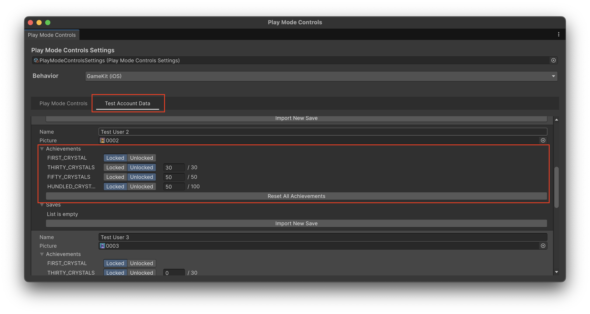

この記事では、Platform Toolkitのアチーブメントシステムに焦点を当てて説明します。

Platform Toolkitの概要については「[Unity6.3から利用できるPlatform Toolkitについて](https://blog.yucchiy.com/2026/01/intro-platform-toolkit)」を、アカウント管理については「[Platform Toolkitのアカウントシステムについて](https://blog.yucchiy.com/2026/01/platform-toolkit-acccount-system)」を参考にしてください。

## アチーブメントシステムへのアクセス

Platform Toolkitのアチーブメントシステムは、プラットフォームの提供する実績機能を統一的なAPIで扱うための仕組みです。

まず、プラットフォームがアチーブメント機能をサポートしているかを、キャパビリティで確認する必要があります。

下記に、キャパビリティによる確認からアチーブメントシステムまでの取得方法を示します。

```csharp
// アチーブメント機能のサポート確認
if (!PlatformToolkit.Capabilities.AccountAchievements)
{
    Debug.LogWarning("Achievement system is not supported on this platform.");
    return null;
}

// アカウントに紐づくアチーブメントシステムを取得
IAchievementSystem achievementSystem = await account.GetAchievementSystem();
```

`PlatformToolkit.Capabilities.AccountAchievements` が `true` を返すプラットフォームのみ、アチーブメント機能が利用できます。

アチーブメントシステムは、`IAccount` インターフェイスの `GetAchievementSystem()` メソッドから取得します。
多くの場合、プライマリアカウントのアチーブメントを操作することになるため、`PlatformToolkit.Accounts.Primary.Establish()` で取得したアカウントを使用します。

## アチーブメントの種類

Platform Toolkitでは、下記の2種類のアチーブメントをサポートしています。

- **Single**: 最初の1回だけ解除されるアチーブメント
    - 例えば、最初のクリスタルを獲得した、ゲームを初めてクリアした、などで得られるアチーブメント
- **Progressive**: 特定の進捗で解除されるアチーブメント
    - 例えば、クリスタルを30個獲得した、敵を100体倒した、などで得られるアチーブメント

## Achievement Editorによるアチーブメントの設定

Achievement Editorは、Unity Editor上でアチーブメントを設定・管理するためのツールです。
エディターのメニューから 「Window > Platform Toolkit > Achievement Editor」を選択して開きます。


アチーブメントを追加するには、Achievement Editor ウインドウの右下にある「+」ボタンをクリックします。各アチーブメントには、下記の項目を設定します。

- **ID**: アチーブメントの一意識別子
    - 全てのアチーブメントで一意のIDを設定する必要がある
    - IDは半角64文字以内、文字は`A-Z`・`a-z`・`0-9`と記号は`_`・ `-`のみ利用できる
- **Unlock Type**: SingleまたはProgressive
- **Progress Target**: Progressive型の場合、解除される進捗値を設定
- **プラットフォーム固有のID**: 各プラットフォーム（Steam、PlayGamesServices、GameKit、GDK、PlayStation5、Switch）の開発者コンソールなどで設定したアチーブメントのIDを設定

設定に問題がある場合、警告アイコンが表示されます。アイコンにマウスをホバーすることで、下図に示すように詳細な警告内容が表示されます。


また、そのプラットフォームで使用しないアチーブメントは警告は、その項目横の「⋮」ボタンをクリックして「**Toggle Ignore**」オプションで非表示にできます。


### アチーブメントのインポートとエクスポート

Achievement Editorは、CSVファイルによるアチーブメントデータのインポート・エクスポートをサポートしています。

CSVのカラムは下記の通りです。

- `ID`: Achievement EditorのID
    - 利用できる文字や制限はAchievement Editorでの設定と同様
- `Progress_Target`: アチーブメントの定義
    - `1` を設定すると **Unlock Type** が **Single** として認識される
    - `1` より大きい値を設定すると **Unlock Type** が **Progressive** として認識され、値が **Progress Target** として利用される
- `Unity.<Platform>`: 各プラットフォームのIDを指定。下記のカラム名が利用可能
    - `Unity.Steam`: Steam
    - `Unity.PlayGamesServices`: Play Games Services（Android）
    - `Unity.GameKit`: GameKit（iOS）
    - `Unity.GDK`: Microsoft GDK
    - `Unity.Playstation5`: PS5
    - `Unity.Switch`: Switch

具体的なCSVの内容を下記に示します。

```csv
ID,Progress_Target,Unity.Steam,Unity.PlayGamesServices,Unity.GDK,Unity.GameKit
FIRST_CRYSTAL,1,FIRST_CRYSTAL,FIRST_CRYSTAL,FIRST_CRYSTAL,FIRST_CRYSTAL
THIRTY_CRYSTALS,30,THIRTY_EGGS,THIRTY_CRYSTALS,THIRTY_EGGS,THIRTY_CRYSTALS
FIFTY_CRYSTALS,50,FIFTY_EGGS,FIFTY_CRYSTALS,FIFTY_EGGS,FIFTY_CRYSTALS
HANDLED_CRYSTALS,100,HANDLED_CRYSTALS,HANDLED_CRYSTALS,HANDLED_CRYSTALS,HANDLED_CRYSTALS
```

エクスポートとインポートはそれぞれ、下図に示すようにAchievement Editorの **Export** ボタンと **Import** ボタンから実行できます。


## アチーブメントの解除と進捗更新

アチーブメントの解除と進捗更新は、`IAchievementSystem` インターフェイスの `Unlock()` と `UpdateProgress()` メソッドを使用します。

```csharp
// Single型のアチーブメントを解除
achievementSystem.Unlock("FIRST_CRYSTAL");

// Progressive型のアチーブメントの進捗を更新
achievementSystem.UpdateProgress("THIRTY_CRYSTALS", 30);
```

### 複数の進捗アチーブメントの同時更新

同じ種類のアイテムに対して複数の進捗アチーブメント（例えばクリスタルを30個、50個、100個で解除されるような実績）を実装したい場合、それぞれに対して異なるアチーブメントを登録しておき、全てのアチーブメントの進捗を更新する必要があります。

```csharp
// クリスタルに関する全てのアチーブメントの進捗を更新
var crystalCount = GetUserCrystalCount();
achievementSystem.UpdateProgress("THIRTY_CRYSTALS", crystalCount);
achievementSystem.UpdateProgress("FIFTY_CRYSTALS", crystalCount);
achievementSystem.UpdateProgress("HUNDRED_CRYSTALS", crystalCount);
```


## 例外処理とエラーハンドリング

アチーブメントシステムを使用する際は、`InvalidAccountException` への対応が必要です。

```csharp

try
{
    IAchievementSystem achievementSystem = await account.GetAchievementSystem();

    achievementSystem.Unlock("FIRST_CRYSTAL");
}
catch (InvalidAccountException e)
{
    // サインアウト時の処理を記述
}
```

アカウントがサインアウトした場合にこの例外が発生するため、タイトル画面に戻る、アチーブメント解除をキューに保存して後で再送信するなどの処理を実装など、要件に合わせて実装が必要です。

また、プラットフォームのAPIを呼び出す際にネットワークエラーが発生する可能性があるため、確実にアチーブメントを更新するには[リトライ処理が推奨されています](https://docs.unity3d.com/Packages/com.unity.platformtoolkit@1.0/manual/achievements/unlock-achievements.html#handle-failed-unlock-requests)。

下記に簡単な、キューを用いたリトライ付きのアチーブメントの更新の実装を示します。

```csharp
using System;
using System.Collections.Generic;
using System.Threading;
using System.Threading.Tasks;
using Unity.PlatformToolkit;

public sealed class AchievementManager : IDisposable
{
    // Queueが複数スレッドから実行されるならConcurrentQueueでもいいかも
    private readonly Queue<(string Id, int Target)> _queue = new();
    private readonly CancellationTokenSource _cts = new();
    private readonly Action<AchievementManager, Exception> _onException;
    private readonly SemaphoreSlim _semaphore = new(1, 1);
    private readonly IAccount _account;
    private readonly TimeSpan _retryInterval;

    public AchievementManager(
        IAccount account,
        TimeSpan retryInterval,
        Action<AchievementManager, Exception> onException = null)
    {
        _account = account;
        _retryInterval = retryInterval;
        _onException = onException;
    }

    // Singleのアチーブメントをキューに突っ込む
    public void QueueUnlock(string id) => Queue((id, 0));
    // Progressiveのアチーブメントをキューに突っ込む
    public void QueueProgress(string id, int progress) => Queue((id, progress));

    private void Queue((string Id, int Target) entry)
    {
        // 進捗更新をキューに入れて
        _queue.Enqueue(entry);

        // 更新処理をキックする
        // 更新処理はCancellationTokenSourceによってキャンセルできるように
        ProcessAsync(_cts.Token).ConfigureAwait(false);
    }

    // キューにあるアチーブメントの更新を停止する
    // onExceptionなどでリトライできない、InvalidAccountExceptionなどが来ると
    // それ以上処理できない可能性があり、その場合などに更新処理を止めるために使う
    public void Cancel() => _cts.Cancel();

    private async Task ProcessAsync(CancellationToken token)
    {
        // CancellationTokenSourceをキャンセルしているので
        // 処理が続行できないので、初めから処理を止めておく
        if (token.IsCancellationRequested) return;

        // SemaphoreSlimでそのアカウントの進捗の更新を同時に更新しないことを保証する
        await _semaphore.WaitAsync(token);
        try
        {
            var achievementSystem = await _account.GetAchievementSystem();
            while (_queue.Count > 0)
            {
                try
                {
                    // キューから1件取得して、更新を試みる
                    var entry = _queue.Peek();

                    // Target値でSingleとProgressiveを判定
                    // Target == 0: Singleのアチーブメント（QueueUnlock経由でキューに追加）
                    // Target > 0: Progressiveのアチーブメント（QueueProgress経由でキューに追加）
                    if (entry.Target == 0)
                    {
                        achievementSystem.Unlock(entry.Id);
                    }
                    else
                    {
                        achievementSystem.UpdateProgress(entry.Id, entry.Target);
                    }

                    // 更新できたら削除
                    _queue.Dequeue();
                }
                catch (Exception e)
                {
                    // 更新中に何か例外が発生
                    if (IsRetryable(e))
                    {
                        // リトライできるならリトライして
                        await Task.Delay(_retryInterval, token);

                        // そのまま処理を同じところから続行するために何もしない
                        // （再度、キューの取得から再開される）
                    }
                    else
                    {
                        // リトライ不可能なので、例外なげて外でハンドリング
                        throw new NonRetryableException(e);
                    }
                }
            }
        }
        catch (Exception e)
        {
            // リトライできない、サインアウトしたなどで
            // このcatch句に到達する
            _onException?.Invoke(this, e);
        }
        finally
        {
            _semaphore.Release();
        }
    }

    // 例外からリトライ可能かを判定
    private static bool IsRetryable(Exception e)
    {
        var type = e.GetType();
        if (type == typeof(TemporarilyUnavailableException))
        {
            return true;
        }

        // NOTE: 上記以外もリトライ可能かは確認できてません...
        return false;
    }

    public void Dispose()
    {
        _cts.Cancel();
        _cts?.Dispose();
    }
}

// リトライができないことを表す独自例外
public sealed class NonRetryableException : Exception
{
    public NonRetryableException(Exception innerException) : base("Non retryable", innerException) { }
}
```

`QueueUnlock` や `QueueProgress` でアチーブメントの更新をキューしておき、更新用のスレッドで `ProcessAsync` を別途実行するような処理を実装しています。
また、アチーブメントの更新が直列で実行されることを保証するために、`ProcessAsync` を `SemaphoreSlim` によって排他制御しています。

使い方は下記の通りです。

```csharp
var manager = new AchievementManager(account, TimeSpan.FromSeconds(3), (manager, ex) =>
{
    Debug.LogException(ex);
    // 例外が投げられたら、以後処理を停止するようにする
    manager.Cancel();
});

manager.QueueUnlock("FIRST_CRYSTAL");
manager.QueueProgress("THIRTY_CRYSTALS", 50);
manager.QueueProgress("FIFTY_CRYSTALS", 50);
manager.QueueProgress("HUNDLED_CRYSTALS", 50);

// （ゲームの終了などで）使い終わったら呼び出す
manager.Dispose();
```

上記だと、キューが揮発性なので、キューが積まれている状態で `Dispose` を呼び出すと、アチーブメントの内容が消えてしまいます。

より堅牢に実装するには、`AchievementManager` を破棄する前にキューの内容をファイルに書き出しておき、また、書き出したキューの内容を復元した状態で `AchievementManager` のインスタンスが生成できるような実装が望ましいでしょう。


コメントの通り、リトライで実際にプラットフォームが投げる可能性のある例外を確認できていないので、もし参考にされる際は注意していただければと思います。


## Play Mode Controlsでのテスト

Play Mode Controlsを使用することで、エディター上でアチーブメントシステムの動作をテストできます。Unity Editorのメニューから `Window > Platform Toolkit > Play Mode Controls` を選択してウインドウを開きます。

下図に示す通り「Test Account Data」タブをクリックし、ユーザーの「Achievements」というプルダウンから、現在のアチーブメントの解除・進捗状況が確認できます。



「Reset All Achievements」ボタンをクリックすると、進捗を全て破棄できます。


## 参考

- [Introduction to achievements | Platform Toolkit | 1.0.0](https://docs.unity3d.com/Packages/com.unity.platformtoolkit@1.0/manual/achievements/achievements-introduction.html)
- [Configure achievements with the Achievement Editor | Platform Toolkit | 1.0.0](https://docs.unity3d.com/Packages/com.unity.platformtoolkit@1.0/manual/achievements/configure-achievements.html)
- [Unlock achievements | Platform Toolkit | 1.0.0](https://docs.unity3d.com/Packages/com.unity.platformtoolkit@1.0/manual/achievements/unlock-achievements.html)
- [Import achievement data | Platform Toolkit | 1.0.0](https://docs.unity3d.com/Packages/com.unity.platformtoolkit@1.0/manual/achievements/import-achievement-data.html)
- [Achievement Editor settings reference | Platform Toolkit | 1.0.0](https://docs.unity3d.com/Packages/com.unity.platformtoolkit@1.0/manual/achievements/achievements-editor-reference.html)

