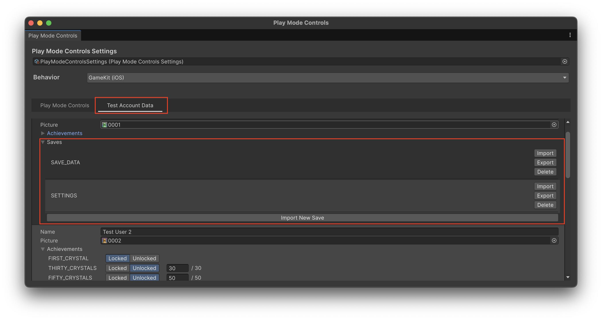

この記事では、Platform Toolkitのセーブシステムに焦点を当てて説明します。

Platform Toolkitのその他の内容については別記事で扱っています。

- [Unity6.3から利用できるPlatform Toolkitについて](https://blog.yucchiy.com/2026/01/intro-platform-toolkit)
- [Platform Toolkitのアカウントシステムについて](https://blog.yucchiy.com/2026/01/platform-toolkit-acccount-system)
- [Platform Toolkitのアチーブメントシステムについて](https://blog.yucchiy.com/2026/01/platform-toolkit-achievement-system)

## セーブシステムへのアクセス

Platform Toolkitは、下記の2種類のセーブシステムを提供しています。

- **アカウントセーブ**: プラットフォームアカウントに紐づくセーブデータ
    - アカウントでサインインしていれば、別のデバイスからも同じセーブデータにアクセス可能
- **ローカルセーブ**: デバイスローカルに保存されるセーブデータ
    - アカウントに依存しないため、サインインなしでも利用可能

どちらのセーブシステムも `ISavingSystem` インターフェイスを実装しているため、共通のAPIでセーブデータを操作できます。

アカウントセーブが使えない場合にローカルセーブにフォールバックする実装例を下記に示します。

```csharp
ISavingSystem savingSystem;
// アカウントセーブを優先
if (PlatformToolkit.Capabilities.AccountSaving)
{
    savingSystem = await account.GetSavingSystem();
}
else if (PlatformToolkit.Capabilities.LocalSaving)
{
    // フォールバック: ローカルセーブ
    return PlatformToolkit.LocalSaving;
}
else
{
    throw new NotSupportedException(
        "Neither account saving nor local saving is supported on this platform."
    );
}
```

どちらのセーブシステムも `ISavingSystem` インターフェイスを実装しているため、共通のAPIでセーブデータを操作できます。


## セーブデータの構造

Platform Toolkitのセーブシステムは、下記に示すような構造になっています。

- **Save**: セーブデータの単位。複数のファイルを含むことができる
- **File**: Save内に保存される個々のファイル


この構造により、1つのセーブに複数のファイル（例えばプレイヤーデータ、インベントリデータ、設定データなど）を保存できます。


## セーブデータの操作

セーブデータを操作する方法について説明します。

### セーブデータの書き込み

セーブデータの書き込みを行うには、まず `ISavingSystem.OpenSaveWritable` で書き込み用の `ISaveWritable` を取得します。

`ISaveWritable.WriteFile` でデータをファイルを書き込み、最後に `ISaveWritable.Commit` で書き込みを確定させます。

簡単なセーブデータのファイル書き込みを下記に示します。

```csharp
// セーブ保存対象のクラス
// SerializableなのでJsonUtilityによってJSON文字列に変換可能
[Serializable]
public sealed class Player
{
    public string name;
    public int level;
    public int power;
}
[Serializable]
public sealed class PlayerInventory
{
    public int[] weaponIds;
}

// シリアライズ用のメソッド
// 簡単のため、JsonUtilityでJSON → UTF8文字列をbyte[]に変換
private static byte[] Serialize(object obj) => Encoding.UTF8.GetBytes(JsonUtility.ToJson(obj));

// 保存するデータ
var player = new Player { name = "taro", level = 10, power = 2 };
var inventory = new PlayerInventory { weaponIds = new[] { 1, 2, 3 } };

// セーブシステム
var savingSystem = await account.GetSavingSystem();
// ISaveWritableの取得
var writable = await savingSystem.OpenSaveWritable("SAVE_DATA");
// 書き込み
await writable.WriteFile("player", Serialize(player));
await writable.WriteFile("inventory", Serialize(inventory));
// 確定
await writable.Commit();
```

簡単のためインスタンスのシリアライズは、`JsonUtility.ToJson`によってJSON文字列に変換し、その文字列を`Encoding.UTF8.GetBytes` によって `byte[]` に変換しています。

シリアライズの実装は、他にも [MessagePack](https://msgpack.org/ja.html) として `byte[]` にしたり、 Cysharp社の提供する [MemoryPack](https://github.com/Cysharp/MemoryPack) を用いることもできます。
MemoryPackについては、私も「[UnityでMemoryPackを利用してみる](https://blog.yucchiy.com/2022/12/advent-calendar-unity-memory-pack.html)」 という記事を書いているので、よければ参考にしてください。


### コミットの挙動について

`Commit` メソッドはアトミックなオペレーションです。
つまり、全てのファイルの書き込みが成功するか、全て失敗するかのどちらかになります。


```csharp
// セーブシステム
var savingSystem = await account.GetSavingSystem();
// ISaveWritableの取得
var writable = await savingSystem.OpenSaveWritable("SAVE_DATA");

// 2つのファイルを書き込み
await writable.WriteFile("player", Serialize(player));
await writable.WriteFile("inventory", Serialize(inventory));

// Commit()が成功すれば、全てのファイルが保存される
// Commit()が失敗すれば、全てのファイルの変更が破棄される
await writable.Commit();
```

そのため、ストレージ容量が足りないなどでCommitが正常に行われない場合、全ての変更が破棄されます。
この挙動によって、中途半端な状態にならないため、ユーザーのセーブデータが壊れるリスクが低減されます。

`Commit`は、最低1つ以上ファイルを書き込まないと失敗します。
書き込むファイルが1つも存在しない、または存在する全てのファイルを削除したような変更を適用しようとすると、`Commit` が `InvalidOperationException` を投げて失敗します。

また、`Commit` が完了すると、`ISaveWritable` は自動的に破棄され、再利用できなくなります。

```csharp
var writable = await savingSystem.OpenSaveWritable("SAVE_DATA");
await writable.WriteFile("player", data);
await writable.Commit();

// writable は再利用できない
await writable.WriteFile("inventory", data); // エラー
```

### セーブデータの読み込み

セーブデータの読み込みは、`ISavingSystem.OpenSaveReadable()` でハンドラを取得し、`ISaveReadable.ReadFile()` でファイルを読み込みます。

```csharp
// デシリアライズ用のメソッド
// 簡単のため、byte[] → UTF8文字列 → JsonUtilityでデシリアライズ
private static T Deserialize<T>(byte[] data) => JsonUtility.FromJson<T>(Encoding.UTF8.GetString(data));

// セーブの存在確認
if (!await savingSystem.SaveExists("SAVE_DATA"))
{
    Debug.LogError("Save does not exist: SAVE_DATA");
    return;
}

// ISaveReadableの取得
var readable = await savingSystem.OpenSaveReadable("SAVE_DATA");

// ファイルの存在確認
if (await readable.ContainsFile("player"))
{
    // 読み込み
    var playerData = await readable.ReadFile("player");
    var player = Deserialize<Player>(playerData);
    Debug.Log($"Player loaded: {player.name}, Level {player.level}");
}

// 同様に...
if (await readable.ContainsFile("inventory"))
{
    var inventoryData = await readable.ReadFile("inventory");
    var inventory = Deserialize<PlayerInventory>(inventoryData);
    Debug.Log($"Inventory loaded: {inventory.weaponIds.Length} weapons");
}
```

セーブ・ファイルともにそれぞれ `ISavingSystem.SaveExists` と `ISaveReadable.ContainsFile` で存在を確認できます。

`ISaveReadable.ReadFile` では、そのファイルに保存したデータが `byte[]` で取得できます。
先ほどの書き込みの例ではJSON文字列として保存していたので、その逆の処理としてJSON文字列を `JsonUtility.FromJson` でデシリアライズしています。


### セーブの列挙

`ISavingSystem.EnumerateSaves()` を使用することで、保存されているセーブ名のリストを取得できます。

```csharp
// セーブリストを取得
var saveNames = await savingSystem.EnumerateSaves();

Debug.Log($"Total saves: {saveNames.Count}");
foreach (var saveName in saveNames)
{
    Debug.Log($"  - {saveName}");
}
```

ただし、セーブの列挙はセーブファイルが開かれていない場合のみ実行できます。

下記のように、セーブデータを開いた状態で列挙を行うと `InvalidOperationException` が投げられます。


```csharp
// セーブを開く
var writable = await savingSystem.OpenSaveWritable("SAVE_DATA");

try
{
    // InvalidOperationException を吐く
    var saves = await savingSystem.EnumerateSaves(); 
}
catch (InvalidOperationException e)
{
    Debug.LogError($"Cannot enumerate saves while a save is open: {e.Message}");
    throw e;
}
```


## DataStore API

DataStore APIは、キー・バリュー方式でセーブデータを保存できるシステムです。

セーブデータの読み書きでは、データを `byte[]` に変換する必要があり、実運用では独自のシリアライズの実装が必要になりますが、
DataStore APIを用いることで、キー・バリュー形式のセーブデータの読み書きについては、独自のシリアライズ実装を行わなくとも実現できます。

DataStore APIは、以下の型をサポートしています。

- `string`
- `int`
- `float`

### DataStore APIの使い方

下記に、DataStore APIの使い方を示します。


```csharp
// 書き込み
// DataStoreインスタンスの作成
// 第3引数は、セーブが存在しなければ作成するかどうかを指定
DataStore dataStore = await DataStore.Load(savingSystem, "SETTINGS", true);

// 書き込み
dataStore.SetFloat("volume", 0.8f);
dataStore.SetInt("difficulty", 2);
dataStore.SetString("player_name", "Player1");

// 保存
await dataStore.Save(savingSystem,"SETTINGS");

// 読み込み
// 第2引数は、存在しない場合のデフォルト値
var volume = dataStore.GetFloat("volume", 0.5f);
var difficulty = dataStore.GetInt("difficulty", 1);
var playerName = dataStore.GetString("player_name");

Debug.Log($"volume: {volume}, difficulty: {difficulty}, player_name: {playerName}");
```

### DataStore APIの内部実装

`DataStore.Load` の第2引数では、セーブ名を指定します。
セーブ名は、`OpenSaveWritable` や `OpenSaveReadable` の引数で指定する文字列です。

また、DataStore APIでは、指定したセーブに対して、`pt-datastore` というファイル名でデータを書き出します。

セーブデータのシリアライズは、下記に示す `DataStoreSave` クラスのインスタンスを `JsonUtility` によってJSON文字列に変換し、`Encoding.UTF8.GetBytes` で `byte[]` に変換しています。

```
private class DataStoreSave
{
    public int Version;
    // SerializableDictionaryはPlatformToolkitの独自実装
    public SerializableDictionary<string, string> Strings;
    public SerializableDictionary<string, int> Ints;
    public SerializableDictionary<string, float> Floats;
}
```


## 例外処理とエラーハンドリング

セーブシステムを使用する際は、下記の例外を適切にハンドリングする必要があります。

- `InvalidAccountException`: アカウントセーブを使用する際、サインアウトしていてアカウントが無効な状態
    - タイトルバックなどで再度サインインが必要
- `InvalidSystemException`:いくつかのプラットフォームの都合で発生する、`ISavingSystem` が無効で利用できないことを表す
    - `GetSavingSystem` によってシステムの再取得が必要。別デバイスでセーブが変更されている可能性を考慮する
- `NotEnoughSpaceException`: ストレージ容量が不足している場合に発生
    - ユーザーに空き容量の確保を促す
- `SaveCorruptException`: セーブデータのメタデータが破損している場合に発生
    - 破損したセーブの削除や、ユーザーへの通知が必要


## Play Mode Controlsでのテスト

Play Mode Controlsを使用することで、エディター上でセーブシステムの動作をテストできます。
エディターのメニューから `Window > Platform Toolkit > Play Mode Controls` を選択してウインドウを開きます。

下図に示す通り「Test Account Data」タブをクリックし、ユーザーの「Saves」というプルダウンから、現在のセーブデータの状況の確認や、セーブデータのインポート・エクスポート・削除ができます。



また、下記に示すように「Play Mode Controls」タブをクリックし、「System Controls > Storage」で、ストレージ容量の不足をシミュレートできます。


## 参考

- [Access a save system | Platform Toolkit | 1.0.0](https://docs.unity3d.com/Packages/com.unity.platformtoolkit@1.0/manual/savedata/access-save-system.html)
- [Manage save files | Platform Toolkit | 1.0.0](https://docs.unity3d.com/Packages/com.unity.platformtoolkit@1.0/manual/savedata/manage-save-files.html)
