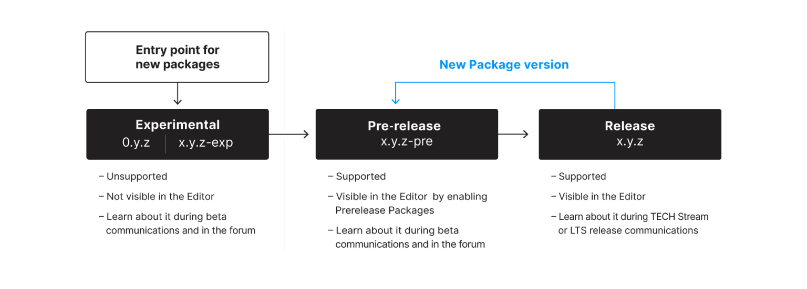
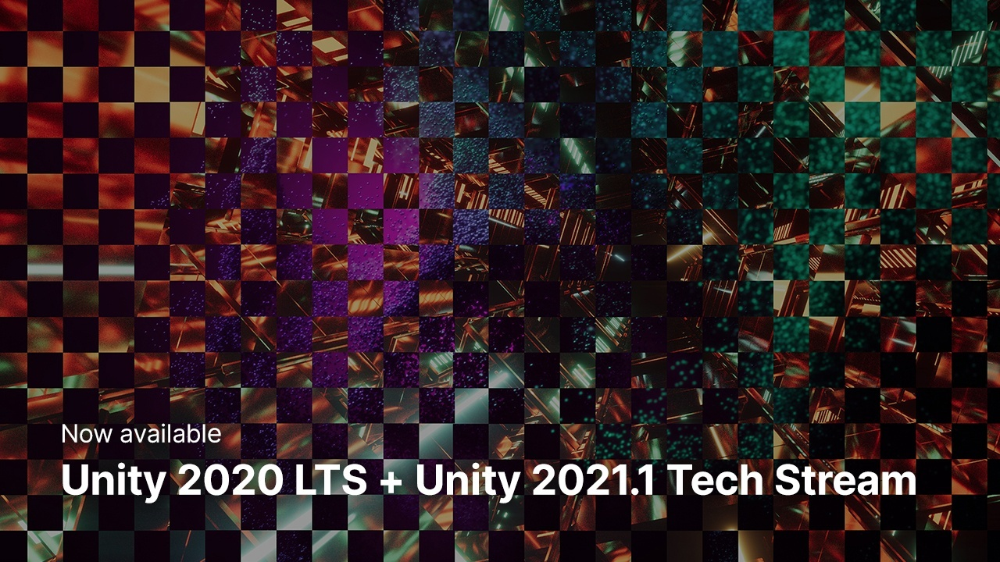
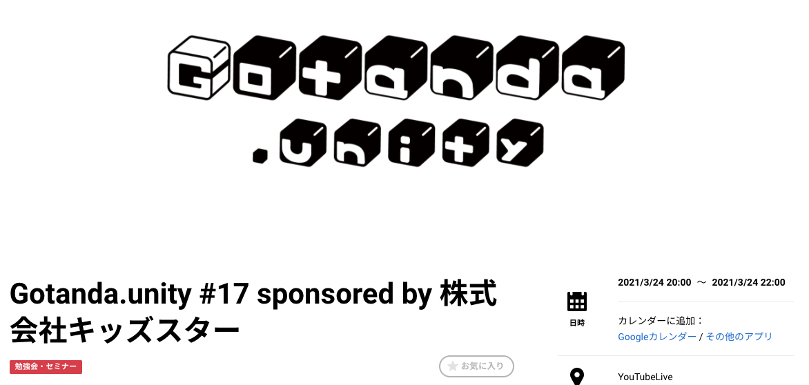
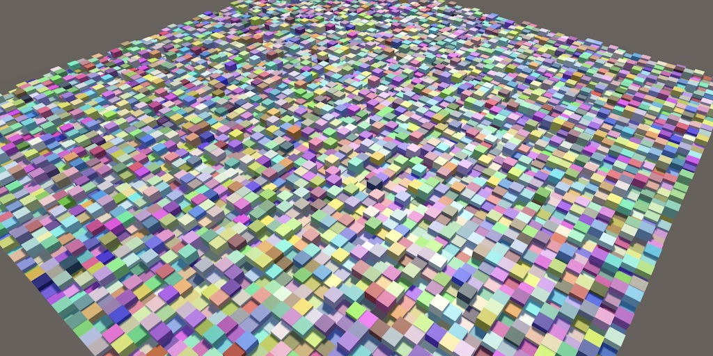

## A new Package Manager experience in Unity 2021.1

[A new Package Manager experience in Unity 2021.1](https://blogs.unity3d.com/2021/03/22/package-manager-updates/)

- 2021.1のテックストリームからパッケージマネージャのリリースライフサイクルに変更が入り、ExperimentalとPre-release、Releaseの３フェーズになりました。
- Experimentalはその名の通り実験段階で、本番環境でのテストは行われておらず、必ずしもロードマップの一部ではないものも含まれます。このフェーズでは、リリースせずに非推奨になる可能性もあります。
- Pre-releaseはUnityによって公式なサポートが行われ、ロードマップの一部として扱われるパッケージです。プロジェクト設定で有効化するとパッケージマネジャーで発見できるようになります。
- Releaseは今までで言うところの検証済みパッケージに相当します。このフェーズのパッケージはUnityによって完全に検証され、本番プロジェクトで安全に利用できることを指します。
- Pre-releaseとExperimentalなパッケージについての情報は、[Forums](https://forum.unity.com/forums/experimental-pre-release-packages.549)から確認することができます。

## Unity 2020 LTS and Unity 2021.1 Tech Stream are now available

- 2020のLTSバージョンと、テックストリームで2021.1が利用できるようになりました。それぞれのリリースノートは、2020 LTSは[こちらから](https://unity3d.com/unity/whats-new/2020.3.0)、2021.1は[こちらから](https://unity3d.com/unity/whats-new/2021.1.0)確認できます。
- 2020 LTSではUniversal Render Pipeline（URP）、Shader Graph、VFX Graph、Chinemachine改善、Animation Riggingの改善が行われています。コーディングワークフローではエンジン内のサブシステムの改修が入り、プレイモードの起動時間が改善されます。C# 8、Rosly Analyzer、セーフモードなども導入されました。また[OpenXR](https://docs.unity3d.com/Packages/com.unity.xr.openxr@1.0/manual/index.htm)と[Occulus Quest 2](https://blogs.unity3d.com/2020/09/17/the-latest-news-from-facebook-connect-2020/)サポート、[AR Foundation 4.0](https://docs.unity3d.com/Packages/com.unity.xr.arfoundation@4.0/manual/index.html)、[Adaptive Performance](https://docs.unity3d.com/Packages/com.unity.adaptiveperformance@2.0/manual/user-guide.html)などが導入されました。
- 2021.1ではVisual ScriptingのUnityEditor統合、引き続きURPとHigh Definition Render Pipeline(HDPR)、2Dツールへの投資が行われます。また、グラフィックパッケージがコアUnityエンジンに統合されます。
- アーティスト系の機能については[Create stunning visuals | Unity 2020 LTS | Unity 2021.1 Tech Stream | Unity | Unity for artists and designers](https://unity.com/releases/artist-features)でも詳細が確認できます。

## Gotanda.unity #17

[Gotanda.unity #17 sponsored by 株式会社キッズスター - Unity Meetup](https://meetup.unity3d.jp/jp/events/1279)

- Gotanda.unityの第17回目。オンライン開催のため動画も公開されています。
    - [Gotanda.unity #17 sponsored by 株式会社キッズスター - YouTube](https://www.youtube.com/watch?v=9OuzfGIDDoU)
- LT#1 (スポンサー枠) もんりぃ先生: Unityプロジェクトの基盤・設計まわりでしくじってしまった話（[スライド](https://www.slideshare.net/monry84/shikujiri-engineer-architecture-section)）
    - 6年に渡るごっこランドの開発・運営の中で失敗したと感じた選択と、それらをどう対応したかについての解説されています。
- LT#2 かこ: もう泣かない,UIの自動レイアウト活用
    - 画面サイズが変わっても崩れないUIを作るコツについて、特にScrollViewの実装に特化して解説されています。
- LT#3 Kuniwak: Unity の meta ファイルの過不足の merge を防止しよう（[スライド](https://speakerdeck.com/orgachem/how-to-prevent-missing-or-dangling-meta-files)）
    - .metaファイルの過不足をチェックする [DeNA/unity-meta-check](https://github.com/DeNA/unity-meta-check) について紹介されています。また.metaが過不足するのかについてその原因についても説明されています。
    - unity-meta-checkはCLIで提供されているのでJenkinsへの組み込みも容易、また40,000アセットでも実行速度が2~3秒と十分に高速。
- LT#4 40: Unityでアクションゲームのあれこれを実装してみる（[レポジトリ](https://github.com/the40san/HitStopDemo)）
    - Unityでヒットストップとカメラシェイクを実装する１手法について紹介されています。
    - ヒットストップでは`Animator.speed`を、カメラシェイクはカメラ本体と視点両方を、CinemachineとAnimatorを用いて揺らすことで実装します。揺れはAnimationClipで作成しています。
- LT#5 いも: どこのご家庭にもある自作シーンマネージャーの話 ([スライド](https://speakerdeck.com/adarapata/dokofalsegojia-ting-nimoarusinmaneziyafalsehua)）
    - 画面遷移の管理の仕組みについて、主に画面スタック、画面へのパラメータ渡し、名称管理についての１実装について解説されています。
    - 遷移先とそのパラメータは型で定義できるように実装されており、また、ページが必要とするアセットはカスタムアトリビュートで紐付けされています。
- LT#6 (スポンサー枠) やまたく: ごっこランドでみかける2Dアニメーション
    - ごっこランドのアニメーションのこだわりについてとその中からチュートリアルアニメーションの実装についてピックアップして解説されています。
    - チュートリアルでは、動きで視線をガイドし画面を止めない、ガイドや画像は統一するなどを意識して実装されています。
    - 始点と終点が任意なアニメーションの実装方法はConstraintを用いて実装されているようです。
- LT#7 うどん: Unity+Airtest入門 ~Unityでお手軽実機の自動テスト~（[スライド](https://speakerdeck.com/nitudon/unity-plus-airtest-plus-pocoru-men)）
    - AirtestとPocoを用いたAndroidのUIの自動テストについて解説されています。
    - [Airtest](https://airtest.netease.com/)は自動テストフレームワークで、付属されたIDEを用いて簡単にテストケースを記述できます。また特定UIの存在確認に画像認識が使えます。
    - [Poco](https://github.com/AirtestProject/Poco)ではuGUIやnGUIなどのヒエラルキー解析を行い、ヒエラルキーベースでテストが記述できます。
- LT#8 きゅぶんず: Adobe XDを使うと、こんなに効率よくゲームUIが作れちゃうの！？（[スライド](https://www.slideshare.net/YoshihiroUra/adobe-xdui-244834389)）
    - Adobe XDと[AkyuiUnity](https://github.com/kyubuns/AkyuiUnity)を用いて効率よくゲームUIを実装する方法について紹介されています。
    - Adobe XDでUI実装し、そのデータをAkyuiUnityを用いてUnity上にインポートすることができます。ボタンコンポーネントやスクロールビューなどもそのまま取り込むことができます。またXDの編集にも対応しています。
    - つなぎ込み実装は[AnKuchen](https://github.com/kyubuns/AnKuchen)を利用することでGameObject名などで直接該当コンポーネントを取得できます。
        - `GameObject.Find`と違いキャッシュからデータを取得するのでパフォーマンスも問題ない。VisualScriptingにも対応しているので、ビジュアルスクリプティングだけでUIの実装ができる。
- LT#9 ゆーじ: 知らなかった！DOTween便利Tips集（[スライド](https://speakerdeck.com/yusuke57/dotween-tips)）
    - DOTweenの便利だけど知らない人がいそうなTipsを7つ紹介されています。

## Unity ShaderGraph CookBook Vol.1

[Unity ShaderGraph CookBook vol.1](https://zenn.dev/r_ngtm/books/shadergraph-cookbook)

- UnityのShaderGraphについて書かれた書籍。著者は[かもそば](https://twitter.com/rn49rn49)さん。
- 書籍の前半ではshaderGraphでよく使うノードのそれぞれの使い方とその利用例についてが説明されています。
- 後半ではホログラム表現やフレネルエフェクト、ノイズ表現など実践的な映像表現について、その実装方法が説明されています。

## Hashing in Pseudorandom Noise Tutorial Series

[Hashing](https://catlikecoding.com/unity/tutorials/pseudorandom-noise/hashing/)

- [Catlike Coding](https://catlikecoding.com/unity/tutorials/)さんの新しいUnityチュートリアルシリーズ[Pseudorandom Noise Tutorials](https://catlikecoding.com/unity/tutorials/pseudorandom-noise/)の初回記事。
- このチュートリアルではハッシュアルゴリズムであるxxHashを用いた乱数生成方法と、その値のビジュアライズ方法について述べています。
- ハッシュの生成はジョブシステム及びコンピューターシェーダーを用いて実装されています。

## Pseudo-metaballs with Scriptable Renderer Features in Unity’s URP

[Pseudo-metaballs with Scriptable Renderer Features in Unity’s URP – Bronson Zgeb](https://bronsonzgeb.com/index.php/2021/03/20/pseudo-metaballs-with-scriptable-renderer-features-in-unitys-urp/)

- この記事ではUniversal Render Pipeline（URP）および Scriptable Rendererの機能を用いて、最適化された擬似的なメタボール描画をおこなう方法について紹介しています。
- 擬似的なメタボール描画は、レンダーテクスチャにメッシュパーティクルを描画し、そのテクスチャをぼかし、Smoothstepによりカラーリングして画面に描画します。
- 上記手法をScriptable Rendererを拡張することで実装しています。

## 長年の疑問だった「Lightmap Bakingで何が原因で重くなるのか」問題、いい加減決着をつける

[長年の疑問だった「Lightmap Bakingで何が原因で重くなるのか」問題、いい加減決着をつける - Qiita](https://qiita.com/warapuri/items/88ae7cd1e89fda63d3ad)

- この記事では、UnityのLightmap Bakingの処理時間がどういう状況で長くなるのか、11の検証を行い考察しています。
- 検証では、広域なマップの屋外で`Lightmapping.BakeAsync()`の開始時間から終了時間の差で計測し行っています。

